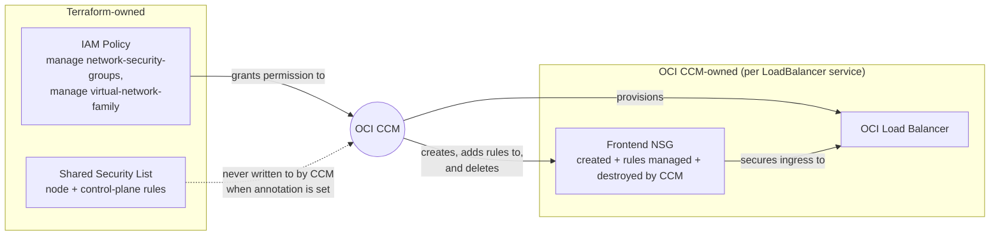

# 0024 — Dedicated Network Security Group for OKE Load Balancer Traffic

## Context

HyperFleet's OCI CI stack provisions a VCN and OKE (Oracle Container Engine for Kubernetes) cluster via Terraform, mirroring the existing Terraform in `hyperfleet-infra`.

Every cloud-hosted Kubernetes cluster runs a **Cloud Controller Manager (CCM)**: the control-plane component that talks to the cloud provider's API on the cluster's behalf, so cluster resources (nodes, `LoadBalancer` services, routes) map to real cloud infrastructure. On OKE, Oracle supplies `oci-cloud-controller-manager`. When a Kubernetes `LoadBalancer` service is created, the OCI CCM provisions an OCI load balancer and, by default, edits the security list of the subnet it places that load balancer in — opening the ingress and health-check rules the service needs. During validation, the CCM removed a Terraform-owned rule from that shared security list, producing a `terraform plan` diff (drift) with no code change on either side.

Two components would then be writing to the same security list: Terraform (declaring the baseline rules for node and control-plane traffic) and the OCI CCM (declaring per-service load balancer rules). Whichever writes last wins, and every load-balancer create/delete cycle risks clobbering the other's state.

## Decision

HyperFleet configures each OKE-managed `LoadBalancer` service with `oci.oraclecloud.com/security-rule-management-mode: "NSG"`. This tells the OCI CCM to create and fully own a dedicated **frontend NSG** for that load balancer: the CCM provisions the NSG, adds the ingress rules the service needs, and removes both the NSG and its rules when the service is deleted. Terraform never creates, owns, or references this NSG — it does not exist in Terraform state, so it cannot appear in a `terraform plan` diff.



This is a different mechanism from attaching an existing NSG via the `oci.oraclecloud.com/oci-network-security-groups` annotation. That annotation only attaches already-existing NSGs to the load balancer; the CCM does not manage rules inside them. Using it with a Terraform-created NSG would still leave Terraform responsible for every ingress rule, one dedicated NSG at a time — the same per-service maintenance burden as the `None` alternative below, just against a smaller blast radius.

The only Terraform-managed change this decision requires is an IAM policy granting the cluster's dynamic group permission to manage NSGs and either VCNs or the virtual-network family in the target compartment:

```text
Allow any-user to manage network-security-groups in compartment <compartment-name> where request.principal.type = 'cluster'
Allow any-user to manage virtual-network-family in compartment <compartment-name> where request.principal.type = 'cluster'
```

This ADR covers frontend (load-balancer ingress) rules only, which is where the observed drift occurred. Backend/node-port and health-check rules on the worker subnet are out of scope here, and today's permissive, POC-grade rules on that subnet mean this decision has no visible effect on them; that holds only as long as those backend rules stay loose. If the worker-subnet rules need the same isolation once they are tightened, an existing NSG can be pre-created and referenced via `oci.oraclecloud.com/oci-backend-network-security-group`, and the CCM will manage rules there too.

The alternative was `security-rule-management-mode: "None"` (equivalent to the legacy `security-list-management-mode: None`), which turns off the CCM's automatic rule management entirely and puts every load-balancer rule under Terraform. That was rejected: the CCM does not just open a static, known port — it computes the health-check port, protocol, and `loadBalancerSourceRanges` per service from the service spec, and OKE clusters in this environment have `LoadBalancer` services created and destroyed continuously by CI/e2e runs. Fully-Terraform-owned rules would mean hand-writing that logic and updating Terraform for every new or changed service, which both defeats the "no plan diff" acceptance criteria and is a standing maintenance burden the CCM-managed NSG avoids entirely by letting the CCM keep doing what it already does, just in a resource Terraform doesn't touch.

## Consequences

**Gains:**

- Creating and deleting a `LoadBalancer` service produces no `terraform plan` diff — the frontend NSG and its rules are created, managed, and destroyed entirely by the CCM, outside Terraform state.
- The CCM's existing per-service rule logic (health-check port, protocol, `loadBalancerSourceRanges`) keeps working automatically; HyperFleet does not need to replicate it.
- Scales to the dynamic create/destroy pattern of the CI and e2e environment, where `LoadBalancer` services come and go per test run without any Terraform change.

**Trade-offs:**

- The frontend NSG's OCID is not known until the CCM creates it at service-creation time (visible via `kubectl describe service` or the OCI console), so no other Terraform-managed resource can reference it by a static OCID.
- Requires a Terraform-managed IAM policy change granting the cluster's dynamic group `manage network-security-groups` and `manage vcns`/`manage virtual-network-family` — a one-time addition, not a per-service one.
- Only frontend (load-balancer ingress) rules are covered; backend/node-port and health-check rules on the worker subnet still depend on whatever security-list or NSG mechanism already governs that subnet, and are not addressed by this ADR.
- **Dependency:** the claim that backend/node-port rules are unaffected holds only while the worker-subnet security rules stay permissive (current POC state). This mirrors a pattern already present elsewhere in the OCI stack — e.g. the managed PostgreSQL module defaults `nsg_ids`/`postgresql_nsg_ids` to an empty list, leaving the private endpoint unrestricted by NSGs until someone tightens it (`hyperfleet-infra#89`). Once the worker-subnet rules are tightened, this ADR's frontend-only scope should be revisited — the same NSG-based pattern (via `oci-backend-network-security-group`) likely needs to extend to the backend to avoid reintroducing drift there.
- Every `LoadBalancer` service manifest must carry the `oci.oraclecloud.com/security-rule-management-mode: "NSG"` annotation; a service missing it falls back to the CCM's default mode against the shared security list, reintroducing drift risk for that one service. This ADR does not name an enforcement owner or mechanism (e.g., a Helm chart default, or CI/admission-time validation) for every `LoadBalancer`-producing manifest in the stack — that is a delivery-story detail for the `hyperfleet-infra` implementation.
- **Orphaned NSG risk:** the CCM only removes the frontend NSG when the `LoadBalancer` service is deleted through Kubernetes — cleanup is finalizer-driven, triggered by the `Service` object's deletion. Anything that removes the underlying OCI load balancer out-of-band, bypassing `kubectl delete svc`, leaves the frontend NSG orphaned with nothing left to clean it up. This is not hypothetical here: the CI compartment's sweep function (`hyperfleet-infra#87`, `functions/oci-ci-sweep`) already deletes stale classic load balancers directly via the OCI API on an hourly schedule as a teardown backstop, and its documented scope does not include NSGs. Until the sweep (or a dedicated NSG sweep) accounts for this, orphaned frontend NSGs can accumulate in the CI compartment.

## Alternatives Considered

| Alternative | Why Rejected |
|-------------|--------------|
| **`security-rule-management-mode: "None"`, rules fully owned by Terraform** | Requires reimplementing the CCM's per-service rule logic (health-check port, protocol, source ranges) by hand in Terraform for every `LoadBalancer` service. In an environment where services are created and destroyed dynamically by CI/e2e runs, this means a Terraform change on every new service — the opposite of the "no plan diff" goal — and is brittle to service-spec changes. |
| **Attach an existing, Terraform-created NSG via `oci.oraclecloud.com/oci-network-security-groups`** | This annotation only attaches an NSG to the load balancer; the CCM does not manage rules inside it. Terraform would still own every ingress rule for that NSG, one load balancer at a time — the same per-service maintenance burden as the `None` alternative, just scoped to a smaller, dedicated resource instead of the shared security list. |
| **Leave default behavior, tolerate drift** | Fails the acceptance criteria directly; a Terraform-owned rule was already observed being removed by the CCM during validation, and repeated drift undermines confidence in `terraform plan` as a source of truth. |

---

## References

- **Story:** [HYPERFLEET-1570 — Own load balancer security rules for OKE-created load balancers](https://redhat.atlassian.net/browse/HYPERFLEET-1570)
- **Epic:** [HYPERFLEET-1542 — OCI Deployment Infrastructure and CI Environment](https://redhat.atlassian.net/browse/HYPERFLEET-1542)
- **External resources:**
  - [OCI Container Engine for Kubernetes — Security Best Practices](https://docs.oracle.com/en-us/iaas/Content/ContEng/Tasks/contengbestpractices_topic-Security-best-practices.htm) — Oracle's own guidance recommends dedicated NSGs over shared security lists for workload traffic, which this ADR follows.
  - [Specifying Security Rule Management Options for Load Balancers and Network Load Balancers](https://docs.oracle.com/en-us/iaas/Content/ContEng/Tasks/contengconfiguringloadbalancersnetworkloadbalancers-subtopic.htm) — defines `oci.oraclecloud.com/security-rule-management-mode`, the frontend/backend NSG behavior, and the required IAM policies this ADR's Decision is based on.
