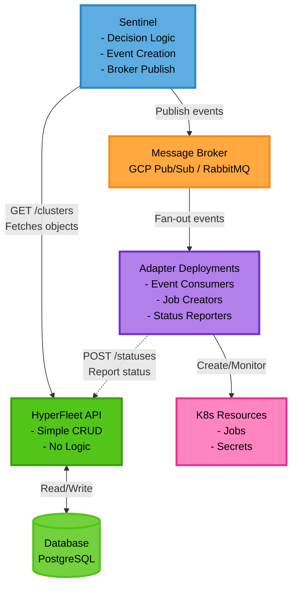
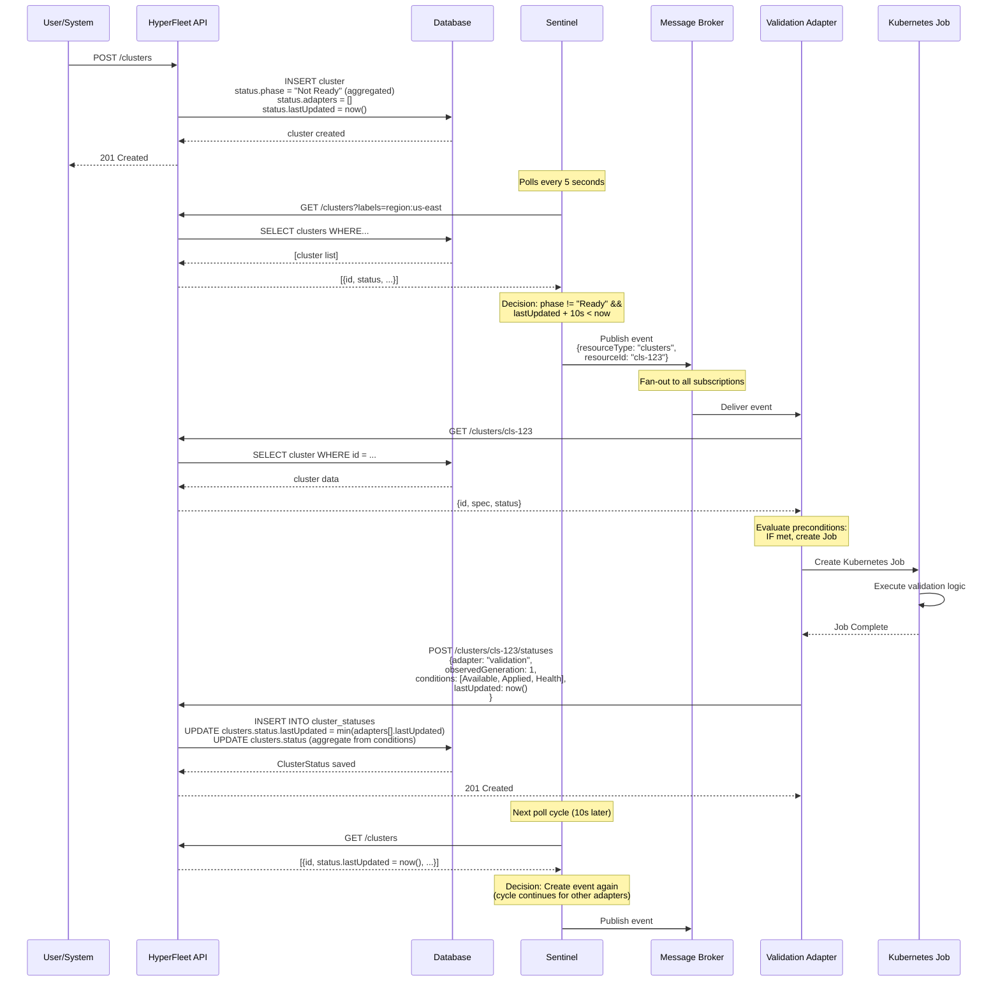
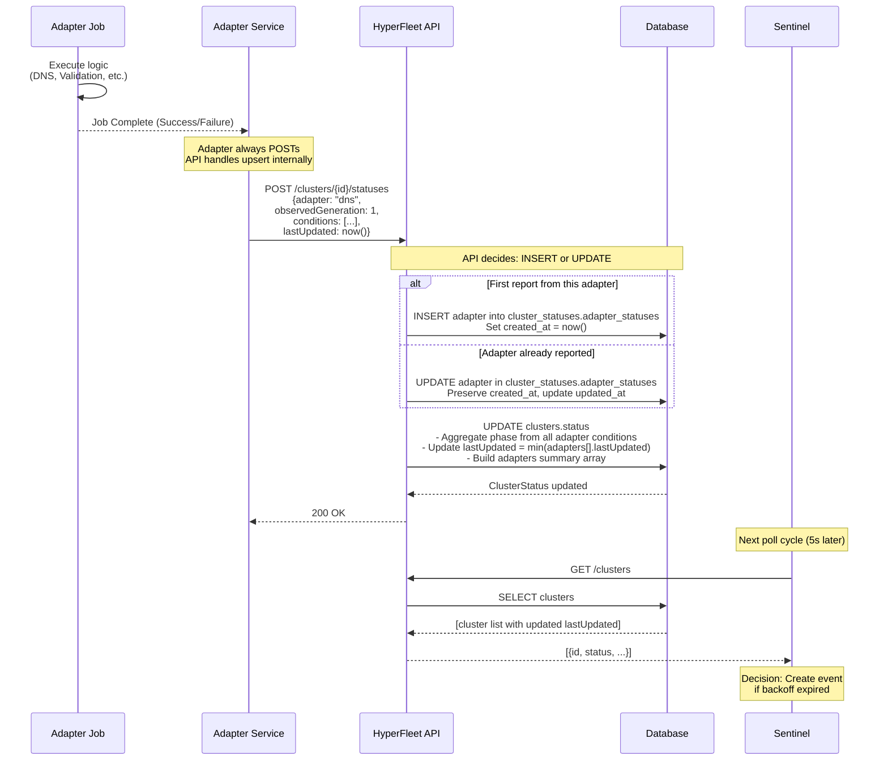

# HyperFleet v2 Architecture Summary

---

## Overview

HyperFleet v2 represents a significant architectural simplification from v1, removing the Outbox Pattern and consolidating business logic into the Sentinel Service. This design reduces complexity while maintaining the event-driven, scalable nature of the system.

**Key Principle**: Separation of concerns - API for data storage, Sentinel for orchestration logic, Adapters for execution.

---

## Architecture Changes from v1

| Aspect | v1 Architecture | v2 Architecture |
|--------|----------------|-----------------|
| **Event Creation** | API creates outbox entries | Sentinel creates and publishes events |
| **Business Logic** | Distributed (API + Outbox Reconciler) | Centralized in Sentinel |
| **Message Publishing** | Outbox Reconciler polls and publishes | Sentinel publishes directly |
| **API Complexity** | Transactional writes + outbox management | Simple CRUD operations |
| **Components** | API + Database + Outbox Reconciler + Broker + Sentinel + Adapters | API + Database + Sentinel + Broker + Adapters |
| **Latency** | Higher (outbox polling delay) | Lower (direct publish) |

**Result**: Removed 1 component (Outbox Reconciler), simplified 2 components (API, Sentinel), reduced operational complexity.

---

## Component Architecture

For detailed visual diagrams, see:
- [Component Architecture Diagram](component-architecture-diagram.md) - Detailed Mermaid diagram showing all components and relationships
- [Data Flow Diagrams](data-flow-diagram.md) - Sequence diagrams for cluster creation, status updates, and decision logic

### High-Level Overview



---

## Components

### 1. HyperFleet API

**What**: Simple REST API providing CRUD operations for HyperFleet resources (clusters, node pools, etc.) and their statuses.

**Why**:
- **Simplicity**: No business logic, just data persistence
- **Standard Patterns**: RESTful design with sub-resource pattern for statuses
- **Scalability**: Stateless API can scale horizontally without coordination
- **Separation of Concerns**: API focuses solely on data storage and retrieval

**Responsibilities**:
- Accept resource creation/update/delete requests (clusters, nodepools, etc.)
- Persist resource data to PostgreSQL database
- Accept status updates from adapters (via POST /{resourceType}/{id}/statuses)
- Serve resource data to Sentinel (via GET /{resourceType})
- No event creation, no outbox pattern, no business logic

**Key Endpoints**:
```
# Cluster CRUD
GET    /clusters
POST   /clusters
GET    /clusters/{id}
PATCH  /clusters/{id} (post-MVP)
DELETE /clusters/{id} (post-MVP)

# NodePool CRUD (MVP)
GET    /nodepools
POST   /nodepools
GET    /nodepools/{id}
PATCH  /nodepools/{id}
DELETE /nodepools/{id}

# Status Reporting (Adapters post here)
# Works for both clusters and nodepools
# Adapters always POST - API handles upsert internally
POST   /clusters/{id}/statuses      # Adapter reports status (includes "adapter" field in payload)
GET    /clusters/{id}/statuses       # Query cluster status (optional)

POST   /nodepools/{id}/statuses      # Same pattern for nodepools
GET    /nodepools/{id}/statuses
```

**API Specification**:

The complete API schema definitions are maintained in the [hyperfleet-api-spec](https://github.com/openshift-hyperfleet/hyperfleet-api-spec) repository:

- **Cluster and NodePool Schemas**: [Resource Object Definitions](https://github.com/openshift-hyperfleet/hyperfleet-api-spec/blob/main/schemas/core/openapi.yaml)
- **ClusterStatus Schema**: [Status Object Definition](https://github.com/openshift-hyperfleet/hyperfleet-api-spec/blob/main/schemas/core/openapi.yaml)
- **Complete OpenAPI Spec**: [openapi.yaml](https://github.com/openshift-hyperfleet/hyperfleet-api-spec/blob/main/schemas/core/openapi.yaml)

> **Note**: The schemas shown in this document are illustrative examples. Always refer to the API spec repository for the authoritative, up-to-date schema definitions.

**Benefits**:
- Easy to test (no side effects)
- Easy to scale (stateless)
- Easy to maintain (minimal logic)
- Clear API contract (standard REST)

---

### 2. Database (PostgreSQL)

**What**: Persistent storage for cluster resources and adapter status updates.

**Why**:
- **Single Source of Truth**: All cluster state centralized
- **Query Flexibility**: Sentinel can filter by labels, status, region, etc.
- **Audit Trail**: Status history provides debugging and compliance records
- **Transactional Consistency**: ACID guarantees for data integrity

**Schema**:

> **Note**: Database schema is derived from the [API Specification](https://github.com/openshift-hyperfleet/hyperfleet-api-spec/blob/main/schemas/core/openapi.yaml). The schema below is illustrative - refer to the API spec for authoritative field definitions.

```
clusters
  - id (uuid, primary key)
  - name (string)
  - spec (jsonb) - cluster configuration
  - status (jsonb) - aggregated status with phase and lastUpdated
  - labels (jsonb) - for sharding and filtering
  - created_at (timestamp)
  - updated_at (timestamp)

cluster_statuses
  - id (uuid, primary key)
  - cluster_id (uuid, foreign key)
  - adapter_statuses (jsonb) - array of adapter status objects, each containing:
    - adapter (string) - e.g., "validation", "dns", "controlplane"
    - observedGeneration (integer) - cluster generation this adapter reconciled
    - conditions (jsonb array) - minimum 3 required:
      - Available: work completed successfully?
      - Applied: resources created successfully?
      - Health: any unexpected errors?
    - data (jsonb, optional) - adapter-specific structured data
    - metadata (jsonb, optional) - additional metadata
    - lastUpdated (timestamp) - when this adapter status was last updated
  - last_updated (timestamp) - when ClusterStatus was last updated
  - created_at (timestamp)
```

**Key Design Decisions**:
- ONE ClusterStatus object per cluster containing ALL adapter statuses in `adapter_statuses` array
- `clusters.status` contains aggregated status (phase, conditions, adapters summary) computed from ClusterStatus
- **Status Reporting Pattern**:
  - Adapters always POST to `/v1/clusters/{id}/statuses` with `adapter` field in payload
  - API handles upsert internally: INSERT if first time, UPDATE if adapter already reported
  - API preserves `created_at` (first report time) and updates `updated_at` on each report
  - API calculates `last_transition_time` when adapter's `Available` condition changes
- **Timestamp Calculation**:
  - `adapters[].lastUpdated`: Set by each adapter in their status report (when they last checked)
  - `cluster.status.lastUpdated`: Calculated by API as `min(adapters[].lastUpdated)` - represents confidence of cluster status
  - Using the OLDEST adapter timestamp ensures Sentinel triggers reconciliation when ANY adapter is stale
- Each adapter has `observedGeneration` to track which cluster generation it reconciled
- Labels stored as JSONB for flexible querying by Sentinel shards
- See [Status Guide](../docs/status-guide.md) for complete status contract details

---

### 3. Sentinel

**What**: Service that continuously polls HyperFleet API, decides when resources need reconciliation, creates events, and publishes them to the message broker.

**Why**:
- **Centralized Orchestration Logic**: Single component decides "when" to reconcile
- **Simple Backoff Strategy**: Time-based decisions using status.lastUpdated (updated on every adapter check)
- **Horizontal Scalability**: Sharding via label selectors (by region, environment, etc.)
- **Broker Abstraction**: Pluggable event publishers (GCP Pub/Sub, RabbitMQ, Stub)
- **Self-Healing**: Continuously retries without manual intervention

**Responsibilities**:
1. **Fetch Resources**: Poll HyperFleet API for resources matching shard selector
2. **Decision Logic**: Determine if resource needs reconciliation based on:
   - `status.phase` (Ready vs Not Ready)
   - `status.lastUpdated` (time since last adapter check)
   - Configured backoff intervals (10s for not-ready, 30m for ready)
3. **Event Creation**: Create reconciliation event with resource context
4. **Event Publishing**: Publish event to configured message broker
5. **Metrics & Observability**: Expose Prometheus metrics for monitoring

**Configuration** (via YAML ConfigMap):
```yaml
# sentinel-config.yaml (ConfigMap)
resource_type: clusters
poll_interval: 5s
backoff_not_ready: 10s
backoff_ready: 30m
resource_selector:
  - label: region
    value: us-east

hyperfleet_api:
  endpoint: http://hyperfleet-api:8080
  timeout: 30s

message_data:
  resource_id: .id
  resource_type: .kind
  generation: .generation
  region: .metadata.labels.region

---
# sentinel-broker-config.yaml (Sentinel-specific ConfigMap)
apiVersion: v1
kind: ConfigMap
metadata:
  name: hyperfleet-sentinel-broker
data:
  BROKER_TYPE: "pubsub"
  BROKER_PROJECT_ID: "hyperfleet-prod"
```

**Decision Algorithm**:
```
FOR EACH resource in FetchResources(resourceType, resourceSelector):
  IF resource.status.phase != "Ready":
    backoff = backoffNotReady (10s)
  ELSE:
    backoff = backoffReady (30m)

  IF now >= resource.status.lastUpdated + backoff:
    event = CreateEvent(resource)
    PublishEvent(broker, event)
```

**Benefits**:
- Removes Outbox Pattern complexity
- Direct publish to broker (lower latency)
- Easy to test decision logic in isolation
- Clear separation: Sentinel orchestrates, Adapters execute

---

### 4. Message Broker

**What**: Message broker implementing fan-out pattern to distribute reconciliation events to multiple adapters.

**Why**:
- **Decoupling**: Sentinel and Adapters don't know about each other
- **Fan-out Pattern**: Single event triggers multiple adapters
- **Scalability**: Adapters can scale independently
- **Reliability**: Message delivery guarantees (at-least-once)
- **Flexibility**: Support multiple broker implementations

**Supported Implementations**:
- **GCP Pub/Sub** (production) - Cloud-native, highly available
- **RabbitMQ** (on-premise) - Self-hosted option
- **Stub** (testing) - In-memory for local development

**Topic/Subscription Pattern**:
```
Topic: hyperfleet.clusters.changed.v1

Subscriptions:
  - validation-adapter-sub  → Validation Adapter
  - dns-adapter-sub         → DNS Adapter
  - placement-adapter-sub   → Placement Adapter
  - pullsecret-adapter-sub  → Pull Secret Adapter
  - hypershift-adapter-sub  → HyperShift Adapter
```

**Event Format** (CloudEvents 1.0):
```json
{
  "specversion": "1.0",
  "type": "com.redhat.hyperfleet.cluster.reconcile.v1",
  "source": "sentinel-operator/cluster-sentinel-us-east",
  "id": "evt-abc-123",
  "time": "2025-10-21T14:30:00Z",
  "datacontenttype": "application/json",
  "data": {
    "resourceType": "clusters",
    "resourceId": "cls-abc-123",
    "reason": "backoff-expired"
  }
}
```

**Benefits**:
- Adapters receive only relevant events
- Easy to add new adapters (just add subscription)
- Broker handles retry and dead-letter queues
- Message ordering within subscription (if needed)

---

### 5. Adapter Deployments

**What**: Event-driven services that consume reconciliation events, evaluate preconditions, create Kubernetes Jobs, and report status back to HyperFleet API.

**Why**:
- **Separation of Concerns**: Each adapter handles one aspect of provisioning
- **Independent Scaling**: Adapters scale based on their workload
- **Precondition Logic**: Adapters decide "if" they should run based on cluster state
- **Job Pattern**: Long-running operations run as Kubernetes Jobs, not adapter pods

**Adapter Types** (MVP):
1. **Landing Zone Adapter** - Do preparation work for coming actions like namespace/secret/configmap creation.
2. **Validation Adapter** - Validates cluster creation prerequisite like quota/networking/policies.
3. **DNS Adapter** - Creates DNS records and certificates
4. **Placement Adapter** - Selects optimal infrastructure placement
5. **Pull Secret Adapter** - Manages image pull secrets
6. **Control Plane Adapter** - Creates HyperShift control plane
7. **Node Pool Validation Adapter** - Validate nodepool creation prereuisite like quota/DNS
8. **Node Pool Adapter** - Creates HyperShift node pools

**Adapter Workflow**:
Using cluster creation as an example
```
1. Consume event from broker subscription
2. Fetch cluster details from API: GET /clusters/{id}
3. Evaluate preconditions:
   - Check adapter-specific requirements
   - Check dependencies (e.g., DNS requires Validation complete)
4. IF preconditions met:
     - Create Kubernetes Job with cluster context
     - Job executes adapter logic (e.g., call cloud provider APIs)
     - Monitor job completion
5. Report status (adapter always POSTs - API handles upsert internally):
   POST /clusters/{id}/statuses

   Payload example:
   {
     "adapter": "dns",                           // Identifies which adapter is reporting
     "observedGeneration": 1,
     "conditions": [
       {
         "type": "Available",
         "status": "True",
         "reason": "AllRecordsCreated",
         "message": "All DNS records created and verified",
         "lastTransitionTime": "2025-10-21T14:35:00Z"
       },
       {
         "type": "Applied",
         "status": "True",
         "reason": "JobLaunched",
         "message": "DNS Job created successfully",
         "lastTransitionTime": "2025-10-21T14:33:00Z"
       },
       {
         "type": "Health",
         "status": "True",
         "reason": "NoErrors",
         "message": "DNS adapter executed without errors",
         "lastTransitionTime": "2025-10-21T14:35:00Z"
       }
     ],
     "data": {
       "recordsCreated": ["api.cluster.example.com", "*.apps.cluster.example.com"]
     },
     "lastUpdated": "2025-10-21T14:35:00Z"      // When adapter checked (now())
   }

   API response: 200 OK (whether first report or update)
6. Acknowledge message to broker
```

**Configuration** (via AdapterConfig):
```yaml
apiVersion: hyperfleet.redhat.com/v1alpha1
kind: AdapterConfig
metadata:
  name: validation-adapter
  namespace: hyperfleet-system
spec:
  adapterType: validation

  # Precondition criteria for when adapter should run
  criteria:
    preconditions:
      - expression: "cluster.status.phase != 'Ready'"
    dependencies: []

  # HyperFleet API configuration
  hyperfleetAPI:
    url: http://hyperfleet-api:8080
    timeout: 10s

  # Message broker configuration
  broker:
    type: gcp-pubsub
    subscription: validation-adapter-sub

  # Job template configuration
  jobTemplate:
    image: quay.io/hyperfleet/validation-job:v1.0.0
    resources:
      requests:
        cpu: 100m
        memory: 128Mi
      limits:
        cpu: 500m
        memory: 512Mi
```

**Benefits**:
- Config-driven (no code changes for new preconditions)
- Job pattern isolates failures
- Status updates drive Sentinel decisions
- Horizontal scaling (multiple adapter replicas)

---

### 6. Kubernetes Resources

**What**: Kubernetes resources(like pipelines/jobs) created by adapters to execute provisioning tasks and manage cluster lifecycle.

**Why**:
- **Job Pattern**: Long-running tasks run as Jobs, not in adapter pods
- **Isolation**: Job failures don't crash adapter service
- **Observability**: Kubernetes native monitoring (pod logs, job status, resource state)
- **Resource Management**: Jobs get CPU/memory limits, timeout enforcement
- **Declarative Management**: Resources tracked and cleaned up via owner references

**Resource Types Created by Adapters**:
- **Jobs**: Execute adapter logic (e.g., call AWS API to create VPC, configure DNS)
- **Secrets**: Store credentials for cloud providers (e.g., AWS credentials, pull secrets)
- **ConfigMaps**: Store configuration data for jobs or target clusters
- **Services**: Network endpoints for cluster resources (depending on adapter)
- **Deployments/StatefulSets**: For adapters that manage long-running services (e.g., HyperShift control plane)
- **PersistentVolumeClaims**: Storage for stateful workloads

**Monitoring Strategy**:
- All resources should be labeled with `adapter=<adapter-name>` and `cluster-id=<cluster-id>` for tracking
- Use Prometheus kube-state-metrics to monitor resource states
- Adapters should expose metrics for resource creation success/failure rates
- Use Kubernetes resources status conditions to track resource lifecycle issues

**Note**: Adapter configuration is managed via AdapterConfig CRD (not ConfigMaps), providing type safety, validation, and Kubernetes-native integration.

**Example Job**:
```yaml
apiVersion: batch/v1
kind: Job
metadata:
  name: dns-adapter-cls-abc-123
  labels:
    adapter: dns
    cluster-id: cls-abc-123
spec:
  backoffLimit: 3
  template:
    spec:
      restartPolicy: Never
      containers:
      - name: dns-job
        image: quay.io/hyperfleet/dns-adapter-job:v1.0.0
        env:
        - name: CLUSTER_ID
          value: "cls-abc-123"
        - name: HYPERFLEET_API
          value: "http://hyperfleet-api:8080"
        resources:
          requests:
            cpu: 100m
            memory: 128Mi
          limits:
            cpu: 500m
            memory: 512Mi
```

**Benefits**:
- Jobs can be retried by Kubernetes (backoffLimit)
- Jobs have clear success/failure status
- Job logs available via kubectl/UI
- Jobs can run to completion without blocking adapter pod

---

## Data Flow

### 1. Cluster Creation Flow



### 2. Status Update Flow



---

## Benefits of Architecture

### 1. Reduced Complexity
- **Removed Outbox Pattern**: No need for outbox table, outbox reconciler, transactional writes
- **Simpler API**: Just CRUD, no business logic, no event creation
- **Fewer Components**: 5 components instead of 6

### 2. Lower Latency
- **Direct Publish**: Sentinel publishes directly to broker (no outbox polling delay)
- **Faster Event Creation**: Decision logic runs in-process (no separate reconciler)

### 3. Better Separation of Concerns
- **API = Data Layer**: Storage and retrieval only
- **Sentinel = Orchestration Layer**: "When" to reconcile
- **Adapters = Execution Layer**: "How" to provision

### 4. Easier Testing
- **API Testing**: Simple HTTP request/response tests, no side effects
- **Sentinel Testing**: Decision logic unit tests with mock API
- **Adapter Testing**: Mock events from broker, verify job creation

### 5. Improved Observability
- **Centralized Decision Logic**: All backoff/retry logic in one place (Sentinel)
- **Clear Metrics**: Sentinel exposes events_created, resources_pending, etc.
- **Status History**: Database stores full adapter status timeline

### 6. Operational Simplicity
- **Fewer Failure Modes**: No outbox reconciler failures, no transactional complexity
- **Easy to Scale**: API and Sentinel scale independently
- **Clear Responsibilities**: Each component has single responsibility

### 7. Condition-Based Status Model

**Why Conditions Instead of Simple Phase?**

The architecture uses **Kubernetes-style Conditions** instead of a single `phase` field to handle the complexity of cluster provisioning:

**Problem with Simple Phase:**
```json
// Too simplistic - loses important information
{
  "adapter": "dns",
  "phase": "Failed"  // Why did it fail? Is it retriable? What succeeded?
}
```

**Solution with Conditions:**
```json
// Multi-dimensional status - captures full state
{
  "adapter": "dns",
  "observedGeneration": 1,
  "conditions": [
    {
      "type": "Available",
      "status": "False",
      "reason": "DNSZoneNotFound",
      "message": "Route53 zone not found for domain example.com"
    },
    {
      "type": "Applied",
      "status": "True",
      "reason": "JobLaunched",
      "message": "DNS Job created successfully"
    },
    {
      "type": "Health",
      "status": "True",
      "reason": "NoErrors",
      "message": "Adapter is healthy (business logic failed, not adapter error)"
    }
  ]
}
```

**Benefits:**
- **Multi-dimensional**: Captures "Did resources get created?" (Applied), "Did work succeed?" (Available), "Any unexpected errors?" (Health)
- **Distinguishes failure types**: Business logic failure (validation failed) vs adapter error (can't connect to API)
- **Enables aggregation**: Cluster `status.phase` computed from all adapter conditions
- **Extensible**: Adapters can add custom conditions beyond the 3 required
- **Kubernetes-native**: Familiar pattern for Kubernetes operators
- **Generation tracking**: `observedGeneration` prevents stale status issues

**Aggregation:**
The cluster's aggregated `status.phase` is computed from adapter conditions:
- All adapters `Available: True` → Cluster phase: `Ready`
- Any adapter `Available: False` → Cluster phase: `Not Ready` (MVP) or `Provisioning`/`Failed`/`Degraded` (Post-MVP)
- Any adapter `Health: False` → Cluster phase: `Degraded`

See [Status Guide](../docs/status-guide.md) for complete details on the status contract.

---

## Trade-offs

### What We Gain
- Simpler architecture (fewer components)
- Lower latency (direct publish)
- Easier to understand and maintain
- Better separation of concerns

### What We Lose
- **Exactly-once semantics**: Outbox Pattern provided guaranteed event delivery. v2 uses at-least-once (broker semantics).
- **Transactional coupling**: API write + event creation was atomic in v1. v2 has eventual consistency (Sentinel polls periodically).

### Why Trade-offs Are Acceptable
- **At-least-once is sufficient**: Adapters are idempotent (can process same event multiple times safely)
- **Eventual consistency is acceptable**: 5-10 second polling delay is acceptable for cluster provisioning use case
- **Simpler system is more maintainable**: Reduced complexity outweighs strict consistency guarantees

---

## Configuration & Deployment

### Sentinel Configuration Example

> **Note**: For MVP (HYPERFLEET-33), deploy a single Sentinel instance watching all resources (`resource_selector: []` - empty list). Multi-Sentinel deployments below are post-MVP enhancements.

```yaml
# sentinel-us-east-config.yaml (ConfigMap)
resource_type: clusters
poll_interval: 5s
backoff_not_ready: 10s
backoff_ready: 30m
resource_selector:
  - label: region
    value: us-east

hyperfleet_api:
  endpoint: http://hyperfleet-api:8080
  timeout: 30s

message_data:
  resource_id: .id
  resource_type: .kind
  generation: .generation
  region: .metadata.labels.region

---
# sentinel-eu-west-config.yaml (ConfigMap)
resource_type: clusters
poll_interval: 5s
backoff_not_ready: 15s
backoff_ready: 1h
resource_selector:
  - label: region
    value: eu-west

hyperfleet_api:
  endpoint: http://hyperfleet-api:8080
  timeout: 30s

message_data:
  resource_id: .id
  resource_type: .kind
  generation: .generation
  region: .metadata.labels.region

---
# sentinel-broker-config.yaml (Same for all Sentinel deployments)
# Option 1: GCP Pub/Sub
apiVersion: v1
kind: ConfigMap
metadata:
  name: hyperfleet-sentinel-broker
data:
  BROKER_TYPE: "pubsub"
  BROKER_PROJECT_ID: "hyperfleet-prod"

---
# Option 2: AWS SQS
apiVersion: v1
kind: ConfigMap
metadata:
  name: hyperfleet-sentinel-broker
data:
  BROKER_TYPE: "awsSqs"
  BROKER_REGION: "us-east-1"
  BROKER_QUEUE_URL: "https://sqs.us-east-1.amazonaws.com/123456789012/hyperfleet-cluster-events"

---
# Option 3: RabbitMQ
apiVersion: v1
kind: ConfigMap
metadata:
  name: hyperfleet-sentinel-broker
data:
  BROKER_TYPE: "rabbitmq"
  BROKER_HOST: "rabbitmq.hyperfleet-system.svc.cluster.local"
  BROKER_PORT: "5672"
  BROKER_VHOST: "/"
  BROKER_EXCHANGE: "hyperfleet-events"
  BROKER_EXCHANGE_TYPE: "fanout"
```

**Note on Broker Configuration**: Sentinel and Adapters use separate broker ConfigMaps:
- **Sentinel** (`hyperfleet-sentinel-broker`): Publishes events - uses BROKER_TOPIC, BROKER_EXCHANGE, or BROKER_QUEUE_URL
- **Adapters** (`hyperfleet-adapter-broker`): Consume events - use BROKER_SUBSCRIPTION_ID, BROKER_QUEUE_NAME
- Common fields (BROKER_TYPE, BROKER_PROJECT_ID, BROKER_HOST) are duplicated for simplicity

---

### API Deployment

```yaml
apiVersion: apps/v1
kind: Deployment
metadata:
  name: hyperfleet-api
spec:
  replicas: 3
  template:
    spec:
      containers:
      - name: api
        image: quay.io/hyperfleet/api:v2.0.0
        env:
        - name: DATABASE_URL
          valueFrom:
            secretKeyRef:
              name: postgres-credentials
              key: connection-string
        - name: LOG_LEVEL
          value: info
```

### Adapter Deployment

```yaml
# Adapter CRD configuration
apiVersion: hyperfleet.redhat.com/v1alpha1
kind: AdapterConfig
metadata:
  name: validation-adapter
  namespace: hyperfleet-system
spec:
  adapterType: validation
  criteria:
    preconditions:
      - expression: "cluster.status.phase != 'Ready'"
  hyperfleetAPI:
    url: http://hyperfleet-api:8080
  broker:
    type: gcp-pubsub
    subscription: validation-adapter-sub
  jobTemplate:
    image: quay.io/hyperfleet/validation-job:v1.0.0
---
# Adapter service deployment
apiVersion: apps/v1
kind: Deployment
metadata:
  name: validation-adapter
  namespace: hyperfleet-system
spec:
  replicas: 2
  selector:
    matchLabels:
      app: validation-adapter
  template:
    metadata:
      labels:
        app: validation-adapter
    spec:
      serviceAccountName: validation-adapter
      containers:
      - name: adapter
        image: quay.io/hyperfleet/validation-adapter:v1.0.0
        args:
        - --config=validation-adapter  # Name of AdapterConfig CR
        - --namespace=hyperfleet-system
```


---

## Security Considerations

### API Security
- **Authentication**: API requires JWT tokens (OIDC integration)
- **Authorization**: RBAC for cluster operations (create, read, update, delete)
- **Input Validation**: Cluster specs validated against JSON schema
- **Rate Limiting**: Prevent abuse (e.g., 100 requests/minute per user)

### Sentinel Security
- **Service Account**: Kubernetes ServiceAccount with minimal RBAC
- **API Credentials**: Read-only access to HyperFleet API (for GET /clusters)
- **Broker Credentials**: Publish-only access to broker topic

### Adapter Security
- **Service Account**: Minimal RBAC to create Jobs and Secrets in adapter namespace
- **CRD Access**: Read-only access to AdapterConfig CR
- **API Credentials**: Write access to status endpoint only (POST /clusters/{id}/statuses)
- **Job Isolation**: Jobs run with separate ServiceAccount (no access to adapter credentials)
- **Cloud Credentials**: Stored in Kubernetes Secrets, mounted to jobs only

---

## Monitoring & Alerting

### Key Metrics

**Sentinel**:
- `hyperfleet_sentinel_resources_pending{resource_type, shard}` - Resources awaiting reconciliation
- `hyperfleet_sentinel_events_created_total{resource_type, shard}` - Events published
- `hyperfleet_sentinel_publish_errors_total{resource_type, shard}` - Broker publish failures

**API**:
- `hyperfleet_api_requests_total{method, path, status}` - Request rate and status codes
- `hyperfleet_api_request_duration_seconds{method, path}` - Request latency
- `hyperfleet_api_clusters_total{phase}` - Cluster count by phase

**Adapters**:
- `hyperfleet_adapter_events_consumed_total{adapter}` - Events received
- `hyperfleet_adapter_jobs_created_total{adapter}` - Jobs created
- `hyperfleet_adapter_job_duration_seconds{adapter, result}` - Job execution time
- `hyperfleet_adapter_resources_created_total{adapter, resource_type}` - Kubernetes resources created (Jobs, Secrets, ConfigMaps, Services, etc.)
- `hyperfleet_adapter_resources_failed_total{adapter, resource_type, reason}` - Resource creation failures

**Kubernetes Resources** (created by adapters):
- `kube_job_status_failed{namespace, job_name}` - Failed job count
- `kube_job_status_succeeded{namespace, job_name}` - Successful job count
- `kube_secret_created{namespace, secret_name}` - Secrets created by adapters
- `kube_configmap_created{namespace, configmap_name}` - ConfigMaps created by adapters
- Use labels like `adapter=<adapter-name>` and `cluster-id=<cluster-id>` to track resources per adapter and cluster

### Alerting Rules

```yaml
groups:
- name: hyperfleet-v2
  rules:
  - alert: SentinelPublishFailures
    expr: rate(hyperfleet_sentinel_publish_errors_total[5m]) > 0.1
    annotations:
      summary: "Sentinel failing to publish events"

  - alert: APIHighErrorRate
    expr: rate(hyperfleet_api_requests_total{status=~"5.."}[5m]) > 0.05
    annotations:
      summary: "API returning 5xx errors"

  - alert: AdapterJobFailures
    expr: rate(hyperfleet_adapter_job_duration_seconds{result="failed"}[10m]) > 0.2
    annotations:
      summary: "Adapter jobs failing at high rate"

  - alert: AdapterResourceCreationFailures
    expr: rate(hyperfleet_adapter_resources_failed_total[5m]) > 0.1
    annotations:
      summary: "Adapter failing to create Kubernetes resources (Jobs, Secrets, ConfigMaps, etc.)"

  - alert: JobsStuckInPending
    expr: kube_job_status_active{namespace="hyperfleet-system"} > 0 and time() - kube_job_created > 300
    annotations:
      summary: "Jobs created by adapters stuck in pending state for >5 minutes"

  - alert: HighJobFailureRate
    expr: rate(kube_job_status_failed{namespace="hyperfleet-system"}[10m]) > 0.3
    annotations:
      summary: "High rate of job failures in hyperfleet-system namespace"
```

---

## Open Questions

1. **Event Ordering**: Do adapters require strict ordering of events? (Likely no, since they evaluate preconditions)
2. **Broker Dead Letter Queue**: How long should failed messages remain in DLQ before alert/manual intervention?
3. **Status Aggregation**: Should API automatically update cluster.status.phase based on adapter statuses, or is this Sentinel's responsibility?
4. **Multi-Tenancy**: How do we isolate clusters by tenant in shared API deployment?
5. **API Versioning**: When/how do we introduce v2 API endpoints (/v2/clusters)?

---

## Next Steps

1. Update JIRA epic for Sentinel to reflect direct broker publish
2. Create API epic with simplified responsibilities
3. Update adapter framework design to include status posting to API
4. Create broker abstraction library for Sentinel (support GCP Pub/Sub, RabbitMQ, Stub)
5. Define CloudEvents schema for reconciliation events (AsyncAPI spec)