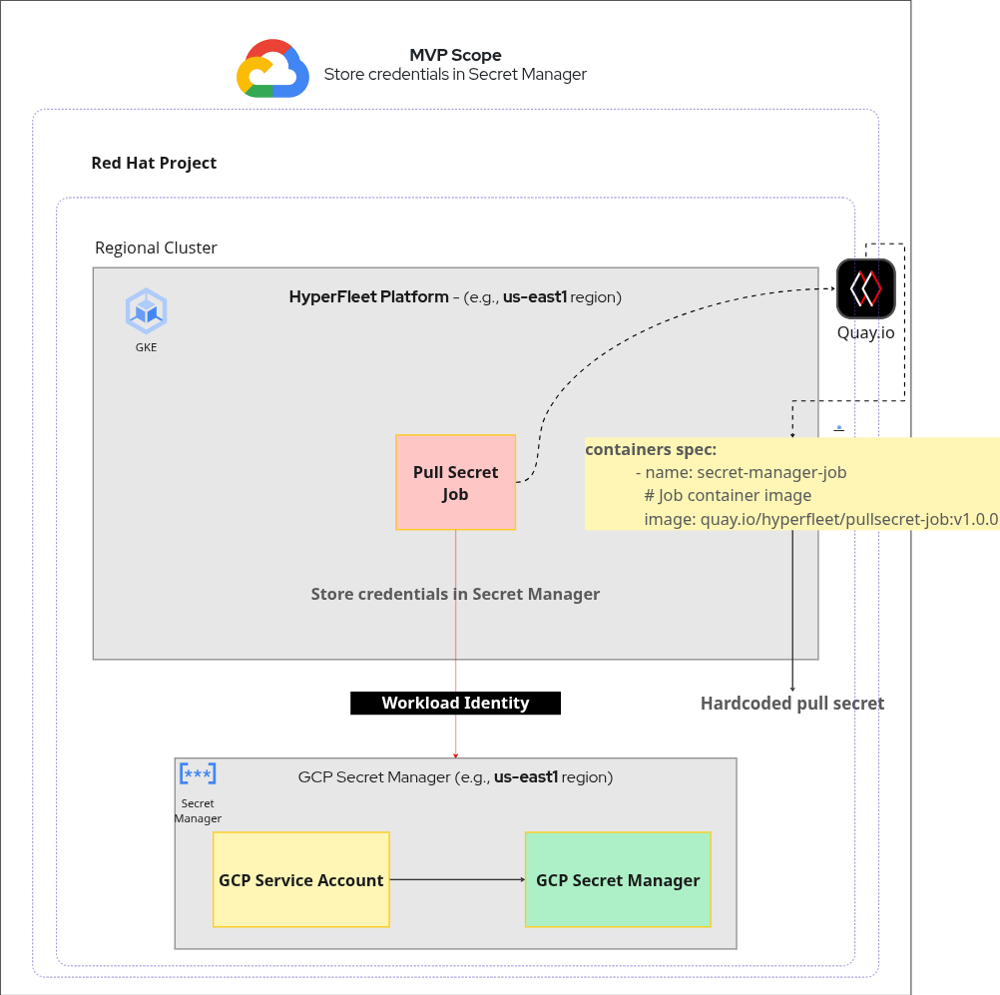
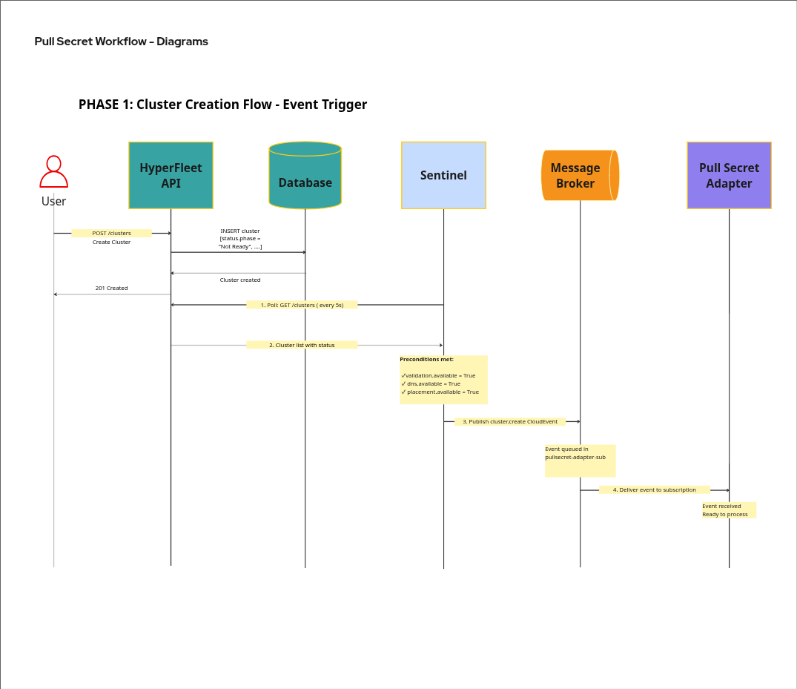

# Pull Secret Service for HyperFleet Architecture

## Executive Summary

The Pull Secret Adapter is responsible for securely storing and managing image registry pull secrets in GCP Secret Manager for HyperShift-managed OpenShift clusters. These secrets enable cluster nodes to pull container images from authenticated registries (e.g., Red Hat registries, Quay.io).

The service operates as an event-driven adapter within the HyperFleet architecture, consuming CloudEvents from Sentinel and orchestrating two critical workflows:
1. Storing pull secrets in the Red Hat GCP Secret Manager
2. Provisioning Kubernetes secrets in the management cluster for HyperShift control plane access

---

## What

### Overview

The Pull Secret Service is an event-driven adapter that manages the complete lifecycle of image registry pull secrets for HyperShift-managed OpenShift clusters provisioned on Google Cloud Platform (GCP).

### Rollout Plan

To minimize the risks related to this, rollout will be done in different milestones:

- **M1:** Pull Secret Service for MVP scope
- **M2:** Pull Secret Service to extract out quay functionality from AMS
- **M3:** Pull Secret Service to support for other clouds and registries

### Responsibilities

#### M1. GCP Secret Manager Storage

- Create internal API/Services/Jobs to maintain customer's pull secrets
- Store pull secret credentials in RedHat GCP Secret Manager
- Add test coverage to validate the pull secret adapter functionalities

> **Note 1:** M1 is purely a task for storing pull secret data in a vault (GCP Secret Manager).

> **Note 2:** The pull secret is stored in the account where the Hyperfleet service runs.

---

### Configuration (via AdapterConfig)

```yaml
apiVersion: hyperfleet.redhat.com/v1alpha1
kind: AdapterConfig
metadata:
  name: pullsecret-adapter
  namespace: hyperfleet-system
spec:
  adapterType: pullsecret

  # Precondition criteria for when Pull Secret Adapter should run
  criteria:
    preconditions:
      # Provider must be GCP (MVP scope)
      - expression: "spec.provider == 'gcp'"
        message: "Pull Secret Adapter only supports GCP in MVP"

      # GCP Project ID must be set
      - expression: "spec.gcp.projectId != nil && spec.gcp.projectId != ''"
        message: "GCP Project ID is required for Secret Manager"

      # Cluster must not be in Ready or Deleting state
      - expression: "cluster.status.phase != 'Ready' && cluster.status.phase != 'Deleting'"
        message: "Pull secret provisioning only runs during cluster creation (MVP scope)"

      # Pull secret should not already be provisioned
      - expression: "status.adapters['pullsecret'].conditions['Available'].status != 'True'"
        message: "Pull secret already provisioned successfully"

    # Dependencies on other adapters that must complete first
    dependencies:
      # Validation adapter must complete successfully
      - adapter: validation
        conditions:
          - type: Available
            status: "True"
          - type: Health
            status: "True"
        message: "Validation adapter must verify GCP prerequisites first"

      # DNS adapter must complete successfully
      - adapter: dns
        conditions:
          - type: Available
            status: "True"
        message: "DNS records must be created before pull secret provisioning"

      # Placement adapter must complete successfully
      - adapter: placement
        conditions:
          - type: Available
            status: "True"
        message: "Cluster placement must be determined before pull secret provisioning"

  # HyperFleet API configuration
  hyperfleetAPI:
    url: http://hyperfleet-api:8080
    timeout: 10s

  # Message broker configuration
  broker:
    type: gcp-pubsub
    subscription: validation-adapter-sub

  # Job template configuration
  jobTemplate:
    image: quay.io/hyperfleet/validation-job:v1.0.0
    resources:
      requests:
        cpu: 100m
        memory: 128Mi
      limits:
        cpu: 500m
        memory: 512Mi
```

**Source:** https://github.com/openshift-hyperfleet/architecture/blob/main/hyperfleet/architecture/architecture-summary.md#5-adapter-deployments

---

## Pull Secret Architecture - Key Components

| Component | Type | Purpose |
|-----------|------|---------|
| **Pull Secret Adapter** | Deployment | Consumes events, orchestrates jobs, reports status |
| **Pull Secret Job** | Job | Executes GCP API calls or uses the GCP SDK both related to GCP Secret Manager and K8s secret operations |
| **GCP Secret Manager** | External Service | Stores pull secret data in RH project |
| **Kubernetes Secret** | Resource | Provides pull secret to HyperShift |

### Integration Points

- **Upstream:** Sentinel Service (event producer)
- **Downstream:** HyperFleet API (status consumer)
- **External:** GCP Secret Manager API (GCP Project ID from a Management Cluster)
- **Internal:** Kubernetes API (management cluster)
- **Dependencies:** Validation, DNS, Placement adapters (must complete first)

### High-Level Architecture


### Assumptions

- Hardcoded Pull Secret to unlock the MVP (see notes: [Hyperfleet MVP Kickoff - 2025/11/07 20:53 CST](https://docs.google.com/document/d/1XKLt1M4kQxMIh4eicdM5Tk092MU9VpUBifXMVnml8xQ))
- RH Project ID from Regional Cluster will be used to enable the Secret Manager API
  - https://docs.cloud.google.com/secret-manager/docs/configuring-secret-manager#enable-the-secret-manager-api
  - For the staging environment, the following GCP project will be used:
    - https://console.cloud.google.com/welcome?project=sda-ccs-3


### MVP Scope

MVP Scope - primarily focused on the Job implementation (see notes: [HyperFleet: Pull Secret Service - Standup - 2025/11/25](https://docs.google.com/document/d/1mCVoli3fbEGMQDapyApV4kf1rHfJE38Rl4wJV6Jg0WM))



---

## Workflow Overview

### Phase 1: Event Trigger (Sentinel → Adapter)

1. Sentinel polls HyperFleet API every 5s
2. Detects cluster with dependencies complete (Validation, DNS, Placement)
3. Publishes `cluster.create` CloudEvent to message broker
4. Pull Secret Adapter consumes event from its subscription



### Phase 2: Precondition Evaluation (Adapter)

5. Adapter fetches cluster details from API: `GET /clusters/{id}`
6. Evaluates preconditions using Expr expressions:
   - `spec.provider == "gcp"`
   - `spec.gcp.projectId != nil` (RH project)
   - `spec.pullSecret.data != nil` (pull secret JSON exists - Hardcoded Pull Secret)
   - `status.adapters[validation].available == "True"`
   - `status.adapters[dns].available == "True"`
   - `status.adapters[placement].available == "True"`
7. If all preconditions pass, proceed; otherwise skip event

### Phase 3: Resource Creation (Adapter → Kubernetes)

8. Create Kubernetes Secret containing pull secret data
   - **Namespace:** `hyperfleet-system`
   - **Name:** `cluster-{cluster-id}-pullsecret-data`
   - **Purpose:** Used by Job as input

9. Create Kubernetes Job to execute provisioning
   - **Name:** `pullsecret-{cluster-id}-gen{generation}`
   - **Service Account:** `pullsecret-adapter-job` (provided by RH project)
   - **Environment:** Cluster ID, GCP project ID, pull secret data, namespace

### Phase 4: GCP Secret Manager Storage (Job)

10. Job authenticates
    - Kubernetes Service Account token exchanged for GCP access token

11. Job checks if secret exists in GCP Secret Manager
    - `GetSecret(projects/{RH-project}/secrets/hyperfleet-{cluster-id}-pull-secret)`

12. If secret doesn't exist, create it:
    - `CreateSecret()` with labels: `managed-by=hyperfleet`, `cluster-id={id}`
    - Replication: Automatic (GCP-managed)

13. Add secret version with pull secret data:
    - `AddSecretVersion(payload: pull-secret-json)`
    - GCP returns version number (e.g., `1`, `2`, etc.)

14. Verify secret accessibility:
    - `AccessSecretVersion(latest)` to confirm readability

---


## References

- [RACI Matrix for Pull Secret Service](https://docs.google.com/spreadsheets/d/1EfsZ0QoUkaf_YOSDA8k2fKHS645l5H3sWfKit1KBu1g/edit?gid=0#gid=0)
- [Tollbooth v2.0 - Use cases](https://docs.google.com/document/d/17begbwlBjU0UpUUgTkwRc6pIS9qNn51sA3WGkwit1Mo/edit?tab=t.0#heading=h.edf6b1rxiby4)
- https://github.com/openshift-hyperfleet/architecture
- [Miro Board 1](https://miro.com/app/board/uXjVJy-n5k4=/)
- [Miro Board 2](https://miro.com/app/board/uXjVJNpPkZ0=/)
- https://hypershift-docs.netlify.app/
- https://rh-amarin.github.io/hyperfleet-architecture/hyperfleet/architecture/sequence.html

---

**Document Version:** 1.0
**Last Updated:** 2025-12-02
**Maintained By:** HyperFleet Platform Team
