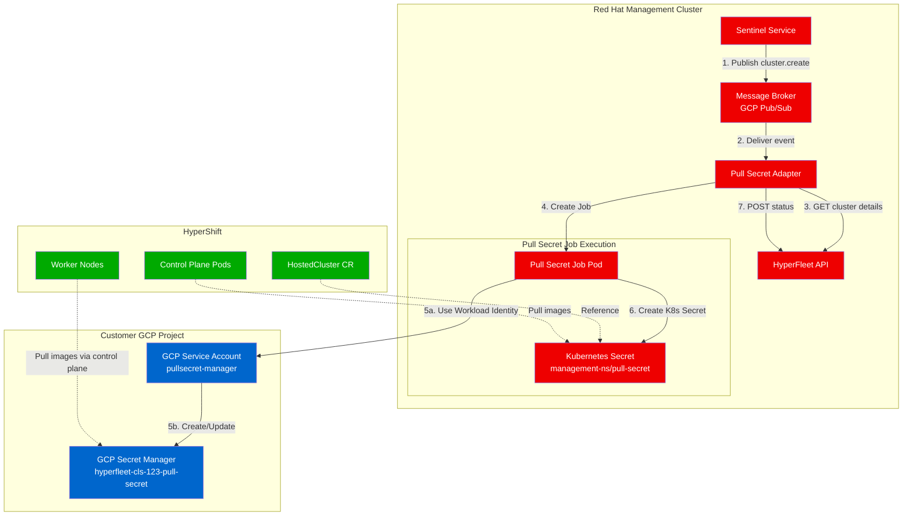
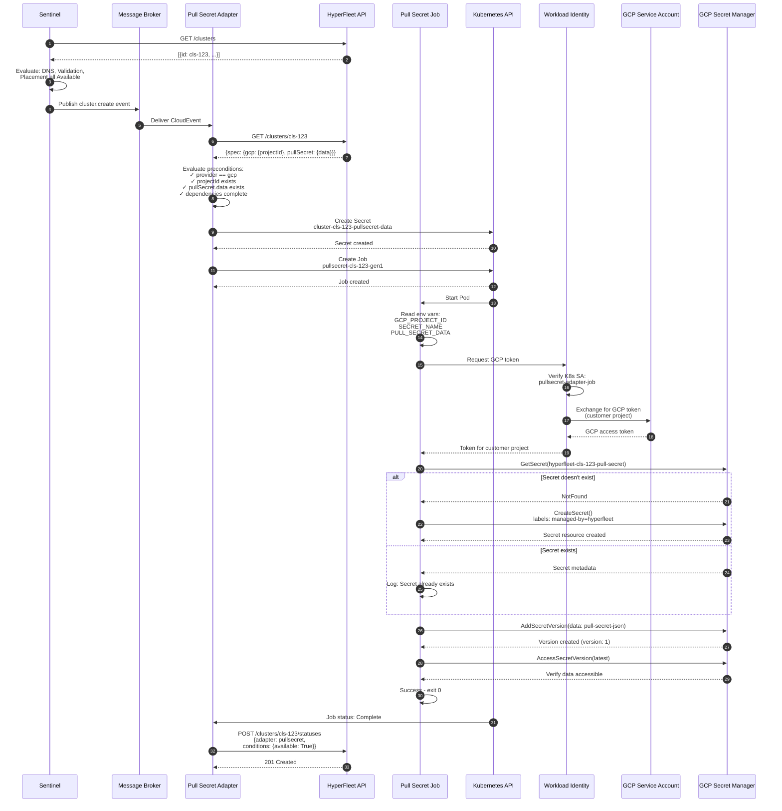

# Pull Secret Workflow and Implementation Plan

---

## Table of Contents

1. [Overview](#overview)
2. [High-Level Architecture](#high-level-architecture)
3. [Workflow 1: Store Secret in GCP Secret Manager](#workflow-1-store-secret-in-gcp-secret-manager)

---

## Overview

### Purpose

The Pull Secret Adapter manages image registry pull secrets for HyperShift-managed OpenShift clusters. It orchestrates two primary workflows:

1. **GCP Secret Manager Storage**: Store pull secrets securely in the customer's GCP Secret Manager
2. **Kubernetes Secret Provisioning**: Create pull secrets in the management cluster namespace for HyperShift to access

### Key Principles

- **Customer Data Security**: Pull secrets stored in the customer's GCP project
- **Separation of Concerns**: Adapter orchestrates; Job executes
- **Event-Driven**: Triggered by CloudEvents from Sentinel
- **Status-Driven**: Reports status to HyperFleet API for Sentinel decision-making

### Components Involved

| Component | Responsibility | Location |
|-----------|---------------|----------|
| **Sentinel** | Publishes cluster events | Red Hat management cluster |
| **Pull Secret Adapter** | Orchestrates secret provisioning | Red Hat management cluster |
| **Pull Secret Job** | Executes GCP API calls | Red Hat management cluster (runs as Job) |
| **GCP Secret Manager** | Stores pull secret data | Customer's GCP project |
| **Kubernetes Secret** | Provides pull secret to HyperShift | Management cluster namespace |
| **HyperFleet API** | Receives status updates | Red Hat management cluster |

---

## High-Level Architecture

### Architecture Flow Summary

1. **Event Trigger**: Sentinel publishes `cluster.create` event
2. **Adapter Receives**: Pull Secret Adapter consumes event from broker
3. **Precondition Check**: Adapter fetches cluster details and validates dependencies
4. **Job Creation**: Adapter creates Pull Secret Job with cluster context
5. **GCP Storage**: Job stores pull secret in customer's GCP Secret Manager
6. **K8s Secret Creation**: Job creates Kubernetes Secret in management cluster
7. **Status Report**: Adapter monitors Job and reports status to API

---

## Workflow 1: Store Secret in GCP Secret Manager

### Objective

Store the pull secret data in the customer's GCP Secret Manager for worker node access.

### Detailed Flow Diagram

### Workflow Steps

#### Phase 1: Event Reception and Validation (Steps 1-6)

1. **Sentinel Polling**: Sentinel polls HyperFleet API for clusters
2. **Decision Logic**: Evaluates that DNS, Validation, Placement adapters are complete
3. **Event Publishing**: Publishes `cluster.create` CloudEvent to broker
4. **Event Delivery**: Broker delivers event to Pull Secret Adapter subscription
5. **Cluster Fetch**: Adapter fetches full cluster details from API
6. **Precondition Evaluation**: Adapter checks:
   - `spec.provider == "gcp"`
   - `spec.gcp.projectId != nil`
   - `spec.pullSecret.data != nil`
   - `status.adapters[validation].available == "True"`
   - `status.adapters[dns].available == "True"`
   - `status.adapters[placement].available == "True"`

#### Phase 2: Resource Creation (Steps 7-9)

7. **K8s Secret Creation**: Adapter creates temporary Kubernetes Secret containing pull secret data
   - Name: `cluster-cls-123-pullsecret-data`
   - Namespace: `hyperfleet-system`
   - Data: Pull secret JSON from cluster spec

8. **Job Creation**: Adapter creates Kubernetes Job
   - Name: `pullsecret-cls-123-gen1` (includes generation ID)
   - Service Account: `pullsecret-adapter-job` (with Workload Identity)
   - Environment: `GCP_PROJECT_ID`, `SECRET_NAME`, `PULL_SECRET_DATA`

