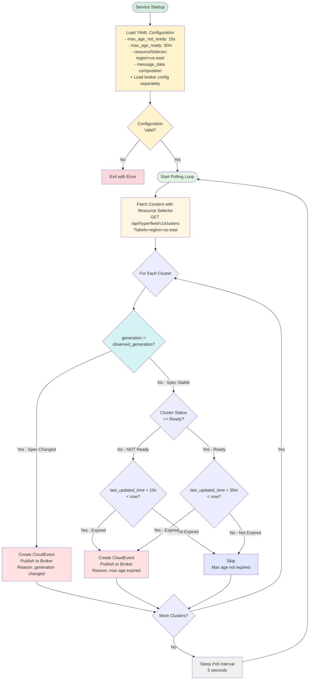
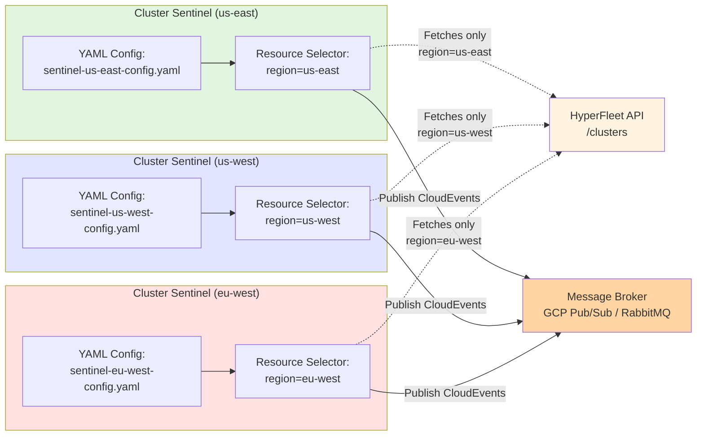

## What & Why

> **Note:** This document uses simple YAML configuration files with inline examples. For additional context on Sentinel configuration and deployment, refer to the upstream implementation in [openshift-hyperfleet/architecture PR #18](https://github.com/openshift-hyperfleet/architecture/pull/18).

**What**

Implement a "HyperFleet Sentinel" service that continuously polls the HyperFleet API for resources (clusters, node pools, etc.) and publishes reconciliation events directly to the message broker to trigger adapter processing. The Sentinel acts as the "watchful guardian" of the HyperFleet system with simple, configurable max age intervals. Multiple Sentinel deployments can be configured via YAML configuration files to handle different shards of resources for horizontal scalability.

**Pattern Reusability**: The Sentinel is designed as a generic reconciliation service that can watch ANY HyperFleet resource type, not just clusters. Future deployments can include:
- **Cluster Sentinel** (this epic) - watches clusters
- **NodePool Sentinel** (future) - watches node pools
- **[Resource] Sentinel** (future) - watches any HyperFleet resource

**Why**

Without the Sentinel, the cluster provisioning workflow has a critical gap:

1. **No Reconciliation Loop**: After adapters complete their work and post status updates, nothing triggers subsequent adapters to check if they can now proceed
2. **Stuck Clusters**: Clusters remain in "pending" state indefinitely with no mechanism to retry failed operations
3. **Manual Intervention Required**: Operators must manually trigger reconciliation or restart adapters
4. **No Failure Recovery**: Transient failures cannot self-heal without a retry mechanism

The Sentinel solves these problems by:
- **Closing the reconciliation loop**: Continuously polls resources and publishes events to trigger adapter evaluation
- **Generation-based reconciliation**: Immediately triggers reconciliation when resource spec changes (generation increments), ensuring responsive updates
- **Uses adapter status updates**: Reads `status.last_updated_time` and `status.observed_generation` (updated by adapters on every check) to determine when to create next event
- **Smart triggering**: Two-tier decision logic prioritizes spec changes (generation mismatch) over periodic health checks (max age)
- **Simple max age intervals**: 10 seconds for non-ready resources, 30 minutes for ready resources (configurable)
- **Self-healing**: Automatically retries without manual intervention
- **Horizontal scalability**: Resource filtering allows multiple Sentinels to handle different resource subsets
- **Event-driven architecture**: Maintains decoupling by publishing CloudEvents to message broker
- **Reusable pattern**: Same service can watch clusters, node pools, or any future HyperFleet resource
- **Direct publishing**: Publishes events directly to broker, simplifying architecture (no outbox pattern needed)

**Acceptance Criteria:**

- Configuration schema defined in Go structs with proper validation tags
- Service deployed as single replica per resource selector
- Service reads configuration from YAML files with environment variable overrides
- Broker configuration separated and shared with adapters
- Polls HyperFleet API for resources matching resource selector criteria
- **Decision Engine checks `resource.generation > resource.status.observed_generation` for immediate reconciliation**
- **Generation mismatch triggers immediate event publication, regardless of max age intervals**
- Uses `status.last_updated_time` and `status.observed_generation` from adapter status updates
- Creates CloudEvents for resources based on two-tier decision logic (generation first, then max age)
- CloudEvent data structure is configurable via message_data field
- Publishes events directly to message broker (GCP Pub/Sub or RabbitMQ)
- Configurable max age intervals (not-ready vs ready)
- Resource filtering support via label selectors in configuration
- Metrics exposed for monitoring (reconciliation rate, event publishing, errors)
- **Integration tests verify generation-based triggering takes priority over max age**
- **Integration tests verify all test scenarios (generation mismatch, max age, edge cases)**
- **100% test coverage maintained on Decision Engine package**
- Graceful shutdown and error handling implemented
- Multiple services can run simultaneously with different resource selectors

---

## Sentinel Architecture

### The Problem: Stuck Workflows

**Without Sentinel**:
```
User creates cluster
  → Validation adapter processes
  → Validation reports status
  → STUCK - Nothing triggers next check

Adapter fails transiently
  → STUCK - No retry mechanism
```

### The Solution: Continuous Reconciliation with Direct Broker Publishing

**Reconciliation Loop (Per Resource Selector)**:



**Multiple Sentinel Deployments (Resource Filtering)**:



**Note on Resource Selector Flexibility**:

Resource filtering can be based on **any label criteria** of the cluster object being reconciled. The `resource_selector` uses a list of label/value pairs with AND logic (all labels must match), allowing for flexible filtering strategies:

- **Regional filtering**:
  ```yaml
  resource_selector:
    - label: region
      value: us-east
  ```
- **Environment-based**:
  ```yaml
  resource_selector:
    - label: environment
      value: production
  ```
- **Multi-label filtering** (all must match):
  ```yaml
  resource_selector:
    - label: region
      value: us-east
    - label: environment
      value: production
    - label: cluster-type
      value: hypershift
  ```
- **Tenant/Customer**:
  ```yaml
  resource_selector:
    - label: tenant
      value: customer-123
  ```

This flexibility allows you to:
- Scale horizontally by dividing clusters across multiple Sentinel instances
- Isolate blast radius (failures in one Sentinel don't affect others)
- Optimize configurations per Sentinel instance (different max age intervals for prod vs dev)
- Deploy Sentinels close to their managed clusters (regional Sentinels in regional k8s clusters)

**Important caveat**: Since this is label-based filtering (not true sharding), operators must manually ensure:
- All resources are covered by at least one Sentinel (no gaps)
- Resource coverage is appropriate (overlaps may be intentional or problematic depending on use case)

### Decision Logic

The service uses a two-tier decision logic that prioritizes spec changes over periodic checks:

**Publish Event IF** (evaluated in priority order):

1. **Generation Mismatch** (HIGHEST PRIORITY - immediate reconciliation):
   - Resource generation > resource.status.observed_generation
   - Reason: User changed the spec (e.g., scaled nodes), requires immediate reconciliation
   - Example: Cluster generation=2, observed_generation=1 → publish immediately

2. **Max Age Expired** (periodic health checks):
   - Cluster status is NOT "Ready" AND max_age_not_ready interval expired (10 seconds default)
   - OR Cluster status IS "Ready" AND max_age_ready interval expired (30 minutes default)

**Skip IF**:
- Generation matches observed_generation AND max age not expired

**Key Insight - Generation-Based Reconciliation**:

This implements the Kubernetes controller pattern where:
- `resource.generation` tracks user's desired state version (increments when spec changes)
- `resource.status.observed_generation` tracks which generation was last reconciled by adapters
- Mismatch indicates new spec changes that require immediate reconciliation, regardless of max age intervals

**Important**: Max age intervals are for periodic health checks when the spec is stable. Spec changes (generation increments) should trigger immediate reconciliation.

### Max Age Strategy (MVP Simple)

The service uses two configurable max age intervals:

| Cluster State | Max Age Time | Reason |
|---------------|--------------|--------|
| NOT Ready     | 10 seconds   | Cluster being provisioned - check frequently |
| Ready         | 30 minutes   | Cluster stable - periodic health check |

**Configuration** (via YAML files):

```yaml
# File: sentinel-config.yaml
# See hyperfleet/components/sentinel/sentinel-config.yaml for a complete example template
# Sentinel-specific configuration
resource_type: clusters  # Resource to watch: clusters, nodepools, manifests, workloads

# Polling configuration
poll_interval: 5s
max_age_not_ready: 10s   # Max age when resource status != "Ready"
max_age_ready: 30m       # Max age when resource status == "Ready"

# Resource selector - only process resources matching these labels
# Note: NOT true sharding, just label-based filtering
# Format: List of label/value pairs (AND logic - all must match)
resource_selector:
  - label: region
    value: us-east

# HyperFleet API configuration
hyperfleet_api:
  endpoint: http://hyperfleet-api.hyperfleet-system.svc.cluster.local:8080
  timeout: 10s
  # token: Override via HYPERFLEET_API_TOKEN="secret-token"

# Message data composition - define CloudEvent data payload structure
message_data:
  resource_id: .id
  resource_type: .kind
  region: .metadata.labels.region

---
# File: sentinel-broker-config.yaml (Sentinel-specific)
# Note: Adapters have their own broker ConfigMap with different fields (e.g., BROKER_SUBSCRIPTION_ID for consumers)
# Sentinel publishes events, Adapters consume events - they need different broker configurations

# Google Cloud Pub/Sub Example:
apiVersion: v1
kind: ConfigMap
metadata:
  name: hyperfleet-sentinel-broker
  namespace: hyperfleet-system
data:
  BROKER_TYPE: "pubsub"
  BROKER_PROJECT_ID: "hyperfleet-prod"
  # Note: Sentinel publishes to topic (implicit default topic per project)
  # Adapters use BROKER_SUBSCRIPTION_ID to consume

---
# RabbitMQ Example:
apiVersion: v1
kind: ConfigMap
metadata:
  name: hyperfleet-sentinel-broker
  namespace: hyperfleet-system
data:
  BROKER_TYPE: "rabbitmq"
  BROKER_HOST: "rabbitmq.hyperfleet-system.svc.cluster.local"
  BROKER_PORT: "5672"
  BROKER_VHOST: "/"
  BROKER_EXCHANGE: "hyperfleet-events"
  BROKER_EXCHANGE_TYPE: "fanout"
  # Note: Sentinel publishes to exchange, Adapters consume from queues bound to this exchange
```

> **Note:** For topic naming conventions and multi-tenant isolation strategies, see [Naming Strategy](./sentinel-naming-strategy.md).

### Adapter Status Update Contract

**CRITICAL REQUIREMENT**: For the Sentinel max age strategy to work correctly, adapters MUST update their status on EVERY evaluation, regardless of whether they take action.

**Why This Matters**:

Without this requirement, adapters that skip work due to unmet preconditions would create an infinite event loop:

```
Time 10:00 - DNS adapter receives event
Time 10:00 - DNS checks preconditions: Validation not complete
Time 10:00 - DNS does NOT update status (skips work)
            ❌ cluster.status.last_updated_time remains at 09:50
Time 10:10 - Sentinel sees last_updated_time=09:50, max age expired (10s)
Time 10:10 - Sentinel publishes ANOTHER event
Time 10:10 - DNS receives event AGAIN...
            ↻ INFINITE LOOP until validation completes
```

**Required Adapter Behavior**:

Adapters MUST update status in ALL scenarios:

1. **Preconditions Met** → Create Job → Report status with `observed_time=now`
2. **Preconditions NOT Met** → Skip work → Report status anyway with:
   ```json
   {
     "adapter": "dns",
     "observed_generation": 1,
     "observed_time": "2025-10-17T10:00:00Z",
     "conditions": [
       {
         "type": "Available",
         "status": "False",
         "reason": "PreconditionsNotMet",
         "message": "Waiting for validation to complete"
       },
       {
         "type": "Applied",
         "status": "False",
         "reason": "PreconditionsNotMet",
         "message": "Waiting for validation adapter"
       },
       {
         "type": "Health",
         "status": "True",
         "reason": "NoErrors",
         "message": "Adapter is healthy"
       }
     ]
   }
   ```

**Note**: Adapters send `observed_time` in the request. API uses this to update `last_report_time` in AdapterStatus and aggregates to `last_updated_time` in ClusterStatus.

**Integration Testing**:

Integration tests MUST verify that:
- Adapters send `observed_time` when preconditions are met
- Adapters send `observed_time` when preconditions are NOT met
- Sentinel correctly calculates max age from `cluster.status.last_updated_time` (aggregated from adapter reports)

---

**Status Tracking**:

The Sentinel uses multiple fields from the resource's status to make intelligent reconciliation decisions:

```json
{
  "id": "cls-123",
  "generation": 2,                                  // User's desired state version (increments on spec changes)
  "status": {
    "phase": "Provisioning",
    "observed_generation": 1,                        // Which generation was last reconciled by adapters
    "last_transition_time": "2025-10-21T10:00:00Z",  // When status changed to "Provisioning"
    "last_updated_time": "2025-10-21T12:00:00Z"          // When adapter last checked this resource
  }
}
```

**Important distinction between fields:**

- **`generation`**: User's desired state version. Increments when the resource spec changes (e.g., user scales nodes from 3 to 5). This is the "what the user wants" field.

- **`status.observed_generation`**: Which generation was last reconciled by adapters. Updated by adapters when they successfully process a resource. This is the "what we've reconciled" field.

- **`last_transition_time`**: Updates ONLY when the status.phase changes (e.g., Provisioning → Ready)

- **`last_updated_time`**: Updates EVERY time an adapter checks the resource, regardless of whether status changed

**Why generation/observed_generation matters for reconciliation:**

When a user changes the cluster spec (e.g., scales nodes), `generation` increments (1 → 2). The Sentinel compares:
- If `generation > observed_generation` (e.g., 2 > 1): **User made changes that haven't been reconciled yet** → Publish event immediately
- If `generation == observed_generation` (e.g., 2 == 2): **Spec is stable, reconciliation is current** → Use max age intervals for periodic health checks

This implements the Kubernetes controller pattern and ensures:
1. **Responsive reconciliation**: Spec changes trigger immediate events (no waiting 30 minutes)
2. **Efficient polling**: When spec is stable, fall back to longer intervals for health checks
3. **Correct semantics**: Generation mismatch means "user intent changed", not "adapter is slow"

**Why this matters for max age calculation:**

If a cluster stays in "Provisioning" state for 2 hours, `last_transition_time` would remain at the time it entered "Provisioning" (e.g., 10:00), even though adapters check it at 11:00, 11:30, 12:00. Using `last_transition_time` for max age calculation would incorrectly trigger events too frequently. Using `last_updated_time` ensures max age is calculated from the last adapter check, not the last status change.

**For complete details on generation and observed_generation semantics, see:**
- [HyperFleet Status Guide](../../docs/status-guide.md) - Complete documentation of the status contract, including how adapters report `observed_generation`

### Resource Filtering Architecture

> **MVP Scope**: For the initial MVP implementation (HYPERFLEET-33), we recommend deploying a **single Sentinel instance** watching all resources (`resource_selector: []` - empty list). Multi-Sentinel deployments with label-based filtering are documented below as a **post-MVP enhancement** for horizontal scalability.

**Why Resource Filtering?**
- Horizontal scalability - distribute load across multiple Sentinel instances
- Regional isolation - deploy Sentinel per region
- Blast radius reduction - failures affect only filtered resources
- Flexibility - different configurations per Sentinel instance (e.g., different max age intervals for dev vs prod)

**Important: This is NOT True Sharding**
- True sharding guarantees complete coverage: all resources are handled by exactly one shard
- Sentinel uses `resource_selector` which is just label-based filtering
- No coordination between Sentinel instances
- Possible to have gaps (resources not selected by any Sentinel) or overlaps (resources selected by multiple Sentinels)
- Operators must ensure their resource selectors provide desired coverage

**How Resource Filtering Works**:
1. Each Sentinel deployment uses ONE YAML configuration file (sentinel-config.yaml)
2. Configuration file defines `resource_type` (clusters, nodepools, etc.) and `resource_selector` (label selector)
3. Sentinel only fetches resources matching the resource type and resource selector
4. Multiple Sentinels can run simultaneously with overlapping or non-overlapping selectors
5. Each Sentinel publishes to the same broker topic/exchange (fan-out to adapters)

**Example Resource Filtering Strategy**:

```yaml
# File: sentinel-us-east-config.yaml
# Deployment 1: US East clusters
resource_type: clusters
poll_interval: 5s
max_age_not_ready: 10s
max_age_ready: 30m
resource_selector:
  - label: region
    value: us-east

hyperfleet_api:
  endpoint: http://hyperfleet-api.hyperfleet-system.svc.cluster.local:8080
  timeout: 10s

# Message data composition
message_data:
  resource_id: .id
  resource_type: .kind
  region: .metadata.labels.region

# Note: Broker config is in separate sentinel-broker-config.yaml ConfigMap

---
# File: sentinel-us-west-config.yaml
# Deployment 2: US West clusters (different config!)
resource_type: clusters
poll_interval: 5s
max_age_not_ready: 15s  # Different max age!
max_age_ready: 1h       # Different max age!
resource_selector:
  - label: region
    value: us-west

hyperfleet_api:
  endpoint: http://hyperfleet-api.hyperfleet-system.svc.cluster.local:8080
  timeout: 10s

message_data:
  resource_id: .id
  resource_type: .kind
  region: .metadata.labels.region

---
# File: sentinel-nodepools-config.yaml
# Future: NodePool Sentinel (different resource type!)
resource_type: nodepools
poll_interval: 5s
max_age_not_ready: 5s
max_age_ready: 10m
# resource_selector: []  # Watch all node pools (empty list matches all)

hyperfleet_api:
  endpoint: http://hyperfleet-api.hyperfleet-system.svc.cluster.local:8080
  timeout: 10s

message_data:
  resource_id: .id
  resource_type: .kind
  cluster_id: .ownerResource.id  # Link to parent cluster

---
# File: sentinel-broker-config.yaml (Same across all Sentinel deployments)
# Choose one of the following based on your environment:
# Note: Adapters have their own broker ConfigMap with different fields

# Google Cloud Pub/Sub:
apiVersion: v1
kind: ConfigMap
metadata:
  name: hyperfleet-sentinel-broker
  namespace: hyperfleet-system
data:
  BROKER_TYPE: "pubsub"
  BROKER_PROJECT_ID: "hyperfleet-prod"

---
# RabbitMQ:
apiVersion: v1
kind: ConfigMap
metadata:
  name: hyperfleet-sentinel-broker
  namespace: hyperfleet-system
data:
  BROKER_TYPE: "rabbitmq"
  BROKER_HOST: "rabbitmq.hyperfleet-system.svc.cluster.local"
  BROKER_PORT: "5672"
  BROKER_VHOST: "/"
  BROKER_EXCHANGE: "hyperfleet-events"
  BROKER_EXCHANGE_TYPE: "fanout"
```

---

## Service Components

### 1. Config Loader

**Responsibility**: Load configuration from YAML files with environment variable overrides

**Key Functions**:
- `Load(configPath)` - Load Sentinel configuration from YAML file
- `LoadBrokerConfig()` - Load broker configuration from environment or ConfigMap
- `BuildLabelSelector(cfg)` - Convert `resource_selector` to label selector
- `ParseMessageData(cfg)` - Parse message_data configuration for CloudEvent payload composition

**Implementation Requirements**:
- Load Sentinel configuration from YAML file path specified via command-line flag
- Parse duration strings (max_age_not_ready, max_age_ready, poll_interval, timeout)
- Parse resource_type field to determine which HyperFleet resources to fetch
- Parse message_data configuration for composable CloudEvent data structure
- Load broker configuration separately (from environment variables or shared ConfigMap)
- Support environment variable overrides for sensitive fields (API tokens, credentials)
- Handle missing or invalid configuration gracefully
- Return structured configuration object for use by reconciler
- Validate required fields and enum values

### 2. Resource Watcher

**Responsibility**: Fetch resources from HyperFleet API with resource selector filtering

**Key Functions**:
- `FetchResources(ctx, resourceType, selector)` - Fetch resources matching label selector

**Implementation Requirements**:
- Call HyperFleet API: `GET /api/hyperfleet/v1/{resourceType}?labels=<selector>`
- Encode label selector as query parameter
- Handle empty selector (fetch all resources)
- Return list of resource objects with status fields (phase, last_transition_time, last_updated_time)
- Handle API errors and timeouts gracefully
- Parse status information including `status.last_updated_time` from adapter updates

### 3. Decision Engine

**Responsibility**: Generation-aware decision logic with time-based fallback

**Key Functions**:
- `Evaluate(resource, now)` - Determine if resource needs an event

**Decision Logic** (evaluated in priority order):
1. **Check for generation mismatch** (HIGHEST PRIORITY):
   - Compare `resource.generation` with `resource.status.observed_generation`
   - If `resource.generation > resource.status.observed_generation`:
     - Return: `{ShouldPublish: true, Reason: "generation changed - new spec to reconcile"}`
     - This ensures immediate reconciliation when users change the spec

2. **Check resource.status.phase** (fallback to max age intervals):
   - Select appropriate max age interval:
     - If phase == "Ready" → use `max_age_ready` (30 minutes)
     - If phase != "Ready" → use `max_age_not_ready` (10 seconds)

3. **Check if max age expired**:
   - Get `resource.status.last_updated_time` (updated by adapters every time they check the resource)
   - Calculate `nextEventTime = last_updated_time + max_age`
   - If `now >= nextEventTime` → publish event
   - Otherwise → skip (max age not expired)

4. **Return decision with reason for logging**

**Implementation Requirements**:
- Priority-based decision logic: generation check first, then max age
- Use `resource.generation` and `resource.status.observed_generation` for spec change detection
- Use `status.last_updated_time` from adapter status updates (NOT `last_transition_time`) for max age calculations
- Clear logging of decision reasoning (which condition triggered the event)

### 4. Message Publisher

**Responsibility**: Publish CloudEvents to message broker

**Key Functions**:
- `PublishEvent(ctx, resource, reason)` - Publish CloudEvent to broker

**CloudEvent Format** (CloudEvents 1.0):
```json
{
  "specversion": "1.0",
  "type": "com.redhat.hyperfleet.cluster.reconcile",
  "source": "hyperfleet-sentinel",
  "id": "evt-abc123",
  "time": "2025-10-21T12:00:00Z",
  "datacontenttype": "application/json",
  "data": {
    "resource_id": "cls-123",
    "resource_type": "cluster",
    "region": "us-east",
    "status": "Provisioning"
  }
}
```

**Message Data Composition (Go Templates)**:

The `data` field structure is defined by the `message_data` configuration in sentinel-config.yaml using **Go template syntax**. This allows Sentinel to be generic across different resource types (clusters, nodepools, etc.) by configuring which fields to extract and include in CloudEvents.

**Template Syntax**:
- Uses Go template language (`text/template` package)
- Resource object available as `.` (dot) in template context
- Supports dot notation for nested fields: `.metadata.labels.region`
- Supports simple conditionals and functions

**Configuration Format**:
```yaml
message_data:
  resource_id: .id                           # Simple field access
  resource_type: .kind                       # Top-level field
  region: .metadata.labels.region            # Nested field access
  cluster_id: .ownerResource.id              # For nodepools: parent cluster
  # Optional: conditional with default
  display_name: '{{if .metadata.displayName}}{{.metadata.displayName}}{{else}}{{.metadata.name}}{{end}}'
```

**Evaluation Context**:
- Template receives the resource object (cluster, nodepool, etc.)
- Field paths are relative to the resource root
- Missing fields result in empty string (not error)

**Error Handling**:
- Invalid template syntax → Sentinel fails at startup (fail-fast)
- Missing fields at runtime → Log warning, use empty string
- Type mismatches → Convert to string representation

**Validation**:
- Templates validated at startup (before starting polling loop)
- Invalid templates cause Sentinel to exit with error
- Provides clear error messages indicating which template failed

**Example Template Evaluation**:
```yaml
# Configuration:
message_data:
  resource_id: .id
  region: .metadata.labels.region

# Resource object:
{
  "id": "cls-123",
  "metadata": {
    "labels": {
      "region": "us-east"
    }
  }
}

# Resulting CloudEvent data:
{
  "resource_id": "cls-123",
  "region": "us-east"
}
```

**Implementation Requirements**:
- Support GCP Pub/Sub:
  - Use `cloud.google.com/go/pubsub` SDK
  - Publish to configured topic
  - Include CloudEvent attributes as message attributes
- Support RabbitMQ:
  - Use `github.com/rabbitmq/amqp091-go` SDK
  - Publish to configured exchange with routing key
  - Use fanout exchange for adapter broadcast
- Handle publishing errors gracefully
- Log event publishing success/failure
- Return error if publish fails
- Include retry logic with exponential backoff

### 5. Main Reconciler

**Responsibility**: Orchestrate reconciliation loop with periodic polling

**Key Functions**:
- `Run(ctx)` - Main reconciliation loop
- `Start()` - Initialize and start the service

**Initialization Steps** (executed once at startup):
1. **Load Configuration**:
   - Load Sentinel configuration from YAML file specified via command-line flag
   - Load broker configuration from environment or shared ConfigMap
   - Parse max age intervals, resource selector, message_data, and resource type
   - Apply environment variable overrides for sensitive fields
   - Initialize MessagePublisher with broker config
   - Log configuration details and validate all required fields

**Polling Loop Steps** (repeated every poll_interval):
1. **Fetch Resources**:
   - Build label selector from resource_selector configuration
   - Determine resource endpoint from resource_type (e.g., /clusters, /nodepools)
   - Call ResourceWatcher.FetchResources(ctx, resourceType, selector)
   - Log resource count and resource selector information
   - Record metric for pending resources

2. **Evaluate Each Resource**:
   - For each resource, call DecisionEngine.Evaluate(resource, now)
   - If decision is "publish event":
     - Create CloudEvent with resource metadata
     - Call MessagePublisher.PublishEvent(ctx, event)
     - Log event publishing
     - Increment events_published metric
     - Continue to next resource on error (don't stop reconciliation)
   - If decision is "skip":
     - Log skip reason at debug level
     - Increment resources_skipped metric

3. **Sleep and Repeat**:
   - Sleep for configured poll_interval (default: 5 seconds)
   - Repeat the loop

**Service Architecture**:
- **Single-phase initialization**: Load configuration once during startup, fail fast if invalid
- **Stateless polling loop**: No configuration reloading during runtime
- **Simple service model**: No Kubernetes controller pattern, just periodic polling
- **Graceful shutdown**: Support clean termination on SIGTERM/SIGINT

**Error Handling**:
- On config load failure: exit with error code
- On resource fetch failure: log error, wait poll interval, retry
- On event publishing failure: log error, record metric, continue to next resource

---

## Decision Engine Test Scenarios

The following test scenarios ensure the Decision Engine correctly implements generation-based reconciliation and max age behavior:

### Generation-Based Reconciliation Tests

**Test 1: Ready cluster with generation mismatch → publish immediately**
```
Given:
  - Cluster status.phase: Ready
  - cluster.generation = 2
  - cluster.status.observed_generation = 1
  - cluster.status.last_updated_time = now() - 5s
  - max_age_ready = 30m
Then:
  - Decision: PUBLISH
  - Reason: "generation changed - new spec to reconcile"
  - Max age NOT checked (generation takes priority)
```

**Test 2: Ready cluster with generation match → wait for max age**
```
Given:
  - Cluster status.phase: Ready
  - cluster.generation = 2
  - cluster.status.observed_generation = 2
  - cluster.status.last_updated_time = now() - 5m
  - max_age_ready = 30m
Then:
  - Decision: SKIP
  - Reason: "max age not expired"
  - Next event: now() + 25m
```

**Test 3: Not-Ready cluster with generation mismatch → publish immediately**
```
Given:
  - Cluster status.phase: NotReady
  - cluster.generation = 3
  - cluster.status.observed_generation = 2
  - cluster.status.last_updated_time = now() - 2s
  - max_age_not_ready = 10s
Then:
  - Decision: PUBLISH
  - Reason: "generation changed - new spec to reconcile"
  - Max age NOT checked (generation takes priority)
```

**Test 4: Not-Ready cluster with generation match and max age expired → publish**
```
Given:
  - Cluster status.phase: NotReady
  - cluster.generation = 1
  - cluster.status.observed_generation = 1
  - cluster.status.last_updated_time = now() - 15s
  - max_age_not_ready = 10s
Then:
  - Decision: PUBLISH
  - Reason: "max age expired (not ready)"
```

**Test 5: Not-Ready cluster with generation match and max age not expired → skip**
```
Given:
  - Cluster status.phase: NotReady
  - cluster.generation = 1
  - cluster.status.observed_generation = 1
  - cluster.status.last_updated_time = now() - 5s
  - max_age_not_ready = 10s
Then:
  - Decision: SKIP
  - Reason: "max age not expired"
  - Next event: now() + 5s
```

**Test 6: Ready cluster with generation match and max age expired → publish**
```
Given:
  - Cluster status.phase: Ready
  - cluster.generation = 1
  - cluster.status.observed_generation = 1
  - cluster.status.last_updated_time = now() - 31m
  - max_age_ready = 30m
Then:
  - Decision: PUBLISH
  - Reason: "max age expired (ready)"
```

### Edge Cases

**Test 7: observed_generation ahead of generation (should not happen, but handle gracefully)**
```
Given:
  - Cluster status.phase: Ready
  - cluster.generation = 1
  - cluster.status.observed_generation = 2
Then:
  - Decision: SKIP (treat as match)
  - Log warning: "observed_generation ahead of generation - potential API issue"
```

**Test 8: Missing observed_generation (initial state)**
```
Given:
  - Cluster status.phase: NotReady
  - cluster.generation = 1
  - cluster.status.observed_generation = 0 (or nil)
  - cluster.status.last_updated_time = now() - 2s
  - max_age_not_ready = 10s
Then:
  - Decision: PUBLISH
  - Reason: "generation changed - new spec to reconcile"
```

### Test Requirements

**Unit Tests** (Decision Engine):

The Decision Engine logic should be tested with unit tests covering:
- All decision paths: generation check → max age check → skip
- All reasons logged correctly (which condition triggered the event)
- Edge cases handled gracefully (observed_generation ahead, missing, etc.)
- 100% code coverage on the Decision Engine package

**Integration Tests** (End-to-End):

Integration tests should verify the complete Sentinel workflow:

1. **Event Publishing**: Sentinel successfully publishes CloudEvents to the message broker when decision logic indicates an event should be published

2. **Generation-based triggering priority**: When a cluster spec changes (generation increments), Sentinel publishes an event immediately regardless of max age intervals

3. **Max age intervals**: When generation matches observed_generation, Sentinel respects max age intervals before publishing the next event

4. **Adapter feedback loop**: Adapters receive events, process resources, and update observed_generation correctly, which Sentinel reads in subsequent polls

---

## Service Deployment

For complete Kubernetes deployment manifests, configuration examples, and observability setup, see [sentinel-deployment.md](./sentinel-deployment.md).

The deployment documentation includes:
- Kubernetes Deployment manifests
- ServiceAccount and RBAC configuration
- ConfigMap examples for Sentinel and broker configuration
- Prometheus metrics specification
- Health probe configuration