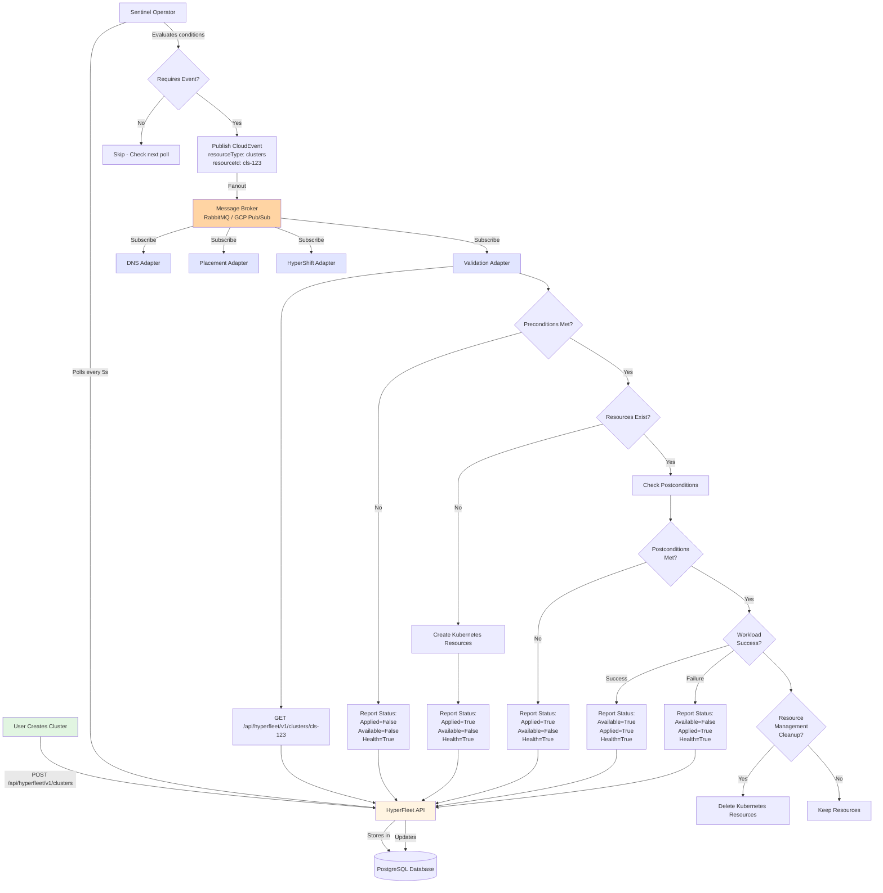
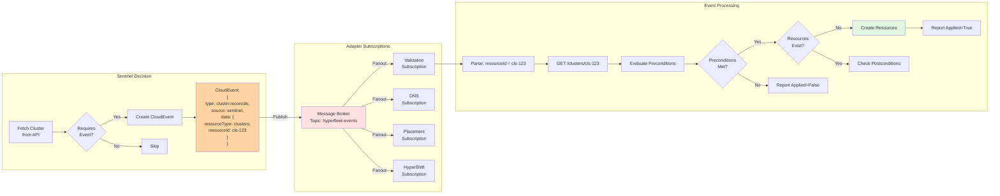

# HyperFleet Reconciliation Flow

This document provides visual diagrams to help understand the reconciliation flow in HyperFleet v2.

## Table of Contents
1. [Complete System Overview](#complete-system-overview)
2. [Adapter Lifecycle Sequence](#adapter-lifecycle-sequence)
3. [Event Flow Detail](#event-flow-detail)

---

## Complete System Overview

This diagram shows how all components work together in the HyperFleet v2 architecture:

---

## Adapter Lifecycle Sequence

This sequence diagram shows the detailed interactions between components for a single adapter processing an event:

```mermaid
sequenceDiagram
    participant S as Sentinel Operator
    participant API as HyperFleet API
    participant B as Message Broker
    participant A as Adapter Service
    participant K as Kubernetes API
    participant W as Workload Pods

    Note over S: Reconciliation Loop (every 5s)

    S->>API: GET /api/hyperfleet/v1/clusters?labels=shard
    API-->>S: List of clusters

    Note over S: For each cluster:<br/>Check if requires event?<br/>(10s for Not Ready, 30m for Ready)

    S->>S: Evaluate: now >= lastEventTime + max_age

    alt Requires event
        S->>B: Publish CloudEvent<br/>{resourceType: "clusters", resourceId: "cls-123"}
        Note over B: Fanout to all adapter subscriptions

        B->>A: Deliver CloudEvent

        Note over A: Parse anemic event
        A->>A: Extract resourceId from event.data

        A->>API: GET /api/hyperfleet/v1/clusters/cls-123
        API-->>A: Full cluster object (spec + status)

        Note over A: Evaluate preconditions from config
        A->>A: Check preconditions (spec.provider == gcp)
        A->>A: Check dependencies (validation adapter Available)

        alt Preconditions NOT met
            A->>A: Log skip reason (debug)

            Note over A: Report status - not applied
            A->>API: GET /api/hyperfleet/v1/clusters/cls-123/statuses

            alt ClusterStatus exists (200 OK)
                A->>API: PATCH /statuses/{statusId}<br/>Applied=False, Available=False, Health=True
            else ClusterStatus not found (404)
                A->>API: POST /statuses<br/>Applied=False, Available=False, Health=True
            end

            API-->>A: Status updated
            A->>B: Acknowledge message
        else Preconditions MET
            Note over A: Check if resources exist
            A->>K: GET resources (e.g., Deployment, StatefulSet)

            alt Resources do NOT exist
                Note over A: Create Kubernetes resources
                A->>K: POST resources (rendered templates + cluster data)
                K-->>A: Resources created

                Note over A: Report status - resources created
                A->>API: GET /api/hyperfleet/v1/clusters/cls-123/statuses

                alt ClusterStatus exists (200 OK)
                    A->>API: PATCH /statuses/{statusId}<br/>Applied=True, Available=False, Health=True
                else ClusterStatus not found (404)
                    A->>API: POST /statuses<br/>Applied=True, Available=False, Health=True
                end

                API-->>A: Status updated
                A->>B: Acknowledge message

            else Resources already exist
                Note over A: Check postconditions
                K-->>A: Resource status

                alt Postconditions NOT met (workload in progress)
                    Note over A: Workload still running
                    A->>API: GET /api/hyperfleet/v1/clusters/cls-123/statuses

                    alt ClusterStatus exists (200 OK)
                        A->>API: PATCH /statuses/{statusId}<br/>Applied=True, Available=False, Health=True
                    else ClusterStatus not found (404)
                        A->>API: POST /statuses<br/>Applied=True, Available=False, Health=True
                    end

                    API-->>A: Status updated
                    A->>B: Acknowledge message

                else Postconditions MET
                    alt Workload Succeeded
                        Note over A: Aggregate conditions
                        A->>A: Available=True (all conditions True)
                        A->>API: PATCH /statuses/{statusId}<br/>Available=True, Applied=True, Health=True
                        API-->>A: Status updated

                        Note over A: Check resource management
                        A->>A: Cleanup enabled?

                        alt Cleanup enabled
                            A->>K: DELETE resources
                        end

                        A->>B: Acknowledge message

                    else Workload Failed
                        Note over A: Aggregate conditions
                        A->>A: Available=False (workload failed)
                        A->>API: PATCH /statuses/{statusId}<br/>Available=False, Applied=True, Health=True
                        API-->>A: Status updated

                        Note over A: Check resource management
                        A->>A: Cleanup enabled?

                        alt Cleanup enabled
                            A->>K: DELETE resources
                        end

                        A->>B: Acknowledge message
                    end
                end
            end
        end
    else Does NOT require event
        Note over S: Skip cluster - log debug
    end

    Note over S: Continue to next cluster
```

---

## Event Flow Detail

This diagram focuses specifically on the event publishing and consumption flow:

---

## Key Takeaways

### Anemic Events Pattern
- Events contain **only** `resourceType` and `resourceId`
- Adapters **always** fetch full cluster from API
- Single source of truth: HyperFleet API database

### Status Upsert Pattern
- Adapters POST status updates to HyperFleet API
- API handles create-or-update logic server-side
- Idempotent: same POST multiple times = same result
- Prevents race conditions between adapters

### Status Reporting Pattern
- **Preconditions NOT met**: Report `Applied=False, Available=False, Health=True`
  - Adapter cannot act on this cluster yet (dependencies not satisfied)
- **Resources created**: Report `Applied=True, Available=False, Health=True`
  - Adapter has applied its intent (created Kubernetes resources), but outcome not yet known
- **Workload in progress** (postconditions not met): Report `Applied=True, Available=False, Health=True`
  - Resources are running, postconditions haven't been satisfied yet
- **Workload succeeded** (postconditions met): Report `Applied=True, Available=True, Health=True`
  - Adapter successfully completed its work, all postconditions satisfied
- **Workload failed** (postconditions met): Report `Applied=True, Available=False, Health=True`
  - Adapter applied intent but workload failed, postconditions indicate failure
- **Adapter error**: Report `Applied=False, Available=False, Health=False`
  - Adapter encountered an internal error and cannot perform its work (e.g., can't connect to Kubernetes API, configuration error, timeout)

### Condition Aggregation
- Each adapter reports 3 required conditions: Available, Applied, Health
- Adapters can add custom conditions (e.g., ValidationPassed, DNSRecordsCreated)
- Adapter aggregates ALL its conditions to determine Available status
- API aggregates all adapter Available statuses to determine cluster phase

### Reconciliation Loop
1. Sentinel continuously polls HyperFleet API (every 5 seconds)
2. For each cluster, Sentinel checks `status.phase` (Ready vs Not Ready)
3. Sentinel applies max age interval based on phase (10s for Not Ready, 30m for Ready)
4. When cluster requires event (max age period passed), Sentinel publishes CloudEvent to broker
5. Adapters receive events, fetch cluster, evaluate preconditions
6. If preconditions met: check if resources exist, create if needed, check postconditions, report status
7. Loop continues - Sentinel keeps polling and publishing events, adapters respond to each event

### Idempotency Pattern
- Adapters check if resources already exist before creating (GET by name/labels)
- Resource naming: `{adapter-name}-{clusterId-short}-gen{generation}`
- If resources exist: check postconditions to determine current state
- If resources don't exist: create new resources
- Handles adapter restarts and duplicate events gracefully
- Each event triggers a fresh evaluation of resource status

### Resource Management
- When workload completes (postconditions met, either success or failure), adapter checks resource management settings
- If cleanup enabled: Delete the created resources from Kubernetes (applies to both success and failure)
- If cleanup disabled: Keep the resources for debugging/auditing purposes
- Cleanup decision happens **after** reporting final status (success or failure)
- This prevents resource accumulation from completed workloads while allowing optional retention for troubleshooting

### Separation of Concerns
- **Sentinel**: Polling + Event publishing
- **Adapter Service**: Orchestration (event handling, precondition evaluation, resource management, status reporting)
- **Workload Pods**: Business logic (validation, DNS creation, cluster provisioning, etc.)
