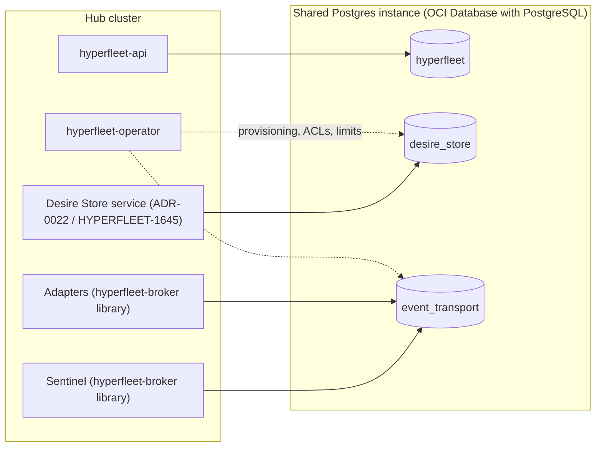

# Co-Located Service Databases on the Shared Postgres Instance — Design

**Jira**: [HYPERFLEET-1670](https://redhat.atlassian.net/browse/HYPERFLEET-1670)

**Implements**: [ADR-0026: Co-Located Service Databases on Shared Postgres](../adrs/0026-co-located-service-databases-shared-postgres-isolation.md)

**Related**: [ADR-0022](../adrs/0022-api-mediated-desire-store-access.md), [ADR-0023](../adrs/0023-oci-managed-postgresql.md), [ADR-0019](../adrs/0019-package-hyperfleet-as-operator.md), [SPIKE: Evaluate Running the Desire Store on the API Postgres](desire-store-api-postgres-spike.md)

## Table of Contents

- [Problem Statement](#problem-statement)
- [How](#how)
  - [Databases and canonical identifiers](#databases-and-canonical-identifiers)
  - [Roles and grants](#roles-and-grants)
  - [Object privileges and privilege handoff](#object-privileges-and-privilege-handoff)
  - [Per-database connection limits](#per-database-connection-limits)
  - [Connection budget](#connection-budget)
  - [Demand validation](#demand-validation)
  - [Consumer topology](#consumer-topology)
  - [Operational rules](#operational-rules)
  - [Monitoring and alerts](#monitoring-and-alerts)
  - [Migration ownership and operator bundle](#migration-ownership-and-operator-bundle)
  - [Scaling a service to its own instance](#scaling-a-service-to-its-own-instance)
  - [Cutover](#cutover)
- [Design Trade-offs](#design-trade-offs)
- [Alternatives](#alternatives)
- [References](#references)

## Problem Statement

[ADR-0026](../adrs/0026-co-located-service-databases-shared-postgres-isolation.md) decides that the API, the Desire Store, and the Event Transport each get a dedicated database on one shared Postgres instance, rather than a schema inside the API database or a separate instance per service. This document is the **how**: the identifiers, roles, grants, connection budget, operational rules, alerts, migration ownership, and cutover procedure that the decision requires. It is the document to build from; the ADR stays short and is cited as fixed input by [HYPERFLEET-1671](https://redhat.atlassian.net/browse/HYPERFLEET-1671) and [HYPERFLEET-1656](https://redhat.atlassian.net/browse/HYPERFLEET-1656).

## How

### Databases and canonical identifiers

Three application databases live on the shared instance. The identifiers below are canonical and must match across the ADR, this document, and the Helm chart/external Secret contract:

| Database | Contents | Owner |
|----------|----------|-------|
| `hyperfleet` | API application state: `Cluster`, `NodePool`, `Channel`, `Version`, `WifConfig`, adapter statuses, enrichment tables | `hyperfleet-api` component |
| `desire_store` | The Desire Store database | Decided by [HYPERFLEET-1671](https://redhat.atlassian.net/browse/HYPERFLEET-1671) (store backend); the service that reads it is decided by [HYPERFLEET-1645](https://redhat.atlassian.net/browse/HYPERFLEET-1645) |
| `event_transport` | The Event Transport database | Decided by [HYPERFLEET-1656](https://redhat.atlassian.net/browse/HYPERFLEET-1656) (transport backend) |

This design **supersedes ADR-0023's database naming only**: where ADR-0023 wrote `hyperfleet-api`, River (queue), and the desire store, the canonical identifiers are `hyperfleet`, `event_transport`, and `desire_store`. ADR-0023 is otherwise unchanged. `hyperfleet` is the name the API Helm chart already uses (`config.database.name`); the drift with ADR-0023's `hyperfleet-api` and with the external Secret schema is follow-up work. `event_transport` is named to stay neutral between the River and purpose-built options evaluated in HYPERFLEET-1656. Each database holds one service's tables; none uses schema-level multiplexing inside another database.

### Roles and grants

The two service databases have a **migration role** `<db>_migrate` — DDL and migrations only — and one or more **runtime roles** with DML only. The runtime roles are owned by each service's design: the Desire Store's write split — Adapters write spec, Appliers write status — and the layer that enforces it are defined by [HYPERFLEET-1671](https://redhat.atlassian.net/browse/HYPERFLEET-1671); the Event Transport's runtime role is defined by [HYPERFLEET-1656](https://redhat.atlassian.net/browse/HYPERFLEET-1656). Per [ADR-0022](../adrs/0022-api-mediated-desire-store-access.md), remote Adapters and Appliers do not hold database connections — the hub desire-store service does — so the store's database runtime role(s) are held by that service. `<db>_app` below is shorthand for a service database's runtime role(s).

`hyperfleet` keeps its **existing single role** — the API role that runs `hyperfleet-api migrate` and serves runtime traffic. The chart uses one Secret for both the `db-migrate` init container and the `serve` container, and there is no separate `hyperfleet` migration role today. Moving the API to the migration/runtime split is follow-up work in [HYPERFLEET-1717](https://redhat.atlassian.net/browse/HYPERFLEET-1717); this document does not define it.

- Roles are **cluster-global** in PostgreSQL, not database-local. Isolation comes from per-database privileges, not from role visibility: `CONNECT` and object grants are recorded per database, so a role can only act where it has been granted.
- PostgreSQL grants `CONNECT` and `TEMPORARY` on every new database to `PUBLIC` by default. Provisioning revokes **both** from `PUBLIC` on **all three databases** — not just `hyperfleet` — and grants `CONNECT` only to the roles that need the database: the [`hyperfleet-operator`](https://github.com/openshift-hyperfleet/hyperfleet-operator) for `desire_store` and `event_transport`, and the API's existing `hyperfleet` role for `hyperfleet`. Otherwise any login role with valid credentials could open a session against `desire_store` or `event_transport` and consume their connection limits.
- No service role is ever granted `CONNECT` on `hyperfleet`. A service credential therefore cannot open a session against the system-of-record database at all — the security boundary ADR-0026 decides.
- Service application `LOGIN` roles must be `NOSUPERUSER`, `NOCREATEDB`, `NOCREATEROLE`, `NOREPLICATION`, `NOBYPASSRLS`, and `NOINHERIT`.
- Service application roles must not be direct or transitive members of API, operator, or migration roles — including memberships that permit `SET ROLE` — and must not own API databases, schemas, or objects. They must not administer API roles or hold role-membership administration rights.
- Migration roles must never be distributed as service credentials.
- Application code and migration tooling use the service-specific role for each database and validate database context at connection time (do not assume implicit database selection from a URI).
- Direct application and migration connections to the three databases must be encrypted. Whether that encryption must also perform **server identity verification** (`sslmode=verify-full` with a trusted CA, or an equivalent certificate and hostname check), and how the CA is distributed and rotated, is a decision in its own right and is tracked in [HYPERFLEET-1709](https://redhat.atlassian.net/browse/HYPERFLEET-1709); this document does not impose it as a requirement. Note that `disable` and `require` do not authenticate the server — `require` encrypts but does not stop an attacker who can intercept or redirect the connection from impersonating PostgreSQL — and a proxy that terminates database TLS must document the authenticated transport boundary it provides.

Provisioning must assert these constraints when roles are created and on every upgrade; ACLs alone do not enforce them.

Per-database ACL matrix (the `hyperfleet-operator` applies it for the two service databases, and the API's existing `hyperfleet` role applies it for `hyperfleet`, during provisioning and on every upgrade):

| Database | `CONNECT` granted to | `TEMPORARY` granted to |
|----------|----------------------|------------------------|
| `hyperfleet` | the API's existing role (migration + runtime) — never service roles | the API's existing role only |
| `desire_store` | `desire_store_app`, `desire_store_migrate`, `hyperfleet-operator` | `desire_store_migrate` only |
| `event_transport` | `event_transport_app`, `event_transport_migrate`, `hyperfleet-operator` | `event_transport_migrate` only |

Applied as `REVOKE CONNECT, TEMPORARY ON DATABASE <db> FROM PUBLIC;` followed by the role-specific grants for each row above: `GRANT CONNECT ON DATABASE <db> TO <role>;` for every role listed under `CONNECT`, and `GRANT TEMPORARY ON DATABASE <db> TO <role>;` for the migration role(s) listed under `TEMPORARY`.

**Owner and fail-closed provisioning.** Each service database is owned by its operator-provisioned migration role `<db>_migrate`. `hyperfleet` is owned by the API's existing role — the single role that runs `hyperfleet-api migrate` and serves runtime traffic; this document does not define a separate `hyperfleet` migration role. The `hyperfleet-operator` scopes its ownership and ACL provisioning to `desire_store` and `event_transport`; it does not own `hyperfleet`, and the operator-side gap for API migrations is tracked in [HYPERFLEET-1612](https://redhat.atlassian.net/browse/HYPERFLEET-1612). For a pre-existing service database, the operator must verify that `<db>_migrate` **owns** the schema, tables, and sequences that migrations must change — or is an effective member of the role that owns them — before proceeding. `GRANT OPTION` is not sufficient for migration DDL: it permits re-granting privileges but not `ALTER` or `DROP`, so it is accepted only for the ACL-update step, where the role grants privileges on objects it does not own. If the required ownership is missing, it may be established only through an explicitly authorized ownership transfer (`ALTER ... OWNER TO`); otherwise provisioning fails closed *before* applying the existing-object grants. For `hyperfleet`, the API's role must own the canonical schema and objects it migrates; because that role also serves runtime traffic, the ownership check is limited to schema- and object-level authority, not database ownership, and it is enforced by the API's own migration and upgrade path rather than by the operator. Provisioning of the two service databases is **fail-closed**: the flow stops on the first failure of any `REVOKE`, `GRANT`, `ALTER ROLE`, `ALTER DEFAULT PRIVILEGES`, or `ALTER DATABASE ... CONNECTION LIMIT`, and only succeeds after verifying that the resulting state matches this document's policy — role attributes, role memberships, database and schema ACLs, object privileges, default privileges, and connection limits. A partially applied step (for example, a `REVOKE` that did not run) must never be treated as success.

### Object privileges and privilege handoff

Database-level `CONNECT`/`TEMPORARY` are necessary but not sufficient: schema `USAGE`, table, and sequence privileges are granted separately, and future objects are covered by default privileges. Each database has one **canonical schema** — `desire_store` and `event_transport` for the service databases, and the API's existing canonical schema for `hyperfleet`. For the service databases the canonical schema is owned by `<db>_migrate`; provisioning **revokes schema-level `CREATE` from `PUBLIC`**, grants `<db>_app` only `USAGE` (never `CREATE`), and grants DDL only to `<db>_migrate`. The migration role is `<db>_migrate` (never handed to application code); it owns the schema and objects it creates, so ownership plus `ALTER DEFAULT PRIVILEGES` is the handoff — no unstated grant is required. For `hyperfleet` the API's existing role owns the canonical schema and objects and also holds `CREATE`, because it is not split; the split is follow-up work in [HYPERFLEET-1717](https://redhat.atlassian.net/browse/HYPERFLEET-1717). The built-in `public` schema is not a service schema and must never act as one: because `public` is always in PostgreSQL's default `search_path`, provisioning also **revokes `CREATE` on `public` from `PUBLIC`** on all three databases and pins each application role's `search_path` to its database's canonical schema, so a compromised `<db>_app` credential cannot create an object in `public` and have an unqualified name resolve to it. A pre-existing database — for example one created before PostgreSQL 15, where `PUBLIC` held `CREATE` on `public` by default — can still carry the grant, so this is verified on every upgrade, not only at creation.

| Role | Schema `USAGE` | Tables | Sequences | DDL |
|------|----------------|--------|-----------|-----|
| `<db>_app` (service runtime) | `GRANT USAGE ON SCHEMA` | `SELECT, INSERT, UPDATE, DELETE` as the workload requires | `USAGE, SELECT` | none (`CREATE` explicitly withheld) |
| `<db>_migrate` (service migration) | `GRANT USAGE ON SCHEMA` | all (via ownership) | all (via ownership) | `CREATE, ALTER, DROP` (owns schema and objects) |
| API's existing role (`hyperfleet`) | `GRANT USAGE ON SCHEMA` | all (via ownership) | all (via ownership) | `CREATE, ALTER, DROP` (owns schema and objects; single role, not split) |

Applied in this order for each service database: `REVOKE CREATE ON SCHEMA <schema> FROM PUBLIC;`, `GRANT USAGE ON SCHEMA <schema> TO <db>_app;`, then grants on **existing** objects — `GRANT SELECT, INSERT, UPDATE, DELETE ON ALL TABLES IN SCHEMA <schema> TO <db>_app;` and `GRANT USAGE, SELECT ON ALL SEQUENCES IN SCHEMA <schema> TO <db>_app;` — and only then `ALTER DEFAULT PRIVILEGES FOR ROLE <db>_migrate IN SCHEMA <schema> GRANT SELECT, INSERT, UPDATE, DELETE ON TABLES TO <db>_app;` (and the equivalent for sequences). The same pass applies `REVOKE CREATE ON SCHEMA public FROM PUBLIC;` and pins the application role's `search_path` to the canonical schema (`ALTER ROLE <db>_app IN DATABASE <db> SET search_path = <schema>;`). Bootstrap and upgrade **verify the existing-object grants before configuring default privileges** and again alongside the rest of the policy — including the `public` schema ACL and the application role's `search_path`; an existing ACL mismatch must not leave `<db>_app` unable to reach current tables and sequences, and a `public` schema that still grants `CREATE` to `PUBLIC` must fail the check.

### Per-database connection limits

- OCI Database with PostgreSQL's default maximum connections is ~500, but it varies by instance shape and can be changed; the provisioned `max_connections` is the source of truth, not the default.
- Each service database's migration role `<db>_migrate` derives its per-database limit from that provisioned `max_connections` and applies it via `ALTER DATABASE ... CONNECTION LIMIT N`; the `hyperfleet-operator` does this for `desire_store` and `event_transport`, and the API's existing role does it for `hyperfleet`.
- The allocation rules are in [Connection budget](#connection-budget).

### Connection budget

Only **actual PostgreSQL connection pools** are counted here. The two services are reached differently:

- **Desire Store** is API-mediated ([ADR-0022](../adrs/0022-api-mediated-desire-store-access.md)): Adapters and Appliers never hold a database connection; the hub desire-store service does. The service itself (existing API or a dedicated hub service) is decided by [HYPERFLEET-1645](https://redhat.atlassian.net/browse/HYPERFLEET-1645).
- **Event Transport** is reached through the `hyperfleet-broker` **library** ([ADR-0002](../adrs/0002-pluggable-message-broker-library.md)), which runs in-process inside Sentinel and every Adapter. So **Sentinel and each Adapter deployment open connections to `event_transport`**; the broker has no pods, replicas, or chart of its own. The transport implementation is decided by [HYPERFLEET-1656](https://redhat.atlassian.net/browse/HYPERFLEET-1656).

API calls (HTTP) and Applier access are not database connections.

| Component | Desire Store | Event Transport | API | Total |
|-----------|--------------|-----------------|-----|-------|
| `hyperfleet-operator` (provisioning, ACLs, limits) | 1–2 | 1–2 | — | 2–4 |
| Hub desire-store service (ADR-0022; R replicas × P pool) | R × P | — | — | R × P |
| API service (A replicas × P pool) | — | — | A × P | A × P |
| Sentinel (S replicas; broker library per ADR-0002/0004) | — | S × Q | — | S × Q |
| Adapters (N deployments; broker library) | — | N × Q | — | N × Q |
| Appliers (API-mediated, ADR-0022) | 0 | 0 | 0 | 0 |
| **Illustrative subtotal (A=3, R=3, S=1, N=10, P=20, Q=5)** | ~62 | ~57 | ~60 | **~179** |

**Connection allocation (derived from the provisioned capacity).**

The per-database limits are **not fixed constants**: they are derived from the instance's provisioned `max_connections` and applied with `ALTER DATABASE ... CONNECTION LIMIT` by each database's owning role — the `hyperfleet-operator` as `<db>_migrate` for `desire_store` and `event_transport`, and the API's existing role for `hyperfleet`. The derivation is:

1. **Reserve headroom:** set aside at least 10% of `max_connections` for monitoring and administrative access. The remaining **allocatable pool** is at most 90% of `max_connections`.
2. **Start from the baseline split:** Desire Store ≈ 20%, Event Transport ≈ 30%, `hyperfleet` ≈ 20% of `max_connections`. This is a starting point, not a cap.
3. **Reallocate to demand:** if a database's demand exceeds its baseline share, move allocation to it from a database that has surplus share, provided every database keeps at least its own demand and the total stays within the allocatable pool. Reallocation happens **before** any rejection.
4. **Reject only if reallocation cannot satisfy demand** (see [Demand validation](#demand-validation)).

The percentages therefore describe the default shape at the illustrative sizing, not a rule that can starve a database. On a 500-connection instance the reserve is 50 and the allocatable pool is 450; the baseline 100/150/100 fits the illustrative demand (~62/57/60) comfortably. On a smaller instance, shares are reallocated rather than scaled down uniformly.

### Demand validation

The limits are derived from both the provisioned capacity and the **configured pool demand** (A, R, S, N, P, and Q). With `allocatable = max_connections − reserved`, each database's demand is computed and must pass **both** checks before any `ALTER DATABASE ... CONNECTION LIMIT` is applied:

1. **Per-database:** each database's demand fits the allocatable pool (no single database can be given more than the pool). A database whose demand alone exceeds `allocatable` is rejected.
2. **Aggregate:** the sum of the three demands does not exceed `allocatable`.

If both hold, each database is allocated at least its demand by reallocating shares (step 3 above); if either fails, the configuration is a deployment error and provisioning fails. No share may be scaled down uniformly while a database is starved, and no allocation that leaves a database below its demand may be accepted.

Worked examples (illustrative demand ~62/57/60, total ~179):

- `max_connections = 500`: reserve 50, allocatable 450. Total demand 179 ≤ 450 → **accepted**; the baseline 100/150/100 already covers each database.
- `max_connections = 250`: reserve 25, allocatable 225. Total demand 179 ≤ 225 → **accepted by reallocation** (for example 62/57/60 = 179). The baseline 50/75/50 would starve Desire Store and the API, so shares are reallocated to them instead of rejecting.
- `max_connections = 150`: reserve 15, allocatable 135. Total demand 179 > 135, and no reallocation can change the total → **rejected**. The instance shape must be enlarged before migrations or limits are applied.

The `hyperfleet-operator`'s upgrade-path documentation must describe how to provision a larger instance shape or request parameter changes from OCI before raising service replicas or pool sizes.

### Consumer topology

Remote Appliers never connect to a service database directly: [ADR-0022](../adrs/0022-api-mediated-desire-store-access.md) keeps them behind the authenticated hub service. The service that fronts the Desire Store, and the Event Transport consumption topology, are decided by [HYPERFLEET-1645](https://redhat.atlassian.net/browse/HYPERFLEET-1645) and [HYPERFLEET-1656](https://redhat.atlassian.net/browse/HYPERFLEET-1656); this design does not define them.

### Operational rules

Every database on the shared instance follows these cross-cutting rules to prevent contention and resource exhaustion. The service-specific settings — autovacuum values, retention, and transaction or claim semantics — belong to each service's own design ([HYPERFLEET-1671](https://redhat.atlassian.net/browse/HYPERFLEET-1671) for the Desire Store, [HYPERFLEET-1656](https://redhat.atlassian.net/browse/HYPERFLEET-1656) for the Event Transport), not to this document.

#### Vacuum and dead-tuple management

PostgreSQL runs a **single server-wide autovacuum worker pool** (`autovacuum_max_workers`); the launcher schedules work per database and each worker processes one table at a time. A busy service can consume workers the API needs, so:

- Update-heavy service tables need more aggressive autovacuum thresholds than the default; queue tables retained by partition rotation generally do not.
- The API database keeps default thresholds for most tables and adjusts only identified hot tables.
- The per-table values are owned by each service's design and must be validated against production measurements.

#### Retention strategy

- No application-side **time-based sweep** loops (`DELETE ... WHERE consumed_at < now()`); retention is not driven by polling deletes.
- Explicit, lifecycle-driven deletes are contract operations, not sweeps, and are allowed: the API's resource deletion ([ADR-0012](../adrs/0012-hard-delete-mechanism-after-adapter-reconciliation.md), [ADR-0013](../adrs/0013-force-delete-scope-db-only.md)) and the Desire Store's `DeleteDesire` and `DeleteByPrefix` operations.
- Queue-like services retain by partition rotation; the API keeps explicit, lifecycle-driven deletion.
- Each service's exact retention and garbage-collection semantics are owned by its design.

#### Transaction profile

- Service transactions are short and do not hold snapshots across request boundaries; a long transaction pins its own database's vacuum horizon, and ordinary tables in the other databases are unaffected. Only shared catalogs and replication slots are instance-wide.
- Connections are released immediately after the work completes.
- Claim, offset, ordering, and delivery semantics are owned by each service's design ([HYPERFLEET-1645](https://redhat.atlassian.net/browse/HYPERFLEET-1645), [HYPERFLEET-1656](https://redhat.atlassian.net/browse/HYPERFLEET-1656)), not defined here.

#### NOTIFY and asynchronous features

- Do not emit `NOTIFY` inside hot write transactions. Notifications are delivered only to listeners connected to the same database, and high-frequency notifications plus long-lived listening transactions add queue pressure and hold a snapshot.
- Sentinel integration runs over the Message Broker ([ADR-0002](../adrs/0002-pluggable-message-broker-library.md)), not Postgres `LISTEN/NOTIFY`.
- A service that needs event signalling owns that choice in its own design; where `NOTIFY` is used, listeners must be short-lived.

### Monitoring and alerts

Each database on the shared instance must emit alerts to detect contention and resource exhaustion:

| Alert | Threshold | Rationale |
|-------|-----------|-----------|
| **API: xmin horizon age** | > 10 min | API transaction or monitoring query holding an old snapshot. Dead tuples cannot be reclaimed. Check for long-running queries (e.g., pagination, bulk exports, monitoring dashboards). |
| **API: dead tuple ratio** | > 15% | Autovacuum is falling behind. Heap bloat is likely. Verify autovacuum settings and check API query performance (full table scans, index bloat). |
| **API: slow query count** | > 5 queries > 1s in 5 min window | Indicates possible lock contention or suboptimal indexes. Check for `SELECT ... FROM clusters` or `nodepools` without proper filtering or pagination. |
| **Desire Store: xmin horizon age** | > 5 min | Long-running transaction or query pinning the snapshot. Dead tuples in the Desire Store table cannot be reclaimed until this transaction finishes. |
| **Desire Store: dead tuple ratio** | > 20% | Autovacuum is falling behind. Heap bloat is likely. Verify autovacuum settings and check for lock contention. |
| **Event Transport: xmin horizon age** | > 10 min | Consumer or monitoring query holding an old snapshot. Queue processing may back up. |
| **Event Transport: oldest unconsumed event age** | > 1 hour (configurable per SLA) | No consumer has processed events for an hour. Check consumer health and connectivity. |
| **Event Transport: dead tuple ratio** | > 30% | With partition rotation, dead tuples are reclaimed with the partition, so a sustained high ratio indicates row-level deletes or slow partition rotation rather than normal operation. |
| **Per-database: connection usage warning** | >= 80% of that database's applied `CONNECTION LIMIT` | The database is approaching its own limit, independent of instance-wide headroom. Identify the largest pool (`<db>_app`, migration, or service) and its demand. |
| **Per-database: connection usage critical** | >= 95% of that database's applied `CONNECTION LIMIT` | The database is about to reject connections; new sessions fail even though the instance may still have spare capacity. Raise the limit (if `max_connections` allows) or shed load. |
| **Instance-level: connection saturation** | >= 90% of the provisioned `max_connections` (and a warning at >= 80%) | Approaching instance capacity. The threshold is derived from `max_connections`, not a fixed 500, so it fires within the supported range on smaller instances. Scale up or deprovision non-critical consumers. |

Per-database alerts (including the per-database connection-usage warning and critical) must be scoped to the specific database (e.g., `query per database name where name = 'desire_store'`). The instance-level connection-saturation alert is the exception: it is computed from **aggregate instance usage** across all databases, not from a single database, because the limit it guards is instance-wide.

### Migration ownership and operator bundle

PostgreSQL schema, role, and table setup differ per database. Each database has a **single owner** — the component that owns its schema and migrations — accountable for credentials, migrations, pool sizing, and chart lifecycle:

| Database | Owner | Responsible For | Ships In |
|----------|-------|-----------------|----------|
| `hyperfleet` | `hyperfleet-api` component | Schema versioning, table creation, role grants, application migrations | API Helm chart (init container `migrate`, as today) |
| `desire_store` | Store backend owner, decided by [HYPERFLEET-1671](https://redhat.atlassian.net/browse/HYPERFLEET-1671) | Store schema, role grants, per-table autovacuum, index creation, pool sizing | The owning component's chart |
| `event_transport` | Transport backend owner, decided by [HYPERFLEET-1656](https://redhat.atlassian.net/browse/HYPERFLEET-1656) | Transport schema, role grants, credentials, partitioning, autovacuum, pool sizing | The owning component's chart |

The event transport is consumed through the [`hyperfleet-broker`](../docs/glossary.md) library inside Sentinel and the adapters ([ADR-0002](../adrs/0002-pluggable-message-broker-library.md)); the broker library is not a component with its own chart or deployment. Which component owns the `event_transport` schema and migrations is decided with the transport backend in HYPERFLEET-1656.

**Migration execution is unchanged by this design.** Each component's chart runs its own migration — the API already does this from an init container and serializes concurrent runs with a PostgreSQL advisory lock — and ownership here means ownership of the migration artifact, not a new execution path.

**Operator bundle integration.**

The following applies **only to the Oracle deployment path described in [ADR-0023](../adrs/0023-oci-managed-postgresql.md)**. It does not alter [ADR-0019](../adrs/0019-package-hyperfleet-as-operator.md)'s partner contract, under which `hyperfleet-operator` consumes partner-provided PostgreSQL and does not provision PostgreSQL.

On the Oracle path, the `hyperfleet-operator`:

1. Ensures the `desire_store` and `event_transport` databases exist on the instance (or accepts them as pre-existing). `hyperfleet` is owned and migrated by the API, not the operator.
2. Applies the two service databases' role ACLs and derives and sets their `CONNECTION LIMIT` from the provisioned `max_connections` and the configured pool demand (see [Demand validation](#demand-validation)); it rejects a configuration that does not fit and never applies fixed constants. `hyperfleet`'s ACLs and limit are applied by the API's existing role (follow-up split in [HYPERFLEET-1717](https://redhat.atlassian.net/browse/HYPERFLEET-1717)).
3. Surfaces health through the existing `HyperFleetConfig` conditions. Schema version per database is internal and gets no new CR field.

On a **partner-provided instance**, the same database, role, and connection-limit contract applies: the operator requires the partner to grant it the authority to create the service databases and roles (or an equivalent provisioning contract). How that is enforced on partner instances is tracked in [HYPERFLEET-1710](https://redhat.atlassian.net/browse/HYPERFLEET-1710) under ADR-0019's operator model.

### Scaling a service to its own instance

A service moves to a dedicated Postgres instance when:

1. **Dedicated instance capacity** becomes cheaper than the shared instance upgrade needed to accommodate the service at target fleet size. Example: as the adapter or Sentinel fleet grows, the Event Transport connection footprint (N × Q + S × Q) may push the shared instance past its supported capacity, necessitating a larger OCI shape. If that shape costs more than a dedicated small instance for the transport, split the service.
2. **Failure domain isolation** becomes a hard requirement. Example: if an Event Transport bug or spike exhausts shared instance resources and brings down the API, a dedicated instance isolates the risk. Both services are on the cluster-provisioning critical path, so the trigger is the observed blast radius of one service failing, not a static ranking of which service matters less.
3. **Tenant isolation** is required (future multi-tenancy design). The shared instance is per-HyperFleet-deployment; isolating one tenant's event stream to a separate database does not provide isolation on the shared instance. A separate instance would be required.

### Cutover

Moving a service is a **connection change plus a data copy**, not a configuration flip. The move is a short outage: quiesce and drain the service's writers and consumers, copy the data (`pg_dump` for small datasets, continuous replication for large ones), wait for replication to catch up and reconcile, switch the connection string, then resume. The old database is kept as a recovery snapshot until the new one is confirmed healthy; it is not a rollback point, so reverting means reconciling the new database's writes back rather than switching to the snapshot alone. Expect a 2–3 week effort per service — plan ahead if you anticipate hitting a limit, because this is not an emergency procedure. A step-by-step runbook belongs with the migration effort, not here.

## Design Trade-offs

### What We Gain

- Database boundaries map directly to PostgreSQL primitives (per-database `CONNECT`, per-database `CONNECTION LIMIT`, per-table autovacuum), so the isolation is enforced by the database rather than by application code.
- Each service's schema, indexes, and partitioning evolve independently, with its own migration owner and chart lifecycle.

### What We Lose / What Gets Harder

- The shared instance is a shared failure domain and a shared CPU/I/O/WAL resource; a noisy service can affect the others even when it does not pin their vacuum horizon.
- Backup and restore are coupled: OCI Database with PostgreSQL takes backups per instance, so a restore recovers all three databases together and there is no per-database point-in-time recovery.
- The connection budget is driven by service and broker-library pool sizing (A × P, R × P, S × Q, N × Q) and must be re-derived whenever replicas or pool sizes change; a configuration that cannot fit is rejected rather than degraded.
- Moving a service off the shared instance later is a 2–3 week data-copy and cutover effort, not a configuration change.

### Acceptable Because

- The budget at the illustrative sizing fits comfortably under the default instance, and demand validation fails closed before an infeasible configuration is applied.
- OCI Database with PostgreSQL provides automatic failover, so the shared failure domain is mitigated (see the [ADR-0023](../adrs/0023-oci-managed-postgresql.md) backup/restore posture).

## Alternatives

The decision-level alternatives (schema isolation in a single database, and a separate instance per service) are recorded in [ADR-0026 → Alternatives Considered](../adrs/0026-co-located-service-databases-shared-postgres-isolation.md#alternatives-considered); they belong to the decision. The design-level choices below were considered here.

| Alternative | Why not |
|-------------|---------|
| **Operator-run migrations for all three databases** | The operator has no migration code, and centralizing the artifacts would take ownership from the components that already version them; migrations stay per-chart (the API's init container pattern), as today. The operator-side gap for API migrations is tracked in [HYPERFLEET-1612](https://redhat.atlassian.net/browse/HYPERFLEET-1612). |
| **Fixed per-database connection limits** | Fixed constants cannot fit the range of instance shapes; limits are derived from the provisioned `max_connections` and the configured demand, and an infeasible configuration is rejected rather than degraded. |
| **TLS terminated in a proxy without end-to-end verification** | A proxy boundary is acceptable only when documented and authenticated. Whether direct connections require server identity verification, and the proxy-terminated-TLS exception, are deferred to the transport-security decision in [HYPERFLEET-1709](https://redhat.atlassian.net/browse/HYPERFLEET-1709). |

## References

- [ADR-0026: Co-Located Service Databases on Shared Postgres](../adrs/0026-co-located-service-databases-shared-postgres-isolation.md) — the decision this document implements
- [SPIKE: Evaluate Running the Desire Store on the API Postgres](desire-store-api-postgres-spike.md) — load profile, feasibility, initial role/grant sketch
- [ADR-0023: OCI Database with PostgreSQL as the Managed Instance for the Oracle Deployment Path](../adrs/0023-oci-managed-postgresql.md) — instance provisioning, HA, admin role boundary, migration caveats
- [ADR-0022: API-Mediated Desire Store Access](../adrs/0022-api-mediated-desire-store-access.md) — Applier access model (API-mediated, not direct DB)
- [ADR-0019: Package HyperFleet as a Kubernetes Operator](../adrs/0019-package-hyperfleet-as-operator.md) — partner-provided PostgreSQL contract
- [HYPERFLEET-1671](https://redhat.atlassian.net/browse/HYPERFLEET-1671) (Desire Store backend implementation) — consumes this design
- [HYPERFLEET-1656](https://redhat.atlassian.net/browse/HYPERFLEET-1656) (Event Transport design spike, River or purpose-built) — consumes this design
- [HYPERFLEET-1672](https://redhat.atlassian.net/browse/HYPERFLEET-1672) — shared-instance contention benchmark
- [HYPERFLEET-1709](https://redhat.atlassian.net/browse/HYPERFLEET-1709) — Postgres transport security
- [HYPERFLEET-1710](https://redhat.atlassian.net/browse/HYPERFLEET-1710) — enforcing the contract on partner-provided instances
- [HYPERFLEET-1717](https://redhat.atlassian.net/browse/HYPERFLEET-1717) — split the API database credential into migration and runtime roles
