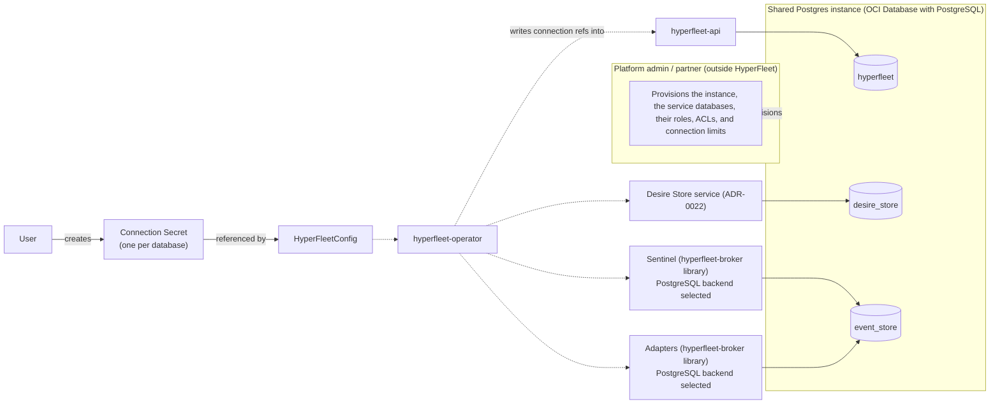

# Co-Located Service Databases on the Shared Postgres Instance — Design

**Jira**: [HYPERFLEET-1670](https://redhat.atlassian.net/browse/HYPERFLEET-1670)

**Implements**: [ADR-0026: Co-Located Service Databases on Shared Postgres](../adrs/0026-co-located-service-databases-shared-postgres-isolation.md)

**Related**: [ADR-0022](../adrs/0022-api-mediated-desire-store-access.md), [ADR-0023](../adrs/0023-oci-managed-postgresql.md), [ADR-0019](../adrs/0019-package-hyperfleet-as-operator.md), [SPIKE: Evaluate Running the Desire Store on the API Postgres](desire-store-api-postgres-spike.md)

## Table of Contents

- [Problem Statement](#problem-statement)
- [How](#how)
  - [Databases and canonical identifiers](#databases-and-canonical-identifiers)
  - [Roles and grants](#roles-and-grants)
  - [Object privileges and privilege handoff](#object-privileges-and-privilege-handoff)
  - [Per-database connection limits](#per-database-connection-limits)
  - [Connection budget](#connection-budget)
  - [Consumer topology](#consumer-topology)
  - [Operational rules](#operational-rules)
  - [Monitoring and alerts](#monitoring-and-alerts)
  - [Ownership, actors, and migrations](#ownership-actors-and-migrations)
  - [Scaling a service to its own instance](#scaling-a-service-to-its-own-instance)
- [Design Trade-offs](#design-trade-offs)
- [Alternatives](#alternatives)
- [References](#references)

## Problem Statement

[ADR-0026](../adrs/0026-co-located-service-databases-shared-postgres-isolation.md) defines the recommended PostgreSQL layout: the API, the Desire Store, and the PostgreSQL backend for the Broker each get a dedicated database on one shared instance. This document describes the identifiers, roles, grants, connection budget, operational guidance, alerts, and migration ownership for that layout. The Broker still supports other backend choices; this document does not give RabbitMQ or Pub/Sub a PostgreSQL dependency.

This design takes as fixed the isolation decision ([ADR-0026](../adrs/0026-co-located-service-databases-shared-postgres-isolation.md)), the managed instance and its admin boundary ([ADR-0023](../adrs/0023-oci-managed-postgresql.md)), API-mediated Desire Store access, so Appliers hold no DB connection ([ADR-0022](../adrs/0022-api-mediated-desire-store-access.md)), and the operator / partner-provided Postgres contract ([ADR-0019](../adrs/0019-package-hyperfleet-as-operator.md)).

Terminology: Desire Store, Broker, Adapter, Applier, Sentinel, and the `hyperfleet-broker` library are defined in the [glossary](glossary.md). PostgreSQL terms used below (`CONNECT`, `TEMPORARY`, `xmin horizon`, dead-tuple ratio, `search_path`, `LISTEN/NOTIFY`) carry their standard PostgreSQL meaning.

## How

### Databases and canonical identifiers

Three application databases live on the shared instance in the recommended PostgreSQL layout. The identifiers below are canonical for this layout and must match the Helm chart/external Secret configuration. The owner column identifies the schema and migration owner, not the PostgreSQL database owner; the platform admin or partner owns the databases.

| Database | Contents | Schema and migration owner |
|----------|----------|-------|
| `hyperfleet` | API application state: `Cluster`, `NodePool`, `Channel`, `Version`, `WifConfig`, adapter statuses, enrichment tables | `hyperfleet-api` component |
| `desire_store` | The Desire Store database | Decided by [HYPERFLEET-1671](https://redhat.atlassian.net/browse/HYPERFLEET-1671) (store backend); the service that reads it is decided by [HYPERFLEET-1645](https://redhat.atlassian.net/browse/HYPERFLEET-1645) |
| `event_store` | Events and consumer tracking for the PostgreSQL backend for the Broker | Decided by [HYPERFLEET-1656](https://redhat.atlassian.net/browse/HYPERFLEET-1656) (PostgreSQL backend design) |

`hyperfleet` is the name the API Helm chart already uses (`config.database.name`). The PostgreSQL backend for the Broker uses `event_store` through the `hyperfleet-broker` library. Broker names the messaging role; `event_store` names the database for this backend. This does not introduce a separate Broker deployment or an event-sourcing model for the API. Each database holds one workload's tables; none uses schema-level multiplexing inside another database.

Alignment of the API chart and external Secret on `hyperfleet` is tracked in [HYPERFLEET-1711](https://redhat.atlassian.net/browse/HYPERFLEET-1711).

```mermaid
flowchart LR
  USER["User"] -->|creates| SEC["Connection Secret<br/>(one per database)"]
  SEC -->|referenced by| HFC["HyperFleetConfig"]
  HFC -.-> OP["hyperfleet-operator"]
  OP -.->|writes connection refs into| API[hyperfleet-api]
  OP -.-> DS["Desire Store service (ADR-0022)"]
  OP -.-> SEN["Sentinel (hyperfleet-broker library)<br/>PostgreSQL backend selected"]
  OP -.-> ADP["Adapters (hyperfleet-broker library)<br/>PostgreSQL backend selected"]

  subgraph PA["Platform admin / partner (outside HyperFleet)"]
    PROV["Provisions the instance, the service databases, their roles, ACLs, and connection limits"]
  end

  subgraph PG["Shared Postgres instance (OCI Database with PostgreSQL)"]
    DBA[(hyperfleet)]
    DBD[(desire_store)]
    DBE[(event_store)]
  end

  PROV ==>|provisions| PG
  API --> DBA
  DS --> DBD
  SEN --> DBE
  ADP --> DBE
```

Diagram legend: the user creates the connection Secrets and references them in **HyperFleetConfig**. Dotted arrows show the operator reading the configuration and wiring those Secret references into component Deployments, not opening database connections. Solid arrows into cylinder nodes are the components' database connections; Sentinel and Adapters open those connections only when the PostgreSQL backend for the Broker is selected. The thick arrow shows the **platform admin or partner** provisioning the instance and databases. The diagram shows the dedicated Desire Store service; the API-pod alternative is in [Connection budget](#connection-budget).

### Roles and grants

#### Component access contract

Components consume the connection configuration and credentials for the database they use. The operator only wires Secret references into Deployments. Per [ADR-0022](../adrs/0022-api-mediated-desire-store-access.md), Adapters and Appliers access the Desire Store through its authenticated hub service, not database credentials. That service enforces client write permissions; database ACLs restrict access to the service's runtime role, not to separate Adapter or Applier database accounts. The service authorization details belong to [HYPERFLEET-1645](https://redhat.atlassian.net/browse/HYPERFLEET-1645).

#### Recommended role and ACL model

For the recommended deployment, `desire_store` and `event_store` use a **migration role** `<db>_migrate` (DDL and migrations) and a **runtime role** `<db>_app` (DML only). The split prevents a compromised runtime credential from altering or dropping objects. `hyperfleet` retains its existing single role: the API chart uses one Secret for both its `db-migrate` init container and runtime container. Splitting that credential is separate API work, not an assumed change in this design.

Here and below, `<db>` is a service database — `desire_store` or `event_store` — unless stated otherwise; `<db>_migrate` and `<db>_app` are its migration and runtime roles, and `<schema>` is that database's canonical schema.

The runtime-role restrictions below apply to `desire_store_app` and `event_store_app`, not to the API's existing single migration/runtime role.

- Roles are **cluster-global** in PostgreSQL, not database-local. Isolation comes from per-database privileges, not from role visibility: `CONNECT` and object grants are recorded per database, so a role can only act where it has been granted.
- PostgreSQL grants `CONNECT` and `TEMPORARY` on every new database to `PUBLIC` by default. The platform admin or partner revokes **both** from `PUBLIC` on **all three databases** — not just `hyperfleet` — and grants `CONNECT` only to the roles that need the database: the service databases' own roles (`desire_store_app`, `desire_store_migrate`, `event_store_app`, `event_store_migrate`) and the API's existing `hyperfleet` role for `hyperfleet`. No role held by `hyperfleet-operator` is granted `CONNECT` on any database. Otherwise any login role with valid credentials could open a session against `desire_store` or `event_store` and consume their connection limits.
- No service role is ever granted `CONNECT` on `hyperfleet`. A service credential therefore cannot open a session against the system-of-record database at all — the security boundary ADR-0026 decides.
- Service application `LOGIN` roles must be `NOSUPERUSER`, `NOCREATEDB`, `NOCREATEROLE`, `NOREPLICATION`, `NOBYPASSRLS`, and `NOINHERIT`.
- Service application roles must not be direct or transitive members of API or migration roles — including memberships that permit `SET ROLE` — and must not own API databases, schemas, or objects. They must not administer API roles or hold role-membership administration rights.
- Migration credentials are supplied only to migration executors, not to runtime containers or remote Desire Store clients.
- Connection configuration explicitly selects the database; do not assume implicit database selection from a URI. Backend-specific connection validation belongs to the implementation work.
- Connections should be encrypted, and a deployment that terminates database TLS in a proxy must document the authenticated transport boundary it provides. Whether encryption must also perform **server identity verification** (`sslmode=verify-full` with a trusted CA, or an equivalent certificate and hostname check), and how the CA is distributed and rotated, is a decision in its own right and lives with the Postgres transport-security work ([HYPERFLEET-1709](https://redhat.atlassian.net/browse/HYPERFLEET-1709)). This is a recommendation today, not an enforced requirement: the charts default to `sslmode=disable`, so enforcing it means changing those defaults and adding coverage before it can be treated as required. Note that `disable` and `require` do not authenticate the server — `require` encrypts but does not stop an attacker who can intercept or redirect the connection from impersonating PostgreSQL.

These database isolation recommendations describe the reference deployment, not checks already implemented by the operator or component charts. The platform admin or partner sets the role attributes, memberships, and grants and should validate them when provisioning or upgrading. HyperFleet does not automatically enforce this policy on arbitrary partner-provided instances; the partner contract and its verification belong to [HYPERFLEET-1710](https://redhat.atlassian.net/browse/HYPERFLEET-1710).

Recommended application/migration ACL matrix, managed by the **platform admin or partner** using database-owner authority — see [Ownership, actors, and migrations](#ownership-actors-and-migrations). The API's migration path does not manage database-level ACLs or limits. Required administrative and monitoring access is managed separately by the platform admin and budgeted in the reserved headroom.

| Database | `CONNECT` granted to | `TEMPORARY` granted to |
|----------|----------------------|------------------------|
| `hyperfleet` | the API's existing role (migration + runtime) — never service roles | the API's existing role only |
| `desire_store` | `desire_store_app`, `desire_store_migrate` | `desire_store_migrate` only |
| `event_store` | `event_store_app`, `event_store_migrate` | `event_store_migrate` only |

Applied by the platform admin or partner as `REVOKE CONNECT, TEMPORARY ON DATABASE <db> FROM PUBLIC;` followed by the role-specific grants for each row above: `GRANT CONNECT ON DATABASE <db> TO <role>;` for every role listed under `CONNECT`, and `GRANT TEMPORARY ON DATABASE <db> TO <role>;` for the migration role(s) listed under `TEMPORARY`.

The platform admin or partner owns the instance and the three databases. Each service database's migration role `<db>_migrate` owns that database's schema and objects, and the API's role owns the `hyperfleet` schema and objects. Because the API's role does not own the `hyperfleet` database, the platform admin applies the `hyperfleet` database-level ACL and `CONNECTION LIMIT`; the API's migration path manages only its schema and objects.

### Object privileges and privilege handoff

Database-level `CONNECT`/`TEMPORARY` do not grant access to tables: schema `USAGE`, table, and sequence privileges are separate. In the recommended deployment, `desire_store` and `event_store` each have a canonical schema of the same name, owned by `<db>_migrate`; `<db>_app` has schema `USAGE` and the DML privileges its workload needs, but no effective `CREATE` privilege. The API continues using `public` in `hyperfleet`, with the privileges needed by its existing single migration/runtime role. Removing `PUBLIC CREATE` on `public` must not remove that API role's required access. For the two new databases, the platform admin should also remove effective runtime `CREATE` privileges on `public` and pin the runtime `search_path` to the canonical schema, including for pre-existing databases that retain older defaults.

| Role | Schema `USAGE` | Tables | Sequences | DDL |
|------|----------------|--------|-----------|-----|
| `<db>_app` (service runtime) | `GRANT USAGE ON SCHEMA` | `SELECT, INSERT, UPDATE, DELETE` as the workload requires | `USAGE, SELECT` | none (`CREATE` explicitly withheld) |
| `<db>_migrate` (service migration) | `GRANT USAGE ON SCHEMA` | all (via ownership) | all (via ownership) | `CREATE, ALTER, DROP` (owns schema and objects) |
| API's existing role (`hyperfleet`) | `GRANT USAGE ON SCHEMA` | all (via ownership) | all (via ownership) | `CREATE, ALTER, DROP` (owns schema and objects; single role, not split) |

Before the first migration, the platform admin creates the canonical schema and assigns `<db>_migrate` as owner, or grants that role database-level `CREATE` so it can create the schema. Runtime grants cover both existing tables/sequences and future objects through default privileges for the role that creates them. Schema ownership supplies migration DDL authority; a grant option alone does not permit `ALTER` or `DROP`. The platform admin owns validation of this setup; this document does not assume automatic chart checks on every upgrade.

### Per-database connection limits

- OCI Database with PostgreSQL's default maximum connections is ~500, but it varies by instance shape and can be changed; the provisioned `max_connections` is the source of truth, not the default.
- Each service database's per-database limit is derived from that provisioned `max_connections` and applied via `ALTER DATABASE ... CONNECTION LIMIT N` by the platform admin or partner; because neither the API's role nor a service's migration role owns the `hyperfleet` database, the platform admin applies `hyperfleet`'s limit as well.
- The allocation rules are in [Connection budget](#connection-budget).

### Connection budget

Only **actual PostgreSQL connection pools** are counted here. Broker connections to `event_store` apply only when the PostgreSQL backend for the Broker is selected; RabbitMQ and Pub/Sub do not create these pools. The two workloads are reached differently:

- **Desire Store** is API-mediated ([ADR-0022](../adrs/0022-api-mediated-desire-store-access.md)): Adapters and Appliers never hold a database connection; the hub desire-store service does. The service itself (existing API or a dedicated hub service) is decided by [HYPERFLEET-1645](https://redhat.atlassian.net/browse/HYPERFLEET-1645).
- **PostgreSQL backend for the Broker** runs through the `hyperfleet-broker` **library** ([ADR-0002](../adrs/0002-pluggable-message-broker-library.md)) inside Sentinel and every Adapter. Each process using this backend opens its own pool to `event_store`; the library has no pods, replicas, or chart of its own. Backend implementation details belong to [HYPERFLEET-1656](https://redhat.atlassian.net/browse/HYPERFLEET-1656).

API calls (HTTP) and Applier access are not database connections. Size each database for **peak**, including rollout and migration overlap:

- `rep_api`, `rep_ds`, and `rep_sentinel`: maximum configured replicas, including the HPA ceiling when enabled.
- `rep_adapter`: sum of maximum replicas across Adapter deployments, not the number of deployments.
- `surge_x`: additional concurrently connecting pods during rollouts; for Adapters, sum the surge across deployments that can roll out together.
- `pool_x`: maximum PostgreSQL connections per running process; `pool_broker` is the pool for the PostgreSQL backend for the Broker.
- `mig_x`: aggregate concurrent migration connections to the corresponding database, not a replica count. Migration concurrency and per-process connections come from the owning migration design.

The formulas assume a common pool size per workload; for differing Adapter pool sizes, sum each deployment's demand instead. Include terminating pods that retain connections in the overlap allowance.

| Component | Peak demand | Charged to |
|-----------|-------------|------------|
| API service | (rep_api + surge_api) × pool_api + mig_api | `hyperfleet` |
| Desire Store, dedicated hub service | (rep_ds + surge_ds) × pool_ds + mig_ds | `desire_store` |
| Desire Store inside the API pods | (rep_api + surge_api) × pool_ds + mig_ds | `desire_store` |
| Sentinel | (rep_sentinel + surge_sentinel) × pool_broker | `event_store` |
| Adapters | (rep_adapter + surge_adapter) × pool_broker | `event_store` |
| Migrations for the PostgreSQL backend for the Broker | mig_broker | `event_store` |
| Appliers (API-mediated, ADR-0022) | 0 | — |

Exactly one of the two Desire Store rows applies; the API-pod variant still has a separate pool to `desire_store`, not part of the `hyperfleet` pool. Hosting is decided by [HYPERFLEET-1645](https://redhat.atlassian.net/browse/HYPERFLEET-1645). The API chart defaults to `pool.max_connections: 50`, with HPA disabled and `maxSurge: 1`. If HPA is enabled with its configured default ceiling of 10 replicas, the runtime upper bound is `(10 + 1) × 50 = 550`, before adding migration connections — already above the 450 allocatable on an illustrative 500-connection instance with 10% reserved. The actual maximum replicas and pool sizes must fit the provisioned capacity. The Desire Store and PostgreSQL backend designs supply their own pool, surge, and migration budgets; these are not additional defaults imposed here.

`hyperfleet-operator` opens no database connection and contributes zero demand. Platform administration and monitoring connections are accounted for in reserved headroom.

Each database's per-database limit is set to its peak demand (above), derived from the instance's provisioned `max_connections`. The platform admin or partner reserves at least 10% of `max_connections` for monitoring and administrative access and sizes each database so the three peaks fit the remaining pool. If they do not fit, the instance shape is enlarged; the limits are never silently scaled down to make a configuration pass. The limit is applied with `ALTER DATABASE ... CONNECTION LIMIT`.

### Consumer topology

Remote Appliers never connect to a service database directly: [ADR-0022](../adrs/0022-api-mediated-desire-store-access.md) keeps them behind the authenticated hub service. The service that fronts the Desire Store, and the Broker consumption topology, are decided by [HYPERFLEET-1645](https://redhat.atlassian.net/browse/HYPERFLEET-1645) and [HYPERFLEET-1656](https://redhat.atlassian.net/browse/HYPERFLEET-1656); this design does not define them.

### Operational rules

Every database on the shared instance follows these cross-cutting rules to prevent contention and resource exhaustion. The service-specific settings — autovacuum values, retention, and transaction or claim semantics — belong to each service's own design ([HYPERFLEET-1671](https://redhat.atlassian.net/browse/HYPERFLEET-1671) for the Desire Store, [HYPERFLEET-1656](https://redhat.atlassian.net/browse/HYPERFLEET-1656) for the Broker), not to this document.

#### Vacuum and dead-tuple management

PostgreSQL runs a **single server-wide autovacuum worker pool** (`autovacuum_max_workers`); the launcher schedules work per database and each worker processes one table at a time. A busy service can consume workers the API needs, so:

- Update-heavy tables need more aggressive autovacuum thresholds than the default; append-only tables reclaimed in bulk generally do not. Which tables fall in each class is the owning service's call.
- The API database keeps default thresholds for most tables and adjusts only identified hot tables.
- The per-table values are owned by each service's design and must be validated against production measurements.

#### Transaction profile

- Keep transactions short and do not hold snapshots across request boundaries. Ordinary primary-side transactions pin cleanup for their own database's tables, not another database's ordinary tables. This is not a blanket guarantee for replication or HA: shared catalogs, replication slots, and standby feedback require instance-level monitoring. OCI [read replicas share regional volumes and use asynchronous replication](https://docs.oracle.com/en-us/iaas/Content/postgresql/high-availability.htm); PostgreSQL [standby feedback can delay primary cleanup and cause bloat](https://www.postgresql.org/docs/17/runtime-config-replication.html#GUC-HOT-STANDBY-FEEDBACK). Validate the managed instance's actual replication configuration rather than assuming HA has no retention effects.
- Return connections to their pool immediately after the work completes; this does not require closing the underlying pooled session.
- Claim, offset, ordering, and delivery semantics are owned by each service's design ([HYPERFLEET-1645](https://redhat.atlassian.net/browse/HYPERFLEET-1645), [HYPERFLEET-1656](https://redhat.atlassian.net/browse/HYPERFLEET-1656)), not defined here.

#### NOTIFY and asynchronous features

- Do not emit `NOTIFY` inside hot write transactions. Notifications are delivered only to listeners connected to the same database, and high-frequency notifications plus long-lived listening transactions add queue pressure and hold a snapshot.
- Sentinel integration runs over the Message Broker ([ADR-0002](../adrs/0002-pluggable-message-broker-library.md)), not Postgres `LISTEN/NOTIFY`.
- A service that needs event signalling owns that choice in its own design; where `NOTIFY` is used, listeners must be short-lived.

### Monitoring and alerts

The platform's database monitoring should cover the shared instance and each database. For primary sessions, **xmin horizon age** tracks how long a snapshot contributing to the oldest visibility horizon has been held; replication-related retention must also be monitored separately. **Dead-tuple ratio** is `dead tuples / (live tuples + dead tuples)`, using estimated table statistics and treating an empty table as zero. The thresholds below are starting points to tune against production measurements, not fixed service SLAs or backend retention decisions. Broker rows apply to `event_store` only when the PostgreSQL backend is selected.

| Alert | Threshold | Rationale |
|-------|-----------|-----------|
| **API: xmin horizon age** | > 10 min | API transaction or monitoring query holding an old snapshot. Dead tuples cannot be reclaimed. Check for long-running queries (e.g., pagination, bulk exports, monitoring dashboards). |
| **API: dead tuple ratio** | > 15% | Autovacuum is falling behind. Heap bloat is likely. Verify autovacuum settings and check API query performance (full table scans, index bloat). |
| **API: slow query count** | > 5 queries > 1s in 5 min window | Indicates possible lock contention or suboptimal indexes. Check for unfiltered or unpaginated queries against the resource tables. |
| **Desire Store: xmin horizon age** | > 5 min | Long-running transaction or query pinning the snapshot. Dead tuples in the Desire Store table cannot be reclaimed until this transaction finishes. |
| **Desire Store: dead tuple ratio** | > 20% | Autovacuum is falling behind. Heap bloat is likely. Verify autovacuum settings and check for lock contention. |
| **Broker: xmin horizon age** | > 10 min | Consumer or monitoring query holding an old snapshot. Queue processing may back up. |
| **Broker: oldest unconsumed event age** | > 1 hour (configurable per SLA) | An event has remained pending for over an hour, even if other events are being processed. Check backlog, consumer health, and connectivity. |
| **Broker: dead tuple ratio** | > 30% | Indicates the Broker's cleanup is falling behind; the expected ratio depends on the retention scheme chosen in [HYPERFLEET-1656](https://redhat.atlassian.net/browse/HYPERFLEET-1656) (bulk partition rotation shows few dead tuples, row-level deletes show more). |
| **Per-database: connection usage warning** | >= 80% of that database's applied `CONNECTION LIMIT` | The database is approaching its own limit, independent of instance-wide headroom. Identify the largest pool (`<db>_app`, migration, or service) and its demand. |
| **Per-database: connection usage critical** | >= 95% of that database's applied `CONNECTION LIMIT` | The database is about to reject connections; new sessions fail even though the instance may still have spare capacity. Raise the limit (if `max_connections` allows) or shed load. |
| **Instance-level: connection saturation** | >= 90% of the provisioned `max_connections` (and a warning at >= 80%) | Approaching instance capacity. The threshold is derived from `max_connections`, not a fixed 500, so it fires within the supported range on smaller instances. Scale up or deprovision non-critical consumers. |

Per-database alerts (including the per-database connection-usage warning and critical) must be scoped to the specific database (e.g., `query per database name where name = 'desire_store'`). The instance-level connection-saturation alert is the exception: it is computed from **aggregate instance usage** across all databases, not from a single database, because the limit it guards is instance-wide.

### Ownership, actors, and migrations

PostgreSQL schema, role, and table setup differ per database, and the actors that touch the instance are distinct. Each actor's authority is:

| Actor | Owns or provisions | Database credential |
|-------|--------------------|---------------------|
| **Platform admin or partner** — whoever owns the instance | Provisions the instance, the `hyperfleet`, `desire_store`, and `event_store` databases, their roles, the ACL matrix, and their per-database `CONNECTION LIMIT` | An admin credential for the instance; never an application credential |
| `hyperfleet-api` component | `hyperfleet` schema, objects, migrations, pool sizing | The API's existing `hyperfleet` role (migration + runtime) |
| Desire Store component (decided by [HYPERFLEET-1671](https://redhat.atlassian.net/browse/HYPERFLEET-1671)) | `desire_store` schema, objects, migrations, per-table autovacuum, pool sizing | `desire_store_migrate` and `desire_store_app` |
| Owner of the PostgreSQL backend for the Broker (decided by [HYPERFLEET-1656](https://redhat.atlassian.net/browse/HYPERFLEET-1656)) | `event_store` schema, objects, migrations, partitioning, autovacuum, pool sizing | `event_store_migrate` for migrations; `event_store_app` used by the library in Sentinel/Adapters |
| [`hyperfleet-operator`](https://github.com/openshift-hyperfleet/hyperfleet-operator) | Wiring database connection Secrets into the component deployments; `HyperFleetConfig` conditions | **None** — it opens no database connection |

Each database therefore has a **single schema and migration owner** — the component that owns its schema and migrations — accountable for credentials, migrations, pool sizing, and chart lifecycle:

| Database | Owner | Responsible For | Ships In |
|----------|-------|-----------------|----------|
| `hyperfleet` | `hyperfleet-api` component | Schema versioning, table creation, role grants, application migrations | API Helm chart (init container `db-migrate`, as today) |
| `desire_store` | Store backend owner, decided by [HYPERFLEET-1671](https://redhat.atlassian.net/browse/HYPERFLEET-1671) | Store schema, role grants, per-table autovacuum, index creation, pool sizing | The owning component's chart |
| `event_store` | Owner of the PostgreSQL backend for the Broker, decided by [HYPERFLEET-1656](https://redhat.atlassian.net/browse/HYPERFLEET-1656) | Backend schema, object grants, credentials, partitioning, autovacuum, pool sizing | Migration artifact and deployment integration defined by the backend design; no standalone Broker chart |

Sentinel and Adapters use the Broker through the [`hyperfleet-broker`](../docs/glossary.md) library ([ADR-0002](../adrs/0002-pluggable-message-broker-library.md)). Selecting its PostgreSQL backend changes storage, not the component topology. Schema and migration ownership for `event_store` belongs to the PostgreSQL backend design in [HYPERFLEET-1656](https://redhat.atlassian.net/browse/HYPERFLEET-1656).

API migration execution is unchanged: its chart runs `db-migrate` and the API serializes concurrent runs with a PostgreSQL advisory lock. The two new databases' owning designs specify their migration artifacts and deployment integration, including any init containers; this document does not invent a Broker chart or a new operator-side executor. The operator deploys the Kubernetes resources but does not connect to PostgreSQL or run SQL migrations itself.

#### Provisioning and the operator

The databases, roles, the ACL matrix, and the per-database `CONNECTION LIMIT` are created and applied by the **platform admin or partner**, not by `hyperfleet-operator`. On the recommended managed path the platform provisions the instance and the three databases, their roles, the ACL matrix, and the limits; the API then creates and migrates the schema and objects inside `hyperfleet`. On a **partner-provided instance** the partner does so (or provides an equivalent contract), per [ADR-0019](../adrs/0019-package-hyperfleet-as-operator.md); how that contract is enforced is tracked in [HYPERFLEET-1710](https://redhat.atlassian.net/browse/HYPERFLEET-1710).

`hyperfleet-operator` holds **no** service database credential and opens no database connection. It consumes the per-database connection Secrets and wires them into the component deployments; database health is surfaced through the operator's existing `HyperFleetConfig` conditions ([ADR-0019](../adrs/0019-package-hyperfleet-as-operator.md)), and no new per-database CR field is added (schema version per database stays internal). Keeping the most privileged database credentials out of the management cluster running the operator matches [ADR-0019](../adrs/0019-package-hyperfleet-as-operator.md)'s partner-provided contract and avoids a Postgres driver and reconciliation path in the operator.

Splitting the API database credential into migration and runtime roles, so `hyperfleet` follows the same per-database split as the two service databases, is follow-up work in [HYPERFLEET-1717](https://redhat.atlassian.net/browse/HYPERFLEET-1717).

### Scaling a service to its own instance

A service moves to a dedicated Postgres instance when:

1. **Dedicated instance capacity** becomes cheaper than the shared instance upgrade needed to accommodate the workload at target fleet size. For the PostgreSQL backend for the Broker, use the full `event_store` peak demand from [Connection budget](#connection-budget), including Sentinel/Adapter surge and migration connections. If a dedicated smaller instance is cheaper, move its database without introducing a standalone Broker service.
2. **Failure domain isolation** becomes a hard requirement. Example: if a Broker bug or spike exhausts shared instance resources and brings down the API, a dedicated instance isolates the risk. Both services are on the cluster-provisioning critical path, so the trigger is the observed blast radius of one service failing, not a static ranking of which service matters less.
3. **Tenant isolation** is required (future multi-tenancy design). The shared instance is per-HyperFleet-deployment; isolating one tenant's event stream to a separate database does not provide isolation on the shared instance. A separate instance would be required.

## Design Trade-offs

### What We Gain

- Database boundaries map directly to PostgreSQL primitives (per-database `CONNECT`, per-database `CONNECTION LIMIT`, per-table autovacuum), so the isolation is enforced by the database rather than by application code.
- Each service's schema, indexes, and partitioning evolve independently, with its own migration owner and chart lifecycle.

### What We Lose / What Gets Harder

- The shared instance is a shared failure domain and a shared CPU/I/O/WAL resource; a noisy service can affect the others even when it does not pin their vacuum horizon.
- Backup and restore are coupled: OCI Database with PostgreSQL takes backups per instance, so a restore recovers all three databases together and there is no per-database point-in-time recovery.
- The connection budget is sized to peak demand, including rolling-update overlap and migration connections, and must be re-derived whenever replicas, surge, or pool sizes change. The platform admin or partner must allocate sufficient capacity; the document does not imply an existing automated deployment check. Broker PostgreSQL pools are counted only when that backend is selected.
- Moving a service to its own instance later is a data-copy effort, not a configuration change.

### Acceptable Because

- The recommended sizing fits once the API's maximum replicas or pool size is bounded, or the instance is enlarged; limits are derived from peak demand rather than assumed.
- OCI Database with PostgreSQL provides automatic failover, so the shared failure domain is mitigated (see the [ADR-0023](../adrs/0023-oci-managed-postgresql.md) backup/restore posture).

## Alternatives

The decision-level alternatives (schema isolation in a single database, and a separate instance per service) are recorded in [ADR-0026 → Alternatives Considered](../adrs/0026-co-located-service-databases-shared-postgres-isolation.md#alternatives-considered); they belong to the decision. The design-level choices below were considered here.

| Alternative | Why not |
|-------------|---------|
| **Operator-run migrations for all three databases** | `hyperfleet-operator` holds no database credential by design, and centralizing the artifacts would take ownership from the components that already version them; migrations stay per-chart (the API's init container pattern), as today. |
| **Operator-owned database provisioning (roles, ACLs, connection limits)** | Puts the most privileged database credentials in the management cluster running the operator and requires a Postgres driver and reconciliation path; provisioning stays with the platform admin or partner per [ADR-0019](../adrs/0019-package-hyperfleet-as-operator.md). |
| **Fixed per-database connection limits** | Fixed constants cannot fit the range of instance shapes; limits are derived from the provisioned `max_connections` and the configured demand, and an infeasible configuration is rejected rather than degraded. |
| **TLS terminated in a proxy without end-to-end verification** | A proxy boundary is acceptable only when documented and authenticated. Whether direct connections require server identity verification, and the proxy-terminated-TLS exception, are deferred to the transport-security decision in [HYPERFLEET-1709](https://redhat.atlassian.net/browse/HYPERFLEET-1709). |

## References

- [ADR-0026: Co-Located Service Databases on Shared Postgres](../adrs/0026-co-located-service-databases-shared-postgres-isolation.md) — the decision this document implements
- [SPIKE: Evaluate Running the Desire Store on the API Postgres](desire-store-api-postgres-spike.md) — load profile, feasibility, initial role/grant sketch
- [ADR-0023: OCI Database with PostgreSQL as the Managed Instance for the Oracle Deployment Path](../adrs/0023-oci-managed-postgresql.md) — instance provisioning, HA, admin role boundary, migration caveats
- [ADR-0022: API-Mediated Desire Store Access](../adrs/0022-api-mediated-desire-store-access.md) — Applier access model (API-mediated, not direct DB)
- [ADR-0019: Package HyperFleet as a Kubernetes Operator](../adrs/0019-package-hyperfleet-as-operator.md) — partner-provided PostgreSQL contract
- [HYPERFLEET-1671](https://redhat.atlassian.net/browse/HYPERFLEET-1671) (Desire Store backend implementation) — consumes this design
- [HYPERFLEET-1656](https://redhat.atlassian.net/browse/HYPERFLEET-1656) (PostgreSQL backend for the Broker, River or purpose-built) — consumes this design
- [HYPERFLEET-1672](https://redhat.atlassian.net/browse/HYPERFLEET-1672) — shared-instance contention benchmark
- [HYPERFLEET-1709](https://redhat.atlassian.net/browse/HYPERFLEET-1709) — Postgres transport security
- [HYPERFLEET-1710](https://redhat.atlassian.net/browse/HYPERFLEET-1710) — enforcing the contract on partner-provided instances
- [HYPERFLEET-1717](https://redhat.atlassian.net/browse/HYPERFLEET-1717) — split the API database credential into migration and runtime roles
