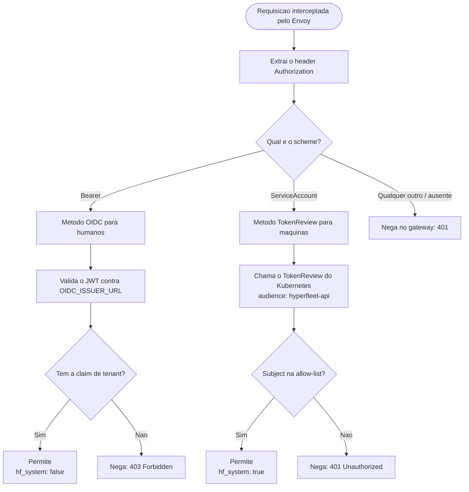
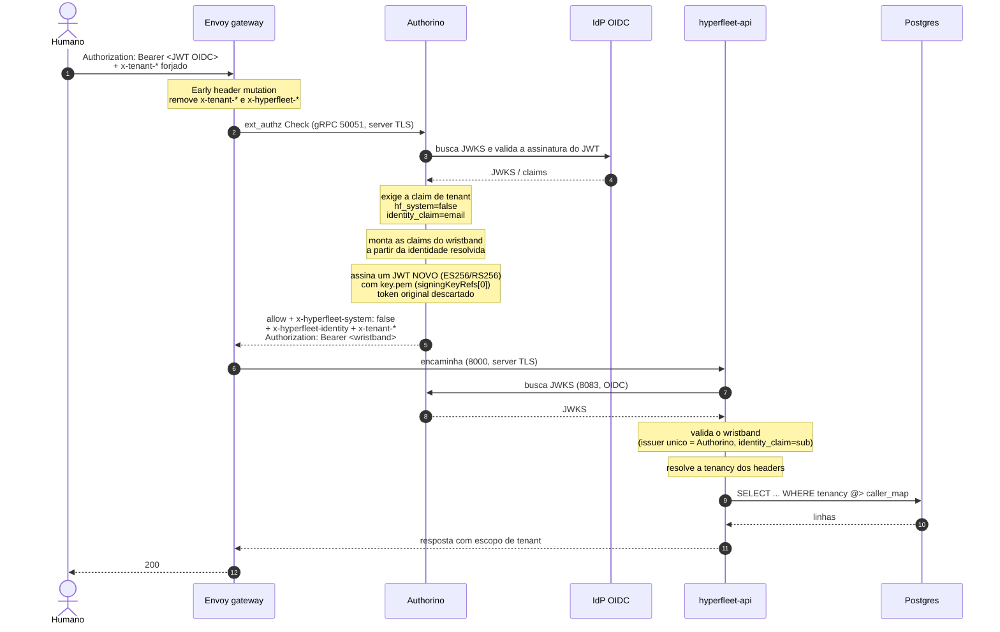
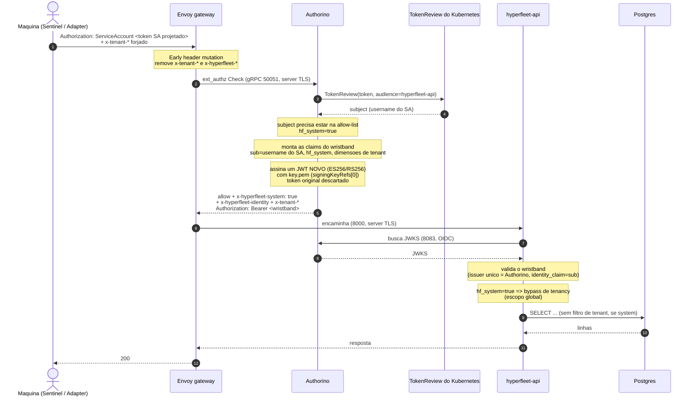
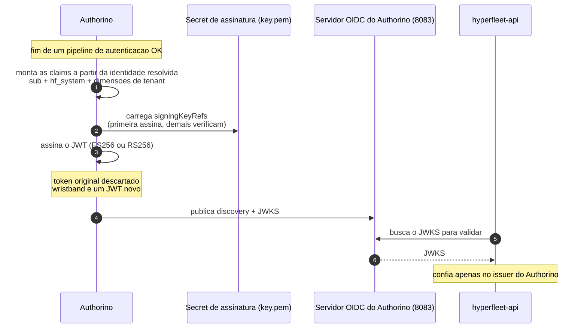
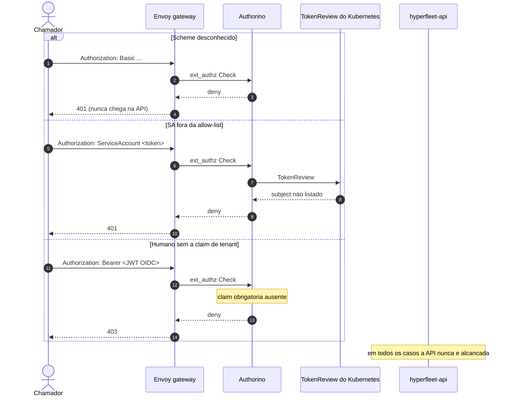
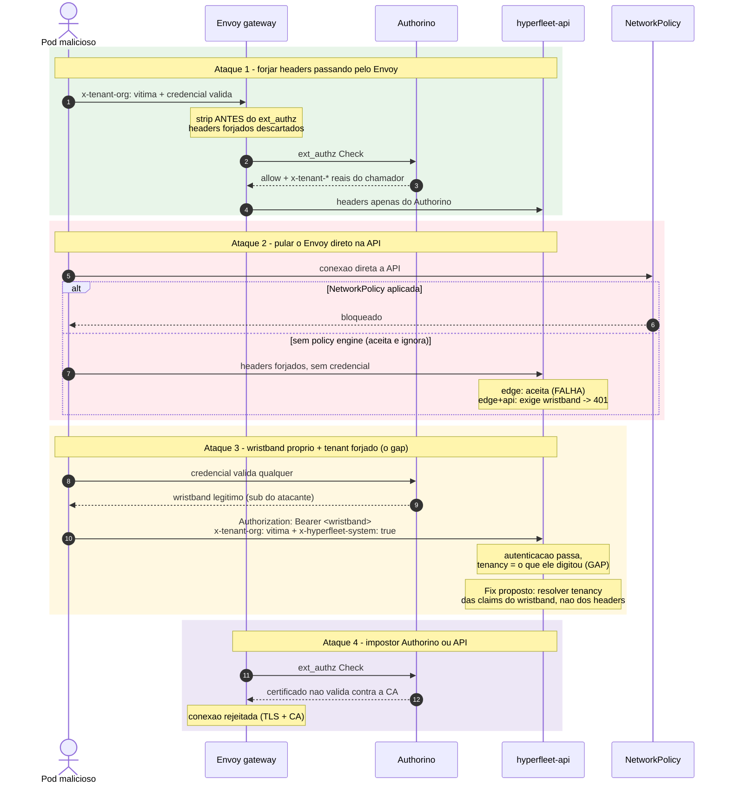

# Autenticação no Gateway, TLS e Tenancy: Diagramas

## Visão geral

O modelo de autenticação do gateway tem várias peças móveis (Envoy, Authorino,
ext_authz, TokenReview, o wristband, headers confiáveis e escopo de tenant) que
são difíceis de manter na cabeça só com prosa. Este documento reproduz os mesmos
fluxos como diagramas Mermaid: a árvore de decisão da convenção de scheme, o
caminho de produção `edge+api` nas variantes humana e de máquina, a geração do
wristband, o modo legado `edge`, as negações fail-closed e o modelo de ameaças.

É um material de apoio ao
[ADR-0020](../adrs/0020-envoy-authorino-api-gateway.md) e ao
[Multi-Tenant Identity and Authorization Design](multi-tenant-identity-authz-design.md).

## Estado deste documento

Estes diagramas descrevem o design **como discutido em 16 de setembro de 2026**,
que está à frente dos ADRs commitados em dois pontos:

- O **wristband** (Authorino Festival Wristband) e o refactor do **`AUTH_MODE`**
  ainda não são decisão de registro. São a emenda pendente do ADR-0020,
  rastreada por [HYPERFLEET-1636](https://redhat.atlassian.net/browse/HYPERFLEET-1636)
  (Backlog). O termo "wristband" ainda não aparece em nenhum documento commitado
  deste repositório.
- A implementação, porém, já está ticketada: o lado do gateway (emitir o
  wristband, trocar o `Authorization` e introduzir o `AUTH_MODE`) é o
  [HYPERFLEET-1668](https://redhat.atlassian.net/browse/HYPERFLEET-1668)
  (In Progress); o lado da API (ler tenancy de claims) é o
  [HYPERFLEET-1669](https://redhat.atlassian.net/browse/HYPERFLEET-1669)
  (New, bloqueado pelo [HYPERFLEET-1668](https://redhat.atlassian.net/browse/HYPERFLEET-1668)).

Trate os fluxos abaixo como o design-alvo, e o ADR-0020 mais o design doc de
tenancy como o estado atualmente commitado.

## Participantes

| Participante | Papel |
|--------------|-------|
| Chamador | Humano (JWT OIDC) ou máquina (token de service account projetado) |
| Envoy | Porta de entrada do gateway. Remove headers forjados, chama o Authorino, encaminha para a API |
| Authorino | Valida credenciais, aplica allow-lists e claims obrigatórias, injeta headers, emite o wristband |
| TokenReview do Kubernetes | Valida um token de service account e devolve o subject |
| IdP OIDC | Emissor externo ou mock que assina os tokens humanos |
| hyperfleet-api | Valida o wristband (em `edge+api`), resolve a tenancy e aplica o escopo na consulta ao banco |
| Postgres | Armazena a coluna JSONB `tenancy` e avalia containment (`@>`) |

## 1. Árvore de decisão: seleção de método pelo scheme

Esta é a visão de **ramificação**: dado o header `Authorization` que chegou pelo
Envoy, qual método de autenticação o Authorino escolhe e qual o critério de
permissão. Ela cobre a seleção de método e o allow/deny; a **linha do tempo** da
mesma requisição (mutação de headers, emissão do wristband e escopo de tenancy
no banco) está nas seções 2 e 3.

## 2. Caminho feliz em `edge+api` (produção)

Nos dois fluxos abaixo o gateway resolve identidade e tenancy, o Authorino emite
o wristband e a API valida esse único emissor. A única diferença entre humano e
máquina é o **método de autenticação** escolhido pelo scheme do header
`Authorization`.

### 2.1 Chamador humano (Bearer / OIDC)

### 2.2 Chamador máquina (ServiceAccount / TokenReview)

## 3. Como o wristband é gerado

O ponto conceitual que costuma confundir: **o token original não "vira" o
wristband**. Não há reuso nem re-assinatura do token recebido. O Authorino
descarta a credencial original e **emite um JWT novo**, assinado por ele, cujas
claims são montadas a partir da identidade já resolvida no pipeline.

O mecanismo, em ordem:

- **Onde é configurado.** No `AuthConfig`, no bloco de resposta de sucesso
  (`response.success.headers`), apontando para o header `Authorization`. É esse
  bloco que substitui o `Authorization` que chegou pelo `Bearer <wristband>`.
- **Quando é emitido.** No fim de um pipeline de autenticação **bem-sucedido**
  (fase de resposta / metadata-out). Em qualquer negação, não há wristband.
- **De onde vêm as claims.** Da identidade resolvida (o "Authorization JSON" do
  Authorino), não do token original. Em `edge+api`: `sub` (email para humano,
  username do SA para máquina, via `identity_claim: sub`), `hf_system` e as
  dimensões do tenant model ativo.
- **Como é assinado.** Chave em um Secret com `key.pem`. O campo `signingKeyRefs`
  é uma lista: a **primeira** chave assina, as demais são mantidas para
  **verificação durante a rotação**.
- **Onde é publicado.** O Authorino serve OIDC discovery e JWKS do wristband em
  `https://authorino-authorino-oidc.<ns>.svc:8083/<ns>/<authconfig>/<response>/.well-known/...`.

### Como a API valida o wristband

A API reaproveita o middleware JWT existente com **um único issuer** (o
Authorino). Como a API rejeita issuer e JWKS em `http` a menos que seja loopback
(`requireHTTPSURL`, desde
[HYPERFLEET-1327](https://redhat.atlassian.net/browse/HYPERFLEET-1327)), há duas
rotas:

- **JWKS local em arquivo** (`jwk_cert_file` com o JWKS público montado). O
  issuer é apenas comparado, nada é buscado, então o servidor OIDC do Authorino
  pode ficar em plaintext. É a rota de prova de conceito e não exige certificado.
- **JWKS por URL** (`jwk_cert_url` apontando para o endpoint do Authorino, com
  `jwk_cert_ca_file`). Exige TLS no servidor OIDC; a rotação é gratuita porque a
  API atualiza em um intervalo.

Comece pela rota 1 e migre para a 2 quando o
[HYPERFLEET-1648](https://redhat.atlassian.net/browse/HYPERFLEET-1648) chegar. O
wristband não está bloqueado no TLS.

### Onde o `AUTH_MODE` é definido

O `AUTH_MODE` não é definido neste repositório de arquitetura. É um valor de
**configuração de deploy** em `hyperfleet-infra`, introduzido pelo
[HYPERFLEET-1668](https://redhat.atlassian.net/browse/HYPERFLEET-1668): ele
substitui as duas flags booleanas atuais (`EXT_AUTHZ_ENABLED` e
`JWT_AUTH_ENABLED`) por um único valor que dirige tanto o gateway quanto a API.
O guard do helmfile que rejeita JWT com o issuer mock passa a ser ciente do modo
(correto para `api`, não aplicado em `edge+api`).

| `AUTH_MODE` | Gateway | JWT na API | Clientes enviam | A API valida | Quando usar |
|-------------|---------|------------|-----------------|--------------|-------------|
| `none` | off | off | nada | nada | Dev local: rodar a API direto, sem gateway e sem wiring de JWT. O loop local mais rápido para trabalho que não tem a ver com auth. Nunca deployado em ambiente real |
| `edge` | on | off | `ServiceAccount <token>` | nada; confia nos headers | Deployments de gateway atuais e prova do fluxo gateway/Authorino/tenancy end-to-end. Ponto fraco: a API confia incondicionalmente nos headers, então só é tão forte quanto a NetworkPolicy realmente aplicada em frente à API |
| `api` | off | on | `Bearer <token>` | issuer do cluster e IdP humano direto | Onde não há gateway porque o cluster alvo não é nosso para moldar (caminho operator até o [HYPERFLEET-1530](https://redhat.atlassian.net/browse/HYPERFLEET-1530); kind e GKE sem gateway) |
| `edge+api` | on | on | `ServiceAccount <token>` | o wristband do Authorino, um único issuer | Única postura de produção documentada: as duas camadas no ar, a API valida um issuer só, independentemente de a NetworkPolicy ser aplicada |

Enquanto o [HYPERFLEET-1668](https://redhat.atlassian.net/browse/HYPERFLEET-1668)
não chega, os switches continuam sendo os dois booleanos no helmfile do
`hyperfleet-infra` (`EXT_AUTHZ_ENABLED`, `JWT_AUTH_ENABLED`), e as duas flags
ligadas juntas não são uma combinação válida até o
[HYPERFLEET-1484](https://redhat.atlassian.net/browse/HYPERFLEET-1484) shipar.

## 4. Modo `edge` (sem wristband)

No modo `edge` a API não roda middleware JWT e confia incondicionalmente nos
headers injetados. A credencial original **não** é trocada por um wristband.

## 5. Negações fail-closed

Toda rejeição acontece no gateway; a API nunca é alcançada.

## 6. Modelo de ameaças em sequência

Os quatro ataques abaixo correspondem um a um à tabela de ameaças. Verde é
defendido, vermelho é o gap, amarelo é o fix, roxo é TLS.

## Notas de leitura

- A árvore de decisão (seção 1) é a visão de **ramificação**; os fluxos das
  seções 2.1 e 2.2 são a visão de **linha do tempo** para os dois ramos que
  terminam em allow.
- O wristband só aparece nos fluxos 2.1 e 2.2 (`edge+api`). No modo `edge`
  (seção 4) não há troca de `Authorization`, que é exatamente onde mora o gap do
  ataque 3.
- Em ambos os fluxos de produção, o token original nunca chega à API: o Authorino
  o descarta e injeta o próprio JWT. Por isso a API tem **um único issuer**,
  independentemente de o chamador ser humano ou máquina.
- O early header strip do ataque 1 é a restrição de ordem que quebrou o primeiro
  proof of concept de multitenancy: a remoção em nível de rota roda depois do
  ext_authz e apagaria os headers que o Authorino injeta.
- O ataque 2 é a razão de existir da segunda camada. Uma NetworkPolicy em um
  cluster sem policy engine é aceita pelo apiserver e silenciosamente ignorada.
- O ataque 3 é o gap registrado como caso e2e em
  [HYPERFLEET-1621](https://redhat.atlassian.net/browse/HYPERFLEET-1621). O fix
  (tenancy a partir das claims do wristband) agora é o
  [HYPERFLEET-1669](https://redhat.atlassian.net/browse/HYPERFLEET-1669),
  bloqueado pelo [HYPERFLEET-1668](https://redhat.atlassian.net/browse/HYPERFLEET-1668).
- TLS nos hops in-cluster (Envoy para Authorino, Envoy para API) não autentica o
  chamador. Ele impede ler uma credencial ou o wristband em trânsito e impede o
  Envoy de falar com um Authorino ou API impostor.

## Mapa de tickets (status em 2026-09-22)

Todos os tickets citados no material de origem ("Crash Course", 16/set/2026),
com o status atual consultado no JIRA. Onde o material de origem divergia, a
observação marca a mudança.

### Épicos e feature

| Ticket | Tema | Status | Responsável |
|--------|------|--------|-------------|
| [HYPERFLEET-1465](https://redhat.atlassian.net/browse/HYPERFLEET-1465) | Feature Multi-Tenant HyperFleet | In Progress | Phuongnhat Nguyen |
| [HYPERFLEET-1164](https://redhat.atlassian.net/browse/HYPERFLEET-1164) | Épico: Multi-Tenant Identity and Authorization (API tenancy) | Review | Phuongnhat Nguyen |
| [HYPERFLEET-1476](https://redhat.atlassian.net/browse/HYPERFLEET-1476) | Épico: Envoy and Authorino Gateway Deployment | In Progress | Martin Liptak |
| [HYPERFLEET-1530](https://redhat.atlassian.net/browse/HYPERFLEET-1530) | Épico: Gateway as an Operator-Managed Component | In Progress | — |

### Gateway, identidade e wristband

| Ticket | Tema | Status | Observação |
|--------|------|--------|------------|
| [HYPERFLEET-1480](https://redhat.atlassian.net/browse/HYPERFLEET-1480) | Machine identity pelo gateway (scheme split, allow-list, knob de scheme) | Closed | Fechado desde 16/set (PR 88) |
| [HYPERFLEET-1631](https://redhat.atlassian.net/browse/HYPERFLEET-1631) | Mock OIDC human token source para kind e CI | Closed | Fechado desde 16/set (PR 90) |
| [HYPERFLEET-1484](https://redhat.atlassian.net/browse/HYPERFLEET-1484) | In-app JWT atrás do gateway | In Progress | Lado da API do wristband |
| [HYPERFLEET-1668](https://redhat.atlassian.net/browse/HYPERFLEET-1668) | Emitir o wristband no gateway, trocar o Authorization e introduzir o AUTH_MODE | In Progress | **Novo**, criado após 16/set; é o lado do gateway |
| [HYPERFLEET-1669](https://redhat.atlassian.net/browse/HYPERFLEET-1669) | Ler tenancy e system identity das claims do wristband | New | **Novo**, criado após 16/set; bloqueado pelo [HYPERFLEET-1668](https://redhat.atlassian.net/browse/HYPERFLEET-1668) |
| [HYPERFLEET-1636](https://redhat.atlassian.net/browse/HYPERFLEET-1636) | Emenda do ADR-0020: convenção de scheme, wristband como issuer, tenancy de claims | Backlog | Ainda não registrado no repo |
| [HYPERFLEET-1621](https://redhat.atlassian.net/browse/HYPERFLEET-1621) | Caso e2e com wristband e tenant forjado | Backlog | Depende de [HYPERFLEET-1631](https://redhat.atlassian.net/browse/HYPERFLEET-1631) e [HYPERFLEET-1484](https://redhat.atlassian.net/browse/HYPERFLEET-1484) |
| [HYPERFLEET-1485](https://redhat.atlassian.net/browse/HYPERFLEET-1485) | Suíte e2e do gateway em kind | Backlog | Responsável Dmitrii Andreev |
| [HYPERFLEET-1632](https://redhat.atlassian.net/browse/HYPERFLEET-1632) | Cache de TokenReview no método de máquina | New | — |
| [HYPERFLEET-1633](https://redhat.atlassian.net/browse/HYPERFLEET-1633) | Rodar validate-authorino no ci-validate | Backlog | — |
| [HYPERFLEET-1613](https://redhat.atlassian.net/browse/HYPERFLEET-1613) | Habilitar enforcement de NetworkPolicy nos clusters GKE dev e CI | Backlog | Independente |

### TLS

| Ticket | Tema | Status | Observação |
|--------|------|--------|------------|
| [HYPERFLEET-1648](https://redhat.atlassian.net/browse/HYPERFLEET-1648) | CA interna e TLS em todos os hops in-cluster do gateway | Review | **Absorveu o [HYPERFLEET-1635](https://redhat.atlassian.net/browse/HYPERFLEET-1635)**: um CA, três certs (listener Authorino 50051, OIDC Authorino 8083, listener da API) |
| [HYPERFLEET-1635](https://redhat.atlassian.net/browse/HYPERFLEET-1635) | TLS no hop Envoy → API | Closed | Escopo consolidado no [HYPERFLEET-1648](https://redhat.atlassian.net/browse/HYPERFLEET-1648) |
| [HYPERFLEET-1523](https://redhat.atlassian.net/browse/HYPERFLEET-1523) | Spike de rotação de certificados do Envoy | New | Signing key, JWKS e CA |
| [HYPERFLEET-1483](https://redhat.atlassian.net/browse/HYPERFLEET-1483) | Fronteira de confiança de rede gateway ↔ API | Closed | — |
| [HYPERFLEET-1327](https://redhat.atlassian.net/browse/HYPERFLEET-1327) | API: exigir HTTPS em issuer JWT e URLs de JWKS | Closed | Origem do `requireHTTPSURL` |

### Tenancy

| Ticket | Tema | Status | Observação |
|--------|------|--------|------------|
| [HYPERFLEET-1473](https://redhat.atlassian.net/browse/HYPERFLEET-1473) | Unicidade de nome de recurso escopada por tenant | Closed | — |
| [HYPERFLEET-1531](https://redhat.atlassian.net/browse/HYPERFLEET-1531) | Documentar o enforcement de tenant | Closed | — |
| [HYPERFLEET-1532](https://redhat.atlassian.net/browse/HYPERFLEET-1532) | AuthConfig Oracle: tenancy derivada do issuer por domínio | New | Perigo adjacente (overrides, não defaults) |
| [HYPERFLEET-1634](https://redhat.atlassian.net/browse/HYPERFLEET-1634) | Decidir e enforçar cardinalidade de dimensões para integridade no delete | Backlog | Escopo ajustado desde 16/set |

Mudanças materiais desde 16/set/2026:

- [HYPERFLEET-1480](https://redhat.atlassian.net/browse/HYPERFLEET-1480) e
  [HYPERFLEET-1631](https://redhat.atlassian.net/browse/HYPERFLEET-1631)
  fecharam; os PRs 88 e 90 mergearam.
- [HYPERFLEET-1635](https://redhat.atlassian.net/browse/HYPERFLEET-1635) fechou,
  mas seu escopo foi **consolidado no**
  [HYPERFLEET-1648](https://redhat.atlassian.net/browse/HYPERFLEET-1648), que
  agora está em Review com um único CA e três certificados leaf.
- [HYPERFLEET-1530](https://redhat.atlassian.net/browse/HYPERFLEET-1530) saiu de
  New para In Progress, agora escopado como gateway operator-managed
  **orientado a Oracle** (Identity Domains, tenancy derivada do issuer,
  `HyperFleetConfig`), bloqueado por
  [HYPERFLEET-1403](https://redhat.atlassian.net/browse/HYPERFLEET-1403) e
  [HYPERFLEET-1476](https://redhat.atlassian.net/browse/HYPERFLEET-1476).
- [HYPERFLEET-1164](https://redhat.atlassian.net/browse/HYPERFLEET-1164) está em
  Review e [HYPERFLEET-1465](https://redhat.atlassian.net/browse/HYPERFLEET-1465)
  em In Progress.
- Os dois itens dados como "not yet created" agora existem:
  [HYPERFLEET-1668](https://redhat.atlassian.net/browse/HYPERFLEET-1668)
  (gateway) e
  [HYPERFLEET-1669](https://redhat.atlassian.net/browse/HYPERFLEET-1669) (API).
  Surgiu também o
  [HYPERFLEET-1679](https://redhat.atlassian.net/browse/HYPERFLEET-1679)
  (port-name/appProtocol do chart da API), fora do escopo do
  [HYPERFLEET-1648](https://redhat.atlassian.net/browse/HYPERFLEET-1648).

## Referências

- [ADR-0020: Envoy and Authorino as the API Authentication Gateway](../adrs/0020-envoy-authorino-api-gateway.md)
- [Multi-Tenant Identity and Authorization Design](multi-tenant-identity-authz-design.md)
- [HYPERFLEET-1636: emenda do ADR-0020](https://redhat.atlassian.net/browse/HYPERFLEET-1636)
- [HYPERFLEET-1484: in-app JWT atrás do gateway](https://redhat.atlassian.net/browse/HYPERFLEET-1484)
- [HYPERFLEET-1668: emitir o wristband no gateway, trocar o Authorization e introduzir o AUTH_MODE](https://redhat.atlassian.net/browse/HYPERFLEET-1668)
- [HYPERFLEET-1669: ler tenancy e system identity das claims do wristband](https://redhat.atlassian.net/browse/HYPERFLEET-1669)
- [HYPERFLEET-1621: execuções e2e com o gateway ligado](https://redhat.atlassian.net/browse/HYPERFLEET-1621)
- Árvore de decisão adaptada de
  [ldornele/hyperfleet_auth - decision_tree.md](https://github.com/ldornele/hyperfleet_auth/blob/main/decision_tree.md)
