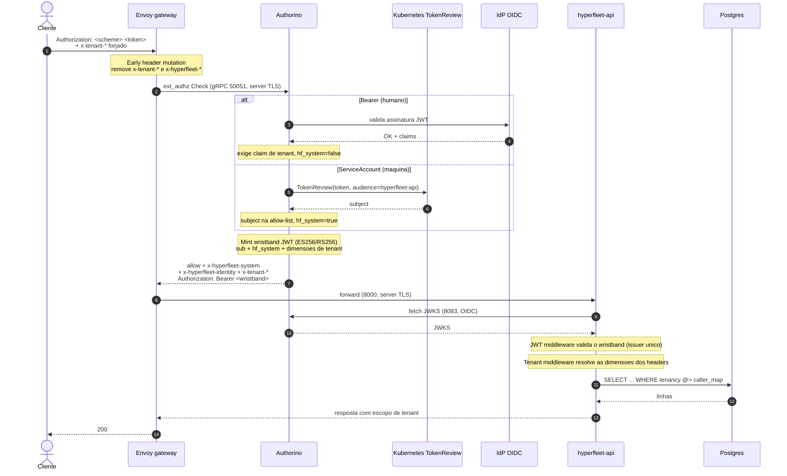
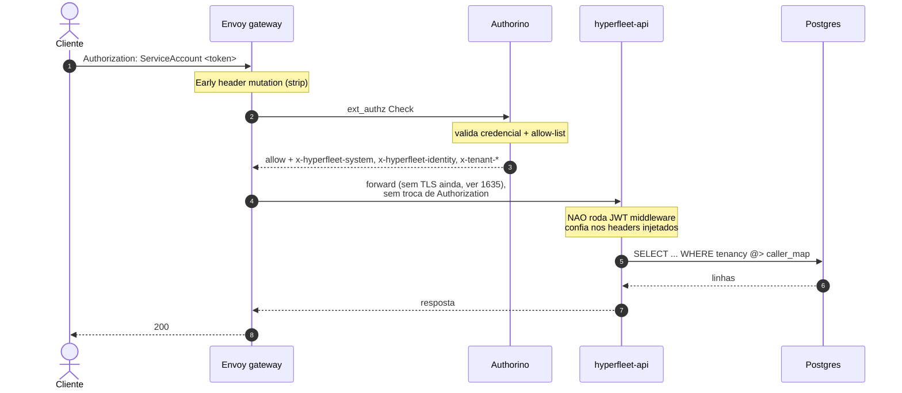
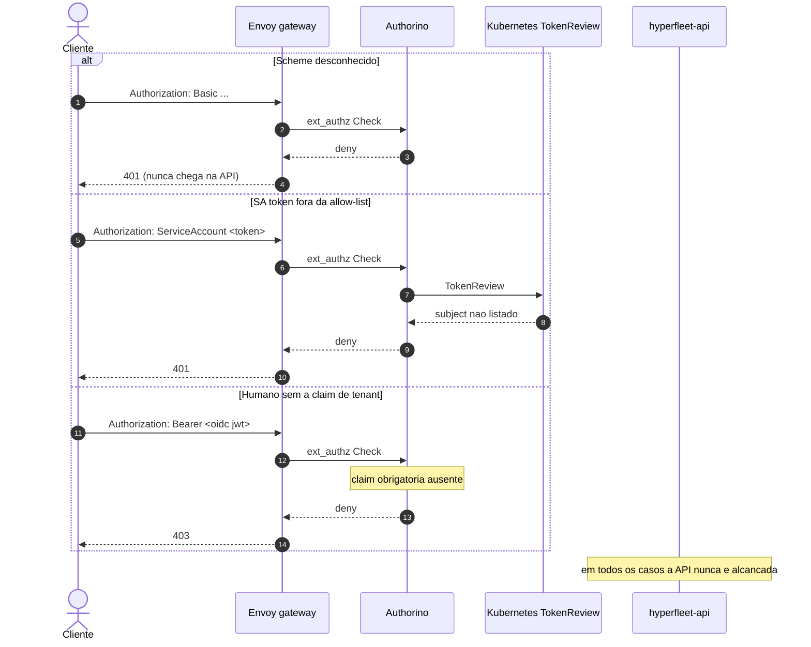
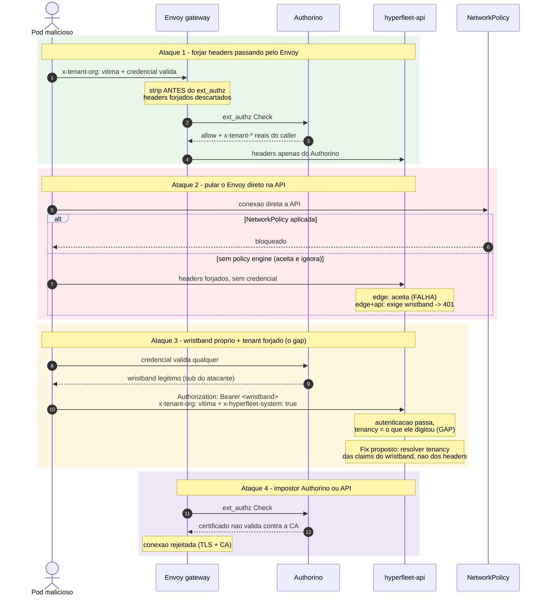

# Gateway Authentication, TLS and Tenancy: Sequence Diagrams

## Overview

The gateway authentication model has several moving parts (Envoy, Authorino,
ext_authz, TokenReview, the wristband, trusted headers and tenant scoping) that
are hard to hold in your head from prose alone. This document renders the same
flows as Mermaid sequence diagrams: the production `edge+api` path, the legacy
`edge` mode, the fail-closed denials, and the threat model.

It is a companion to
[ADR-0020](../adrs/0020-envoy-authorino-api-gateway.md) and the
[Multi-Tenant Identity and Authorization Design](multi-tenant-identity-authz-design.md).

## State of this document

These diagrams describe the design **as discussed on 16 September 2026**, which
is ahead of the committed ADRs in two ways:

- The **wristband** (Authorino Festival Wristband) and the **`AUTH_MODE`**
  refactor are not yet decision-of-record. They are the pending ADR-0020
  amendment tracked by [HYPERFLEET-1636](https://redhat.atlassian.net/browse/HYPERFLEET-1636).
- The term "wristband" does not appear in any committed document in this
  repository yet.

Treat the flows below as the target design, and ADR-0020 plus the tenancy design
doc as the currently committed state.

## Participants

| Participant | Role |
|-------------|------|
| Client | Human (OIDC JWT) or machine (projected service account token) caller |
| Envoy | Gateway front door. Strips forged headers, calls Authorino, forwards to the API |
| Authorino | Validates credentials, enforces allow-lists and required claims, injects headers, mints the wristband |
| Kubernetes TokenReview | Validates a service account token and returns its subject |
| OIDC IdP | External or mock issuer that signs human tokens |
| hyperfleet-api | Validates the wristband (in `edge+api`), resolves tenancy, scopes the database query |
| Postgres | Stores the `tenancy` JSONB column and evaluates containment (`@>`) |

## 1. `edge+api` happy path (production)

The gateway resolves identity and tenancy for both caller types, the Authorino
mints the wristband, and the API validates that single issuer.

## 2. `edge` mode (no wristband)

In `edge` mode the API runs no JWT middleware and trusts the injected headers
unconditionally. The original credential is not swapped for a wristband.

## 3. Fail-closed denials

Every rejection happens at the gateway; the API is never reached.

## 4. Threat model as sequences

The four attacks below map one-to-one to the threat table in the crash course.
Green is defended, red is the gap, yellow is the fix, purple is TLS.

## Reading notes

- The wristband only appears in flow 1 (`edge+api`). In `edge` mode (flow 2)
  there is no `Authorization` swap, which is exactly where the attack-3 gap
  lives.
- The early header strip in attack 1 is the ordering constraint that tripped up
  the first multitenancy proof of concept: route-level header removal runs after
  ext_authz and would delete the headers Authorino injects.
- Attack 2 is why the second layer exists. A NetworkPolicy on a cluster with no
  policy engine is accepted by the apiserver and silently ignored.
- Attack 3 is the gap recorded as an e2e case on
  [HYPERFLEET-1621](https://redhat.atlassian.net/browse/HYPERFLEET-1621). The
  fix (tenancy from wristband claims) is a separate story under HYPERFLEET-1164,
  not yet created.
- TLS on the in-cluster hops (Envoy to Authorino, Envoy to API) does not
  authenticate the caller. It prevents reading a credential or wristband in
  transit and prevents Envoy from talking to an impostor Authorino or API.

## References

- [ADR-0020: Envoy and Authorino as the API Authentication Gateway](../adrs/0020-envoy-authorino-api-gateway.md)
- [Multi-Tenant Identity and Authorization Design](multi-tenant-identity-authz-design.md)
- [HYPERFLEET-1636: ADR-0020 amendment](https://redhat.atlassian.net/browse/HYPERFLEET-1636)
- [HYPERFLEET-1484: In-app JWT behind the gateway](https://redhat.atlassian.net/browse/HYPERFLEET-1484)
- [HYPERFLEET-1621: e2e runs with the gateway on](https://redhat.atlassian.net/browse/HYPERFLEET-1621)
