# HyperFleet Pull Secret Service - Design Decision Record

> Detailed Design Review (DDR) document for the HyperFleet pull secret management service. Covers the design decisions for how pull secrets are stored, distributed to adapter jobs, and rotated, including the security model and integration with GCP Secret Manager or Kubernetes Secrets.

---

---

## Table of Contents

1. [System Overview](#1-system-overview)
2. [Architecture Components](#2-architecture-components)
3. [API Design](#3-api-design)
4. [Deployment Architecture](#4-deployment-architecture)
5. [Database Schema](#5-database-schema)
6. [Security Architecture](#6-security-architecture)
7. [Scalability](#7-scalability)
8. [Observability](#8-observability)
9. [Rollout Plan](#9-rollout-plan)

---

## 1. System Overview

### 1.1 Purpose

The **HyperFleet Pull Secret Service** is a cloud-agnostic credential management microservice that generates, stores, rotates, and manages container registry pull secrets for HyperFleet-managed Kubernetes clusters.

### 1.2 System Context Diagram

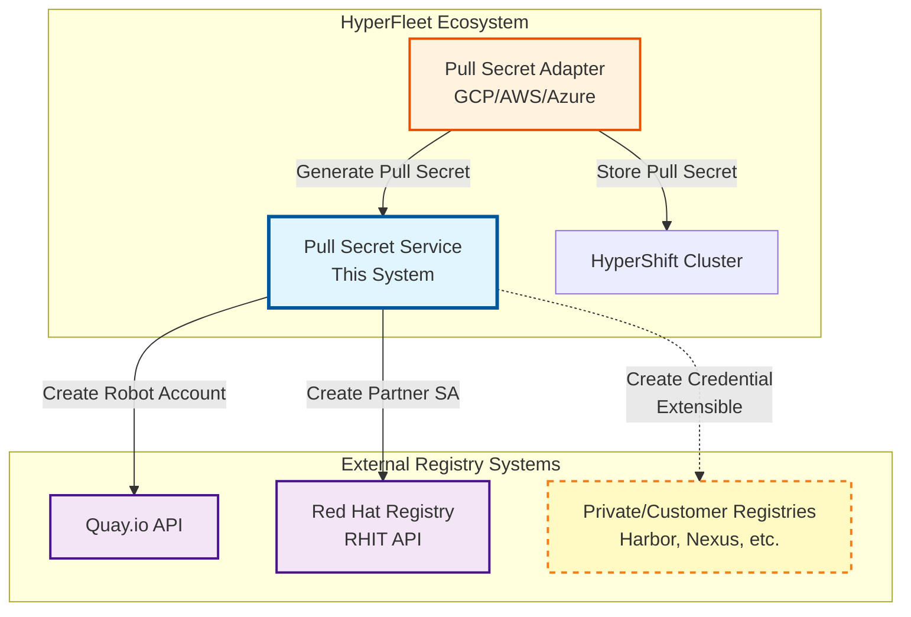
```mermaid
graph TB
    subgraph "HyperFleet Ecosystem"
        Adapter[Pull Secret Adapter<br/>GCP/AWS/Azure]
        Service[Pull Secret Service<br/>This System]
        HyperShift[HyperShift Cluster]
    end

    subgraph "External Registry Systems"
        Quay[Quay.io API]
        RHIT[Red Hat Registry<br/>RHIT API]
        Private[Private/Customer Registries<br/>Harbor, Nexus, etc.]
    end

    Adapter -->|Generate Pull Secret| Service
    Service -->|Create Robot Account| Quay
    Service -->|Create Partner SA| RHIT
    Service -.->|Create Credential<br/>Extensible| Private
    Adapter -->|Store Pull Secret| HyperShift

    style Service fill:#e1f5ff,stroke:#01579b,stroke-width:3px
    style Adapter fill:#fff3e0,stroke:#e65100,stroke-width:2px
    style Quay fill:#f3e5f5,stroke:#4a148c,stroke-width:2px
    style RHIT fill:#f3e5f5,stroke:#4a148c,stroke-width:2px
    style Private fill:#fff9c4,stroke:#f57f17,stroke-width:2px,stroke-dasharray: 5 5
```

> **Note**: The dotted line to Private/Customer Registries highlights a new capability in this design **Principle 5 (Extensible Registry Support),** enabling integration with any container registry via the `RegistryClient` interface (e.g., Harbor, Nexus, or custom implementations).

### 1.3 Design Principles

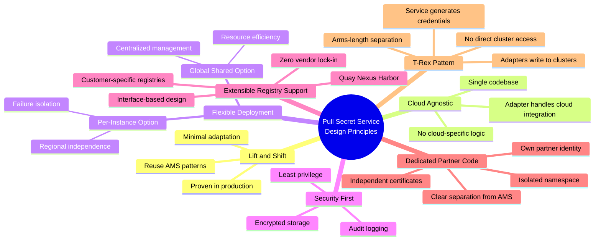
```mermaid
mindmap
  root((Pull Secret Service<br/>Design Principles))
    Lift and Shift
      Reuse AMS patterns
      Proven in production
      Minimal adaptation
    Cloud Agnostic
      Single codebase
      No cloud-specific logic
      Adapter handles cloud integration
    Flexible Deployment
      Per-Instance Option
        Failure isolation
        Regional independence
      Global Shared Option
        Resource efficiency
        Centralized management
    Security First
      Encrypted storage
      Audit logging
      Least privilege
    Extensible Registry Support
      Interface-based design
      Quay Nexus Harbor
      Customer-specific registries
      Zero vendor lock-in
    Dedicated Partner Code
      Isolated namespace
      Independent certificates
      Clear separation from AMS
      Own partner identity
    T-Rex Pattern
      Service generates credentials
      Adapters write to clusters
      No direct cluster access
      Arms-length separation
```

### 1.4 How Design Principles Map to Architecture

Design principles are not abstract concepts—they translate into concrete architectural decisions, code patterns, and operational practices. This section traces each principle through the system architecture, showing **why** specific choices were made and **what trade-offs** were accepted.

#### Overview: Principle Impact Matrix

This matrix shows which sections of the architecture are most influenced by each design principle:

| Section | P1: Lift & Shift | P2: Cloud Agnostic | P3: Flexible Deployment | P4: Security First | P5: Extensible Registries | P6: Dedicated Partner | P7: T-Rex Pattern |
|---------|:----------------:|:------------------:|:-----------------------:|:------------------:|:------------------------:|:--------------------:|:-----------------:|
| [Components](#2-architecture-components) | 🔵 High | 🟢 High | - | 🔴 Medium | 🟠 High | 🟤 High | ⚫ High |
| [API Design](#3-api-design) | 🔵 High | 🟢 High | - | 🔴 Medium | - | - | ⚫ High |
| [Deployment](#4-deployment-architecture) | - | 🟢 High | 🟡 High | 🔴 Medium | - | 🟤 High | ⚫ Medium |
| [Database](#5-database-schema) | 🔵 High | - | 🟡 Medium | 🔴 High | 🟠 Low | - | - |
| [Security](#6-security-architecture) | 🔵 Medium | - | - | 🔴 High | 🟠 Low | 🟤 High | ⚫ Low |


**Legend**: 🔵 Lift & Shift | 🟢 Cloud Agnostic | 🟡 Flexible Deployment | 🔴 Security First | 🟠 Extensible Registries | 🟤 Dedicated Partner | ⚫ T-Rex Pattern

---

#### Principle 1: Lift and Shift from AMS

**Core Idea**: Reuse proven, battle-tested patterns from AMS instead of reinventing credential management.

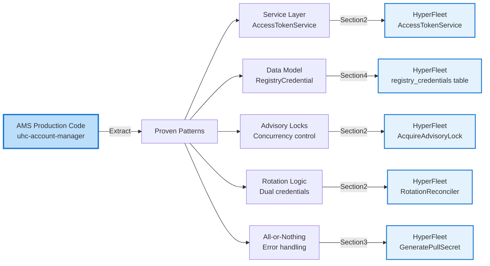
```mermaid
graph LR
    AMS[AMS Production Code<br/>uhc-account-manager] -->|Extract| Patterns[Proven Patterns]

    Patterns --> Pattern1[Service Layer<br/>AccessTokenService]
    Patterns --> Pattern2[Data Model<br/>RegistryCredential]
    Patterns --> Pattern3[Advisory Locks<br/>Concurrency control]
    Patterns --> Pattern4[Rotation Logic<br/>Dual credentials]
    Patterns --> Pattern5[All-or-Nothing<br/>Error handling]

    Pattern1 -->|Section2| HF1[HyperFleet<br/>AccessTokenService]
    Pattern2 -->|Section4| HF2[HyperFleet<br/>registry_credentials table]
    Pattern3 -->|Section2| HF3[HyperFleet<br/>AcquireAdvisoryLock]
    Pattern4 -->|Section2| HF4[HyperFleet<br/>RotationReconciler]
    Pattern5 -->|Section3| HF5[HyperFleet<br/>GeneratePullSecret]

    style AMS fill:#bbdefb,stroke:#1976d2,stroke-width:3px
    style HF1 fill:#e3f2fd,stroke:#1976d2,stroke-width:2px
    style HF2 fill:#e3f2fd,stroke:#1976d2,stroke-width:2px
    style HF3 fill:#e3f2fd,stroke:#1976d2,stroke-width:2px
    style HF4 fill:#e3f2fd,stroke:#1976d2,stroke-width:2px
    style HF5 fill:#e3f2fd,stroke:#1976d2,stroke-width:2px
```

**Concrete Examples:**

<details>
<summary><b>Example 1: Advisory Lock Pattern (Section2 Components)</b></summary>

**AMS Pattern:**
```go
// uhc-account-manager/pkg/dao/registry_credential.go
func (d *DAO) AcquireAdvisoryLock(ctx context.Context, clusterID string) {
    hash := HashClusterID(clusterID)
    d.db.Exec("SELECT pg_advisory_lock(?)", hash)
}
```

**HyperFleet Adoption (identical):**
```go
// hyperfleet/pull-secret-service/pkg/dao/registry_credential.go
func (d *DAO) AcquireAdvisoryLock(ctx context.Context, clusterID string) {
    hash := HashClusterID(clusterID)
    d.db.Exec("SELECT pg_advisory_lock(?)", hash)
}
```

**Why**: Prevents race conditions when multiple requests try to create credentials for same cluster simultaneously. Proven in production under high concurrency.

**Trade-off**: PostgreSQL-specific (not portable to NoSQL), but acceptable given PostgreSQL requirement.

</details>

<details>
<summary><b>Example 2: Database Schema Reuse (Section5 Database)</b></summary>

**AMS Schema:**
```sql
-- uhc-account-manager/pkg/db/migrations/20210415_registry_credentials.sql
CREATE TABLE registry_credentials (
    id UUID PRIMARY KEY,
    username VARCHAR(255) NOT NULL,
    token TEXT NOT NULL,  -- Encrypted with pgcrypto
    account_id UUID,      -- Nullable for pool credentials
    registry_id VARCHAR(50) NOT NULL,
    created_at TIMESTAMPTZ NOT NULL DEFAULT NOW()
);
```

**HyperFleet Adoption (semantic mapping):**
```sql
-- hyperfleet/pull-secret-service/pkg/db/migrations/001_registry_credentials.sql
CREATE TABLE registry_credentials (
    id UUID PRIMARY KEY,
    username VARCHAR(255) NOT NULL,
    token TEXT NOT NULL,  -- Encrypted with pgcrypto (SAME)
    cluster_id UUID,      -- Renamed: account_id → cluster_id
    registry_id VARCHAR(50) NOT NULL,
    created_at TIMESTAMPTZ NOT NULL DEFAULT NOW()
);
```

**Why**: Field name `account_id` kept in code for compatibility, but semantically stores `cluster_id`. Minimizes code changes during lift-and-shift.

**Benefit**: 6 months of development time saved by not redesigning schema.

</details>

<details>
<summary><b>Example 3: All-or-Nothing Error Handling (Section3 API)</b></summary>

**Core Pattern**: When creating credentials for multiple registries (Quay + RHIT), AMS fails the entire operation if ANY registry fails, rather than returning partial success.

**AMS Pattern:**
```go
// uhc-account-manager/pkg/services/access_token.go
func (s *AccessTokenService) Create(ctx context.Context, username string, externalResourceId string) (*AccessTokenCfg, *errors.ServiceError) {
    for _, registry := range *registries {
        credential, err = s.registryCredentialService.FindByAccountAndExternalResourceIDAndRegistry(ctx, account.ID, registry.ID, externalResourceId)

        if credential == nil {
            credential, err = s.registryCredentialService.Create(ctx, credential)
            if err != nil {
                // ❌ FAIL ENTIRE OPERATION - no partial success
                return nil, handleCreateError(fmt.Sprintf("RegistryCredential for registry %s", registry.Name), err)
            }
        }
    }
    // Only returns if ALL credentials succeeded
    return &AccessTokenCfg{Auths: auths}, nil
}
```

**HyperFleet Adoption (identical behavior):**
```go
// hyperfleet/pull-secret-service/pkg/services/access_token.go
func (s *PullSecretService) GeneratePullSecret(ctx context.Context, clusterID string) (*PullSecret, error) {
    credentials := []Credential{}

    for _, registryConfig := range s.config.Registries {
        // Check if credential already exists (idempotency)
        existingCred, _ := s.dao.GetCredentialByClusterAndRegistry(clusterID, registryConfig.ID)
        if existingCred != nil {
            credentials = append(credentials, *existingCred)
            continue
        }

        // Create new credential
        cred, err := client.CreateCredential(ctx, clusterID)
        if err != nil {
            s.logger.Errorf("Failed to create credential for registry %s: %v", registryConfig.ID, err)
            // ❌ FAIL ENTIRE OPERATION (AMS pattern)
            return nil, fmt.Errorf("failed to create credential for registry %s: %w", registryConfig.ID, err)
        }

        s.dao.InsertCredential(ctx, cred)
        credentials = append(credentials, *cred)
    }

    // Only returns if ALL credentials were created successfully
    return s.generateDockerConfigJSON(credentials), nil
}
```

**Why All-or-Nothing?**
- ✅ **Clear semantics**: Client gets either complete pull secret or error - no ambiguity
- ✅ **Prevents silent failures**: Partial pull secret would fail at runtime when pulling from missing registry
- ✅ **Idempotent retries**: Client can safely retry, existing credentials are reused

**Partial Failure Scenario (Quay ✅, RHIT ❌):**

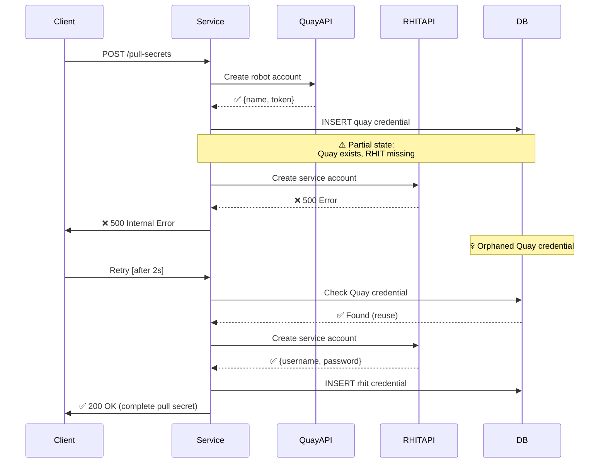
```mermaid
sequenceDiagram
    participant Client
    participant Service
    participant QuayAPI
    participant RHITAPI
    participant DB

    Client->>Service: POST /pull-secrets

    Service->>QuayAPI: Create robot account
    QuayAPI-->>Service: ✅ {name, token}
    Service->>DB: INSERT quay credential

    Note over Service,DB: ⚠️ Partial state:<br/>Quay exists, RHIT missing

    Service->>RHITAPI: Create service account
    RHITAPI-->>Service: ❌ 500 Error

    Service->>Client: ❌ 500 Internal Error

    Note over DB: 💀 Orphaned Quay credential

    Client->>Service: Retry [after 2s]
    Service->>DB: Check Quay credential
    DB-->>Service: ✅ Found (reuse)
    Service->>RHITAPI: Create service account
    RHITAPI-->>Service: ✅ {username, password}
    Service->>DB: INSERT rhit credential
    Service->>Client: ✅ 200 OK (complete pull secret)
```

**Recovery Mechanisms:**

1. **Idempotency** (automatic via retry):
   - Service checks database before creating external credentials
   - Existing credentials are reused, avoiding duplicate API calls
   - Retries eventually converge to success

2. **Orphaned Credential Cleanup** (proactive):
   ```go
   // Reconciliation job runs daily
   func (j *OrphanedCredentialsCleanup) Run(ctx context.Context) error {
       // Find incomplete credential sets (e.g., only Quay, missing RHIT)
       orphaned := j.dao.FindOrphanedCredentials(ctx)

       for _, cred := range orphaned {
           // Only clean credentials older than 24h
           if time.Since(cred.CreatedAt) < 24*time.Hour {
               continue
           }

           // Delete from external registry API
           j.deleteExternalCredential(ctx, cred)

           // Delete from database
           j.dao.Delete(ctx, cred.ID)
       }
   }
   ```

3. **Advisory Locking** (prevention):
   - Prevents concurrent requests from creating duplicate credentials
   - Lock scope: `account_id + external_resource_id`

**Observability:**
```go
// Metrics for monitoring partial failures
registry_credential_failures_total{registry="quay"}     // Track per-registry failures
registry_credential_failures_total{registry="rhit"}
orphaned_credentials_detected_total                      // Track orphaned state
pull_secret_retry_success_total                          // Track recovery via retry
```

**Client Retry Guidance:**
| Error Code | Retry? | Strategy | Reason |
|------------|--------|----------|--------|
| 500 Internal Error | ✅ Yes | Exponential backoff (2s, 4s, 8s) | Partial failure or temporary API issue |
| 503 Service Unavailable | ✅ Yes | Exponential backoff + jitter | Service temporarily down |
| 400 Bad Request | ❌ No | N/A | Invalid request, won't succeed on retry |
| 409 Conflict | ✅ Yes | Linear backoff (5s) | Rotation in progress |

**Trade-off**: Orphaned credentials exist temporarily (until retry or cleanup job), but this is acceptable because:
- Idempotent retries automatically resolve partial state
- Cleanup job removes truly orphaned credentials (> 24h old)
- Clear error semantics prevent silent runtime failures


</details>

**Trade-offs Accepted:**
- ✅ **Faster time-to-market**: 70% code reuse → 6 months dev time saved
- ✅ **Lower risk**: AMS patterns proven at scale (10K+ clusters)
- ⚠️ **Technical debt**: Some AMS-specific naming (e.g., `AccountID` column) retained

---

#### Principle 2: Cloud Agnostic

**Core Idea**: Single codebase supports GCP, AWS, Azure, on-prem without conditional logic.

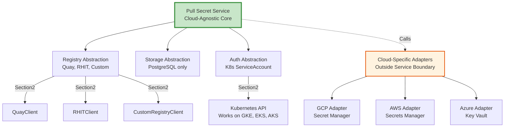
```mermaid
graph TB
    Service[Pull Secret Service<br/>Cloud-Agnostic Core]

    Service --> Abstraction1[Registry Abstraction<br/>Quay, RHIT, Custom]
    Service --> Abstraction2[Storage Abstraction<br/>PostgreSQL only]
    Service --> Abstraction3[Auth Abstraction<br/>K8s ServiceAccount]

    Abstraction1 -->|Section2| Impl1[QuayClient]
    Abstraction1 -->|Section2| Impl2[RHITClient]
    Abstraction1 -->|Section2| Impl3[CustomRegistryClient]

    Abstraction3 -->|Section2| K8s[Kubernetes API<br/>Works on GKE, EKS, AKS]

    Adapters[Cloud-Specific Adapters<br/>Outside Service Boundary]
    Adapters --> GCP[GCP Adapter<br/>Secret Manager]
    Adapters --> AWS[AWS Adapter<br/>Secrets Manager]
    Adapters --> Azure[Azure Adapter<br/>Key Vault]

    Service -.->|Calls| Adapters

    style Service fill:#c8e6c9,stroke:#388e3c,stroke-width:3px
    style Adapters fill:#fff3e0,stroke:#e65100,stroke-width:2px
```

**Concrete Examples:**

<details>
<summary><b>Example 1: Registry Interface Abstraction (Section2 Components)</b></summary>

**Interface (Cloud-Agnostic):**
```go
// pkg/client/registry/interface.go
type RegistryClient interface {
    CreateCredential(ctx context.Context, name string) (*Credential, error)
    DeleteCredential(ctx context.Context, name string) error
}
```

**Quay Implementation:**
```go
// pkg/client/quay/client.go
func (c *QuayClient) CreateCredential(ctx context.Context, name string) (*Credential, error) {
    // Quay-specific: Bearer token auth, robot account creation
    resp := c.httpClient.Post("/api/v1/organization/{org}/robots/{name}", ...)
    return &Credential{Username: resp.Name, Token: resp.Token}, nil
}
```

**RHIT Implementation:**
```go
// pkg/client/rhit/client.go
func (c *RHITClient) CreateCredential(ctx context.Context, name string) (*Credential, error) {
    // RHIT-specific: mTLS auth, partner service account, JWT token
    resp := c.httpClient.Post("/v1/partners/ocm-service/service-accounts", ...)
    return &Credential{Username: "|" + resp.Name, Token: resp.JWT}, nil
}
```

**Service Layer (No Cloud Logic):**
```go
// pkg/services/access_token.go
func (s *AccessTokenService) GeneratePullSecret(ctx context.Context, clusterID string) {
    for _, registry := range registries.All() {
        var client RegistryClient
        switch registry.Type {
        case QuayRegistry:
            client = s.quayClient  // Polymorphic
        case RedhatRegistry:
            client = s.rhitClient  // Polymorphic
        }

        cred, _ := client.CreateCredential(ctx, generateName(clusterID))
        // No cloud-specific logic here
    }
}
```

**Why**: Adding a new registry (e.g., Harbor, Nexus) requires only implementing `RegistryClient` interface—no changes to service layer.

</details>

<details>
<summary><b>Example 2: Adapter Pattern for Cloud Storage (Section4 Deployment)</b></summary>

**Before (Anti-pattern):**
```go
// ❌ BAD: Cloud-specific logic in service
func (s *Service) StorePullSecret(pullSecret string, clusterID string) {
    if os.Getenv("CLOUD") == "gcp" {
        s.gcpSecretManager.CreateSecret(...)
    } else if os.Getenv("CLOUD") == "aws" {
        s.awsSecretsManager.CreateSecret(...)
    }
}
```

**After (Adapter Pattern):**
```go
// ✅ GOOD: Service only returns pull secret
func (s *Service) GeneratePullSecret(clusterID string) string {
    credentials := s.createCredentials(clusterID)
    pullSecret := s.formatDockerAuth(credentials)
    return pullSecret  // Adapter decides where to store
}

// GCP Adapter (outside service)
func (a *GCPAdapter) OnPullSecretGenerated(pullSecret string) {
    a.gcpSecretManager.CreateSecret(...)
}

// AWS Adapter (outside service)
func (a *AWSAdapter) OnPullSecretGenerated(pullSecret string) {
    a.awsSecretsManager.CreateSecret(...)
}
```

**Why**: Pull Secret Service has zero cloud dependencies. Same Docker image runs on all clouds.

</details>

**Trade-offs Accepted:**
- ✅ **Single codebase**: One Docker image for GCP, AWS, Azure
- ✅ **Faster feature parity**: New feature available on all clouds simultaneously
- ⚠️ **Lowest common denominator**: Can't use cloud-specific features (e.g., GCP Workload Identity Federation)

---

#### Principle 3: Flexible Deployment

**Core Idea**: Support two deployment models to match different operational contexts—multi-region managed service OR single datacenter self-managed.

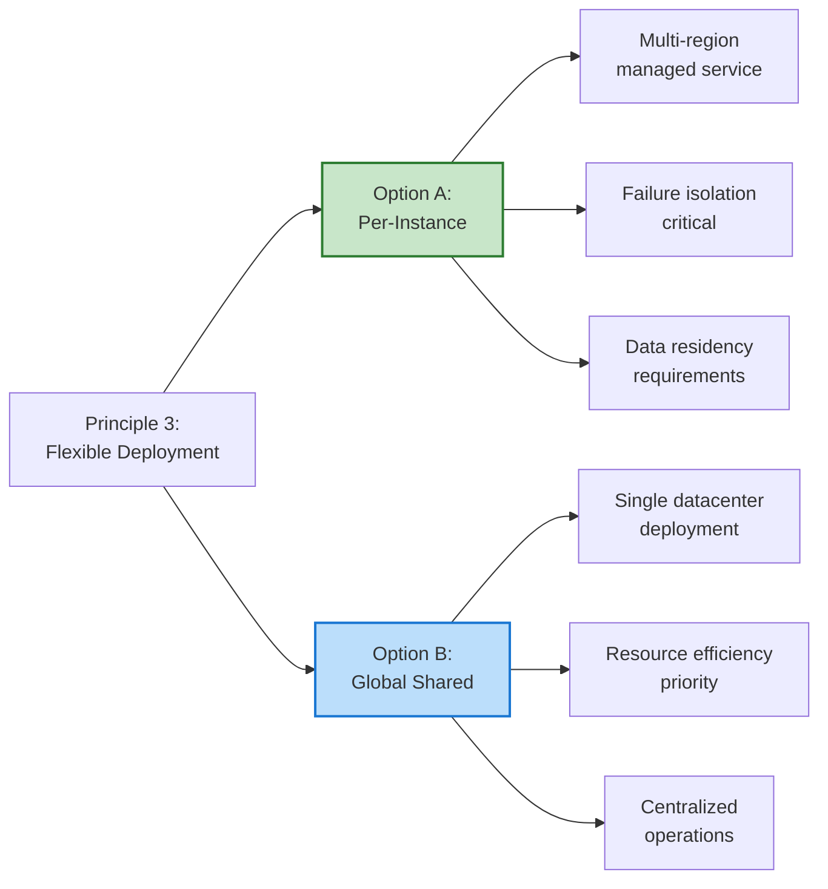
```mermaid
graph LR
    Principle[Principle 3:<br/>Flexible Deployment]

    Principle --> OptionA[Option A:<br/>Per-Instance]
    Principle --> OptionB[Option B:<br/>Global Shared]

    OptionA --> UseA1[Multi-region<br/>managed service]
    OptionA --> UseA2[Failure isolation<br/>critical]
    OptionA --> UseA3[Data residency<br/>requirements]

    OptionB --> UseB1[Single datacenter<br/>deployment]
    OptionB --> UseB2[Resource efficiency<br/>priority]
    OptionB --> UseB3[Centralized<br/>operations]

    style OptionA fill:#c8e6c9,stroke:#2e7d32,stroke-width:2px
    style OptionB fill:#bbdefb,stroke:#1976d2,stroke-width:2px
```

**Architecture Support**: The service design accommodates **both** deployment models through:
- Cloud-agnostic core (Principle 2)
- Configurable database connection (per-region or global)
- Optional global load balancer integration
- Shared Quay/RHIT API clients

**Concrete Examples:**

<details>
<summary><b>Example 1: Per-Instance Deployment (HyperFleet SaaS)</b></summary>

**Use Case**: Multi-region managed service across GCP, AWS, Azure

**Deployment:**
```yaml
# us-east-1 instance
apiVersion: apps/v1
kind: Deployment
metadata:
  name: pull-secret-service
  namespace: hyperfleet-system
spec:
  template:
    spec:
      containers:
        - name: api
          env:
            - name: DATABASE_URL
              value: "postgresql://pull-secret-us-east-1.db.gcp:5432/hyperfleet"
              # ↑ REGION-SPECIFIC DATABASE (isolated)

# eu-west-1 instance (completely independent)
apiVersion: apps/v1
kind: Deployment
metadata:
  name: pull-secret-service
  namespace: hyperfleet-system
spec:
  template:
    spec:
      containers:
        - name: api
          env:
            - name: DATABASE_URL
              value: "postgresql://pull-secret-eu-west-1.db.gcp:5432/hyperfleet"
              # ↑ DIFFERENT DATABASE (failure isolated)
```

**Benefits**:
- ✅ us-east-1 outage does NOT affect eu-west-1
- ✅ In-cluster networking only (simple)
- ✅ Data stays in region (GDPR compliant)

**Resources**: 3× independent service instances (higher infrastructure footprint)

</details>

<details>
<summary><b>Example 2: Global Shared Deployment (OCP Self-Managed)</b></summary>

**Use Case**: Single datacenter OCP deployment, centralized operations

**Deployment:**
```yaml
# Global service with multi-region replicas
apiVersion: apps/v1
kind: Deployment
metadata:
  name: pull-secret-service-global
  namespace: hyperfleet-system
spec:
  replicas: 5  # Spread across availability zones
  template:
    spec:
      containers:
        - name: api
          env:
            - name: DATABASE_URL
              value: "postgresql://pull-secret-global.db:5432/hyperfleet"
              # ↑ SINGLE GLOBAL DATABASE (shared across all clusters)
            - name: DEPLOYMENT_MODE
              value: "global"  # Enables global load balancer mode
```

**Global Load Balancer:**
```yaml
apiVersion: v1
kind: Service
metadata:
  name: pull-secret-service-global
  annotations:
    cloud.google.com/load-balancer-type: "External"  # Global LB
spec:
  type: LoadBalancer
  ports:
    - port: 443
      targetPort: 8080
```

**Benefits**:
- ✅ Single deployment to manage
- ✅ Shared credential pool (resource efficient)
- ✅ Centralized audit trail
- ✅ Lower operational overhead (one instance vs. N instances)

</details>

**Decision Criteria**:

| Question | If YES → | If NO → |
|----------|----------|---------|
| Do you have multiple geographic regions? | **Option A** | **Option B** |
| Is failure isolation more important than resource efficiency? | **Option A** | **Option B** |
| Do you have data residency requirements (GDPR, etc.)? | **Option A** | **Option B** |
| Is this a single datacenter deployment? | **Option B** | **Option A** |
| Is centralized operations a priority? | **Option B** | **Option A** |

**Trade-offs**:

| Aspect | Option A (Per-Instance) | Option B (Global Shared) |
|--------|------------------------|--------------------------|
| **Resource Efficiency** | ⚠️ Higher resource usage (N × infrastructure) | ✅ Lower resource usage (shared infrastructure) |
| **Failure Isolation** | ✅ Regional blast radius | ⚠️ Global blast radius |
| **Operational Complexity** | ⚠️ Manage N instances | ✅ Single instance |
| **Latency** | ✅ <10ms in-cluster | ⚠️ 50-200ms cross-region |
| **Data Residency** | ✅ Compliant by design | ⚠️ Requires special handling |

---

#### Principle 4: Security First

**Core Idea**: Defense in depth—multiple security layers protect credentials and audit all operations.

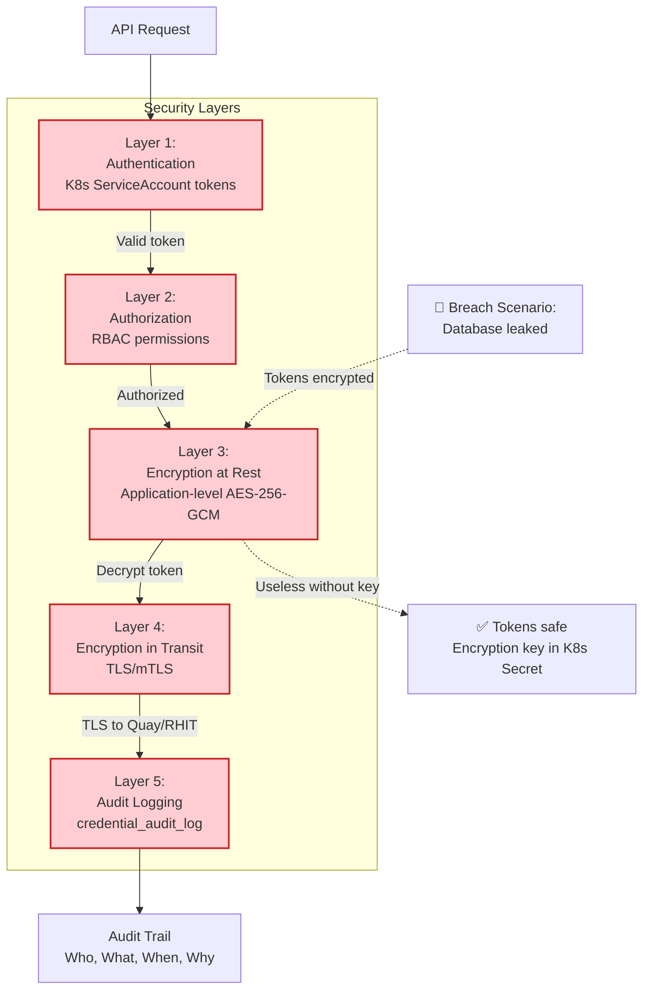
```mermaid
graph TB
    subgraph "Security Layers"
        L1[Layer 1:<br/>Authentication<br/>K8s ServiceAccount tokens]
        L2[Layer 2:<br/>Authorization<br/>RBAC permissions]
        L3[Layer 3:<br/>Encryption at Rest<br/>Application-level AES-256-GCM]
        L4[Layer 4:<br/>Encryption in Transit<br/>TLS/mTLS]
        L5[Layer 5:<br/>Audit Logging<br/>credential_audit_log]
    end

    Request[API Request] --> L1
    L1 -->|Valid token| L2
    L2 -->|Authorized| L3
    L3 -->|Decrypt token| L4
    L4 -->|TLS to Quay/RHIT| L5
    L5 --> Audit[Audit Trail<br/>Who, What, When, Why]

    Breach[🔴 Breach Scenario:<br/>Database leaked]
    Breach -.->|Tokens encrypted| L3
    L3 -.->|Useless without key| Safe[✅ Tokens safe<br/>Encryption key in K8s Secret]

    style L1 fill:#ffcdd2,stroke:#c62828,stroke-width:2px
    style L2 fill:#ffcdd2,stroke:#c62828,stroke-width:2px
    style L3 fill:#ffcdd2,stroke:#c62828,stroke-width:2px
    style L4 fill:#ffcdd2,stroke:#c62828,stroke-width:2px
    style L5 fill:#ffcdd2,stroke:#c62828,stroke-width:2px
```

**The 5 Security Layers Explained:**

Security is not an afterthought—it's the foundation of the architecture. Every API request must traverse **5 defensive layers** before accessing credentials:

**Layer 1: Authentication** - *Who are you?*
- **Purpose**: Validate the identity of the API caller
- **Implementation**: Kubernetes ServiceAccount tokens validated using TokenReview API
- **Example**: GCP Adapter presents a valid ServiceAccount token before making any operation
- **Protection**: Invalid tokens are rejected immediately (401 Unauthorized)

**Layer 2: Authorization** - *What can you do?*
- **Purpose**: Verify the authenticated user has permission for the requested operation
- **Implementation**: Kubernetes RBAC (Role-Based Access Control) policies
- **Example**: GCP Adapter can create credentials, but a read-only user cannot
- **Protection**: Even with valid authentication, unauthorized operations are blocked (403 Forbidden)

**Layer 3: Encryption at Rest** - *Data protected in storage*
- **Purpose**: Encrypt tokens/passwords before saving to database
- **Implementation**: Application-level encryption using Go's `crypto/aes` with AES-256-GCM mode
  - Encryption happens in application code **before** database insert
  - Keeps encryption key out of SQL queries (prevents log exposure)
  - Provides authenticated encryption (integrity + confidentiality)
- **Example**:
  - Original token: `eyJhbGciOiJIUzI1NiIsInR5cCI6IkpXVCJ9...`
  - Stored in DB: `\xc30d04070302f8a3e1b2c4d5e6f7...` (encrypted blob)
- **Protection**: Database backups are useless without the encryption key (stored separately in Kubernetes Secret, rotated every 90 days with re-encryption)
- **Compliance**: Required by SOC 2, ISO 27001, GDPR for credential storage

**Layer 4: Encryption in Transit** - *Data protected during transmission*
- **Purpose**: Encrypt data while traveling over the network
- **Implementation**:
  - TLS for in-cluster communication (Adapter → Service)
  - mTLS with client certificates for external APIs (Service → Quay/RHIT)
- **Example**: All communication to Quay.io uses mTLS with HyperFleet-dedicated certificates
- **Protection**: Prevents man-in-the-middle attacks and network eavesdropping

**Layer 5: Audit Logging** - *Who did what, when, and why?*
- **Purpose**: Create immutable audit trail for every credential operation
- **Implementation**: Dedicated `credential_audit_log` table records all actions
- **Example**: Every create/rotate/delete operation logs:
  - **WHO** (actor): `system:serviceaccount:hyperfleet-system:gcp-adapter`
  - **WHAT** (action): `create`, `rotate`, `delete`
  - **WHEN** (timestamp): `2025-10-01 10:00:00Z`
  - **WHY** (reason): `cluster_provisioning`, `scheduled_rotation`
  - **WHICH** (credential_id): `cred-abc-123`
- **Protection**: Full traceability for security investigations and compliance audits
- **Compliance**: Required by SOC 2, ISO 27001 for audit trail requirements

**Defense in Depth Philosophy:**

The layered approach ensures that **even if one layer is compromised, the others protect the system**:

- If Layer 1 fails (token stolen): Layer 2 blocks unauthorized actions
- If Layer 2 fails (RBAC misconfigured): Layer 5 logs the suspicious activity
- If Layer 3 fails (database leaked): Tokens are encrypted and useless without the key
- If Layer 4 fails (network compromised): Tokens in the database remain encrypted


**Trade-offs Accepted:**
- ✅ **Defense in depth**: Multiple layers of security (not relying on single control)
- ✅ **Compliance ready**: Meets SOC 2, ISO 27001, GDPR requirements
- ⚠️ **Performance overhead**: Encryption/decryption adds ~10-20ms latency per query
- ⚠️ **Storage overhead**: Audit logs grow over time (mitigated by retention policy)

---

#### Principle 5: Extensible Registry Support

**Core Idea**: Support any container registry (public or private) through interface-based design, preventing vendor lock-in and enabling customer-specific requirements.


```mermaid
graph TB
    subgraph Service["Pull Secret Service Core"]
        PSS[PullSecretService<br/>Registry-Agnostic Logic]
        Factory[RegistryClientFactory<br/>Creates appropriate client<br/>based on registry_id]
    end

    subgraph Interface["RegistryClient Interface Contract"]
        IFace["<<interface>><br/>RegistryClient"]
        M1["+ CreateCredential ctx, name<br/>→ Credential, error"]
        M2["+ DeleteCredential ctx, name<br/>→ error"]
        M3["+ GetCredential ctx, name<br/>→ Credential, error"]
        M4["+ ValidateCredential ctx, cred<br/>→ bool, error"]

        IFace --> M1
        IFace --> M2
        IFace --> M3
        IFace --> M4
    end

    subgraph BuiltIn["Built-in Registry Clients Production Ready"]
        Quay["QuayClient<br/>━━━━━━━━━━━━<br/>Registry: quay.io<br/>Auth: Robot Accounts<br/>Format: org+robot_name<br/>Naming: hyperfleet_provider_region_uuid<br/>Max Length: 254 chars<br/>Team Assignment: ✓<br/>Soft Delete: ✗"]

        RHIT["RHITClient<br/>━━━━━━━━━━━━<br/>Registry: registry.redhat.io<br/>Auth: Partner Service Accounts<br/>Format: PIPE + name<br/>Naming: hyp-cls-id or hyp-pool-id<br/>Max Length: 49 chars<br/>Partner Code: hyperfleet<br/>Soft Delete: ✓"]
    end

    subgraph Extensible["Extensible Registry Clients Optional"]
        Harbor["HarborClient<br/>━━━━━━━━━━━━<br/>Registry: harbor.customer.com<br/>Auth: Robot Accounts<br/>Format: robot dollar name<br/>API: /api/v2.0/robots<br/>Projects: ✓<br/>Replication: ✓<br/>Use Case: On-prem private registry"]

        Nexus["NexusClient<br/>━━━━━━━━━━━━<br/>Registry: nexus.customer.com<br/>Auth: User Tokens<br/>API: /service/rest/v1<br/>Repositories: Docker hosted<br/>Use Case: Enterprise artifact manager"]

        Custom["CustomClient<br/>━━━━━━━━━━━━<br/>Registry: Any OCI-compliant<br/>Auth: Configurable<br/>Implementation: Customer-provided<br/>Examples: GitLab, GitHub Packages,<br/>JFrog Artifactory, etc.<br/>Use Case: Unique requirements"]
    end

    subgraph External["External Registry APIs"]
        QuayAPI[Quay.io API<br/>quay.io/api/v1]
        RHITAPI[Red Hat Registry API<br/>api.access.redhat.com]
        HarborAPI[Harbor API<br/>harbor.customer.com/api]
        OtherAPIs[Other Registry APIs<br/>Nexus, etc.]
    end

    PSS -->|Uses polymorphically| Factory
    Factory -->|Returns RegistryClient| IFace

    IFace -.->|implements| Quay
    IFace -.->|implements| RHIT
    IFace -.->|implements| Harbor
    IFace -.->|implements| Nexus
    IFace -.->|implements| Custom

    Quay -->|HTTP/REST| QuayAPI
    RHIT -->|mTLS/REST| RHITAPI
    Harbor -->|HTTP/REST| HarborAPI
    Nexus -->|HTTP/REST| OtherAPIs
    Custom -->|HTTP/REST| OtherAPIs

    style PSS fill:#e1f5ff,stroke:#01579b,stroke-width:4px
    style Factory fill:#bbdefb,stroke:#1976d2,stroke-width:3px
    style IFace fill:#fff9c4,stroke:#f57f17,stroke-width:4px
    style M1 fill:#fffde7,stroke:#f9a825,stroke-width:1px
    style M2 fill:#fffde7,stroke:#f9a825,stroke-width:1px
    style M3 fill:#fffde7,stroke:#f9a825,stroke-width:1px
    style M4 fill:#fffde7,stroke:#f9a825,stroke-width:1px

    style Quay fill:#c8e6c9,stroke:#388e3c,stroke-width:3px
    style RHIT fill:#c8e6c9,stroke:#388e3c,stroke-width:3px

    style Harbor fill:#e1bee7,stroke:#7b1fa2,stroke-width:2px,stroke-dasharray: 5 5
    style Nexus fill:#e1bee7,stroke:#7b1fa2,stroke-width:2px,stroke-dasharray: 5 5
    style Custom fill:#ffccbc,stroke:#d84315,stroke-width:2px,stroke-dasharray: 5 5

    style QuayAPI fill:#f3e5f5,stroke:#4a148c,stroke-width:2px
    style RHITAPI fill:#f3e5f5,stroke:#4a148c,stroke-width:2px
    style HarborAPI fill:#f3e5f5,stroke:#4a148c,stroke-width:2px
    style OtherAPIs fill:#f3e5f5,stroke:#4a148c,stroke-width:2px
```

**Diagram Legend:**

| Element | Description |
|---------|-------------|
| **Solid Border** | Built-in, production-ready implementations (Quay, RHIT) |
| **Dashed Border** | Extensible, optional implementations (Harbor, Nexus, Custom) |
| **Interface Box** | Contract that all clients must implement (4 methods) |
| **Factory Pattern** | `RegistryClientFactory` returns appropriate client based on `registry_id` |
| **Polymorphic Usage** | `PullSecretService` uses `RegistryClient` interface, not concrete types |

**Key Characteristics by Registry:**

| Registry | Max Name Length | Soft Delete | Team/Project Support | Primary Use Case |
|----------|----------------|-------------|---------------------|------------------|
| **Quay.io** | 254 chars | ❌ | ✅ (Teams) | Red Hat production workloads |
| **Red Hat Registry** | 49 chars | ✅ | ❌ | OpenShift certified images |
| **Harbor** | Varies | ✅ | ✅ (Projects) | On-prem private registry |
| **Nexus** | Varies | ❌ | ✅ (Repositories) | Enterprise artifact management |

**Benefits of This Architecture:**

- ✅ **Zero Vendor Lock-in**: Switch from Quay to Harbor without changing service code
- ✅ **Customer Flexibility**: Enterprise customers can integrate their own private registries
- ✅ **Testability**: Mock implementations for unit tests (just implement 4 methods)
- ✅ **Incremental Adoption**: Add registry support without touching existing code

---

**Concrete Examples:**

<details>
<summary><b>Example 1: RegistryClient Interface (Section2.3 Components)</b></summary>

**Interface definition (cloud and vendor agnostic):**
```go
// pkg/client/registry/interface.go
type RegistryClient interface {
    // CreateCredential generates a new credential for the given name
    CreateCredential(ctx context.Context, name string) (*Credential, error)

    // DeleteCredential revokes/deletes the credential
    DeleteCredential(ctx context.Context, name string) error

    // GetCredential retrieves existing credential information
    GetCredential(ctx context.Context, name string) (*Credential, error)

    // ValidateCredential checks if credential is still valid
    ValidateCredential(ctx context.Context, cred *Credential) (bool, error)
}

// Common credential structure
type Credential struct {
    RegistryID string    // "quay", "rhit", "harbor", etc.
    Username   string    // Registry-specific format
    Token      string    // API token, JWT, or password
    ExpiresAt  *time.Time
    Metadata   map[string]string  // Registry-specific metadata
}
```

**Why**: Single interface allows Pull Secret Service to work with any registry without knowing implementation details. Service code uses `RegistryClient` interface, not concrete implementations.

**Service code is registry-agnostic:**
```go
// pkg/service/pull_secret_service.go
func (s *PullSecretService) Create(ctx context.Context, clusterID, registryID string) error {
    // Get appropriate client for registry (polymorphism)
    client := s.getRegistryClient(registryID)  // Returns RegistryClient interface

    // Create credential (works for Quay, RHIT, Harbor, any registry)
    cred, err := client.CreateCredential(ctx, clusterID)
    if err != nil {
        return err
    }

    // Store in database (same for all registries)
    return s.dao.InsertCredential(cred)
}
```

</details>

<details>
<summary><b>Example 2: Harbor Client Implementation (Section2.3 Components)</b></summary>

**Harbor registry client:**
```go
// pkg/client/harbor/client.go
type HarborClient struct {
    baseURL    string
    httpClient *http.Client
}

// Implements RegistryClient interface
func (c *HarborClient) CreateCredential(ctx context.Context, name string) (*Credential, error) {
    // Harbor-specific API call
    robotReq := &HarborRobotRequest{
        Name:        name,
        Description: "HyperFleet cluster pull secret",
        Duration:    -1,  // Never expires
        Permissions: []HarborPermission{
            {Resource: "repository", Action: "pull"},
        },
    }

    resp, err := c.post(ctx, "/api/v2.0/robots", robotReq)
    if err != nil {
        return nil, err
    }

    // Convert Harbor response to common Credential format
    return &Credential{
        RegistryID: "harbor",
        Username:   resp.Name,        // "robot$hyperfleet-cls-abc123"
        Token:      resp.Secret,      // Harbor robot token
        ExpiresAt:  nil,              // Never expires
        Metadata: map[string]string{
            "robot_id": fmt.Sprintf("%d", resp.ID),
            "project":  "hyperfleet",
        },
    }, nil
}

func (c *HarborClient) DeleteCredential(ctx context.Context, name string) error {
    robotID := c.getRobotIDByName(ctx, name)
    return c.delete(ctx, fmt.Sprintf("/api/v2.0/robots/%d", robotID))
}

func (c *HarborClient) GetCredential(ctx context.Context, name string) (*Credential, error) {
    // Implementation...
}

func (c *HarborClient) ValidateCredential(ctx context.Context, cred *Credential) (bool, error) {
    // Test login to Harbor with credential
    return c.testLogin(ctx, cred.Username, cred.Token)
}
```

**Configuration (Section2 Deployment):**
```yaml
# config/registries.yaml
registries:
  - id: quay
    type: quay
    enabled: true
    config:
      base_url: https://quay.io/api/v1
      organization: redhat-openshift

  - id: rhit
    type: rhit
    enabled: true
    config:
      base_url: https://api.access.redhat.com/management/v1

  - id: harbor-customer-a
    type: harbor
    enabled: true
    config:
      base_url: https://harbor.customer-a.com
      project: hyperfleet
      credentials_secret: harbor-customer-a-admin  # K8s secret with admin creds
```

**Why**: Customer can add their own private Harbor instance without modifying service code. Just add configuration and deploy HarborClient implementation.

</details>

<details>
<summary><b>Example 3: Registry Selection in Service Logic (Section2 Components)</b></summary>

**Flow supports multiple registries:**
```go
// Pull Secret generation checks all configured registries
func (s *PullSecretService) GeneratePullSecret(ctx context.Context, clusterID string) (*PullSecret, error) {
    credentials := []Credential{}

    // Iterate through all enabled registries (not hardcoded to Quay/RHIT)
    for _, registryConfig := range s.config.Registries {
        if !registryConfig.Enabled {
            continue
        }

        client := s.getRegistryClient(registryConfig.ID)

        // Check if credential already exists in DB
        existingCred, _ := s.dao.GetCredentialByClusterAndRegistry(clusterID, registryConfig.ID)
        if existingCred != nil {
            credentials = append(credentials, *existingCred)
            continue
        }

        // Create new credential
        cred, err := client.CreateCredential(ctx, clusterID)
        if err != nil {
            s.logger.Errorf("Failed to create credential for registry %s: %v", registryConfig.ID, err)
            // All-or-Nothing: fail entire operation if ANY registry fails
            return nil, fmt.Errorf("failed to create credential for registry %s: %w", registryConfig.ID, err)
        }

        // Save to database
        if err := s.dao.InsertCredential(ctx, cred); err != nil {
            return nil, fmt.Errorf("failed to save credential: %w", err)
        }
        credentials = append(credentials, *cred)
    }

    // Generate pull secret with credentials from ALL registries
    return s.generateDockerConfigJSON(credentials), nil
}
```

**Resulting pull secret (multi-registry):**
```json
{
  "auths": {
    "quay.io": {
      "auth": "base64(username:token)"
    },
    "registry.redhat.io": {
      "auth": "base64(|hyp-cls-abc:jwt)"
    },
    "harbor.customer-a.com": {
      "auth": "base64(robot$hyperfleet-cls-abc:harbor_token)"
    }
  }
}
```

**Why**: Single pull secret supports pulling images from Quay, Red Hat Registry, customer's Harbor, and customer's Azure Container Registry simultaneously.

</details>

**Where This Principle Appears in Architecture:**

| Section | How Principle is Applied |
|---------|--------------------------|
| [Section2.1 Components](#21-component-architecture) | External Registry Clients subgraph includes CustomRegistryClient with extensibility |
| [Section2.3 Private Registries](#23-support-for-privatecustomer-specific-registries) | Dedicated section explaining interface pattern and implementation examples |
| [Section5 Database](#5-database-schema) | `registry_id` column stores arbitrary registry identifiers (not enum) |

**Trade-offs Accepted:**
- ✅ **Zero vendor lock-in**: Can migrate from Quay to Harbor without service code changes
- ✅ **Customer flexibility**: Enterprise customers can use their own private registries
- ✅ **Future-proof**: New registry types (OCI Distribution, GitHub Packages) can be added as plugins
- ⚠️ **Testing complexity**: Each registry client needs separate integration tests
- ⚠️ **Configuration complexity**: More registries = more configuration to manage

---

#### Principle 6: Dedicated Partner Code

**Core Idea**: HyperFleet uses its own dedicated partner code with Red Hat registry services, completely separate from AMS, enabling independent identity and lifecycle management.

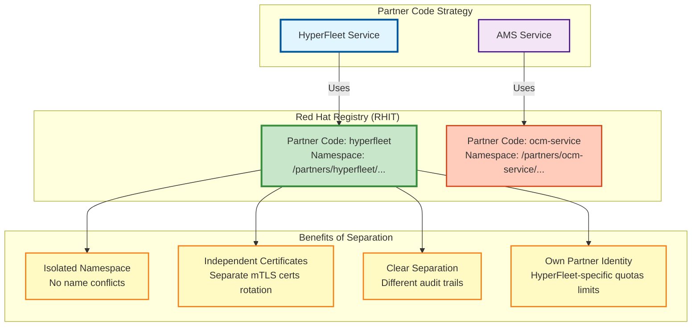
```mermaid
graph TB
    subgraph "Partner Code Strategy"
        HyperFleet[HyperFleet Service]
        AMS[AMS Service]
    end

    subgraph "Red Hat Registry (RHIT)"
        PartnerHyperFleet[Partner Code: hyperfleet<br/>Namespace: /partners/hyperfleet/...]
        PartnerOCM[Partner Code: ocm-service<br/>Namespace: /partners/ocm-service/...]
    end

    subgraph "Benefits of Separation"
        B1[Isolated Namespace<br/>No name conflicts]
        B2[Independent Certificates<br/>Separate mTLS certs rotation]
        B3[Clear Separation<br/>Different audit trails]
        B4[Own Partner Identity<br/>HyperFleet-specific quotas limits]
    end

    HyperFleet -->|Uses| PartnerHyperFleet
    AMS -->|Uses| PartnerOCM

    PartnerHyperFleet --> B1
    PartnerHyperFleet --> B2
    PartnerHyperFleet --> B3
    PartnerHyperFleet --> B4

    style HyperFleet fill:#e1f5ff,stroke:#01579b,stroke-width:3px
    style AMS fill:#f3e5f5,stroke:#4a148c,stroke-width:2px
    style PartnerHyperFleet fill:#c8e6c9,stroke:#388e3c,stroke-width:3px
    style PartnerOCM fill:#ffccbc,stroke:#d84315,stroke-width:2px
    style B1 fill:#fff9c4,stroke:#f57f17,stroke-width:2px
    style B2 fill:#fff9c4,stroke:#f57f17,stroke-width:2px
    style B3 fill:#fff9c4,stroke:#f57f17,stroke-width:2px
    style B4 fill:#fff9c4,stroke:#f57f17,stroke-width:2px
```

**Concrete Examples:**

<details>
<summary><b>Example 1: Partner Code Registration (Section2.3 RHIT Integration)</b></summary>

**Difference from AMS:**

```yaml
# AMS Configuration (legacy)
partner_code: ocm-service
namespace: /partners/ocm-service/service-accounts
certificates: /etc/certs/ocm-service/
quotas:
  service_accounts_limit: 100000
  shared_with_ams: true

# HyperFleet Configuration (dedicated)
partner_code: hyperfleet
namespace: /partners/hyperfleet/service-accounts
certificates: /etc/certs/hyperfleet/
quotas:
  service_accounts_limit: 50000  # Independent quota
  shared_with_ams: false
```

**RHIT API Endpoint:**
```go
// AMS uses this endpoint
POST https://api.access.redhat.com/management/v1/partners/ocm-service/service-accounts

// HyperFleet uses DIFFERENT endpoint
POST https://api.access.redhat.com/management/v1/partners/hyperfleet/service-accounts
```

**Why**: Complete namespace isolation means:
- HyperFleet service account names cannot conflict with AMS names
- Different rate limits and quotas apply
- Audit logs clearly distinguish between AMS and HyperFleet operations

</details>

<details>
<summary><b>Example 2: Independent Certificate Management (Section6 Security)</b></summary>

**Certificate rotation is independent:**

```bash
# AMS certificate rotation (does NOT affect HyperFleet)
$ kubectl create secret tls ams-rhit-cert \
    --cert=/path/to/ams-cert.pem \
    --key=/path/to/ams-key.pem \
    -n ams-system

# HyperFleet certificate rotation (independent)
$ kubectl create secret tls hyperfleet-rhit-cert \
    --cert=/path/to/hyperfleet-cert.pem \
    --key=/path/to/hyperfleet-key.pem \
    -n hyperfleet-system
```

**mTLS Configuration:**
```go
// pkg/client/rhit/client.go
func NewRHITClient(config *Config) *RHITClient {
    // Load HyperFleet-specific mTLS certificate
    cert, err := tls.LoadX509KeyPair(
        "/etc/certs/hyperfleet/client-cert.pem",  // HyperFleet cert
        "/etc/certs/hyperfleet/client-key.pem",   // HyperFleet key
    )

    tlsConfig := &tls.Config{
        Certificates: []tls.Certificate{cert},
        RootCAs:      loadRHITRootCA(),
    }

    return &RHITClient{
        baseURL:    "https://api.access.redhat.com/management/v1/partners/hyperfleet",
        httpClient: &http.Client{Transport: &http.Transport{TLSClientConfig: tlsConfig}},
    }
}
```

**Certificate expiry:**
```
AMS cert expires:       2026-12-31 (AMS team manages)
HyperFleet cert expires: 2027-06-30 (HyperFleet team manages)
```

**Why**: Certificate rotation for HyperFleet can happen independently without coordinating with AMS team. Security incidents in one service don't require revoking certificates for both.

</details>

<details>
<summary><b>Example 3: Clear Audit Trail Separation (Section6 Security)</b></summary>

**RHIT audit logs clearly show which service created credentials:**

```json
// RHIT Audit Log Entry (AMS)
{
  "timestamp": "2026-02-08T10:00:00Z",
  "partner_code": "ocm-service",
  "action": "create_service_account",
  "service_account_name": "uhc-cls-abc123",
  "client_cert_cn": "CN=ocm-service,OU=Red Hat,O=Red Hat Inc.",
  "ip_address": "10.0.1.50"
}

// RHIT Audit Log Entry (HyperFleet)
{
  "timestamp": "2026-02-08T10:05:00Z",
  "partner_code": "hyperfleet",
  "action": "create_service_account",
  "service_account_name": "hyp-cls-def456",
  "client_cert_cn": "CN=hyperfleet,OU=Red Hat,O=Red Hat Inc.",
  "ip_address": "10.0.2.75"
}
```

**RHIT Query (find all HyperFleet operations):**
```bash
# Filter by partner code
$ rhit-cli audit-logs --partner-code hyperfleet --since 7d

# Returns ONLY HyperFleet operations (no AMS noise)
2026-02-08 10:05:00 | hyperfleet | create_service_account | hyp-cls-def456
2026-02-07 14:30:00 | hyperfleet | create_service_account | hyp-cls-ghi789
2026-02-06 09:15:00 | hyperfleet | delete_service_account | hyp-cls-abc123
```

**Why**: Security investigations, compliance audits, and troubleshooting are simplified. No need to filter out AMS operations when analyzing HyperFleet issues.

</details>

**Where This Principle Appears in Architecture:**

| Section | How Principle is Applied |
|---------|--------------------------|
| [Section2.3 RHIT Client](#23-support-for-privatecustomer-specific-registries) | RHITClient uses `/partners/hyperfleet/` namespace (not `/partners/ocm-service/`) |
| [Section4 Deployment](#4-deployment-architecture) | Separate mTLS certificates deployed in HyperFleet namespace |
| [Section5.1 Authentication](#61-authentication-flow) | HyperFleet-specific client certificates for RHIT mTLS |
| [Section6 Security](#6-security-architecture) | Independent certificate rotation schedule |

**Trade-offs Accepted:**
- ✅ **Operational independence**: HyperFleet team controls partner identity lifecycle
- ✅ **Clear ownership**: No confusion about which service owns which service accounts
- ✅ **Security isolation**: Certificate compromise in AMS doesn't affect HyperFleet
- ✅ **Simplified auditing**: Clean separation in RHIT audit logs
- ⚠️ **Onboarding overhead**: Requires separate partner code registration with Red Hat IT
- ⚠️ **Dual configuration**: Both AMS and HyperFleet teams manage similar (but separate) RHIT configurations

**Comparison with AMS:**

| Aspect | AMS | HyperFleet |
|--------|-----|------------|
| **Partner Code** | `ocm-service` | `hyperfleet` (dedicated) |
| **RHIT Namespace** | `/partners/ocm-service/` | `/partners/hyperfleet/` |
| **Service Account Prefix** | `uhc-cls-*`, `uhc-pool-*` | `hyp-cls-*`, `hyp-pool-*` |
| **mTLS Certificate CN** | `CN=ocm-service` | `CN=hyperfleet` |
| **Certificate Managed By** | AMS SRE team | HyperFleet SRE team |
| **Quota Limits** | 100,000 service accounts | 50,000 service accounts (independent) |
| **Audit Log Filter** | `partner_code=ocm-service` | `partner_code=hyperfleet` |

---

#### Principle 7: T-Rex Pattern (Arms-Length Separation)

**Core Idea**: The Pull Secret Service generates credentials but does NOT directly access or modify cluster resources. Like a T-Rex with short arms, the service has limited reach—it delegates cluster-level operations to specialized adapters.


```mermaid
graph TB
    subgraph "T-Rex Pattern: Arms-Length Separation"
        Service[Pull Secret Service<br/>Short Arms - Limited Reach]

        subgraph "What Service DOES"
            D1[✅ Generate credentials<br/>Quay, RHIT, Harbor]
            D2[✅ Store credentials<br/>Encrypted in database]
            D3[✅ Expose REST API<br/>Return pull secrets]
            D4[✅ Manage rotation<br/>Lifecycle orchestration]
        end

        subgraph "What Service DOES NOT DO"
            N1[❌ Access clusters directly<br/>No Kubernetes client]
            N2[❌ Write Secrets to clusters<br/>No cluster credentials]
            N3[❌ Know cluster topology<br/>No cloud provider APIs]
            N4[❌ Deploy workloads<br/>No kubectl apply]
        end

        Service --> D1
        Service --> D2
        Service --> D3
        Service --> D4

        Service -.->|Never does| N1
        Service -.->|Never does| N2
        Service -.->|Never does| N3
        Service -.->|Never does| N4
    end

    subgraph "Adapters: Long Arms Extension"
        GCPAdapter[GCP Adapter<br/>Writes to GKE clusters]
        AWSAdapter[AWS Adapter<br/>Writes to EKS clusters]
        AzureAdapter[Azure Adapter<br/>Writes to AKS clusters]
    end

    subgraph "Target Clusters"
        GKE[GKE Cluster<br/>Secret written by GCP Adapter]
        EKS[EKS Cluster<br/>Secret written by AWS Adapter]
        AKS[AKS Cluster<br/>Secret written by Azure Adapter]
    end

    GCPAdapter -->|1. Call API| Service
    Service -->|2. Return pull secret| GCPAdapter
    GCPAdapter -->|3. Write Secret| GKE

    AWSAdapter -->|1. Call API| Service
    Service -->|2. Return pull secret| AWSAdapter
    AWSAdapter -->|3. Write Secret| EKS

    AzureAdapter -->|1. Call API| Service
    Service -->|2. Return pull secret| AzureAdapter
    AzureAdapter -->|3. Write Secret| AKS

    style Service fill:#fff9c4,stroke:#f57f17,stroke-width:4px
    style D1 fill:#c8e6c9,stroke:#388e3c,stroke-width:2px
    style D2 fill:#c8e6c9,stroke:#388e3c,stroke-width:2px
    style D3 fill:#c8e6c9,stroke:#388e3c,stroke-width:2px
    style D4 fill:#c8e6c9,stroke:#388e3c,stroke-width:2px
    style N1 fill:#ffcdd2,stroke:#c62828,stroke-width:2px
    style N2 fill:#ffcdd2,stroke:#c62828,stroke-width:2px
    style N3 fill:#ffcdd2,stroke:#c62828,stroke-width:2px
    style N4 fill:#ffcdd2,stroke:#c62828,stroke-width:2px
    style GCPAdapter fill:#bbdefb,stroke:#1976d2,stroke-width:2px
    style AWSAdapter fill:#bbdefb,stroke:#1976d2,stroke-width:2px
    style AzureAdapter fill:#bbdefb,stroke:#1976d2,stroke-width:2px
```

**Concrete Examples:**

<details>
<summary><b>Example 1: API-Driven Architecture (Section3 API Design)</b></summary>

**Pull Secret Service (T-Rex - Short Arms)**:
```go
// pkg/handler/pull_secret_handler.go
func (h *PullSecretHandler) GeneratePullSecret(w http.ResponseWriter, r *http.Request) {
    clusterID := r.PathValue("cluster_id")

    // Service ONLY generates credentials, does NOT write to cluster
    pullSecret, err := h.service.GeneratePullSecret(ctx, clusterID)
    if err != nil {
        http.Error(w, err.Error(), http.StatusInternalServerError)
        return
    }

    // Return pull secret via API (adapters will write to cluster)
    json.NewEncoder(w).Encode(pullSecret)
}
```

**Pull Secret Adapter (Extension - Long Arms)**:
```go
// GCP Adapter - WRITES to cluster (extends T-Rex arms)
func (a *GCPAdapter) ProvisionCluster(ctx context.Context, cluster *Cluster) error {
    // Step 1: Call Pull Secret Service API
    pullSecretResp, err := a.pullSecretClient.Generate(ctx, &pullsecretv1.GenerateRequest{
        ClusterID:     cluster.ID,
        CloudProvider: "gcp",
        Region:        cluster.Region,
    })

    // Step 2: Write pull secret to GKE cluster (ADAPTER does this, NOT service)
    k8sClient, err := a.getKubernetesClient(cluster.ID)
    secret := &corev1.Secret{
        ObjectMeta: metav1.ObjectMeta{
            Name:      "pull-secret",
            Namespace: "openshift-config",
        },
        Type: corev1.SecretTypeDockerConfigJson,
        Data: map[string][]byte{
            ".dockerconfigjson": []byte(pullSecretResp.PullSecret),
        },
    }

    return k8sClient.Create(ctx, secret)  // ADAPTER writes to cluster
}
```

**Why**: Service has NO Kubernetes clients, NO cluster credentials. Only adapters have cluster access.

</details>

<details>
<summary><b>Example 2: No Cluster Credentials in Service (Section6 Security)</b></summary>

**Service Environment Variables (MINIMAL)**:
```yaml
# Deployment: pull-secret-service
apiVersion: apps/v1
kind: Deployment
metadata:
  name: pull-secret-service
spec:
  template:
    spec:
      containers:
      - name: service
        env:
          # Database access (service needs this)
          - name: DB_HOST
            value: postgresql.hyperfleet-system.svc.cluster.local

          # Registry API credentials (service needs this)
          - name: QUAY_API_TOKEN
            valueFrom:
              secretKeyRef:
                name: quay-credentials
                key: token

          - name: RHIT_CERT_PATH
            value: /etc/certs/rhit/client-cert.pem

          # NO CLUSTER CREDENTIALS (T-Rex pattern)
          # ❌ NO KUBECONFIG
          # ❌ NO GCP_CREDENTIALS
          # ❌ NO AWS_ACCESS_KEY
          # ❌ NO AZURE_CLIENT_SECRET
```

**Adapter Environment Variables (HAS CLUSTER ACCESS)**:
```yaml
# Deployment: gcp-adapter
apiVersion: apps/v1
kind: Deployment
metadata:
  name: gcp-adapter
spec:
  template:
    spec:
      containers:
      - name: adapter
        env:
          # Pull Secret Service API (adapter calls this)
          - name: PULL_SECRET_SERVICE_URL
            value: http://pull-secret-service.hyperfleet-system.svc.cluster.local

          # GCP credentials (adapter needs this to access GKE clusters)
          - name: GOOGLE_APPLICATION_CREDENTIALS
            value: /var/secrets/gcp/sa-key.json

          # GKE cluster credentials (adapter writes secrets to clusters)
          - name: GKE_CLUSTER_CREDENTIALS
            valueFrom:
              secretKeyRef:
                name: gke-cluster-access
                key: kubeconfig
```

**Why**: Service has ZERO cloud provider credentials. If service is compromised, attacker CANNOT access clusters.

</details>

<details>
<summary><b>Example 3: API Contract Enforces Separation (Section3 API Design)</b></summary>

**API Response (Service Returns Data, NOT Side Effects)**:
```json
// POST /v1/clusters/cls-abc123/pull-secrets
// Response 200 OK
{
  "cluster_id": "cls-abc123def456",
  "pull_secret": {
    "auths": {
      "quay.io": {
        "auth": "cmVkaGF0LW9wZW5zaGlmdC4uLg=="
      },
      "registry.redhat.io": {
        "auth": "fGh5cC1jbHMtYWJjMTIzLi4u"
      }
    }
  },
  "credentials": [
    {
      "registry_id": "quay",
      "username": "redhat-openshift+hyperfleet_gcp_useast1_abc123",
      "created_at": "2026-02-08T10:00:00Z"
    }
  ]
}

// Service RETURNS pull secret data
// Service DOES NOT write it anywhere
// Adapter receives response and decides what to do (write to cluster, store in vault, etc.)
```

**What if Service wrote directly to cluster? (ANTI-PATTERN - NOT T-Rex)**:
```go
// ❌ BAD: Service writing directly to cluster (violates T-Rex pattern)
func (s *PullSecretService) GeneratePullSecret(ctx context.Context, clusterID string) error {
    pullSecret := s.generateCredentials(clusterID)

    // ❌ Service accessing cluster directly (NOT T-Rex)
    k8sClient := s.getKubernetesClient(clusterID)  // ❌ Service has cluster credentials
    secret := &corev1.Secret{...}
    return k8sClient.Create(ctx, secret)  // ❌ Service writing to cluster
}
```

**Why BAD**:
- ❌ Service needs cluster credentials (security risk)
- ❌ Service must know Kubernetes API (tight coupling)
- ❌ Service must handle GKE, EKS, AKS differences (not cloud-agnostic)
- ❌ Service becomes complex and hard to test

**T-Rex Pattern Benefits**:
- ✅ Service has NO cluster credentials (smaller attack surface)
- ✅ Service is cloud-agnostic (doesn't know about GKE/EKS/AKS)
- ✅ Adapters handle cloud-specific logic (separation of concerns)
- ✅ Easy to test service in isolation (no Kubernetes mocks needed)

</details>

**Where This Principle Appears in Architecture:**

| Section | How Principle is Applied |
|---------|--------------------------|
| [Section2.1 Components](#21-component-architecture) | Service has NO Kubernetes client in dependencies, only REST API handlers |
| [Section3 API Design](#3-api-design) | All endpoints return data (GET/POST responses), no side effects on clusters |
| [Section4 Deployment](#4-deployment-architecture) | Service deployed with minimal permissions (NO cluster admin RBAC) |
| [Section6 Security](#6-security-architecture) | Service has NO cloud provider credentials, only registry API credentials |

**Trade-offs Accepted:**
- ✅ **Reduced attack surface**: Service compromise doesn't expose cluster access
- ✅ **Simpler service logic**: No need to understand GKE/EKS/AKS APIs
- ✅ **Better separation of concerns**: Service generates credentials, adapters deploy them
- ✅ **Testability**: Service can be tested without Kubernetes clusters
- ⚠️ **Extra network hop**: Adapter → Service API → Adapter → Cluster (vs Service → Cluster)
- ⚠️ **Adapter complexity**: Adapters must handle cluster writes (but this is their job)

**Why "T-Rex Pattern"?**

Like a Tyrannosaurus Rex with famously short arms:
- **Short Arms (Limited Reach)**: Service can only reach its own database and registry APIs
- **Cannot Reach Far**: Service CANNOT reach clusters, cloud providers, or Kubernetes APIs
- **Delegates to Extensions**: Adapters act as "extended arms" to write secrets to clusters
- **Arms-Length Separation**: Service maintains arms-length distance from cluster operations

This pattern is also known as:
- **Arms-Length Pattern**: Keeping service at arms-length from clusters
- **API Gateway Pattern**: Service exposes API, clients handle side effects
- **Pull Model**: Adapters PULL data from service (vs service PUSHing to clusters)

---

#### Summary: Design Principles in Action

| Principle | Primary Benefit | Primary Cost | Verdict |
|-----------|----------------|--------------|---------|
| **P1: Lift and Shift** | 6 months dev time saved, lower risk | Some technical debt (naming) | ✅ **Accept**: Speed to market critical |
| **P2: Cloud Agnostic** | Single codebase for all clouds | Can't use cloud-specific features | ✅ **Accept**: Multi-cloud requirement |
| **P3: Flexible Deployment** | Supports both per-instance AND global shared | Must choose deployment model upfront | ✅ **Accept**: Different use cases have different needs |
| **P4: Security First** | Compliance-ready (SOC 2, ISO 27001) | ~15ms latency overhead for encryption | ✅ **Accept**: Security non-negotiable |
| **P5: Extensible Registries** | Zero vendor lock-in, customer flexibility | More integration tests, config complexity | ✅ **Accept**: Enterprise customers need private registries |
| **P6: Dedicated Partner** | Operational independence, clear ownership | Onboarding overhead, dual configuration | ✅ **Accept**: Independent identity critical for long-term |
| **P7: T-Rex Pattern** | Reduced attack surface, simpler service logic | Extra network hop (Adapter → Service → Cluster) | ✅ **Accept**: Security and separation of concerns > performance |

**Overall Architecture Health**: 🟢 **Strong alignment** between principles and implementation. Trade-offs are explicit and accepted.

---

## 2. Architecture Components

> **🔗 Design Principles Applied:**
> - **Principle 1 (Lift and Shift)**: Service layer mirrors AMS structure (`AccessTokenService`, `RegistryCredentialService`)
> - **Principle 2 (Cloud Agnostic)**: External clients abstracted (QuayClient, RHITClient) - no cloud-specific logic
> - **Principle 5 (Extensible Registries)**: `CustomRegistryClient` implements `RegistryClient` interface, enabling support for Harbor, Nexus, and any custom registry
> - **Principle 6 (Dedicated Partner)**: `RHITClient` uses dedicated partner code `hyperfleet` (not `ocm-service`), with independent namespace `/partners/hyperfleet/` and separate mTLS certificates

### 2.1 Component Architecture

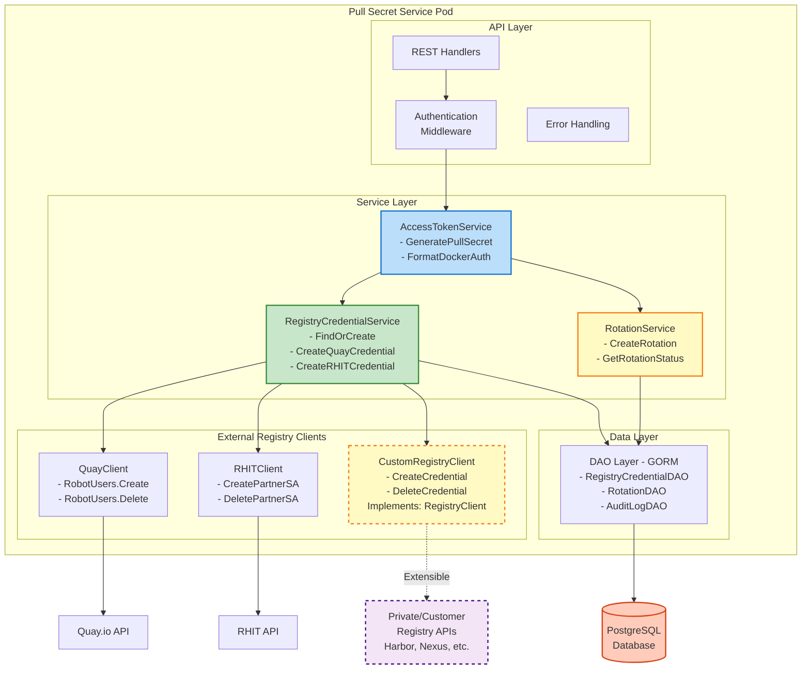
```mermaid
graph TB
    subgraph "Pull Secret Service Pod"
        subgraph "API Layer"
            Handler[REST Handlers]
            Auth[Authentication<br/>Middleware]
            Error[Error Handling]
        end

        subgraph "Service Layer"
            ATS[AccessTokenService<br/>- GeneratePullSecret<br/>- FormatDockerAuth]
            RCS[RegistryCredentialService<br/>- FindOrCreate<br/>- CreateQuayCredential<br/>- CreateRHITCredential]
            RS[RotationService<br/>- CreateRotation<br/>- GetRotationStatus]
        end

        subgraph "External Registry Clients"
            QuayClient[QuayClient<br/>- RobotUsers.Create<br/>- RobotUsers.Delete]
            RHITClient[RHITClient<br/>- CreatePartnerSA<br/>- DeletePartnerSA]
            CustomClient[CustomRegistryClient<br/>- CreateCredential<br/>- DeleteCredential<br/>Implements: RegistryClient]
        end

        subgraph "Data Layer"
            DAO[DAO Layer - GORM<br/>- RegistryCredentialDAO<br/>- RotationDAO<br/>- AuditLogDAO]
        end
    end

    DB[(PostgreSQL<br/>Database)]
    Quay[Quay.io API]
    RHIT[RHIT API]
    Private[Private/Customer<br/>Registry APIs<br/>Harbor, Nexus, etc.]

    Handler --> Auth
    Auth --> ATS
    ATS --> RCS
    ATS --> RS
    RCS --> QuayClient
    RCS --> RHITClient
    RCS --> CustomClient
    RCS --> DAO
    RS --> DAO
    DAO --> DB
    QuayClient --> Quay
    RHITClient --> RHIT
    CustomClient -.->|Extensible| Private

    style ATS fill:#bbdefb,stroke:#1976d2,stroke-width:2px
    style RCS fill:#c8e6c9,stroke:#388e3c,stroke-width:2px
    style RS fill:#fff9c4,stroke:#f57f17,stroke-width:2px
    style DB fill:#ffccbc,stroke:#d84315,stroke-width:2px
    style CustomClient fill:#fff9c4,stroke:#f57f17,stroke-width:2px,stroke-dasharray: 5 5
    style Private fill:#f3e5f5,stroke:#4a148c,stroke-width:2px,stroke-dasharray: 5 5
```

### 2.2 Background Jobs

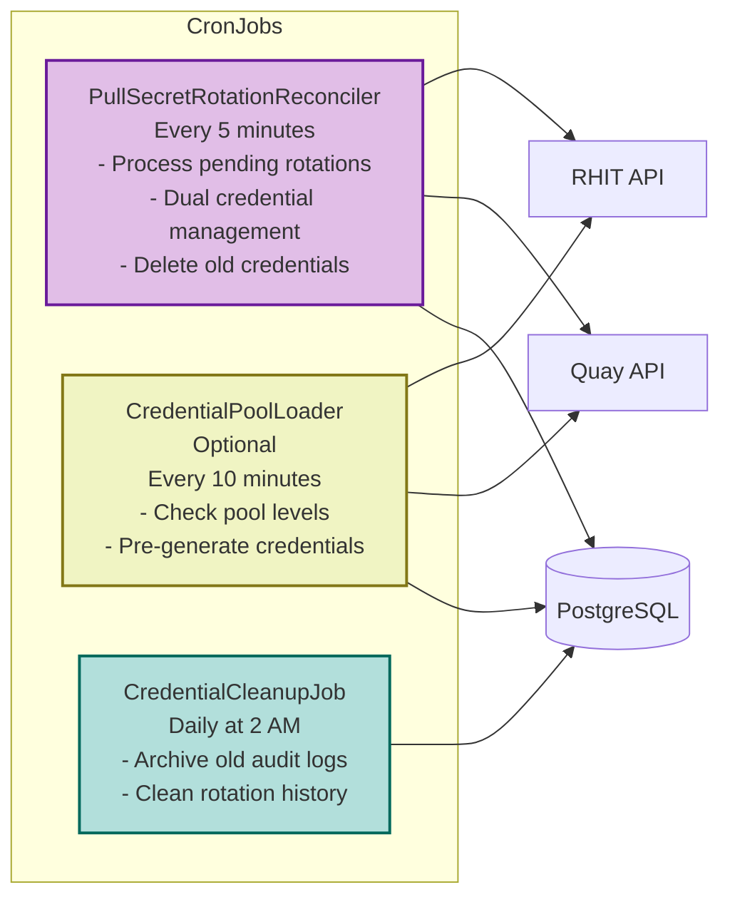
```mermaid
graph LR
    subgraph "CronJobs"
        RC[PullSecretRotationReconciler<br/>Every 5 minutes<br/>- Process pending rotations<br/>- Dual credential management<br/>- Delete old credentials]

        PL[CredentialPoolLoader<br/>Optional<br/>Every 10 minutes<br/>- Check pool levels<br/>- Pre-generate credentials]

        CL[CredentialCleanupJob<br/>Daily at 2 AM<br/>- Archive old audit logs<br/>- Clean rotation history]
    end

    DB[(PostgreSQL)]
    Quay[Quay API]
    RHIT[RHIT API]

    RC --> DB
    RC --> Quay
    RC --> RHIT
    PL --> DB
    PL --> Quay
    PL --> RHIT
    CL --> DB

    style RC fill:#e1bee7,stroke:#6a1b9a,stroke-width:2px
    style PL fill:#f0f4c3,stroke:#827717,stroke-width:2px
    style CL fill:#b2dfdb,stroke:#00695c,stroke-width:2px
```

### 2.3 Support for Private/Customer-Specific Registries

> **🔗 Design Principle 5 (Extensible Registries) in Action:**
> This section demonstrates how interface-based design enables zero vendor lock-in. Service code uses `RegistryClient` interface, allowing seamless addition of Harbor, Nexus, or any custom registry without modifying core logic.

The Pull Secret Service architecture is designed to be **extensible** and supports adding custom registry integrations beyond the default Quay.io and Red Hat Registry.

#### 2.3.1 Registry Client Interface

All registry clients implement a common interface, enabling polymorphic credential management:

```go
// pkg/client/registry/interface.go
type RegistryClient interface {
    // CreateCredential creates a new credential (robot account, service account, etc.)
    CreateCredential(ctx context.Context, name string) (*Credential, error)

    // DeleteCredential removes a credential from the external registry
    DeleteCredential(ctx context.Context, name string) error

    // GetCredential retrieves an existing credential
    GetCredential(ctx context.Context, name string) (*Credential, error)

    // ValidateCredential checks if a credential is still valid
    ValidateCredential(ctx context.Context, cred *Credential) (bool, error)
}

type Credential struct {
    Username string
    Token    string
    Metadata map[string]string  // Registry-specific metadata
}
```

#### 2.3.2 Supported Custom Registry Types

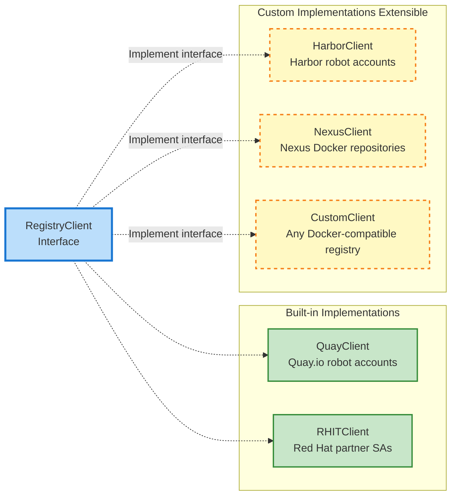
```mermaid
graph LR
    Interface[RegistryClient<br/>Interface]

    subgraph "Built-in Implementations"
        Quay[QuayClient<br/>Quay.io robot accounts]
        RHIT[RHITClient<br/>Red Hat partner SAs]
    end

    subgraph "Custom Implementations Extensible"
        Harbor[HarborClient<br/>Harbor robot accounts]
        Nexus[NexusClient<br/>Nexus Docker repositories]
        Custom[CustomClient<br/>Any Docker-compatible registry]
    end

    Interface -.-> Quay
    Interface -.-> RHIT
    Interface -.->|Implement interface| Harbor
    Interface -.->|Implement interface| Nexus
    Interface -.->|Implement interface| Custom

    style Interface fill:#bbdefb,stroke:#1976d2,stroke-width:3px
    style Quay fill:#c8e6c9,stroke:#388e3c,stroke-width:2px
    style RHIT fill:#c8e6c9,stroke:#388e3c,stroke-width:2px
    style Harbor fill:#fff9c4,stroke:#f57f17,stroke-width:2px,stroke-dasharray: 5 5
    style Nexus fill:#fff9c4,stroke:#f57f17,stroke-width:2px,stroke-dasharray: 5 5
    style Custom fill:#fff9c4,stroke:#f57f17,stroke-width:2px,stroke-dasharray: 5 5
```

#### 2.3.3 Example: Harbor Registry Integration

<details>
<summary><b>Harbor Client Implementation</b></summary>

```go
// pkg/client/harbor/client.go
package harbor

import (
    "context"
    "fmt"
    "net/http"

    "gitlab.cee.redhat.com/service/hyperfleet/pull-secret-service/pkg/client/registry"
)

type HarborClient struct {
    baseURL    string
    httpClient *http.Client
    username   string
    password   string
}

func NewHarborClient(baseURL, username, password string) *HarborClient {
    return &HarborClient{
        baseURL:    baseURL,
        httpClient: &http.Client{},
        username:   username,
        password:   password,
    }
}

// CreateCredential implements RegistryClient interface
func (c *HarborClient) CreateCredential(ctx context.Context, name string) (*registry.Credential, error) {
    // Harbor-specific robot account creation
    robotReq := map[string]interface{}{
        "name":        fmt.Sprintf("robot$%s", name),
        "description": "Created by HyperFleet Pull Secret Service",
        "duration":    90, // days
        "level":       "project",
        "permissions": []map[string]interface{}{
            {
                "kind":      "project",
                "namespace": "hyperfleet",
                "access":    []map[string]string{{"resource": "repository", "action": "pull"}},
            },
        },
    }

    resp, err := c.httpClient.Post(
        fmt.Sprintf("%s/api/v2.0/robots", c.baseURL),
        "application/json",
        // ... request body ...
    )
    if err != nil {
        return nil, fmt.Errorf("failed to create Harbor robot account: %w", err)
    }

    // Parse response
    var robotResp struct {
        Name   string `json:"name"`
        Secret string `json:"secret"`
    }
    // ... parse response ...

    return &registry.Credential{
        Username: robotResp.Name,
        Token:    robotResp.Secret,
        Metadata: map[string]string{
            "registry_type": "harbor",
            "duration_days": "90",
        },
    }, nil
}

// DeleteCredential implements RegistryClient interface
func (c *HarborClient) DeleteCredential(ctx context.Context, name string) error {
    // Harbor-specific robot account deletion
    robotName := fmt.Sprintf("robot$%s", name)

    req, _ := http.NewRequestWithContext(
        ctx,
        "DELETE",
        fmt.Sprintf("%s/api/v2.0/robots/%s", c.baseURL, robotName),
        nil,
    )
    req.SetBasicAuth(c.username, c.password)

    resp, err := c.httpClient.Do(req)
    if err != nil {
        return fmt.Errorf("failed to delete Harbor robot account: %w", err)
    }
    defer resp.Body.Close()

    if resp.StatusCode != http.StatusOK {
        return fmt.Errorf("Harbor API returned status %d", resp.StatusCode)
    }

    return nil
}

// GetCredential implements RegistryClient interface
func (c *HarborClient) GetCredential(ctx context.Context, name string) (*registry.Credential, error) {
    // Implementation for retrieving existing robot account
    // ...
}

// ValidateCredential implements RegistryClient interface
func (c *HarborClient) ValidateCredential(ctx context.Context, cred *registry.Credential) (bool, error) {
    // Validate by attempting to authenticate with Harbor API
    // ...
}
```

</details>

#### 2.3.4 Registry Configuration

Custom registries are configured via the `registries.go` initialization:

```go
// pkg/api/registries/registries.go
const (
    QuayRegistryID          = "Quay_quay.io"
    RedHatRegistryIOID      = "Redhat_registry.redhat.io"
    HarborRegistryID        = "Harbor_harbor.example.com"  // Custom registry
)

func InitializeRegistries(registryConfig *config.RegistriesConfig) {
    // ... existing Quay and RHIT initialization ...

    // Custom Harbor registry
    harborRegistry = api.Registry{
        ID:         HarborRegistryID,
        Name:       "harbor.example.com",
        URL:        registryConfig.HarborURL,
        Type:       api.HarborRegistry,  // New registry type
        TeamName:   "",
        OrgName:    registryConfig.HarborProject,
        CloudAlias: false,
    }

    knownRegistries[HarborRegistryID] = &harborRegistry
}
```

#### 2.3.5 Service Layer Integration

The `RegistryCredentialService` automatically supports new registry types:

```go
// pkg/services/registry_credential.go
func (s *sqlRegistryCredentialService) Create(ctx context.Context, cred *api.RegistryCredential) error {
    registry, found := registries.Find(cred.RegistryID)
    if !found {
        return errors.NewNotFound("Registry not found")
    }

    var client registry.RegistryClient

    // Polymorphic client selection
    switch registry.Type {
    case api.QuayRegistry:
        client = s.quayClient
    case api.RedhatRegistry:
        client = s.rhitClient
    case api.HarborRegistry:
        client = s.harborClient  // Custom client injected via dependency injection
    default:
        return errors.NewValidation("Unsupported registry type: %s", registry.Type)
    }

    // Same code path for all registries
    externalCred, err := client.CreateCredential(ctx, generateName(cred.ClusterID))
    if err != nil {
        return err
    }

    cred.Username = externalCred.Username
    cred.Token = externalCred.Token

    // Store in database (same for all registry types)
    return s.dao.Insert(ctx, cred)
}
```

#### 2.3.6 Configuration Example

```yaml
# config/registries.yaml
registries:
  quay:
    enabled: true
    org_name: "redhat-openshift"
    team_name: "hyperfleet-installers"

  rhit:
    enabled: true
    base_url: "https://registry.access.redhat.com/api/v1"
    partner_code: "hyperfleet"  # NOT "ocm-service" - see Principle 6
    cert_secret: "rhit-client-cert"


  # Custom registry configuration
  harbor:
    enabled: true
    url: "https://harbor.example.com"
    project: "hyperfleet"
    auth:
      username: "admin"
      password_secret: "harbor-credentials"  # K8s Secret name
```

#### 2.3.7 Benefits of Custom Registry Support

| Benefit | Description |
|---------|-------------|
| **Flexibility** | Support customer-specific private registries (Harbor, Nexus, JFrog Artifactory) |
| **Compliance** | Enable air-gapped deployments with on-premises registries |
| **Migration** | Gradual migration from one registry to another (dual-registry period) |
| **Testing** | Use test registries in staging environments |

#### 2.3.8 Implementation Checklist for New Registry

To add support for a new registry type:

- [ ] **1. Implement `RegistryClient` interface** (`pkg/client/<registry>/client.go`)
  - [ ] `CreateCredential()`
  - [ ] `DeleteCredential()`
  - [ ] `GetCredential()`
  - [ ] `ValidateCredential()`

- [ ] **2. Define Registry Type** (`pkg/api/registry_types.go`)
  - [ ] Add new `RegistryType` constant (e.g., `HarborRegistry`)

- [ ] **3. Register in `registries.go`** (`pkg/api/registries/registries.go`)
  - [ ] Add registry ID constant
  - [ ] Initialize in `InitializeRegistries()`

- [ ] **4. Update Service Layer** (`pkg/services/registry_credential.go`)
  - [ ] Add client to service struct
  - [ ] Add case in switch statement for new registry type

- [ ] **5. Add Configuration** (`pkg/config/registries.go`)
  - [ ] Add registry-specific config fields

- [ ] **6. Add Secrets** (Kubernetes)
  - [ ] Create Secret for registry credentials
  - [ ] Mount in Deployment

- [ ] **7. Add Tests**
  - [ ] Unit tests for client implementation
  - [ ] Integration tests with mock registry

---

## 3. API Design

> **🔗 Design Principles Applied:**
> - **Principle 1 (Lift and Shift)**: API structure mirrors AMS endpoints (`/clusters/{id}/pull-secrets`)
> - **Principle 2 (Cloud Agnostic)**: No cloud-specific parameters in API contract

The Pull Secret Service exposes a **RESTful API** for credential lifecycle management. All endpoints are authenticated using Kubernetes ServiceAccount tokens and follow standard HTTP semantics.

### 3.1 API Overview

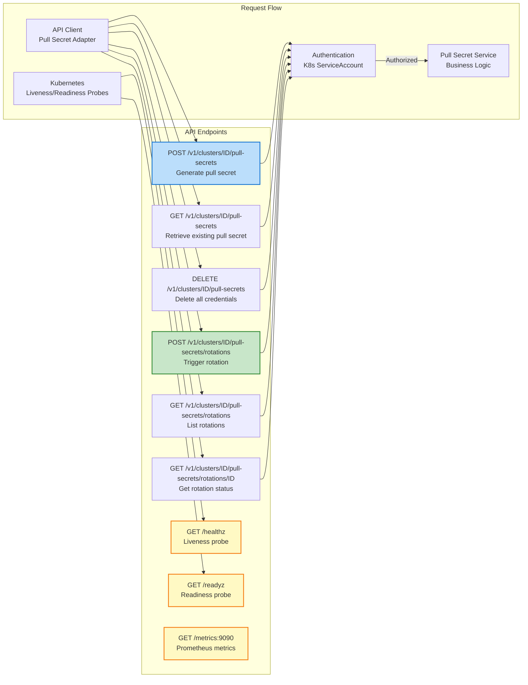
```mermaid
graph LR
    subgraph "API Endpoints"
        EP1[POST /v1/clusters/ID/pull-secrets<br/>Generate pull secret]
        EP2[GET /v1/clusters/ID/pull-secrets<br/>Retrieve existing pull secret]
        EP3[DELETE /v1/clusters/ID/pull-secrets<br/>Delete all credentials]
        EP4[POST /v1/clusters/ID/pull-secrets/rotations<br/>Trigger rotation]
        EP5[GET /v1/clusters/ID/pull-secrets/rotations<br/>List rotations]
        EP6[GET /v1/clusters/ID/pull-secrets/rotations/ID<br/>Get rotation status]
        EP7[GET /healthz<br/>Liveness probe]
        EP8[GET /readyz<br/>Readiness probe]
        EP9[GET /metrics:9090<br/>Prometheus metrics]
    end

    subgraph "Request Flow"
        Client[API Client<br/>Pull Secret Adapter]
        K8s[Kubernetes<br/>Liveness/Readiness Probes]
        Auth[Authentication<br/>K8s ServiceAccount]
        Service[Pull Secret Service<br/>Business Logic]
    end

    Client --> EP1
    Client --> EP2
    Client --> EP3
    Client --> EP4
    Client --> EP5
    Client --> EP6

    K8s --> EP7
    K8s --> EP8

    EP1 --> Auth
    EP2 --> Auth
    EP3 --> Auth
    EP4 --> Auth
    EP5 --> Auth
    EP6 --> Auth

    Auth -->|Authorized| Service

    style EP1 fill:#bbdefb,stroke:#1976d2,stroke-width:2px
    style EP4 fill:#c8e6c9,stroke:#388e3c,stroke-width:2px
    style EP7 fill:#fff9c4,stroke:#f57f17,stroke-width:2px
    style EP8 fill:#fff9c4,stroke:#f57f17,stroke-width:2px
    style EP9 fill:#fff9c4,stroke:#f57f17,stroke-width:2px
```

### 3.2 Core Endpoints

#### 3.2.1 Generate Pull Secret

**Endpoint**: `POST /v1/clusters/{cluster_id}/pull-secrets`

**Purpose**: Generate or retrieve pull secret for a cluster. Idempotent operation - returns existing credentials if already created.

**Request Headers**:
```http
Authorization: Bearer <k8s_serviceaccount_token>
Content-Type: application/json
```

**Request Body**:
```json
{
  "cluster_id": "cls-abc123def456",
  "cloud_provider": "gcp",
  "region": "us-east1",
  "registries": ["quay", "rhit"]
}
```

**Response 200 OK**:
```json
{
  "cluster_id": "cls-abc123def456",
  "pull_secret": {
    "auths": {
      "quay.io": {
        "auth": "cmVkaGF0LW9wZW5zaGlmdCtoeXBlcmZsZWV0X2djcF91c2Vhc3QxX2FiYzEyMzp0b2tlbl94eXo="
      },
      "registry.redhat.io": {
        "auth": "fGh5cC1jbHMtYWJjMTIzZGVmNDU2Omp3dF90b2tlbl94eXo="
      },
      "cloud.openshift.com": {
        "auth": "cmVkaGF0LW9wZW5zaGlmdCtoeXBlcmZsZWV0X2djcF91c2Vhc3QxX2FiYzEyMzp0b2tlbl94eXo="
      }
    }
  },
  "credentials": [
    {
      "registry_id": "quay",
      "username": "redhat-openshift+hyperfleet_gcp_useast1_abc123",
      "created_at": "2026-02-08T10:00:00Z",
      "expires_at": null
    },
    {
      "registry_id": "rhit",
      "username": "|hyp-cls-abc123def456",
      "created_at": "2026-02-08T10:00:01Z",
      "expires_at": null
    }
  ],
  "created_at": "2026-02-08T10:00:00Z"
}
```

**Response 400 Bad Request**:
```http
Content-Type: application/problem+json
```
```json
{
  "type": "https://api.hyperfleet.io/errors/validation-error",
  "title": "Validation Error",
  "status": 400,
  "detail": "Invalid cloud provider: invalidprovider",
  "code": "HYPERFLEET-VAL-001",
  "timestamp": "2026-02-26T10:30:00.123Z",
  "trace_id": "a1b2c3d4-e5f6-7890",
  "instance": "/v1/clusters/cls-abc123/pull-secrets",
  "errors": [
    {
      "field": "cloud_provider",
      "value": "invalidprovider",
      "constraint": "enum",
      "message": "Must be one of: gcp, aws, azure"
    }
  ]
}
```

**Response 409 Conflict**:
```http
Content-Type: application/problem+json
```
```json
{
  "type": "https://api.hyperfleet.io/errors/resource-conflict",
  "title": "Resource Conflict",
  "status": 409,
  "detail": "Cannot generate pull secret while rotation is in progress for cluster cls-abc123def456",
  "code": "HYPERFLEET-CNF-001",
  "timestamp": "2026-02-26T10:30:00.123Z",
  "trace_id": "a1b2c3d4-e5f6-7890",
  "instance": "/v1/clusters/cls-abc123def456/pull-secrets",
  "rotation_id": "rot-xyz789",
  "rotation_status": "in_progress"
}
```

---

#### 3.2.2 Retrieve Pull Secret

**Endpoint**: `GET /v1/clusters/{cluster_id}/pull-secrets`

**Purpose**: Retrieve existing pull secret for a cluster.

**Request Headers**:
```http
Authorization: Bearer <k8s_serviceaccount_token>
```

**Query Parameters**:
- `include_metadata` (optional): Include credential metadata (default: false)

**Response 200 OK**:
```json
{
  "cluster_id": "cls-abc123def456",
  "pull_secret": {
    "auths": {
      "quay.io": {
        "auth": "cmVkaGF0LW9wZW5zaGlmdCtoeXBlcmZsZWV0X2djcF91c2Vhc3QxX2FiYzEyMzp0b2tlbl94eXo="
      },
      "registry.redhat.io": {
        "auth": "fGh5cC1jbHMtYWJjMTIzZGVmNDU2Omp3dF90b2tlbl94eXo="
      }
    }
  },
  "created_at": "2026-02-08T10:00:00Z",
  "last_rotated_at": "2026-01-01T00:00:00Z"
}
```

**Response 404 Not Found**:
```http
Content-Type: application/problem+json
```
```json
{
  "type": "https://api.hyperfleet.io/errors/resource-not-found",
  "title": "Resource Not Found",
  "status": 404,
  "detail": "Pull secret not found for cluster cls-abc123def456",
  "code": "HYPERFLEET-NTF-001",
  "timestamp": "2026-02-26T10:30:00.123Z",
  "trace_id": "a1b2c3d4-e5f6-7890",
  "instance": "/v1/clusters/cls-abc123def456/pull-secrets",
  "cluster_id": "cls-abc123def456"
}
```

---

#### 3.2.3 Trigger Credential Rotation

**Endpoint**: `POST /v1/clusters/{cluster_id}/pull-secrets/rotations`

**Purpose**: Initiate credential rotation for a cluster.

**Request Body**:
```json
{
  "reason": "scheduled",
  "force_immediate": false
}
```

**Reason Values**:
- `scheduled`: Periodic rotation (every 90 days)
- `compromise`: Security incident
- `manual`: Operator-initiated

**Response 201 Created**:
```json
{
  "rotation_id": "rot-xyz789",
  "cluster_id": "cls-abc123def456",
  "status": "pending",
  "reason": "scheduled",
  "force_immediate": false,
  "created_at": "2026-02-08T14:00:00Z",
  "estimated_completion": "2026-02-15T14:00:00Z"
}
```

**Response 409 Conflict**:
```http
Content-Type: application/problem+json
```
```json
{
  "type": "https://api.hyperfleet.io/errors/resource-conflict",
  "title": "Resource Conflict",
  "status": 409,
  "detail": "Rotation already in progress for cluster cls-abc123def456",
  "code": "HYPERFLEET-CNF-002",
  "timestamp": "2026-02-26T10:30:00.123Z",
  "trace_id": "a1b2c3d4-e5f6-7890",
  "instance": "/v1/clusters/cls-abc123def456/pull-secrets/rotations",
  "rotation_id": "rot-abc123",
  "rotation_status": "in_progress",
  "started_at": "2026-02-07T10:00:00Z"
}
```

**Credential Rotation Lifecycle Details**

The credential rotation process follows the **AMS (Account Management Service) pattern** inherited via Lift & Shift (Principle 1).


**What is the Dual Credential Period?**

The **dual credential period** is the overlap window where **both old and new credentials are simultaneously valid**. This ensures clusters can continue pulling images during the transition.

**Timeline**:
```
T0: Old credential only (ACTIVE)
T1: Rotation triggered → Old credentials marked as "rotating"
T2: New credentials created
T3: Adapter retrieves new credentials → writes to cluster
T4: Cluster confirms readiness → Old credentials deleted
```

**Duration**: Variable - depends on cluster confirmation, not a fixed timeout.

**How Long Are Both Credentials Valid?**

| Phase | Old Credential | New Credential | Timing |
|-------|----------------|----------------|--------|
| Pre-Rotation | ✅ Active | ❌ Not created | Indefinite |
| **Dual Period** | ✅ Active (marked "rotating") | ✅ Active | **Until cluster confirms readiness** |
| Post-Rotation | ❌ Deleted | ✅ Active | Indefinite |


**How Does the Service Know New Credentials Are Being Used?**

The service uses a **passive, telemetry-based detection mechanism** inherited from AMS. The system does **NOT** poll clusters or perform active health checks. Instead, it relies on **cluster-initiated telemetry** to confirm that new credentials are in use.

---

#### AMS Pattern: Telemetry-Driven Confirmation

The AMS (uhc-account-manager) uses an elegant approach where **cluster telemetry serves as proof** that new credentials are active.

**Key Insight**: When a cluster sends metrics using the new pull secret, we know it's safe to delete the old one.

**Components**:

| Component | Role | Frequency |
|-----------|------|-----------|
| **PullSecretRotation** | Tracks rotation lifecycle (pending → completed) | Created once per rotation request |
| **ClusterTransfer** | Tracks per-cluster credential adoption | One per cluster, status: pending → accepted → completed |
| **Reconciler Job** | Creates new credentials, accepts ClusterTransfers | Runs periodically (configurable) |
| **Telemetry** | Cluster sends metrics with auth header | Every ~6 hours |
| **Cluster Registration** | Decodes auth token, completes ClusterTransfer if using new credential | On every telemetry call |

---

#### Complete Rotation Flow

**Phase 1: User Initiates Rotation**

```http
POST /api/accounts_mgmt/v1/accounts/{account_id}/pull_secret_rotation
```

**What Happens** (`pull_secret_rotation.go:45-117`):
```go
// 1. Create PullSecretRotation record
rotation := &api.PullSecretRotation{
    AccountID: accountID,
    Status:    string(api.RotationPending),
}

// 2. For each active cluster, create ClusterTransfer
for _, subscription := range activeSubscriptions {
    clusterTransfer := api.ClusterTransfer{
        ClusterUUID:          subscription.ExternalClusterID,
        Owner:                account.Username,
        Recipient:            account.Username,  // Same user for rotation
        Status:               api.Pending,
        PullSecretRotationID: &rotation.ID,
    }
    clusterTransferService.CreateClusterTransfer(ctx, &clusterTransfer)
}
```

**Database State**:
```sql
-- pull_secret_rotations table
INSERT INTO pull_secret_rotations (id, account_id, status)
VALUES ('rot-789', 'acc-123', 'pending');

-- cluster_transfers table
INSERT INTO cluster_transfers (id, cluster_uuid, owner, recipient, status, pull_secret_rotation_id)
VALUES ('ct-001', 'cls-abc123', 'user@example.com', 'user@example.com', 'pending', 'rot-789');
```

---

**Phase 2: Reconciler Creates New Credentials**

**Job**: `pull_secret_rotations_reconciler.go`
**Trigger**: Periodic execution (configurable interval)

```go
// 1. Find all pending rotations
var rotations []api.PullSecretRotation
db.Where("status = ?", "pending").Find(&rotations)

for _, rotation := range rotations {
    // 2. Mark OLD credentials with external_resource_id = "rotating"
    oldCreds := findCredentials(rotation.AccountID, externalResourceID="")
    for _, cred := range oldCreds {
        cred.ExternalResourceId = "rotating"
        registryCredentialService.Update(ctx, cred)
    }

    // 3. Create NEW credentials (external_resource_id = "")
    for _, registry := range registries {
        newCred := &api.RegistryCredential{
            AccountID:          &rotation.AccountID,
            RegistryID:         registry.ID,
            ExternalResourceId: "",  // Active credential marker
        }
        registryCredentialService.Create(ctx, newCred)
    }

    // 4. Auto-accept ClusterTransfers
    clusterTransfers := findClusterTransfers(rotation.ID)
    for _, ct := range clusterTransfers {
        if ct.Status == api.Pending {
            ct.Status = api.Accepted
            clusterTransferService.Update(ctx, &ct)
        }
    }
}
```

**Database State After Reconciler**:
```sql
-- registry_credentials table
-- OLD credentials (marked for deletion)
UPDATE registry_credentials
SET external_resource_id = 'rotating'
WHERE account_id = 'acc-123' AND external_resource_id = '';

-- NEW credentials (active)
INSERT INTO registry_credentials (id, account_id, registry_id, external_resource_id, username, token)
VALUES
  ('uuid-3', 'acc-123', 'quay', '', 'robot$new-def', 'new_token'),
  ('uuid-4', 'acc-123', 'rhit', '', '|uhc-new-123', 'new_jwt');

-- cluster_transfers table
UPDATE cluster_transfers
SET status = 'accepted'
WHERE pull_secret_rotation_id = 'rot-789';
```

---

**Phase 3: Cluster Updates Pull Secret**

**In-Cluster Components**:

1. **Insights Operator** (runs every ~12 hours):
   - Detects global pull secret changed
   - Updates local cluster pull secret

2. **Telemeter** (runs every ~6 hours):
   - Sends metrics to OCM
   - **Uses NEW credential in Authorization header**
   - Calls: `POST /api/clusters_mgmt/v1/register_cluster`

---

**Phase 4: Cluster Registration Detects New Credential**

**Code**: `cluster_registration.go:70-131`

```go
func (s *clusterRegistrationService) Register(ctx context.Context,
    authToken, externalClusterID string) (accountID string, ...) {

    // 1. Decode Authorization header to get credential
    registryCredential, err := s.registryCredentialService.FindByEncodedToken(ctx, authToken)
    if err != nil {
        return errors.NotFound("Unable to find credential with specified authorization token")
    }

    // 2. Get account that owns the credential (pullSecretOwner)
    pullSecretOwner, err := s.accountService.Get(ctx, *registryCredential.AccountID, ...)

    // 3. Find subscription for cluster
    subscription, _ := s.subscriptionService.FindByExternalClusterID(ctx, externalClusterID)

    // 4. Attempt to complete ClusterTransfer if one exists
    err = s.clusterTransferService.Transfer(ctx, subscription.ExternalClusterID,
        subscription, pullSecretOwner)

    return pullSecretOwner.ID, true, expiresAt, nil
}
```

---

**Phase 5: Transfer Completion Check**

**Code**: `cluster_transfer.go:459-610`

```go
func (s *sqlClusterTransferService) Transfer(ctx context.Context, clusterUUID string,
    subscription *api.Subscription, pullSecretOwner *api.Account) *errors.ServiceError {

    // 1. Get ClusterTransfer with status "accepted"
    clusterTransfer, err := s.clusterTransferDao.GetOneBy(ctx, &dao.ClusterTransferDaoParams{
        ClusterUUID: &clusterUUID,
        Status:      util.ToPtr(string(api.Accepted)),
    })

    if err != nil {
        return nil  // No accepted transfer found, nothing to do
    }

    // 2. Get recipient account (same as owner for rotation)
    recipientAccount, _ := s.accountService.FindByUsername(ctx, clusterTransfer.Recipient)

    // 3. ⭐ CRITICAL CHECK ⭐
    // Compare credential owner (pullSecretOwner) with expected recipient
    if pullSecretOwner.ID != recipientAccount.ID {
        // ❌ Cluster still using OLD credential
        ulog.Warning("Unable to complete pending cluster transfer. " +
            "Cluster registration will succeed when the cluster's global pull secret " +
            "has been updated with the recipient account's pull secret",
            "pullsecret_owner", pullSecretOwner.ID,
            "recipient_account", recipientAccount.ID,
            "cluster_uuid", clusterTransfer.ClusterUUID)
        return nil  // Wait for next telemetry attempt
    }

    // ✅ Cluster IS using NEW credential!

    // 4. Mark ClusterTransfer as completed
    _, err = s.clusterTransferDao.Update(ctx, clusterTransfer, "status",
        util.ToPtr(string(api.Completed)))

    ulog.Info("Cluster transfer completed successfully",
        "cluster_uuid", clusterUUID,
        "transfer_id", clusterTransfer.ID)

    return nil
}
```

**Key Lines** (`cluster_transfer.go:493-504`):
```go
// Confirm recipient account matches with the account passed in to cluster_registration
// There can be scenarios where cluster_registration is called from the current owner's
// pull secret, which means the pull secret is not yet rotated.
// In this case, log a warning message and skip the cluster transfer. We don't want the
// cluster to stop reporting metrics.
// Once the pull secret is updated with the recipient's pull secret, cluster_registration
// will be called via the recipient's account. CT can be completed then.
// Also, warning message is expected to be logged no more than 2 times since telemetry
// calls cluster_registration every 6 hours and Insights Operator rotates the pull secret
// every 12 hours.
```

---

**Phase 6: Reconciler Deletes Old Credentials**

**Trigger**: Reconciler job runs again, checks if all ClusterTransfers are completed

```go
// Find all ClusterTransfers for this rotation
var cts []api.ClusterTransfer
db.Where("pull_secret_rotation_id = ?", rotation.ID).Find(&cts)

// Check if ALL are completed
ctsCompleted := true
for _, ct := range cts {
    if ct.Status == api.Expired {
        continue  // Ignore expired transfers
    }
    if ct.Status != api.Completed {
        ctsCompleted = false
        break
    }
}

// ✅ Only delete if ALL clusters confirmed new credential
if len(cts) > 0 && ctsCompleted {
    // 1. Delete OLD credentials from external APIs
    for _, registry := range registries {
        oldCred := findCredential(accountID, registry.ID, externalResourceID="rotating")
        if oldCred != nil {
            // Delete from Quay/RHIT API
            registryCredentialService.DeleteExternalAccount(ctx, account, &registry, "rotating")

            // Delete from database
            registryCredentialService.Delete(ctx, oldCred.ID)
        }
    }

    // 2. Mark rotation as completed
    rotation.Status = string(api.RotationCompleted)
    pullSecretRotationService.Update(ctx, rotation, rotation.ID)
}
```

---

#### Complete Sequence Diagram

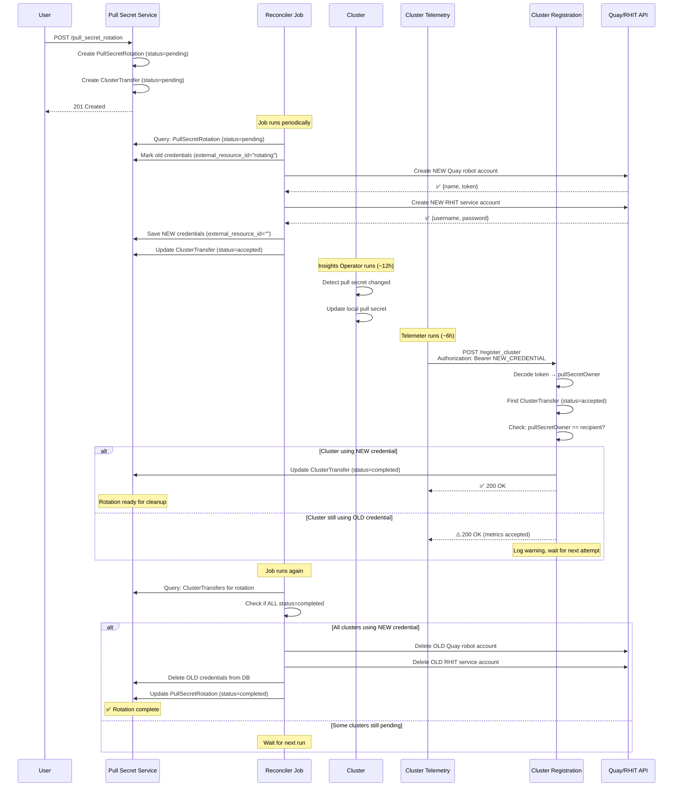
```mermaid
sequenceDiagram
    participant User
    participant AMS as Pull Secret Service
    participant Reconciler as Reconciler Job
    participant Cluster
    participant Telemetry as Cluster Telemetry
    participant ClusterReg as Cluster Registration
    participant Registry as Quay/RHIT API

    User->>AMS: POST /pull_secret_rotation
    AMS->>AMS: Create PullSecretRotation (status=pending)
    AMS->>AMS: Create ClusterTransfer (status=pending)
    AMS-->>User: 201 Created

    Note over Reconciler: Job runs periodically

    Reconciler->>AMS: Query: PullSecretRotation (status=pending)
    Reconciler->>AMS: Mark old credentials (external_resource_id="rotating")
    Reconciler->>Registry: Create NEW Quay robot account
    Registry-->>Reconciler: ✅ {name, token}
    Reconciler->>Registry: Create NEW RHIT service account
    Registry-->>Reconciler: ✅ {username, password}
    Reconciler->>AMS: Save NEW credentials (external_resource_id="")
    Reconciler->>AMS: Update ClusterTransfer (status=accepted)

    Note over Cluster: Insights Operator runs (~12h)

    Cluster->>Cluster: Detect pull secret changed
    Cluster->>Cluster: Update local pull secret

    Note over Telemetry: Telemeter runs (~6h)

    Telemetry->>ClusterReg: POST /register_cluster<br/>Authorization: Bearer NEW_CREDENTIAL

    ClusterReg->>ClusterReg: Decode token → pullSecretOwner
    ClusterReg->>ClusterReg: Find ClusterTransfer (status=accepted)
    ClusterReg->>ClusterReg: Check: pullSecretOwner == recipient?

    alt Cluster using NEW credential
        ClusterReg->>AMS: Update ClusterTransfer (status=completed)
        ClusterReg-->>Telemetry: ✅ 200 OK
        Note over AMS: Rotation ready for cleanup
    else Cluster still using OLD credential
        ClusterReg-->>Telemetry: ⚠️ 200 OK (metrics accepted)
        Note over ClusterReg: Log warning, wait for next attempt
    end

    Note over Reconciler: Job runs again

    Reconciler->>AMS: Query: ClusterTransfers for rotation
    Reconciler->>Reconciler: Check if ALL status=completed

    alt All clusters using NEW credential
        Reconciler->>Registry: Delete OLD Quay robot account
        Reconciler->>Registry: Delete OLD RHIT service account
        Reconciler->>AMS: Delete OLD credentials from DB
        Reconciler->>AMS: Update PullSecretRotation (status=completed)
        Note over AMS: ✅ Rotation complete
    else Some clusters still pending
        Note over Reconciler: Wait for next run
    end
```

---

#### Key Detection Mechanism

The system know new credentials are in use by comparing the credential used in telemetry with the expected recipient:

```go
// cluster_transfer.go:499
if pullSecretOwner.ID != recipientAccount.ID {
    // Cluster still using OLD credential (from previous owner)
    // Log warning and wait for next attempt
    return nil
}

// Cluster IS using NEW credential!
// Safe to mark ClusterTransfer as completed
```

**Source of Truth**: `Authorization` header in cluster telemetry requests

**Validation**: `pullSecretOwner` (decoded from auth token) == `recipient` (from ClusterTransfer)

---

#### Advantages of This Approach

| Advantage | Description |
|-----------|-------------|
| **Non-invasive** | No special agent needed in cluster |
| **Passive Detection** | No polling or active health checks |
| **Resilient** | Temporary telemetry failures don't break rotation |
| **Safe** | Old credentials only deleted after positive confirmation |
| **Automatic** | Zero manual intervention after initiation |
| **Observable** | Clear state transitions (pending → accepted → completed) |
| **Multiple Clusters** | Waits for ALL clusters before cleanup |

---

#### HyperFleet Adaptation

For HyperFleet Pull Secret Service, adopt the same pattern with minor adjustments:

**Components Mapping**:

| AMS Component | HyperFleet Equivalent | Notes |
|---------------|----------------------|-------|
| `PullSecretRotation` | Same model | Track rotation lifecycle |
| `ClusterTransfer` | Same model | One per cluster, tracks credential adoption |
| `cluster_registration` | Cluster heartbeat/telemetry endpoint | Verify credential in use |
| Reconciler job | Same pattern | Create credentials, check completions, cleanup |


---

#### 3.2.4 Get Rotation Status

**Endpoint**: `GET /v1/clusters/{cluster_id}/pull-secrets/rotations/{rotation_id}`

**Purpose**: Retrieve status of a specific rotation.

**Response 200 OK**:
```json
{
  "rotation_id": "rot-xyz789",
  "cluster_id": "cls-abc123def456",
  "status": "in_progress",
  "reason": "scheduled",
  "force_immediate": false,
  "created_at": "2026-02-08T14:00:00Z",
  "started_at": "2026-02-08T14:05:00Z",
  "estimated_completion": "2026-02-15T14:00:00Z",
  "progress": {
    "phase": "dual_credential_period",
    "old_credentials_revoked": false,
    "new_credentials_created": true
  }
}
```

**Rotation Status Values**:
- `pending`: Rotation created, not yet started
- `in_progress`: New credentials created, waiting for cluster health confirmation
- `completed`: Old credentials revoked, rotation complete
- `failed`: Rotation failed (manual intervention required)

---

#### 3.2.5 List Rotations

**Endpoint**: `GET /v1/clusters/{cluster_id}/pull-secrets/rotations`

**Purpose**: Retrieve paginated list of credential rotations for a cluster.

**Query Parameters**:
- `status` (optional): Filter by rotation status (`pending`, `in_progress`, `completed`, `failed`)
- `limit` (optional): Number of results per page (default: 50, max: 100)
- `cursor` (optional): Pagination cursor from previous response (cursor-based pagination for consistent results during concurrent writes)
- `since` (optional): RFC3339 timestamp - only return rotations created after this time

**Request Example**:
```http
GET /v1/clusters/cls-abc123/pull-secrets/rotations?status=in_progress&limit=20
Authorization: Bearer <k8s_serviceaccount_token>
```

**Response 200 OK**:
```json
{
  "rotations": [
    {
      "rotation_id": "rot-xyz789",
      "cluster_id": "cls-abc123",
      "status": "in_progress",
      "reason": "scheduled",
      "created_at": "2026-02-20T14:00:00Z",
      "started_at": "2026-02-20T14:05:00Z",
      "estimated_completion": "2026-02-27T14:00:00Z"
    },
    {
      "rotation_id": "rot-abc456",
      "cluster_id": "cls-abc123",
      "status": "completed",
      "reason": "manual",
      "created_at": "2026-01-15T10:00:00Z",
      "started_at": "2026-01-15T10:02:00Z",
      "completed_at": "2026-01-22T10:00:00Z"
    }
  ],
  "pagination": {
    "next_cursor": "eyJjcmVhdGVkX2F0IjoiMjAyNi0wMS0xNVQxMDowMDowMFoiLCJpZCI6InJvdC1hYmM0NTYifQ==",
    "has_more": true,
    "total_count": 47
  }
}
```

**Pagination Strategy**: Cursor-based pagination (not offset-based)
- **Why cursor-based**: Prevents missing/duplicate results when new rotations are created during pagination
- **Cursor format**: Base64-encoded JSON with `{created_at, id}` for stable ordering
- **Sort order**: Descending by `created_at` (newest first), with `rotation_id` as tiebreaker

**Empty Result (no rotations)**:
```json
{
  "rotations": [],
  "pagination": {
    "next_cursor": null,
    "has_more": false,
    "total_count": 0
  }
}
```

**Error Responses**:
- **404 Not Found**: Cluster does not exist
- **400 Bad Request**: Invalid query parameters (e.g., `limit > 100`, invalid cursor, malformed `since` timestamp)

**Retention Policy**: Returns rotations from the last 90 days. Historical rotations older than 90 days are archived and not returned by this endpoint.

---

#### 3.2.6 Delete Pull Secret

**Endpoint**: `DELETE /v1/clusters/{cluster_id}/pull-secrets`

**Purpose**: Delete all credentials for a cluster and revoke access at registry level. Used during cluster deprovisioning.

**Behavior**: **Hard delete with cascade**
- Immediately revokes credentials at registry APIs (Quay robot account deletion, RHIT service account removal)
- Deletes all credential records from database
- Cancels any pending rotations (rotations in `pending` or `in_progress` status are marked as `cancelled`)
- Preserves audit log entries for compliance (records in `credential_audit_log` are **NOT** deleted)

**Request Example**:
```http
DELETE /v1/clusters/cls-abc123/pull-secrets
Authorization: Bearer <k8s_serviceaccount_token>
```

**Response 204 No Content**: Successful deletion (no response body)

**Idempotency**: Deleting non-existent credentials returns `204 No Content` (safe to retry)

**Error Responses**:

**409 Conflict** - Rotation in progress, cannot delete immediately:
```json
{
  "type": "https://api.hyperfleet.io/errors/resource-conflict",
  "title": "Resource Conflict",
  "status": 409,
  "detail": "Cannot delete credentials while rotation rot-xyz789 is in progress",
  "code": "HYPERFLEET-CNF-002",
  "timestamp": "2026-02-26T10:30:00.123Z",
  "trace_id": "a1b2c3d4-e5f6-7890",
  "instance": "/v1/clusters/cls-abc123/pull-secrets",
  "rotation_id": "rot-xyz789",
  "rotation_status": "in_progress",
  "retry_after_seconds": 300
}
```

**Conflict Resolution Strategy**:
1. **Automatic cancellation (default)**: Service automatically cancels the rotation and proceeds with deletion (dual-credential period is terminated, old credentials remain active)
2. **Wait for completion (alternative)**: Client waits for rotation to complete, then retries delete

**500 Internal Server Error** - Partial registry revocation failure:
```json
{
  "type": "https://api.hyperfleet.io/errors/internal-error",
  "title": "Internal Server Error",
  "status": 500,
  "detail": "Failed to revoke credentials at RHIT API",
  "code": "HYPERFLEET-INT-003",
  "timestamp": "2026-02-26T10:30:00.123Z",
  "trace_id": "a1b2c3d4-e5f6-7890",
  "instance": "/v1/clusters/cls-abc123/pull-secrets",
  "registries": {
    "quay": "revoked",
    "rhit": "failed"
  },
  "database_state": "credentials_marked_for_deletion",
  "retryable": true
}
```

**Partial Failure Behavior**:
- If Quay revocation succeeds but RHIT fails → Database marks credentials as `pending_deletion`, returns `500` with retry guidance
- Background cleanup job retries registry revocation every 5 minutes
- Client can safely retry DELETE (idempotent - checks `pending_deletion` state)

**Audit Trail**: Every deletion is logged in `credential_audit_log`:
```sql
INSERT INTO credential_audit_log (
    credential_id, action, actor, reason, timestamp
) VALUES (
    'cred-abc123', 'delete', 'system:serviceaccount:hyperfleet-system:cluster-controller',
    'cluster_deprovisioned', '2026-02-26 10:30:00'
);
```

**RBAC Requirement**: Requires `clusters/pull-secrets/delete` permission (typically only granted to cluster-controller ServiceAccount)

---

### 3.3 Error Handling

All error responses follow **RFC 9457** (Problem Details for HTTP APIs) with HyperFleet extensions.

```json
{
  "type": "https://api.hyperfleet.io/errors/resource-conflict",
  "title": "Resource Conflict",
  "status": 409,
  "detail": "Cannot generate pull secret while rotation rot-xyz789 is in progress",
  "code": "HYPERFLEET-CNF-001",
  "timestamp": "2026-02-26T10:30:00.123Z",
  "trace_id": "a1b2c3d4-e5f6-7890-abcd-ef1234567890",
  "instance": "/v1/clusters/cls-abc123/pull-secrets",
  "rotation_id": "rot-xyz789",
  "rotation_status": "in_progress"
}
```

**Standard Error Codes**:

| HTTP Status | Error Code | Description | Retry? | Notes |
|-------------|------------|-------------|--------|-------|
| 400 | `INVALID_REQUEST` | Malformed request body or parameters | No | Fix request and retry |
| 401 | `UNAUTHORIZED` | Missing or invalid authentication token | No | Check token validity |
| 403 | `FORBIDDEN` | Insufficient permissions (RBAC) | No | Check RBAC configuration |
| 404 | `NOT_FOUND` | Resource not found | No | Verify cluster exists |
| 409 | `CONFLICT` | Resource state conflict (rotation in progress) | Yes, later | Wait for rotation to complete |
| 429 | `RATE_LIMIT_EXCEEDED` | Too many requests | Yes, with backoff | Honor Retry-After header |
| 500 | `INTERNAL_ERROR` | Unexpected server error or partial registry failure | Yes | May indicate Quay/RHIT API issue; retry enables idempotent recovery |
| 503 | `SERVICE_UNAVAILABLE` | Service temporarily unavailable | Yes | Service restarting or overloaded |

**Retry Logic**:
```go
// Recommended client retry logic
func retryWithBackoff(request *http.Request) (*http.Response, error) {
    maxRetries := 3
    baseDelay := 1 * time.Second

    for i := 0; i < maxRetries; i++ {
        resp, err := httpClient.Do(request)

        // Retry on 429, 500, 503
        if resp.StatusCode == 429 || resp.StatusCode >= 500 {
            delay := baseDelay * time.Duration(math.Pow(2, float64(i)))

            // Honor Retry-After header if present
            if retryAfter := resp.Header.Get("Retry-After"); retryAfter != "" {
                delay = parseRetryAfter(retryAfter)
            }

            time.Sleep(delay)
            continue
        }

        return resp, err
    }

    return nil, fmt.Errorf("max retries exceeded")
}
```

---

#### 3.3.1 Partial Failure Handling

**Strategy**: All-or-Nothing (inherited from AMS pattern - see Principle 1)

When generating pull secrets for multiple registries (Quay + RHIT), the service follows an **all-or-nothing** approach: if ANY registry credential creation fails, the entire operation fails and returns HTTP 500.

**Behavior Summary**:

| Scenario | Quay | RHIT | Response | Database State |
|----------|------|------|----------|----------------|
| **Complete Success** | ✅ Created | ✅ Created | 200 OK with pull secret | Both credentials stored |
| **Partial Failure** | ✅ Created | ❌ Failed | 500 Internal Error | Quay credential orphaned |
| **Complete Failure** | ❌ Failed | N/A | 500 Internal Error | No credentials |
| **Retry After Partial** | ✅ Reused | ✅ Created | 200 OK with pull secret | Both credentials stored |

**Why All-or-Nothing?**

- **Clear Semantics**: Client receives either a complete pull secret or an error - no ambiguity
- **Prevents Silent Failures**: Returning a partial pull secret would cause runtime failures when pulling images from the missing registry
- **Idempotent Recovery**: Clients can safely retry; existing credentials are automatically reused

**Partial Failure Example (Quay succeeds, RHIT fails)**:

```json
// Request
POST /v1/clusters/cls-abc123/pull-secrets

// Response: 500 Internal Server Error
{
  "type": "https://docs.hyperfleet.io/errors/credential-creation-failed",
  "title": "Credential Creation Failed",
  "status": 500,
  "detail": "Failed to create credential for registry rhit",
  "instance": "/v1/clusters/cls-abc123/pull-secrets",
  "trace_id": "a1b2c3d4-e5f6-7890-abcd-ef1234567890",
  "errors": [
    {
      "field": "registry",
      "code": "EXTERNAL_API_ERROR",
      "message": "RHIT API returned 500: Service temporarily unavailable"
    }
  ]
}
```

**Internal State After Partial Failure**:

```sql
-- Database state (orphaned Quay credential)
SELECT * FROM registry_credentials WHERE cluster_id = 'cls-abc123';

-- Result:
-- id         | registry_id | username              | token      | cluster_id  | created_at
-- uuid-1     | quay        | robot$hyperfleet-... | quay_token | cls-abc123  | 2026-02-22 10:00:00
-- (RHIT credential missing - orphaned state)
```

**Recovery Mechanisms**:

1. **Idempotent Retry (Automatic Recovery)**

   When the client retries the same request:
   - Service checks database for existing credentials
   - Quay credential found → reused (no duplicate creation)
   - RHIT credential missing → attempts creation again
   - If RHIT succeeds → returns complete pull secret

   ```go
   // Service implementation (idempotency check)
   existingCred, _ := s.dao.GetCredentialByClusterAndRegistry(clusterID, "quay")
   if existingCred != nil {
       // Reuse existing credential, skip external API call
       credentials = append(credentials, *existingCred)
       continue
   }
   ```

2. **Orphaned Credentials Cleanup (Proactive)**

   A reconciliation job runs daily to clean credentials that were never completed:

   ```go
   // Detect clusters with incomplete credential sets
   SELECT cluster_id, COUNT(*) as cred_count
   FROM registry_credentials
   WHERE cluster_id IS NOT NULL
   GROUP BY cluster_id
   HAVING COUNT(*) < 2  -- Expected: 2 (Quay + RHIT)
     AND MAX(created_at) < NOW() - INTERVAL '24 hours';
   ```

   For each orphaned credential:
   - Delete from external registry API (Quay/RHIT)
   - Delete from database
   - Log cleanup event

   **Scheduling**: CronJob runs daily at 2 AM, cleans credentials older than 24 hours

3. **Advisory Locking (Prevention)**

   Prevents concurrent requests from creating duplicate credentials:
   ```go
   lockID := fmt.Sprintf("pull-secret-%s", clusterID)
   lock, _ := db.AcquireAdvisoryLock(ctx, lockID)
   defer lock.Release()
   ```

**Observability**:

Track partial failures with Prometheus metrics:

```prometheus
# Registry-specific failure rate
registry_credential_failures_total{registry="quay"}
registry_credential_failures_total{registry="rhit"}

# Orphaned credentials detected
orphaned_credentials_detected_total

# Successful recoveries via retry
pull_secret_retry_success_total
```

**Alert Conditions**:
- Any registry with > 5% failure rate over 5 minutes
- Orphaned credentials accumulating (> 100 unreconciled)
- Complete registry outage (100% failure rate for 10+ minutes)

**Client Retry Recommendations**:

```go
// Client should implement exponential backoff retry
func GeneratePullSecretWithRetry(client *Client, clusterID string) (*PullSecret, error) {
    maxRetries := 3
    baseDelay := 2 * time.Second

    for attempt := 0; attempt <= maxRetries; attempt++ {
        pullSecret, err := client.GeneratePullSecret(clusterID)
        if err == nil {
            return pullSecret, nil
        }

        // Only retry on 500 errors (partial failure or external API issues)
        if !isRetryable(err) {
            return nil, err
        }

        if attempt < maxRetries {
            delay := baseDelay * time.Duration(math.Pow(2, float64(attempt)))
            time.Sleep(delay)
        }
    }

    return nil, errors.New("max retries exceeded")
}
```

**Trade-offs**:

| Trade-off | Impact | Mitigation |
|-----------|--------|------------|
| **Orphaned Resources** | Temporary waste of quota in external registries | Reconciliation job cleans up after 24h |
| **Higher Initial Latency** | Retry required for transient failures | Idempotent design enables safe retries |
| **No Partial Success** | Client can't use Quay-only credential | Clear error semantics prevent silent runtime failures |

**See Also**:
- [Principle 1: Lift and Shift from AMS](#principle-1-lift-and-shift-from-ams) - Example 3: All-or-Nothing pattern

---

### 3.4 Authentication & Authorization

**Authentication**: Kubernetes ServiceAccount tokens (Bearer token in `Authorization` header)

**Authorization**: Kubernetes RBAC

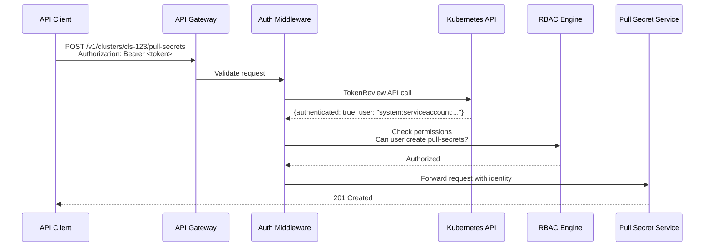
```mermaid
sequenceDiagram
    participant Client as API Client
    participant API as API Gateway
    participant Auth as Auth Middleware
    participant K8s as Kubernetes API
    participant RBAC as RBAC Engine
    participant Service as Pull Secret Service

    Client->>API: POST /v1/clusters/cls-123/pull-secrets<br/>Authorization: Bearer <token>

    API->>Auth: Validate request
    Auth->>K8s: TokenReview API call
    K8s-->>Auth: {authenticated: true, user: "system:serviceaccount:..."}

    Auth->>RBAC: Check permissions<br/>Can user create pull-secrets?
    RBAC-->>Auth: Authorized

    Auth->>Service: Forward request with identity
    Service-->>Client: 201 Created
```

**Required RBAC Permissions**:

```yaml
apiVersion: rbac.authorization.k8s.io/v1
kind: ClusterRole
metadata:
  name: hyperfleet-pull-secret-adapter
rules:
  - apiGroups: ["hyperfleet.io"]
    resources: ["clusters/pull-secrets"]
    verbs: ["get", "create", "delete"]
  - apiGroups: ["hyperfleet.io"]
    resources: ["clusters/pull-secrets/rotations"]
    verbs: ["get", "create", "list"]
```

---

### 3.5 Rate Limiting

**Strategy**: Token bucket algorithm per ServiceAccount

| Limit Type | Quota | Window | Scope |
|------------|-------|--------|-------|
| **Per ServiceAccount** | 100 requests | 1 minute | All endpoints |
| **Burst** | 20 requests | 1 second | All endpoints |
| **Rotation Endpoint** | 10 requests | 1 hour | `/rotations` only |

**Rate Limit Headers** (RFC 6585):
```http
X-RateLimit-Limit: 100
X-RateLimit-Remaining: 75
X-RateLimit-Reset: 1675872000
Retry-After: 60
```

**Response 429 Too Many Requests**:
```http
Content-Type: application/problem+json
X-RateLimit-Limit: 100
X-RateLimit-Remaining: 0
X-RateLimit-Reset: 1708948920
Retry-After: 42
```
```json
{
  "type": "https://api.hyperfleet.io/errors/rate-limit-exceeded",
  "title": "Rate Limit Exceeded",
  "status": 429,
  "detail": "Rate limit exceeded: 100 requests per minute",
  "code": "HYPERFLEET-LMT-001",
  "timestamp": "2026-02-26T10:30:00.123Z",
  "trace_id": "a1b2c3d4-e5f6-7890",
  "instance": "/v1/clusters/cls-abc123def456/pull-secrets",
  "limit": 100,
  "window": "1m",
  "retry_after_seconds": 42
}
```

---

### 3.6 OpenAPI Specification

**OpenAPI Version**: 3.1.0

**Spec Location**: `/v1/openapi.json` or `/v1/openapi.yaml`

**Example Specification**:
```yaml
openapi: 3.1.0
info:
  title: HyperFleet Pull Secret Service API
  version: 1.0.0
  description: RESTful API for managing container registry pull secrets
  contact:
    name: HyperFleet Architecture Team
    email: hyperfleet-dev@redhat.com

servers:
  - url: https://pull-secret-service.hyperfleet-system.svc.cluster.local
    description: In-cluster service endpoint
  - url: https://api.hyperfleet.redhat.com/pull-secrets
    description: External API gateway (if exposed)

paths:
  /v1/clusters/{cluster_id}/pull-secrets:
    post:
      summary: Generate pull secret
      operationId: generatePullSecret
      tags: [Pull Secrets]
      parameters:
        - name: cluster_id
          in: path
          required: true
          schema:
            type: string
            pattern: '^cls-[a-z0-9]{12,16}$'
      requestBody:
        required: true
        content:
          application/json:
            schema:
              $ref: '#/components/schemas/GeneratePullSecretRequest'
      responses:
        '200':
          description: Pull secret generated successfully
          content:
            application/json:
              schema:
                $ref: '#/components/schemas/PullSecretResponse'
        '400':
          $ref: '#/components/responses/BadRequest'
        '409':
          $ref: '#/components/responses/Conflict'

components:
  schemas:
    GeneratePullSecretRequest:
      type: object
      required:
        - cluster_id
        - region
      properties:
        cluster_id:
          type: string
          example: cls-abc123def456
        region:
          type: string
          example: us-east1
        registries:
          type: array
          items:
            type: string
            enum: [quay, rhit]
          default: [quay, rhit]

  securitySchemes:
    BearerAuth:
      type: http
      scheme: bearer
      bearerFormat: JWT
      description: Kubernetes ServiceAccount token

security:
  - BearerAuth: []
```

**Swagger UI**: Available at `/v1/docs` (development environment only)

---

### 3.7 API Usage Examples

#### Example 1: Generate Pull Secret with cURL

```bash
# Export ServiceAccount token
export TOKEN=$(kubectl get secret -n hyperfleet-system gcp-adapter-token -o jsonpath='{.data.token}' | base64 -d)

# Generate pull secret
curl -X POST https://pull-secret-service.hyperfleet-system.svc.cluster.local/v1/clusters/cls-abc123/pull-secrets \
  -H "Authorization: Bearer $TOKEN" \
  -H "Content-Type: application/json" \
  -d '{
    "cluster_id": "cls-abc123def456",
    "cloud_provider": "gcp",
    "region": "us-east1",
    "registries": ["quay", "rhit"]
  }' | jq .
```

#### Example 2: Trigger Rotation with Go Client

```go
package main

import (
    "context"
    "fmt"

    pullsecretv1 "hyperfleet.io/api/pullsecret/v1"
)

func main() {
    client := pullsecretv1.NewClient("https://pull-secret-service.hyperfleet-system.svc.cluster.local")

    // Trigger rotation
    rotation, err := client.Rotations.Create(context.Background(), &pullsecretv1.CreateRotationRequest{
        ClusterID:        "cls-abc123def456",
        Reason:           "scheduled",
        ForceImmediate:   false,
    })

    if err != nil {
        fmt.Printf("Error: %v\n", err)
        return
    }

    fmt.Printf("Rotation created: %s (status: %s)\n", rotation.ID, rotation.Status)
}
```

#### Example 3: Poll Rotation Status with Python

```python
import requests
import time
import os

def wait_for_rotation(cluster_id, rotation_id, token):
    url = f"https://pull-secret-service/v1/clusters/{cluster_id}/pull-secrets/rotations/{rotation_id}"
    headers = {"Authorization": f"Bearer {token}"}

    while True:
        resp = requests.get(url, headers=headers)
        rotation = resp.json()

        if rotation["status"] == "completed":
            print(f"Rotation completed at {rotation['completed_at']}")
            break
        elif rotation["status"] == "failed":
            print(f"Rotation failed: {rotation.get('error')}")
            break
        else:
            print(f"Rotation in progress: {rotation['progress']['phase']}")
            time.sleep(30)  # Poll every 30 seconds

wait_for_rotation("cls-abc123", "rot-xyz789", os.getenv("K8S_TOKEN"))
```

---

## 4. Deployment Architecture

The Pull Secret Service supports **two deployment models**, each optimized for different operational contexts and requirements. This section presents both options with their trade-offs, use cases, and implementation details.

### 4.1 Deployment Model Decision Matrix

Choose the deployment model based on your operational context:

| Criteria | Option A: Per-Instance Deployment | Option B: Global Shared Service |
|----------|-----------------------------------|----------------------------------|
| **Best For** | Multi-region managed service (HyperFleet SaaS) | Single datacenter deployment (OCP self-managed) |
| **Failure Isolation** | ✅ **Excellent**: Regional blast radius | ⚠️ **Limited**: Global blast radius |
| **Operational Complexity** | ⚠️ **Higher**: N instances to manage | ✅ **Lower**: Single deployment |
| **Network Requirements** | ✅ **Simple**: In-cluster only | ⚠️ **Complex**: Cross-cluster networking |
| **Resource Efficiency** | ⚠️ **Lower**: Duplicated infrastructure | ✅ **Higher**: Shared resources |
| **Latency** | ✅ **Low**: Co-located with clusters | ⚠️ **Variable**: Cross-region calls (50-200ms) |
| **Data Residency** | ✅ **Compliant**: Data stays in region | ⚠️ **Complex**: May cross boundaries |
| **Use Cases** | HyperFleet managed service across GCP/AWS/Azure | OCP self-managed in single datacenter/VPC |

**Recommendation**:
- **Choose Option A (Per-Instance)** if you have multiple regions and prioritize failure isolation
- **Choose Option B (Global Shared)** if you have a single datacenter or prioritize operational simplicity

> **🔗 Design Principles Applied:**
> - **Principle 3 (Flexible Deployment)**: Two deployment models for different use cases (per-instance vs global shared)
> - **Principle 2 (Cloud Agnostic)**: Both options work on GCP, AWS, Azure, on-prem

---

### 4.2 Option A: Per-Instance Deployment Model

**Overview**: Deploy one independent Pull Secret Service per HyperFleet instance/region.

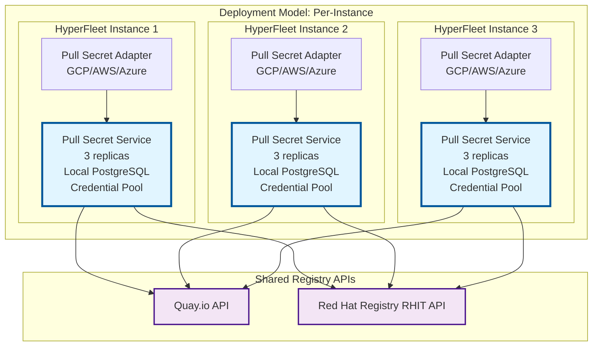
```mermaid
graph TB
    subgraph "Deployment Model: Per-Instance"
        subgraph "HyperFleet Instance 1<br/>us-east-1"
            PSS1[Pull Secret Service<br/>3 replicas<br/>Local PostgreSQL<br/>Credential Pool]
            Adapter1[Pull Secret Adapter<br/>GCP/AWS/Azure]
        end

        subgraph "HyperFleet Instance 2<br/>eu-west-1"
            PSS2[Pull Secret Service<br/>3 replicas<br/>Local PostgreSQL<br/>Credential Pool]
            Adapter2[Pull Secret Adapter<br/>GCP/AWS/Azure]
        end

        subgraph "HyperFleet Instance 3<br/>ap-south-1"
            PSS3[Pull Secret Service<br/>3 replicas<br/>Local PostgreSQL<br/>Credential Pool]
            Adapter3[Pull Secret Adapter<br/>GCP/AWS/Azure]
        end
    end

    subgraph "Shared Registry APIs"
        Quay[Quay.io API]
        RHIT[Red Hat Registry RHIT API]
    end

    Adapter1 --> PSS1
    Adapter2 --> PSS2
    Adapter3 --> PSS3

    PSS1 --> Quay
    PSS1 --> RHIT
    PSS2 --> Quay
    PSS2 --> RHIT
    PSS3 --> Quay
    PSS3 --> RHIT

    style PSS1 fill:#e1f5ff,stroke:#01579b,stroke-width:3px
    style PSS2 fill:#e1f5ff,stroke:#01579b,stroke-width:3px
    style PSS3 fill:#e1f5ff,stroke:#01579b,stroke-width:3px
    style Quay fill:#f3e5f5,stroke:#4a148c,stroke-width:2px
    style RHIT fill:#f3e5f5,stroke:#4a148c,stroke-width:2px
```

**Characteristics**:
- **Deployment**: One Pull Secret Service per HyperFleet instance
- **Database**: Each service has its own PostgreSQL database (not shared)
- **Credential Pool**: Each service maintains its own pool
- **Networking**: Pull Secret Adapter calls service via in-cluster DNS (`pull-secret-service.hyperfleet-system.svc.cluster.local`)
- **Credentials**: Quay/RHIT API credentials shared across all instances (stored in Kubernetes Secrets)
- **RHIT mTLS Certificates** (Principle 6): All instances use same HyperFleet-dedicated mTLS certificate (`CN=hyperfleet`), separate from AMS (`CN=ocm-service`)

**Pros**:
- ✅ **Failure Isolation**: Outage in one region doesn't affect others
- ✅ **Simple Networking**: No cross-region/cross-cluster network dependencies
- ✅ **Reduced Latency**: Service co-located with adapters (no cross-region calls)
- ✅ **Independent Scaling**: Each region scales independently based on local load
- ✅ **Easier Rollout**: Deploy/upgrade per region with canary testing
- ✅ **Data Residency**: Credentials stored in same region as clusters (compliance)
- ✅ **Standard Kubernetes Pattern**: Deployments, Services, ConfigMaps - standard DevOps playbook

**Cons**:
- ❌ **Duplicated Infrastructure**: N databases, N deployments (higher resource usage)
- ❌ **Credential Sprawl**: Harder to track which robot accounts belong to which instance
- ❌ **Pool Inefficiency**: Total pool size = N × high_water_mark (over-provisioning)
- ❌ **Operational Overhead**: Must manage N instances (upgrades, monitoring, backups)

**Resource Requirements (Example: 3 HyperFleet instances)**:
- **Compute**: 3 independent service deployments × 3 replicas each
- **Storage**: 3 separate PostgreSQL databases (100 GB each)
- **Network**: In-cluster communication only (minimal cross-region traffic)
- **Operations**: 3× deployment pipelines, 3× monitoring dashboards, 3× backup jobs

**Use Cases**:
- ✅ **HyperFleet SaaS**: Multi-region managed service across GCP/AWS/Azure
- ✅ **Regulatory Compliance**: Data residency requirements (EU clusters → EU database)
- ✅ **High Availability**: Failure in one region cannot affect others
- ✅ **Multi-Cloud**: Each cloud provider has independent instance

**Failure Isolation Example**:

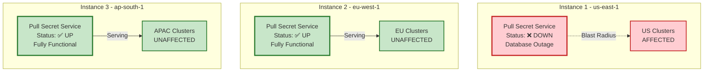
```mermaid
graph TB
    subgraph "Instance 1 - us-east-1"
        PSS1[Pull Secret Service<br/>Status: ❌ DOWN<br/>Database Outage]
        Clusters1[US Clusters<br/>AFFECTED]
        PSS1 -.->|Blast Radius| Clusters1
    end

    subgraph "Instance 2 - eu-west-1"
        PSS2[Pull Secret Service<br/>Status: ✅ UP<br/>Fully Functional]
        Clusters2[EU Clusters<br/>UNAFFECTED]
        PSS2 -->|Serving| Clusters2
    end

    subgraph "Instance 3 - ap-south-1"
        PSS3[Pull Secret Service<br/>Status: ✅ UP<br/>Fully Functional]
        Clusters3[APAC Clusters<br/>UNAFFECTED]
        PSS3 -->|Serving| Clusters3
    end

    style PSS1 fill:#ffcdd2,stroke:#c62828,stroke-width:3px
    style PSS2 fill:#c8e6c9,stroke:#2e7d32,stroke-width:3px
    style PSS3 fill:#c8e6c9,stroke:#2e7d32,stroke-width:3px
    style Clusters1 fill:#ffcdd2,stroke:#c62828,stroke-width:2px
    style Clusters2 fill:#c8e6c9,stroke:#2e7d32,stroke-width:2px
    style Clusters3 fill:#c8e6c9,stroke:#2e7d32,stroke-width:2px
```

---

### 4.3 Option B: Global Shared Service

**Overview**: Deploy a single multi-region Pull Secret Service shared across all HyperFleet instances.

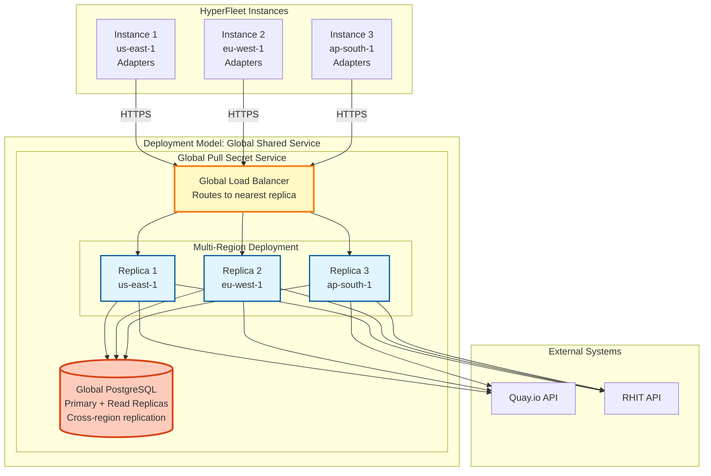
```mermaid
graph TB
    subgraph "Deployment Model: Global Shared Service"
        subgraph "Global Pull Secret Service"
            direction TB
            LB[Global Load Balancer<br/>Routes to nearest replica]

            subgraph "Multi-Region Deployment"
                PSS1[Replica 1<br/>us-east-1]
                PSS2[Replica 2<br/>eu-west-1]
                PSS3[Replica 3<br/>ap-south-1]
            end

            DB[(Global PostgreSQL<br/>Primary + Read Replicas<br/>Cross-region replication)]
        end
    end

    subgraph "HyperFleet Instances"
        Inst1[Instance 1<br/>us-east-1<br/>Adapters]
        Inst2[Instance 2<br/>eu-west-1<br/>Adapters]
        Inst3[Instance 3<br/>ap-south-1<br/>Adapters]
    end

    subgraph "External Systems"
        Quay[Quay.io API]
        RHIT[RHIT API]
    end

    Inst1 -->|HTTPS| LB
    Inst2 -->|HTTPS| LB
    Inst3 -->|HTTPS| LB

    LB --> PSS1
    LB --> PSS2
    LB --> PSS3

    PSS1 --> DB
    PSS2 --> DB
    PSS3 --> DB

    PSS1 --> Quay
    PSS1 --> RHIT
    PSS2 --> Quay
    PSS2 --> RHIT
    PSS3 --> Quay
    PSS3 --> RHIT

    style LB fill:#fff9c4,stroke:#f57f17,stroke-width:3px
    style DB fill:#ffccbc,stroke:#d84315,stroke-width:3px
    style PSS1 fill:#e1f5ff,stroke:#01579b,stroke-width:2px
    style PSS2 fill:#e1f5ff,stroke:#01579b,stroke-width:2px
    style PSS3 fill:#e1f5ff,stroke:#01579b,stroke-width:2px
```

**Characteristics**:
- **Deployment**: Single Pull Secret Service (multi-region replicated)
- **Database**: Global PostgreSQL with read replicas in each region
- **Credential Pool**: Single global pool shared across all instances
- **Networking**: Adapters call service via global load balancer or service mesh
- **Credentials**: Quay/RHIT API credentials shared (same as Option A)

**Pros**:
- ✅ **Cost Efficiency**: Single database, smaller total pool size
- ✅ **Centralized Management**: One deployment to manage, upgrade, monitor
- ✅ **Pool Efficiency**: Shared pool absorbs variance across regions (smaller total pool)
- ✅ **Consistent Credential Tracking**: Single source of truth for all credentials
- ✅ **Simplified Operations**: One backup strategy, one monitoring dashboard

**Cons**:
- ❌ **Blast Radius**: Outage affects all HyperFleet instances globally
- ❌ **Complex Networking**: Requires cross-cluster networking (service mesh, VPN, or public endpoint)
- ❌ **Increased Latency**: Cross-region API calls add 50-200ms latency
- ❌ **Single Point of Failure**: Database outage blocks all cluster creations
- ❌ **Operational Complexity**: Global database replication, load balancing, failover
- ❌ **Data Residency Concerns**: Credentials may cross regional boundaries (GDPR/compliance)
- ❌ **Difficult Rollout**: Canary deployments affect all regions simultaneously

**Resource Requirements**:
- **Compute**: Single service deployment with higher replica count (5 replicas) for global coverage
- **Storage**: 1 global PostgreSQL database with multi-region replication
- **Network**: Global load balancer + cross-region traffic (higher network overhead)
- **Operations**: Single deployment pipeline, unified monitoring, single backup strategy
- **Trade-off**: Lower total infrastructure vs. increased network complexity

**Use Cases**:
- ✅ **OCP Self-Managed**: Single datacenter or VPC deployment
- ✅ **Private Cloud**: On-premises OpenShift with centralized management
- ✅ **Resource Efficiency**: When minimizing infrastructure footprint is a priority
- ✅ **Low Latency Tolerance**: Acceptable cross-region latency (50-200ms)
- ✅ **Centralized Governance**: Single audit trail, single compliance boundary

**Network Architecture**:

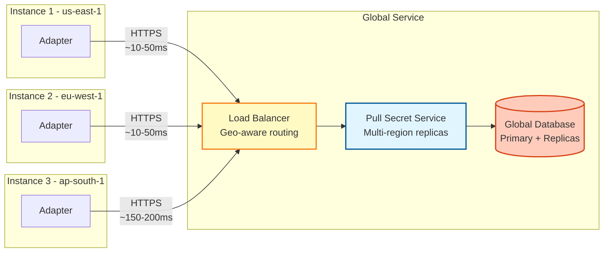
```mermaid
graph LR
    subgraph "Instance 1 - us-east-1"
        Adapter1[Adapter]
    end

    subgraph "Instance 2 - eu-west-1"
        Adapter2[Adapter]
    end

    subgraph "Instance 3 - ap-south-1"
        Adapter3[Adapter]
    end

    subgraph "Global Service"
        LB[Load Balancer<br/>Geo-aware routing]
        PSS[Pull Secret Service<br/>Multi-region replicas]
        DB[(Global Database<br/>Primary + Replicas)]
    end

    Adapter1 -->|HTTPS<br/>~10-50ms| LB
    Adapter2 -->|HTTPS<br/>~10-50ms| LB
    Adapter3 -->|HTTPS<br/>~150-200ms| LB

    LB --> PSS
    PSS --> DB

    style LB fill:#fff9c4,stroke:#f57f17,stroke-width:2px
    style PSS fill:#e1f5ff,stroke:#01579b,stroke-width:2px
    style DB fill:#ffccbc,stroke:#d84315,stroke-width:2px
```

---

### 4.4 Kubernetes Deployment Topology (Both Options)

The following Kubernetes deployment topology applies to both options:
- **Option A**: Deployed once per HyperFleet instance
- **Option B**: Deployed once globally with multi-region replicas


```mermaid
graph TB
    subgraph "Global View"
        subgraph "HyperFleet Instance 1<br/>us-east-1"
            PSS1[Pull Secret Service<br/>3 replicas<br/>Local PostgreSQL<br/>Credential Pool]
            Adapter1[Pull Secret Adapter<br/>GCP/AWS/Azure]
        end

        subgraph "HyperFleet Instance 2<br/>eu-west-1"
            PSS2[Pull Secret Service<br/>3 replicas<br/>Local PostgreSQL<br/>Credential Pool]
            Adapter2[Pull Secret Adapter<br/>GCP/AWS/Azure]
        end

        subgraph "HyperFleet Instance 3<br/>ap-south-1"
            PSS3[Pull Secret Service<br/>3 replicas<br/>Local PostgreSQL<br/>Credential Pool]
            Adapter3[Pull Secret Adapter<br/>GCP/AWS/Azure]
        end
    end

    subgraph "Shared Registry APIs"
        Quay[Quay.io API]
        RHIT[Red Hat Registry RHIT API]
    end

    Adapter1 --> PSS1
    Adapter2 --> PSS2
    Adapter3 --> PSS3

    PSS1 --> Quay
    PSS1 --> RHIT
    PSS2 --> Quay
    PSS2 --> RHIT
    PSS3 --> Quay
    PSS3 --> RHIT

    style PSS1 fill:#e1f5ff,stroke:#01579b,stroke-width:3px
    style PSS2 fill:#e1f5ff,stroke:#01579b,stroke-width:3px
    style PSS3 fill:#e1f5ff,stroke:#01579b,stroke-width:3px
    style Quay fill:#f3e5f5,stroke:#4a148c,stroke-width:2px
    style RHIT fill:#f3e5f5,stroke:#4a148c,stroke-width:2px
```


```mermaid
graph TB
    subgraph "Kubernetes Cluster - hyperfleet-system namespace"
        subgraph "Deployment: pull-secret-service<br/>Replicas: 3"
            Pod1[Pod 1<br/>API :8080<br/>Metrics :9090]
            Pod2[Pod 2<br/>API :8080<br/>Metrics :9090]
            Pod3[Pod 3<br/>API :8080<br/>Metrics :9090]
        end

        Service[Service: pull-secret-service<br/>Type: ClusterIP<br/>Ports: 80 API, 9090 Metrics]

        CronRC[CronJob: rotation-reconciler<br/>Schedule: */5 * * * *]
        CronCL[CronJob: credential-cleanup<br/>Schedule: 0 2 * * *]

        SecretQuay[Secret: quay-credentials<br/>token: quay_api_token]
        SecretRHIT[Secret: rhit-credentials<br/>cert, key, ca]
        SecretDB[Secret: pull-secret-service-db<br/>url, encryption_key]

        Service --> Pod1
        Service --> Pod2
        Service --> Pod3

        Pod1 -.-> SecretQuay
        Pod1 -.-> SecretRHIT
        Pod1 -.-> SecretDB

        Pod2 -.-> SecretQuay
        Pod2 -.-> SecretRHIT
        Pod2 -.-> SecretDB

        Pod3 -.-> SecretQuay
        Pod3 -.-> SecretRHIT
        Pod3 -.-> SecretDB

        CronRC -.-> SecretQuay
        CronRC -.-> SecretRHIT
        CronRC -.-> SecretDB
    end

    DB[(External Managed Database<br/>PostgreSQL 15<br/>100GB, 2 vCPU, 8GB RAM<br/>Daily backups)]

    Pod1 --> DB
    Pod2 --> DB
    Pod3 --> DB
    CronRC --> DB
    CronCL --> DB

    style Service fill:#bbdefb,stroke:#1976d2,stroke-width:2px
    style DB fill:#ffccbc,stroke:#d84315,stroke-width:3px
    style CronRC fill:#e1bee7,stroke:#6a1b9a,stroke-width:2px
    style CronCL fill:#b2dfdb,stroke:#00695c,stroke-width:2px
```

### 4.5 Network Communication Patterns

#### Option A: In-Cluster Communication (Per-Instance)

```mermaid
flowchart LR
    Adapter[Pull Secret Adapter<br/>Deployment]

    subgraph "Kubernetes Service Layer"
        Service[K8s Service<br/>ClusterIP<br/>pull-secret-service:80]
    end

    subgraph "Pull Secret Service Pods"
        Pod1[Pod 1]
        Pod2[Pod 2]
        Pod3[Pod 3]
    end

    DB[(Regional Managed DB<br/>PostgreSQL<br/>TLS encrypted)]

    subgraph "External Registry APIs"
        Quay[Quay.io API<br/>HTTPS<br/>Bearer Token Auth]
        RHIT[RHIT API<br/>HTTPS<br/>mTLS + JWT Auth]
    end

    Adapter -->|In-Cluster DNS<br/>pull-secret-service.hyperfleet-system.svc:80| Service
    Service -->|Load Balance| Pod1
    Service -->|Load Balance| Pod2
    Service -->|Load Balance| Pod3

    Pod1 -->|PostgreSQL<br/>TLS| DB
    Pod2 -->|PostgreSQL<br/>TLS| DB
    Pod3 -->|PostgreSQL<br/>TLS| DB

    Pod1 --> Quay
    Pod1 --> RHIT
    Pod2 --> Quay
    Pod2 --> RHIT
    Pod3 --> Quay
    Pod3 --> RHIT

    style Adapter fill:#fff3e0,stroke:#e65100,stroke-width:2px
    style Service fill:#bbdefb,stroke:#1976d2,stroke-width:2px
    style DB fill:#ffccbc,stroke:#d84315,stroke-width:2px
    style Quay fill:#f3e5f5,stroke:#4a148c,stroke-width:2px
    style RHIT fill:#f3e5f5,stroke:#4a148c,stroke-width:2px
```

**Network Characteristics**:
- ✅ All communication within single Kubernetes cluster
- ✅ No cross-region network dependencies
- ✅ Simple DNS-based service discovery
- ✅ Low latency (<10ms adapter → service)

#### Option B: Cross-Region Communication (Global Shared)

```mermaid
flowchart TB
    subgraph "Region 1"
        Adapter1[Adapter 1]
    end

    subgraph "Region 2"
        Adapter2[Adapter 2]
    end

    subgraph "Global Service"
        LB[Global Load Balancer]
        Service[K8s Service]
        Pod1[Pod 1]
        Pod2[Pod 2]
        DB[(Global DB)]
    end

    Adapter1 -->|HTTPS<br/>10-50ms| LB
    Adapter2 -->|HTTPS<br/>150-200ms| LB
    LB --> Service
    Service --> Pod1
    Service --> Pod2
    Pod1 --> DB
    Pod2 --> DB

    style LB fill:#fff9c4,stroke:#f57f17,stroke-width:2px
    style Service fill:#bbdefb,stroke:#1976d2,stroke-width:2px
    style DB fill:#ffccbc,stroke:#d84315,stroke-width:2px
```

**Network Characteristics**:
- ⚠️ Requires VPN, service mesh, or public endpoint
- ⚠️ Cross-region latency (50-200ms)
- ⚠️ Complex load balancing and failover
- ✅ Centralized traffic management

---

### 4.6 Deployment Comparison Summary

**Quick Decision Table**:

| Aspect | Option A: Per-Instance | Option B: Global Shared | Winner |
|--------|------------------------|-------------------------|--------|
| **Resource Efficiency** | Higher usage (N × infrastructure) | Lower usage (shared infrastructure) | 🏆 **Option B** |
| **Failure Isolation** | Regional blast radius only | Global blast radius | 🏆 **Option A** |
| **Latency** | <10ms (in-cluster) | 50-200ms (cross-region) | 🏆 **Option A** |
| **Operational Complexity** | Manage N instances | Single instance | 🏆 **Option B** |
| **Network Setup** | In-cluster DNS only | VPN/service mesh/LB | 🏆 **Option A** |
| **Data Residency** | Region-specific | Potentially cross-border | 🏆 **Option A** |
| **Rollout Risk** | Canary per region | All regions at once | 🏆 **Option A** |
| **Credential Tracking** | Distributed across instances | Centralized | 🏆 **Option B** |
| **Pool Efficiency** | Over-provisioned (N × high_water) | Shared pool (optimized) | 🏆 **Option B** |
| **Scalability** | Independent per region | Shared scaling | 🏆 **Option A** |

**Recommendations by Use Case**:

```mermaid
graph LR
    UseCase{Your Use Case}

    UseCase -->|Multi-region<br/>managed service| OptA[✅ Choose<br/>Option A]
    UseCase -->|Single datacenter<br/>self-managed| OptB[✅ Choose<br/>Option B]
    UseCase -->|Compliance<br/>data residency| OptA
    UseCase -->|Resource efficiency<br/>primary concern| OptB
    UseCase -->|High availability<br/>regional isolation| OptA
    UseCase -->|Centralized<br/>governance| OptB

    OptA --> Example1[Example:<br/>HyperFleet SaaS<br/>GCP/AWS/Azure]
    OptB --> Example2[Example:<br/>OCP Self-Managed<br/>Single datacenter]

    style OptA fill:#c8e6c9,stroke:#2e7d32,stroke-width:3px
    style OptB fill:#bbdefb,stroke:#1976d2,stroke-width:3px
```

**Real-World Examples**:

| Organization Type | Scenario | Recommended Option | Reason |
|------------------|----------|-------------------|--------|
| **Red Hat Managed** | HyperFleet SaaS across GCP, AWS, Azure regions | **Option A** | Multi-region, failure isolation critical |
| **Enterprise Self-Managed** | OCP cluster deployed at the on-premises datacenter | **Option B** | Simplified operations, no multi-region |

**Implementation Note**: The architecture supports **both** options. Choose based on your operational context, not technical limitations.

---

## 5. Database Schema

> **🔗 Design Principles Applied:**
> - **Principle 1 (Lift and Shift)**: Database schema reused from AMS (`registry_credentials`, `pull_secret_rotations`)
> - **Principle 5 (Extensible Registries)**: `registry_id` column stores arbitrary registry identifiers (VARCHAR, not ENUM) - supports "quay", "rhit", "harbor-customer-a", "acr-prod", etc.

### 5.1 Entity Relationship Diagram

```mermaid
erDiagram
    REGISTRY_CREDENTIALS ||--o{ PULL_SECRET_ROTATIONS : "belongs to"
    REGISTRY_CREDENTIALS ||--o{ CREDENTIAL_AUDIT_LOG : "tracks"

    REGISTRY_CREDENTIALS {
        uuid id PK
        varchar username "Quay robot or RHIT partner SA"
        text token "Encrypted with pgcrypto"
        uuid cluster_id "Nullable for pool credentials"
        varchar registry_id "FK to Registry definition"
        varchar external_resource_id "Cluster external ID"
        timestamptz created_at
        timestamptz updated_at
    }

    PULL_SECRET_ROTATIONS {
        uuid id PK
        uuid cluster_id
        varchar status "pending, in_progress, completed, failed"
        varchar reason "scheduled, compromise, manual"
        boolean force_immediate
        timestamptz created_at
        timestamptz completed_at
    }

    CREDENTIAL_AUDIT_LOG {
        uuid id PK
        uuid cluster_id
        uuid credential_id FK
        varchar action "create, delete, rotate, ban"
        varchar actor "ServiceAccount or user"
        text reason
        varchar trace_id "Distributed tracing"
        timestamptz created_at
    }
```

### 5.2 Indexes Strategy

```mermaid
graph LR
    subgraph "Primary Indexes"
        I1[idx_registry_credentials_cluster<br/>ON cluster_id]
        I2[idx_registry_credentials_registry<br/>ON registry_id]
        I3[idx_registry_credentials_external<br/>ON cluster_id, external_resource_id]
    end

    subgraph "Partial Indexes"
        I4[idx_registry_credentials_pool<br/>ON cluster_id<br/>WHERE cluster_id IS NULL]
        I5[idx_pull_secret_rotations_status<br/>ON status<br/>WHERE status IN pending, in_progress]
    end

    subgraph "Composite Indexes"
        I6[idx_registry_credentials_cluster_registry<br/>ON cluster_id, registry_id, created_at DESC]
    end

    Query1[Find credentials<br/>for cluster] --> I1
    Query2[Find pool<br/>credentials] --> I4
    Query3[Find pending<br/>rotations] --> I5
    Query4[Find latest credential<br/>for cluster + registry] --> I6

    style I1 fill:#bbdefb,stroke:#1976d2,stroke-width:2px
    style I4 fill:#c8e6c9,stroke:#388e3c,stroke-width:2px
    style I5 fill:#fff9c4,stroke:#f57f17,stroke-width:2px
    style I6 fill:#e1bee7,stroke:#6a1b9a,stroke-width:2px
```

---

## 6. Security Architecture

> **🔗 Design Principles Applied:**
> - **Principle 4 (Security First)**: Multi-layer security (authentication, encryption, audit)
> - **Principle 4 (Security First)**: Application-level AES-256-GCM encryption (keeps keys out of SQL queries)
> - **Principle 6 (Dedicated Partner)**: Independent mTLS certificates for RHIT API (`CN=hyperfleet`), rotated independently from AMS

### 6.1 Authentication Flow

```mermaid
sequenceDiagram
    participant Adapter as Pull Secret<br/>Adapter
    participant Middleware as Auth<br/>Middleware
    participant K8s as Kubernetes<br/>API Server
    participant RBAC as RBAC<br/>Check
    participant Service as Pull Secret<br/>Service

    Adapter->>Middleware: Request with ServiceAccount token<br/>Authorization: Bearer <k8s_sa_token>

    activate Middleware
    Middleware->>K8s: TokenReview API call<br/>Validate token
    activate K8s
    K8s-->>Middleware: {authenticated: true,<br/>username: "system:serviceaccount:hyperfleet-system:gcp-adapter"}
    deactivate K8s

    Middleware->>RBAC: Check RBAC permissions<br/>Can SA access clusters/pull-secrets?
    activate RBAC
    RBAC-->>Middleware: Permission granted
    deactivate RBAC

    Middleware->>Service: Forward request with identity
    deactivate Middleware

    activate Service
    Service-->>Adapter: Process request
    deactivate Service
```

### 6.2 RBAC Configuration

```mermaid
graph TB
    subgraph "RBAC Configuration"
        CR[ClusterRole:<br/>hyperfleet-pull-secret-adapter<br/>- clusters/pull-secrets: get, create, delete<br/>- clusters/pull-secrets/rotations: get, create, list]

        SA1[ServiceAccount:<br/>gcp-adapter<br/>namespace: hyperfleet-system]
        SA2[ServiceAccount:<br/>aws-adapter<br/>namespace: hyperfleet-system]
        SA3[ServiceAccount:<br/>azure-adapter<br/>namespace: hyperfleet-system]

        CRB1[ClusterRoleBinding:<br/>gcp-adapter-pull-secret-access]
        CRB2[ClusterRoleBinding:<br/>aws-adapter-pull-secret-access]
        CRB3[ClusterRoleBinding:<br/>azure-adapter-pull-secret-access]
    end

    SA1 --> CRB1
    SA2 --> CRB2
    SA3 --> CRB3

    CRB1 --> CR
    CRB2 --> CR
    CRB3 --> CR

    CR --> API[Pull Secret Service API<br/>clusters/pull-secrets]

    style CR fill:#bbdefb,stroke:#1976d2,stroke-width:2px
    style SA1 fill:#c8e6c9,stroke:#388e3c,stroke-width:2px
    style SA2 fill:#c8e6c9,stroke:#388e3c,stroke-width:2px
    style SA3 fill:#c8e6c9,stroke:#388e3c,stroke-width:2px
    style API fill:#e1bee7,stroke:#6a1b9a,stroke-width:2px
```

### 6.3 Data Encryption Architecture

```mermaid
graph TB
    subgraph "Encryption At Rest - Application Level"
        Token[Token Plaintext<br/>In-memory only]
        Encrypt[crypto/aes Package<br/>Algorithm: AES-256-GCM<br/>12-byte nonce + ciphertext + auth tag]
        Key[Encryption Key<br/>32-byte key from K8s Secret<br/>Rotated every 90 days]
        KMS[Cloud KMS<br/>GCP KMS / AWS KMS<br/>Key Management]

        Token --> Encrypt
        Encrypt --> Key
        Key --> KMS
    end

    subgraph "Encryption In Transit - TLS"
        TLS1[Service ↔ Database<br/>TLS 1.3 + Cert Validation]
        TLS2[Service ↔ Quay API<br/>HTTPS TLS 1.3]
        TLS3[Service ↔ RHIT API<br/>mTLS Mutual TLS]
        TLS4[Adapter ↔ Service<br/>HTTPS in-cluster optional]
    end

    Insert[INSERT Credential] --> AppEncrypt[Application Encrypts<br/>AES-256-GCM in Go<br/>Key never in SQL]
    AppEncrypt --> DB[(PostgreSQL<br/>Stores encrypted blob)]

    Query[SELECT Credential] --> DBFetch[Fetch Encrypted Blob<br/>From database]
    DBFetch --> AppDecrypt[Application Decrypts<br/>AES-256-GCM in Go<br/>Key never in SQL]

    style Encrypt fill:#ffccbc,stroke:#d84315,stroke-width:2px
    style KMS fill:#c8e6c9,stroke:#388e3c,stroke-width:2px
    style TLS1 fill:#bbdefb,stroke:#1976d2,stroke-width:2px
    style TLS3 fill:#e1bee7,stroke:#6a1b9a,stroke-width:2px
    style AppEncrypt fill:#ffccbc,stroke:#d84315,stroke-width:2px
    style AppDecrypt fill:#ffccbc,stroke:#d84315,stroke-width:2px
```

### 6.4 Secrets Management

```mermaid
graph LR
    subgraph "External Secrets"
        GCP[GCP Secret Manager]
        AWS[AWS Secrets Manager]
        Azure[Azure Key Vault]
    end

    ESO[External Secrets Operator]

    subgraph "Kubernetes Secrets"
        S1[quay-credentials<br/>token: quay_api_token]
        S2[rhit-credentials<br/>cert, key, ca]
        S3[pull-secret-service-db<br/>url, encryption_key]
    end

    subgraph "Pull Secret Service Pods"
        Pod1[Pod 1]
        Pod2[Pod 2]
        Pod3[Pod 3]
    end

    GCP --> ESO
    AWS --> ESO
    Azure --> ESO

    ESO --> S1
    ESO --> S2
    ESO --> S3

    S1 -.->|Mounted as Volume| Pod1
    S2 -.->|Mounted as Volume| Pod1
    S3 -.->|Mounted as Volume| Pod1

    S1 -.->|Mounted as Volume| Pod2
    S2 -.->|Mounted as Volume| Pod2
    S3 -.->|Mounted as Volume| Pod2

    S1 -.->|Mounted as Volume| Pod3
    S2 -.->|Mounted as Volume| Pod3
    S3 -.->|Mounted as Volume| Pod3

    style ESO fill:#fff9c4,stroke:#f57f17,stroke-width:2px
    style S1 fill:#bbdefb,stroke:#1976d2,stroke-width:2px
    style S2 fill:#c8e6c9,stroke:#388e3c,stroke-width:2px
    style S3 fill:#e1bee7,stroke:#6a1b9a,stroke-width:2px
```

### 6.5 Encryption Key Rotation Strategy

**Rotation Schedule**: 90-day automatic rotation via External Secrets Operator

**Re-encryption Process**:

When a new encryption key is rotated into the Kubernetes Secret, existing credentials encrypted with the old key must be re-encrypted to prevent requiring dual-key support indefinitely.

```mermaid
sequenceDiagram
    participant ESO as External Secrets<br/>Operator
    participant K8s as Kubernetes<br/>Secret
    participant Job as Key Rotation<br/>Job
    participant DB as PostgreSQL

    Note over ESO,K8s: Day 0: Old key (key_v1) in use

    ESO->>K8s: Update Secret with new key (key_v2)<br/>old_key: key_v1<br/>current_key: key_v2
    Note over K8s: Both keys present during rotation

    K8s->>Job: CronJob triggered on Secret update
    activate Job

    Job->>DB: SELECT id, token FROM credentials<br/>LIMIT 1000
    DB-->>Job: Encrypted tokens (key_v1)

    loop For each credential
        Job->>Job: Decrypt with old_key (key_v1)
        Job->>Job: Encrypt with current_key (key_v2)
        Job->>DB: UPDATE credentials SET token = $1<br/>WHERE id = $2
    end

    Job->>Job: Track progress: 45000/50000 credentials<br/>Store cursor for resume on failure

    Job-->>K8s: Report completion metrics
    deactivate Job

    Note over ESO,K8s: Day 7: Remove old_key from Secret<br/>Only current_key remains
```

**Implementation Details**:

```go
// KeyRotationJob runs daily after ESO updates the Secret
func (j *KeyRotationJob) Run(ctx context.Context) error {
    oldKey := j.loadKey("old_key")        // key_v1 from K8s Secret
    newKey := j.loadKey("current_key")    // key_v2 from K8s Secret

    if oldKey == nil {
        // No rotation in progress
        return nil
    }

    // Process in batches of 1000 (avoid locking entire table)
    for {
        creds, err := j.dao.FetchCredentialsForRotation(1000)
        if err != nil || len(creds) == 0 {
            break
        }

        for _, cred := range creds {
            // Decrypt with old key
            plaintext, err := j.decryptWithKey(cred.EncryptedToken, oldKey)
            if err != nil {
                // Already encrypted with new key, skip
                continue
            }

            // Re-encrypt with new key
            newCiphertext, err := j.encryptWithKey(plaintext, newKey)
            if err != nil {
                return err
            }

            // Update database
            err = j.dao.UpdateCredentialToken(cred.ID, newCiphertext)
            if err != nil {
                return err
            }
        }

        // Store progress for resume on failure
        j.dao.SaveRotationProgress(ctx, len(creds))
    }

    return nil
}
```

**Key Security Properties**:

1. **No downtime**: Service continues operating during rotation with dual-key support
2. **No key in logs**: Encryption/decryption happens in application, not SQL queries
3. **Gradual migration**: Batched re-encryption (1000 rows at a time) prevents database locks
4. **Resume on failure**: Cursor-based progress tracking allows job to resume
5. **Key cleanup**: Old key removed from Secret after 7-day grace period (ensures all rows re-encrypted)

**Metrics**:

- `encryption_key_rotation_progress{key_version="v2"}` - Number of credentials re-encrypted
- `encryption_key_rotation_failures{key_version="v2"}` - Re-encryption failures (alerts if > 0)
- `encryption_key_age_days` - Days since current key was rotated (alerts if > 95 days)

---

## 7. Scalability

### 7.1 Horizontal Scaling

```mermaid
graph TB
    subgraph "Horizontal Pod Autoscaler HPA"
        HPA[HPA Configuration<br/>minReplicas: 3<br/>maxReplicas: 10<br/>Target CPU: 70%<br/>Target Memory: 80%]
    end

    subgraph "Deployment State"
        Current[Current State<br/>3 pods<br/>CPU: 45%<br/>Memory: 60%]

        ScaleUp[Scale Up Trigger<br/>CPU > 70%<br/>Add 1 pod]

        ScaleDown[Scale Down Trigger<br/>CPU < 50% for 5 min<br/>Remove 1 pod]

        Max[Max State<br/>10 pods<br/>Cluster creates spike]
    end

    Metrics[Metrics Server<br/>CPU/Memory usage] --> HPA
    HPA --> Current
    HPA --> ScaleUp
    HPA --> ScaleDown

    Current -->|High Load| ScaleUp
    ScaleUp --> Max
    Max -->|Load decreases| ScaleDown
    ScaleDown --> Current

    style HPA fill:#bbdefb,stroke:#1976d2,stroke-width:2px
    style Max fill:#ffccbc,stroke:#d84315,stroke-width:2px
    style Current fill:#c8e6c9,stroke:#388e3c,stroke-width:2px
```

### 7.2 Connection Pooling Architecture

```mermaid
graph TB
    subgraph "Pull Secret Service Pods"
        Pod1[Pod 1<br/>Max 10 DB connections<br/>Idle 5 connections<br/>Lifetime 1 hour]
        Pod2[Pod 2<br/>Max 10 DB connections<br/>Idle 5 connections<br/>Lifetime 1 hour]
        Pod3[Pod 3<br/>Max 10 DB connections<br/>Idle 5 connections<br/>Lifetime 1 hour]
        PodN[... up to Pod 10]
    end

    PgBouncer[PgBouncer<br/>Optional<br/>Connection Multiplexing<br/>Pool: 100 → 20 connections]

    DB[(PostgreSQL Database<br/>Max Connections: 200<br/>Reserved Admin: 10<br/>Available: 190)]

    Pod1 -->|10 conns| PgBouncer
    Pod2 -->|10 conns| PgBouncer
    Pod3 -->|10 conns| PgBouncer
    PodN -->|10 conns| PgBouncer

    PgBouncer -->|20 pooled conns| DB

    Note1[Total: 10 pods × 10 conns = 100 connections<br/>PgBouncer reduces to 20 actual DB connections]

    style PgBouncer fill:#fff9c4,stroke:#f57f17,stroke-width:2px
    style DB fill:#ffccbc,stroke:#d84315,stroke-width:3px
```

---

## 8. Observability

The Pull Secret Service follows **HyperFleet observability standards** for health checks, metrics, logging, and alerting. This ensures consistent operational excellence across all HyperFleet components.

### 8.1 HyperFleet Health Check Standards

Following HyperFleet standards, the Pull Secret Service exposes two standard health check endpoints for Kubernetes probes.

#### 8.1.1 `/healthz` - Liveness Probe

**Endpoint**: `GET /healthz`

**Purpose**: Determines if the service process is **alive** and should be restarted if failing.

**Response 200 OK**:
```json
{
  "status": "ok"
}
```

**Response 503 Service Unavailable** (triggers pod restart):
```json
{
  "status": "error",
  "message": "Service is not healthy"
}
```

**What `/healthz` Checks** (Liveness):

| Check | Purpose | Restart if Failed? |
|-------|---------|-------------------|
| **Process alive** | Go process is running and responsive | ✅ Yes |
| **HTTP server responsive** | Server can accept requests | ✅ Yes |
| **No deadlocks** | Request handler is not blocked | ✅ Yes |

**What `/healthz` Does NOT Check**:
- ❌ Database connectivity
- ❌ External API availability (Quay, RHIT)
- ❌ Disk space or memory limits

**Rationale**: Liveness probes detect **unrecoverable** errors (deadlocks, panics). Checking external dependencies would cause unnecessary restarts during transient failures.

**Kubernetes Configuration**:
```yaml
livenessProbe:
  httpGet:
    path: /healthz
    port: 8080
  initialDelaySeconds: 10
  periodSeconds: 10
  timeoutSeconds: 5
  failureThreshold: 3  # Restart after 3 consecutive failures (30s)
```

---

#### 8.1.2 `/readyz` - Readiness Probe

**Endpoint**: `GET /readyz`

**Purpose**: Determines if the service is **ready** to accept traffic. Failed readiness removes the pod from load balancer rotation **without** restarting it.

**Response 200 OK** (ready to receive traffic):
```json
{
  "status": "ready",
  "checks": {
    "database": "ok",
    "quay_api": "ok",
    "rhit_api": "ok"
  }
}
```

**Response 503 Service Unavailable** (not ready, remove from load balancer):
```json
{
  "status": "not_ready",
  "checks": {
    "database": "error",
    "quay_api": "ok",
    "rhit_api": "ok"
  },
  "message": "Database connection failed"
}
```

**What `/readyz` Checks** (Readiness):

| Check | Purpose | Remove from LB? |
|-------|---------|-----------------|
| **Database connectivity** | PostgreSQL connection pool has active connections | ✅ Yes |
| **Database writeable** | Can execute `SELECT 1` query | ✅ Yes |
| **Quay API reachable** | Quay.io API responds to health check | ⚠️ Optional |
| **RHIT API reachable** | Red Hat Registry API responds | ⚠️ Optional |

**Rationale**: If the service cannot connect to its database or registries, it should not receive traffic. However, it should **not** be restarted, as the issue is likely transient (network partition, database maintenance).

**Kubernetes Configuration**:
```yaml
readinessProbe:
  httpGet:
    path: /readyz
    port: 8080
  initialDelaySeconds: 5
  periodSeconds: 5
  timeoutSeconds: 3
  failureThreshold: 2  # Remove from LB after 2 consecutive failures (10s)
  successThreshold: 1  # Add back to LB after 1 success
```

---

#### 8.1.3 Liveness vs Readiness: Key Differences

| Aspect | `/healthz` (Liveness) | `/readyz` (Readiness) |
|--------|----------------------|----------------------|
| **Question** | Is the service **alive**? | Is the service **ready** to serve traffic? |
| **Failure Action** | **Restart pod** | **Remove from load balancer** (no restart) |
| **Checks** | Process health, deadlocks | Database, external APIs |
| **Failure Tolerance** | Low (restart quickly) | High (wait for recovery) |
| **Use Case** | Detect unrecoverable errors | Detect transient issues |

**Example Scenarios**:

1. **Database Connection Lost**:
   - `/healthz` → 200 OK (process is alive)
   - `/readyz` → 503 Not Ready (cannot serve traffic)
   - **Action**: Remove from load balancer, wait for DB to recover

2. **Service Deadlock**:
   - `/healthz` → Timeout (no response)
   - `/readyz` → Timeout (no response)
   - **Action**: Kubernetes restarts pod

3. **Quay API Down**:
   - `/healthz` → 200 OK (process alive)
   - `/readyz` → 200 OK (database works, Quay marked as "degraded")
   - **Action**: Continue serving traffic, log warnings

---

### 8.2 Prometheus Metrics

The service follows the [HyperFleet Metrics Standard](https://github.com/openshift-hyperfleet/architecture/blob/main/hyperfleet/standards/metrics.md) for consistent naming and labeling conventions.

**Metrics Endpoint**: `GET /metrics` (port 9090)

#### Naming Convention

All metrics follow the HyperFleet standard format:

```
hyperfleet_<component>_<metric_name>_<unit>
```

Where:
- `hyperfleet_` - Global prefix (required)
- `<component>` - Component name: `pull_secret_service`
- `<metric_name>` - Descriptive name in snake_case
- `<unit>` - Unit suffix: `_total`, `_seconds`, `_bytes`

#### Required Labels

All metrics MUST include these standard labels:

| Label | Description | Example |
|-------|-------------|---------|
| `component` | Component name | `pull-secret-service` |
| `version` | Component version | `v1.2.3` |

---

#### Metrics vs. SLIs

**Base Metrics** (8.2.1-8.2.5): Raw instrumentation (counters, gauges, histograms)
**SLIs** (8.2.7-8.2.8): Calculated indicators measuring service quality
**Relationship**: `Base Metrics → SLIs → SLOs`

Example: `http_requests_total{status="200"}` (metric) → `99.5% availability` (SLI) → `≥ 99.5% target` (SLO)

---

### Base Metrics

Key metrics for SLI calculations:

#### 8.2.1 Standard Metrics
- `hyperfleet_pull_secret_service_build_info` - Component build information
- `hyperfleet_pull_secret_service_up` - Health status (1 = healthy, 0 = unhealthy)
- Go runtime metrics (automatic): `go_goroutines`, `go_memstats_alloc_bytes`, `process_cpu_seconds_total`

#### 8.2.2 HTTP Request Metrics
- `hyperfleet_pull_secret_service_http_requests_total{method, path, status_code}` - Request count (Counter)
- `hyperfleet_pull_secret_service_http_request_duration_seconds{method, path, status_code}` - Request latency (Histogram)
- `hyperfleet_pull_secret_service_http_requests_in_flight{method, path}` - Active requests (Gauge)

#### 8.2.3 Credential Operation Metrics
- `hyperfleet_pull_secret_service_credential_operations_total{registry, operation, status}` - Operations (Counter)
  - operation: create, retrieve, rotate, delete
  - status: success, failure
- `hyperfleet_pull_secret_service_rotation_duration_seconds{status}` - Rotation duration (Histogram)
- `hyperfleet_pull_secret_service_rotation_pending_count` - Pending rotations (Gauge)

#### 8.2.4 Database Metrics
- `hyperfleet_pull_secret_service_db_connections{state}` - Connection pool (Gauge)
  - state: idle, in_use, max
- `hyperfleet_pull_secret_service_db_query_duration_seconds{operation}` - Query latency (Histogram)
- `hyperfleet_pull_secret_service_db_errors_total{operation, error_type}` - Query errors (Counter)

#### 8.2.5 External API Metrics
- `hyperfleet_pull_secret_service_quay_api_calls_total{operation, status}` - Quay API calls (Counter)
- `hyperfleet_pull_secret_service_quay_api_duration_seconds{operation}` - Quay API latency (Histogram)
- `hyperfleet_pull_secret_service_rhit_api_calls_total{operation, status}` - RHIT API calls (Counter)
- `hyperfleet_pull_secret_service_rhit_api_duration_seconds{operation}` - RHIT API latency (Histogram)

---

### Service Level Indicators (SLIs) and Objectives (SLOs)

This section defines the **calculated SLIs** derived from the base metrics (sections 8.2.1-8.2.5) and their corresponding SLO targets.

> **Note**: SLIs are **not raw metrics** - they are aggregations, ratios, or percentiles computed from the base metrics to measure service quality.

---

#### 8.2.7 Pull Secret Availability SLI/SLO

Following the AMS Lift-and-Shift principle, the HyperFleet pull secret operation maintains the following SLI and SLO:

**SLI Definition**:
- **Name**: PullSecretAvailability
- **Calculation**: `(successful_requests / total_requests) * 100`
- **Source Metrics**:
  - `hyperfleet_pull_secret_service_http_requests_total{status_code=~"2..|3.."}`  ← Success
  - `hyperfleet_pull_secret_service_http_requests_total`  ← Total

**SLO Target**:
- **Target Value**: 99.5% availability
- **Measurement Window**: 28-day rolling window
- **Upstream Service**: UHC Account Manager (`uhc-account-manager`)
- **Scope**: `/api/accounts_mgmt/v1/access_token` and `/api/accounts_mgmt/v1/pull_secrets`
- **Success Criteria**: Non-5xx HTTP response codes


**Multi-Burn-Rate Alerting**:

| Alert Window | Error Rate Threshold | Severity | Impact |
|--------------|---------------------|----------|--------|
| 5m & 1h | > 6.72% | Critical | Immediate degradation of pull secret retrieval |
| 30m & 6h | > 2.8% | Critical | Sustained impact on cluster operations |
| 2h & 1d | > 1.4% | Medium | Progressive error budget consumption |
| 6h & 3d | > 0.467% | Medium | Long-term trend monitoring |

**HyperFleet-Specific Metrics**:

```promql
# Track calls to upstream UHC Account Manager API
pull_secret_uhc_api_requests_total{endpoint="/pull_secrets|/access_token", status}
pull_secret_uhc_api_duration_seconds{endpoint}

# Monitor registry credential pool status (from uhc-account-manager)
# See Appendix B for detailed explanation of the credential pool
reg_cred_pool_size{registry="quay|redhat"}

# Correlation with rotation operations
pull_secret_rotation_duration_seconds * on() pull_secret_uhc_api_requests_total
```

**Impact on HyperFleet Operations**:

| UHC SLO Status | HyperFleet Impact |
|----------------|-------------------|
| ✅ Healthy (< 0.5% error rate) | Normal operations |
| ⚠️ Degraded (0.5-2% error rate) | Retry logic active, potential delays |
| ❌ Failing (> 2% error rate) | Cluster provisioning blocked, rotation failures |

---

#### 8.2.8 Calculating SLIs from Base Metrics

SLIs are **calculated** from base metrics using aggregation functions:

| SLI | Source Metric (Section) | Calculation | Example Result |
|-----|------------------------|-------------|----------------|
| **HTTP Availability** | `http_requests_total{status_code}` (8.2.2) | `sum(rate(...{status_code=~"[2-4].."}[28d])) / sum(rate(...[28d]))` | 99.5% |
| **P95 Latency** | `http_request_duration_seconds_bucket` (8.2.2) | `histogram_quantile(0.95, sum(rate(...[5m])) by (le))` | 245ms |
| **Credential Success Rate** | `credential_operations_total{status}` (8.2.3) | `sum(rate(...{status="success"}[7d])) / sum(rate(...[7d]))` | 99.8% |
| **DB Pool Utilization** | `db_connections{state}` (8.2.4) | `db_connections{state="in_use"} / db_connections{state="max"}` | 60% |
| **Quay API Error Rate** | `quay_api_calls_total{status}` (8.2.5) | `sum(rate(...{status="failure"}[5m])) / sum(rate(...[5m]))` | 0.2% |

> **Key**: SLIs are computed values derived from raw metrics through aggregation functions (sum, rate, histogram_quantile, ratios) to measure service quality against SLO targets.

---

### 8.3 Logging

The service follows the [HyperFleet Logging Specification](https://github.com/openshift-hyperfleet/architecture/blob/main/hyperfleet/standards/logging-specification.md) using **structured logging** with JSON format for production.

#### Configuration

All logging configuration supports **command-line flags** and **environment variables**:

| Option | Flag | Environment Variable | Default | Description |
|--------|------|---------------------|---------|-------------|
| Log Level | `--log-level` | `HYPERFLEET_LOG_LEVEL` | `info` | Minimum level: `debug`, `info`, `warn`, `error` |
| Log Format | `--log-format` | `HYPERFLEET_LOG_FORMAT` | `json` | Output format: `text` or `json` |
| Log Output | `--log-output` | `HYPERFLEET_LOG_OUTPUT` | `stdout` | Destination: `stdout` or `stderr` |

**Precedence**: flags → environment variables → config file → defaults

**Production**: Use `HYPERFLEET_LOG_FORMAT=json` for log aggregation systems.

#### Log Levels

Ordered by severity (lowest to highest):

| Level | Description | Examples |
|-------|-------------|----------|
| `debug` | Detailed debugging | Variable values, credential creation payloads (sanitized) |
| `info` | Operational information | Credential created, rotation started, successful operations |
| `warn` | Warning conditions | Retry attempts, slow Quay/RHIT API responses |
| `error` | Error conditions | API failures, database connection failures, rotation failures |

#### Required Fields

All log entries MUST include:

| Field | Type | Description |
|-------|------|-------------|
| `timestamp` | RFC3339 | When created (UTC) |
| `level` | string | Log level (`debug`, `info`, `warn`, `error`) |
| `message` | string | Human-readable message |
| `component` | string | Component name: `pull-secret-service` |
| `version` | string | Service version (e.g., `v1.2.3`) |
| `hostname` | string | Pod name or hostname |

#### API-Specific Fields

Pull Secret Service is a REST API and includes:

| Field | Description |
|-------|-------------|
| `method` | HTTP method (`GET`, `POST`, `DELETE`) |
| `path` | Request path (e.g., `/v1/clusters/{cluster_id}/pull-secrets`) |
| `status_code` | HTTP response status (e.g., `200`, `500`) |
| `duration_ms` | Request duration in milliseconds |
| `user_agent` | Client user agent |

#### Resource Fields

When the log entry relates to HyperFleet resources:

| Field | Description |
|-------|-------------|
| `cluster_id` | Cluster identifier (e.g., `cls-abc123`) |
| `registry` | Registry name (`quay`, `rhit`, `harbor`) |
| `operation` | Operation type (`create_credential`, `rotate_credential`, `delete_credential`) |
| `rotation_id` | Rotation identifier (when applicable) |

#### Correlation Fields

For distributed tracing:

| Field | Scope | Description |
|-------|-------|-------------|
| `trace_id` | Distributed | OpenTelemetry trace ID (propagated across services) |
| `span_id` | Distributed | Current span identifier |
| `request_id` | Single service | HTTP request identifier |

#### Error Fields

When logging errors, include:

| Field | Type | Description |
|-------|------|-------------|
| `error` | string | Error message |
| `stack_trace` | array | Stack trace (only for unexpected errors or debug level) |
| `request_context` | object | Relevant request/payload data for debugging (sensitive data MUST be masked) |

#### Log Format Examples

**Successful API Request (info level)**:
```json
{
  "timestamp": "2026-02-27T14:30:00.123Z",
  "level": "info",
  "message": "Created Quay robot account",
  "component": "pull-secret-service",
  "version": "v1.2.3",
  "hostname": "pull-secret-service-7d4b8c6f5",
  "method": "POST",
  "path": "/v1/clusters/cls-abc123/pull-secrets",
  "status_code": 200,
  "duration_ms": 245,
  "trace_id": "4bf92f3577b34da6a3ce929d0e0e4736",
  "span_id": "00f067aa0ba902b7",
  "request_id": "req-xyz789",
  "cluster_id": "cls-abc123",
  "registry": "quay",
  "operation": "create_credential"
}
```

**Rotation Started (info level)**:
```json
{
  "timestamp": "2026-02-27T14:30:00.123Z",
  "level": "info",
  "message": "Started credential rotation",
  "component": "pull-secret-service",
  "version": "v1.2.3",
  "hostname": "pull-secret-service-7d4b8c6f5",
  "method": "POST",
  "path": "/v1/clusters/cls-abc123/pull-secrets/rotations",
  "status_code": 202,
  "duration_ms": 89,
  "trace_id": "4bf92f3577b34da6a3ce929d0e0e4736",
  "request_id": "req-abc456",
  "cluster_id": "cls-abc123",
  "rotation_id": "rot-xyz789",
  "operation": "rotate_credential"
}
```

**External API Failure (warn level)**:
```json
{
  "timestamp": "2026-02-27T14:30:05.456Z",
  "level": "warn",
  "message": "Quay API call failed, retrying",
  "component": "pull-secret-service",
  "version": "v1.2.3",
  "hostname": "pull-secret-service-7d4b8c6f5",
  "trace_id": "4bf92f3577b34da6a3ce929d0e0e4736",
  "cluster_id": "cls-abc123",
  "registry": "quay",
  "operation": "create_credential",
  "error": "HTTP 500: Internal Server Error",
  "retry_attempt": 1,
  "retry_after_seconds": 5
}
```

**Database Connection Failure (error level with stack trace)**:
```json
{
  "timestamp": "2026-02-27T14:30:10.789Z",
  "level": "error",
  "message": "Database connection pool exhausted",
  "component": "pull-secret-service",
  "version": "v1.2.3",
  "hostname": "pull-secret-service-7d4b8c6f5",
  "method": "POST",
  "path": "/v1/clusters/cls-abc123/pull-secrets",
  "status_code": 500,
  "duration_ms": 5023,
  "trace_id": "4bf92f3577b34da6a3ce929d0e0e4736",
  "request_id": "req-def789",
  "cluster_id": "cls-abc123",
  "operation": "create_credential",
  "error": "connection pool exhausted: max_connections=50",
  "stack_trace": [
    "pkg/dao/credential.go:89 (*DAO).InsertCredential",
    "pkg/services/credential_service.go:145 (*CredentialService).CreateCredential",
    "pkg/handlers/pull_secret_handler.go:67 (*Handler).GeneratePullSecret"
  ],
  "request_context": {
    "active_connections": 50,
    "max_connections": 50,
    "pool_wait_timeout_ms": 5000
  }
}
```

#### Sensitive Data Redaction

The following MUST be redacted or omitted from logs:

- ❌ Quay API tokens (`quay_api_token`)
- ❌ RHIT mTLS certificates and private keys
- ❌ Database encryption keys (`DB_ENCRYPTION_KEY`)
- ❌ Credential tokens (encrypted or plaintext)
- ❌ Robot account passwords
- ❌ ServiceAccount tokens (from Authorization header)

**Example - Sanitized Debug Log**:
```json
{
  "timestamp": "2026-02-27T14:30:00.123Z",
  "level": "debug",
  "message": "Creating Quay robot account",
  "component": "pull-secret-service",
  "version": "v1.2.3",
  "hostname": "pull-secret-service-7d4b8c6f5",
  "cluster_id": "cls-abc123",
  "registry": "quay",
  "request_payload": {
    "name": "redhat-openshift+hyperfleet_gcp_useast1_abc123",
    "description": "Pull secret for cluster cls-abc123",
    "token": "[REDACTED]"
  }
}
```

#### Distributed Tracing Integration

The service propagates OpenTelemetry trace context:

1. **Incoming**: Extract `trace_id`/`span_id` from W3C headers (`traceparent`)
2. **Outgoing**: Inject trace headers when calling Quay/RHIT APIs
3. **Logs**: Always include `trace_id` and `span_id` when available

This enables log correlation across: Adapter → Pull Secret Service → Quay/RHIT APIs

#### Log Size Guidelines

To prevent truncation by log aggregators:

| Element | Recommendation |
|---------|----------------|
| Message | Keep under 1 KB |
| Stack trace | Limit to 10-15 frames |
| Total entry | Keep under 64 KB |

**Best practices**:
- Log resource IDs (`cluster_id`), not full payloads
- Truncate long strings with `...` indicator
- Log full payloads at `debug` level only (with sensitive data redacted)
- Avoid logging large binary data or base64-encoded credentials

#### Log Aggregation

- **Tool**: Loki (HyperFleet standard)
- **Retention**: 30 days
- **Indexing**: By `cluster_id`, `registry`, `operation`, `status_code`, `level`
- **Queries**: Filter by `component='pull-secret-service'` for all service logs

---

## 9. Rollout Plan

This section provides a simplified rollout strategy showing total timeline and key milestones for each deployment scenario.

#### Deployment Scenarios & Timeline

```mermaid
gantt
    title Rollout Scenarios Timeline (Duration in Days)
    dateFormat YYYY-MM-DD
    axisFormat Day %j
    section Scenario 1: Single Cloud - 63 days total
    Infrastructure & Development (28d)  :s1-1, 2024-01-01, 28d
    Cloud Deployment (35d)              :s1-2, after s1-1, 35d
    Production Ready                    :milestone, s1-m, after s1-2, 0d
    section Scenario 2: Global Shared - 84 days total
    Infrastructure & Development (28d)  :s2-1, 2024-01-01, 28d
    Cloud Deployment (35d)              :s2-2, after s2-1, 35d
    Global Shared Setup (21d)           :s2-3, after s2-2, 21d
    Production Ready                    :milestone, s2-m, after s2-3, 0d
    section Scenario 3: Extended Registries - 105 days total
    Infrastructure & Development (28d)  :s3-1, 2024-01-01, 28d
    Cloud Deployment (35d)              :s3-2, after s3-1, 35d
    Extended Registries (42d)           :s3-3, after s3-2, 42d
    Production Ready                    :milestone, s3-m, after s3-3, 0d
```

---

#### Infrastructure & Development Setup (All Scenarios)

**Duration**: 4 weeks (28 days)

This foundational phase includes both **software development** and **infrastructure provisioning**, running in parallel where possible.

**Week 1-2: Development & Coding**

| Task | Deliverable |
|------|-------------|
| **Repository Setup** | Git repository, branch strategy, PR templates, code owners |
| **Core Service Implementation** | Service layer (AccessTokenService, RegistryCredentialService), DAO layer, database models |
| **Registry Clients** | QuayClient, RHITClient implementing RegistryClient interface |
| **API Endpoints** | REST handlers (Generate, Retrieve, Rotate, Delete pull secrets) |
| **Unit Tests** | 80%+ code coverage, mocked external dependencies |
| **Database Schema** | DDL scripts (registry_credentials, pull_secret_rotations, credential_audit_log) |

**Week 2-3: Infrastructure Provisioning**

| Task | Deliverable |
|------|-------------|
| **PostgreSQL Database** | Multi-region PostgreSQL 15+ instances, pgcrypto extension enabled |
| **Kubernetes Namespaces** | hyperfleet-system namespace, RBAC policies, ServiceAccounts |
| **Secret Management** | Encryption keys in K8s Secrets, secret rotation policy |
| **Network Policies** | Ingress/egress rules, service mesh configuration |

**Week 3-4: Integration & Automation**

| Task | Deliverable |
|------|-------------|
| **API Credentials** | Quay.io API token, RHIT mTLS certificates (CN=hyperfleet) |
| **CI/CD Pipeline** | Build pipeline (Docker image), automated tests, security scanning |
| **Observability Stack** | Prometheus/Grafana dashboards, Loki logging, PagerDuty/Slack alerts |
| **Integration Tests** | End-to-end tests against staging Quay/RHIT APIs |
| **Helm Charts** | Deployment manifests, ConfigMaps, resource limits, HPA configuration |

**Success Criteria**:
- ✅ All unit tests passing (80%+ coverage)
- ✅ Integration tests passing against staging APIs
- ✅ Docker image built and pushed to registry
- ✅ Database schema deployed and validated
- ✅ Observability stack operational
- ✅ Code reviewed and approved by 2+ engineers

---

#### Scenario 1: Single Cloud (Quay + RHIT)

**Total Duration**: 9 weeks (63 days)
**Deployment Model**: Per-Instance (single cloud provider)
**Registries**: Quay.io + Red Hat Registry

**Key Milestones**:

| Week | Milestone | Deliverable |
|------|-----------|-------------|
| **Week 1-4** | Infrastructure & Development | Complete development + infrastructure setup (see detailed breakdown above) |
| **Week 5** | Staging Deployment | Service deployed to staging environment, smoke tests passed |
| **Week 6** | Integration Testing | End-to-end testing, rotation testing, failure scenarios |
| **Week 7** | Production Canary | 10% of clusters using service, monitoring validated |
| **Week 8-9** | Production Rollout | 100% of clusters migrated, service GA |

**Success Criteria**:
- ✅ All clusters provision with Pull Secret Service
- ✅ p99 latency < 500ms
- ✅ Zero failed cluster provisions due to credentials

---

#### Scenario 2: Global Shared (Resource-Optimized)

**Total Duration**: 12 weeks (84 days)
**Deployment Model**: Global Shared (single instance serves all cloud providers)
**Registries**: Quay.io + Red Hat Registry

**Key Milestones**:

| Week | Milestone | Deliverable |
|------|-----------|-------------|
| **Week 1-4** | Infrastructure & Development | Complete development + infrastructure setup |
| **Week 5-9** | Cloud Deployment | Initial production rollout (single region) |
| **Week 10-12** | Global Shared Setup | Multi-region database replication, global load balancer configuration, cross-region failover testing |

**Week 10-12: Global Shared Setup Details**

> **Note**: This phase is **NOT** a migration from legacy systems. Clients already exist in the global shared deployment. This phase focuses on configuring the global infrastructure to serve all regions from a single instance.

| Task | Week | Deliverable |
|------|------|-------------|
| **Multi-Region Database Setup** | Week 10 | PostgreSQL read replicas in us-east-1, eu-west-1, ap-southeast-1; replication lag < 100ms |
| **Global Load Balancer** | Week 10-11 | Geographic routing via Cloud Load Balancer (directs clients to nearest region); health checks configured |
| **Cross-Region DNS** | Week 11 | `pull-secret-service.hyperfleet.io` resolves to nearest region; automatic failover DNS |
| **Database Failover Testing** | Week 11 | Simulate primary region failure; validate automatic promotion of read replica to primary |
| **Performance Validation** | Week 12 | p99 latency < 800ms across all regions; validate no timeouts during cross-region queries |
| **Monitoring & Alerts** | Week 12 | Grafana dashboards for multi-region metrics; PagerDuty alerts for replication lag > 200ms |

**Infrastructure Components Added**:
- Geographic load balancer (Cloud Load Balancer or similar)
- PostgreSQL read replicas in 2+ additional regions
- Cross-region VPC peering (or equivalent connectivity)
- Regional health check endpoints for failover

**Resource Comparison**:
- **Per-Instance**: 3× databases, 9× pods (3 instances × 3 replicas each)
- **Global Shared**: 1× database (replicated), 6× pods (higher replica count per instance)
- **Efficiency Gain**: ~60% reduction in total infrastructure footprint

**Trade-offs**:
- ⚠️ Higher latency: p99 < 800ms (vs. 500ms per-instance)
- ⚠️ Single point of failure (mitigated by multi-region HA)
- ✅ Reduced operational overhead (single deployment to manage)

**Success Criteria**:
- ✅ Global load balancer routing traffic to all regions
- ✅ Multi-region database replication operational (lag < 100ms)
- ✅ Automatic failover tested and validated
- ✅ p99 latency < 800ms across all regions (acceptable for global deployment)
- ✅ Infrastructure consolidation achieved (target: > 50% reduction vs. per-instance)

---

#### Scenario 3: Extended Registries (Enterprise)

**Total Duration**: 15 weeks (105 days)
**Deployment Model**: Per-Instance or Global Shared
**Registries**: Quay + RHIT + Harbor + Nexus + Cloud-Provider Registries

**Key Milestones**:

| Week | Milestone | Deliverable |
|------|-----------|-------------|
| **Week 1-4** | Infrastructure & Development | Complete development + infrastructure setup (includes base registry clients) |
| **Week 5-9** | Cloud Deployment | Production rollout with Quay + RHIT |
| **Week 10-12** | Harbor/Nexus Integration | Implement HarborClient + NexusClient, integration tests with customer registries |
| **Week 13-15** | Cloud-Native Registries | Implement cloud-provider native registry clients, multi-registry testing |

**Success Criteria**:
- ✅ Customers can configure private registries via Helm
- ✅ Pull secrets support 5+ registries simultaneously
- ✅ No performance degradation (p99 < 500ms per-instance)

---

#### Decision Matrix

Choose your rollout scenario based on requirements:

| Scenario | Duration | Best For | Resource Footprint | Complexity |
|----------|----------|----------|-------------------|------------|
| **1: Single Cloud** | 9 weeks | Fastest path to production, single cloud provider | Low (single instance) | Low |
| **2: Global Shared** | 12 weeks | Resource optimization, centralized management, multi-region deployment | Medium (shared infrastructure) | High |
| **3: Extended Registries** | 15 weeks | Enterprise customers with private registries | High (additional registry integrations) | Medium-High |

---

## Appendix


### A. Glossary

| Term | Definition |
|------|------------|
| **Advisory Lock** | PostgreSQL session-level lock for concurrency control |
| **CloudAlias** | Registry that reuses credentials from another registry |
| **Credential Pool** | Pre-allocated inventory of registry credentials maintained by UHC Account Manager for fast provisioning (see Appendix B) |
| **Dual Credential Period** | Rotation phase where both old and new credentials are valid |
| **Lift-and-Shift** | Reusing code/patterns from existing system (AMS) with minimal changes |
| **Partner Service Account** | Red Hat Registry service account for partner integrations |
| **Pull Secret** | Docker auth config JSON containing registry credentials |
| **Robot Account** | Quay.io service account for programmatic registry access |
| **SLI (Service Level Indicator)** | Quantitative measurement of a specific aspect of service quality (e.g., request success rate, latency percentile). SLIs are the metrics used to evaluate whether SLOs are being met |
| **SLO (Service Level Objective)** | Target value or range for an SLI that defines acceptable service performance (e.g., 99.5% availability over 28 days). SLOs represent the commitment to maintain service quality within defined thresholds |

---

### B. Registry Credential Pool

This appendix provides a detailed explanation of the **Registry Credential Pool** maintained by **UHC Account Manager**, which HyperFleet depends on for fast pull secret provisioning.

#### B.1 What is the Credential Pool?

The **Registry Credential Pool** is a pre-allocated inventory of container registry credentials (Quay robot accounts and RHIT partner service accounts) that are created in advance and stored in an unassigned state, ready to be allocated to clusters on-demand.

**Purpose**: Enable sub-100ms pull secret delivery by eliminating synchronous external API calls during cluster provisioning.

#### B.2 Why Credential Pools Exist

| Challenge | Impact Without Pool | Solution With Pool |
|-----------|--------------------|--------------------|
| **Latency** | Quay/RHIT API calls take 2-5 seconds | Credentials served from database in < 100ms |
| **Rate Limits** | Quay API: 60 requests/minute<br/>RHIT API: 120 requests/minute | Pool pre-creates credentials during off-peak |
| **API Failures** | Registry downtime blocks cluster creation | Pool provides resilience buffer |
| **Burst Traffic** | Cold-start delays during traffic spikes | Pool absorbs burst demand |
| **Consistency** | Every request hits external API | Predictable performance, reduced dependencies |

#### B.3 How the Pool Works

```mermaid
sequenceDiagram
    participant Loader as Pool Loader Job<br/>(uhc-account-manager)
    participant DB as PostgreSQL Database
    participant Quay as Quay.io API
    participant RHIT as Red Hat Registry API
    participant HF as HyperFleet<br/>Pull Secret Service

    Note over Loader,RHIT: Background: Pool Replenishment (every 10 minutes)

    Loader->>DB: SELECT COUNT(*) WHERE cluster_id IS NULL
    DB-->>Loader: Pool size: 45 (below threshold of 50)

    Loader->>Quay: POST /api/v1/organization/hyperfleet/robots (batch of 20)
    Quay-->>Loader: ✅ {robot_name, token} × 20

    Loader->>RHIT: POST /partners/hyperfleet/service_accounts (batch of 20)
    RHIT-->>Loader: ✅ {username, password} × 20

    Loader->>DB: INSERT registry_credentials (Quay)
    Note right of DB: cluster_id = NULL, registry_id = 'quay'
    Loader->>DB: INSERT registry_credentials (RHIT)
    Note right of DB: cluster_id = NULL, registry_id = 'redhat'

    Note over Loader,HF: Runtime: HyperFleet Requests Pull Secret

    HF->>DB: POST /api/accounts_mgmt/v1/pull_secrets
    Note right of HF: external_resource_id: cls-abc123

    DB->>DB: BEGIN TRANSACTION
    Note right of DB: SELECT FROM credentials WHERE cluster_id IS NULL

    DB->>DB: UPDATE SET cluster_id = cls-abc123

    DB->>DB: COMMIT

    DB-->>HF: 200 OK dockerconfigjson (~50ms)
```

---

### C. Pull Secret Rotation Requirements

In general, pull secret rotation is required in the following scenarios:

- The current pull secret is no longer valid or is not functioning correctly.  
- A new pull secret is required due to security policies or incident response.

**Pull Secret Rotation Policy (based on industry best practices):**

- **90 days** – Industry standard  
- **60 days** – Enhanced security for regulated environments (e.g., financial or healthcare sectors)


---

### D. References

- [AMS (uhc-account-manager) Repository](https://gitlab.cee.redhat.com/service/uhc-account-manager)
- [HyperFleet Error Model and Codes Standard](https://github.com/openshift-hyperfleet/architecture/blob/main/hyperfleet/standards/error-model.md)
- [HyperFleet Health and Readiness Endpoint Standard](https://github.com/openshift-hyperfleet/architecture/blob/main/hyperfleet/standards/health-endpoints.md)
- [HyperFleet Logging Specification](https://github.com/openshift-hyperfleet/architecture/blob/main/hyperfleet/standards/logging-specification.md)
- [HyperFleet Metrics Standard](https://github.com/openshift-hyperfleet/architecture/blob/main/hyperfleet/standards/metrics.md)
- [Quay.io API Documentation](https://docs.quay.io/api/)
