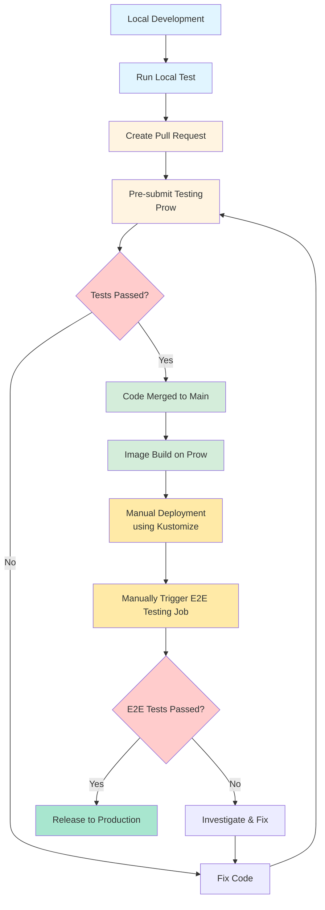

## Testing Scope in MVP

* Pipeline for pre-submit jobs is required to validate code changes before merging
* Image build pipeline is required to create container images for deployment
* Deployment configuration is required using Kustomize for Kubernetes manifests
* Manual deployment will be used in MVP as a trade-off; future releases will use ArgoCD for automated deployments
* E2E testing job for Critical User Journeys (CUJ) is required to validate end-to-end functionality
* Manual triggering of E2E testing jobs is sufficient for MVP as a trade-off; automatic triggering will be required in future releases

### Testing Workflow

The following diagram illustrates the complete testing and release workflow from local development to production release:



**Workflow Stages:**
- **Local Development** (Blue): Developer writes code and runs local tests
- **Pre-submit** (Light Yellow): Automated testing including unittest, integration testint, static testing  triggered by PR creation
- **Build & Merge** (Green): Code merged and container images built
- **Deployment & E2E** (Yellow): Manual deployment and end-to-end testing
- **Release** (Light Green): Production release after all validations pass

## Testing Concepts and Scope Alignment

### Linter Check
* **Code location**: All Go source files in the repository
* **Testing purpose**: Static code analysis to enforce coding standards, identify code quality issues, and catch common programming errors before code review. Ensures consistent code style across the codebase without executing the code.
* **Checks performed**:
  - Code formatting compliance (gofmt, goimports)
  - Unused variables and imports
  - Suspicious constructs and potential bugs
  - Code complexity metrics
  - Style violations and best practice deviations
* **Pipeline**: Pre-submit jobs
* **Coding framework**: N/A (static analysis tools)
* **Tools used**: `golangci-lint`, `gofmt/goimports`, `go vet` (aggregates multiple Go linters)
* **Running command**: `make lint-check`


### Unit Test
* **Code location**: Same package as function implementation
* **Testing purpose**: White-box testing that focuses on individual functions and methods in isolation. Tests should verify correct behavior of single units of code with mocked dependencies.
* **Pipeline**: Pre-submit jobs
* **Coding framework**: Standard Go testing with mock data (framework choice flexible)
* **Running command**: `make test`

### Integration Test
* **Code location**: _test_ package in the repo.
* **Testing purpose**: Validate interactions between multiple components and external dependencies (e.g., databases, message queues, external APIs). Tests verify that integrated components work correctly together.
* **Scope**: Test component interactions within the service boundary
* **Pipeline**: Pre-submit jobs
* **Coding framework**: Standard Go testing + `testcontainer` (framework choice flexible)
* **Running command**: `make test-integration`

### E2E Test
* **Code location**: Isolated repo [hyperfleet-e2e](https://github.com/openshift-hyperfleet/hyperfleet-e2e)
* **Testing purpose**: Black-box testing that validates complete user workflows and Critical User Journeys (CUJ) in CLM. Tests the entire CLM system from end-to-end without knowledge of internal implementation details. 
* **Scope**: Validate real-world scenarios from peered components across all CLM system components. The testing input should be hyperfleet API request and the expected result should be resources we are gonna create on a cluster. 

    For example, a scenario is *Mastro CR will be created when create a cluster via hyperfleet API*
    To verify above scenario, the request should be 
    ```
    curl -x POST /v1/clusters -d '{<cluster spec>}'
    ```
    The expected results should be:
    * Cluster statuses reported by adapters are all in correct status
    * The cluster resource of control plane and nodepool are created on actional cluster(that depends on which transportation we are gonna to use)
    * NOTE: We don't check if hosted cluster is finally created

* **Pipeline**: Dedicated E2E testing pipeline for CUJ automation scenarios
* **Coding framework**: `Ginkgo`
* **Running command**: `make test-e2e FILTER=<critical>`


## Testing Strategy

### Pre-submit Job
* **Job location**: Prow
* **Testing scope**: Unit tests and integration tests with dependent components
* **Coverage target**: Aim for >80% combined code coverage from unit and integration tests
* **Trigger strategy**: Automatically triggered when a PR is opened or updated
* **Action**: Block PR merging if any test failures occur
* **Success criteria**: All unit and integration tests must pass and combined coverage ≥80%
* **Jobs**:
  
  1. **Linter Check** (`pull-ci-<repo>-main-lint`)
     * **Purpose**: Ensure code quality, consistency, and adherence to Go coding standards
     * **Tools**: 
       - `golangci-lint` - Comprehensive Go linter aggregating multiple linting tools
       - `gofmt` / `goimports` - Code formatting validation
       - `go vet` - Static analysis for common Go programming errors
     * **Checks performed**:
       - Code formatting and style consistency
       - Unused variables and imports
       - Error handling best practices
       - Complexity metrics (cyclomatic complexity)
       - Code smells and anti-patterns
       - Documentation comments for exported functions
     * **Configuration**: `.golangci.yml` file in repository root defining enabled linters and rules
     * **Success criteria**: Zero linting issues detected, all code properly formatted
     * **Running command**: `make lint-check`
     * **On failure**: Block PR merge until all linting issues resolved
  
  2. **Unit Test** (`pull-ci-<repo>-main-unit`)
     * **Purpose**: Validate individual components and functions work correctly in isolation
     * **Framework**: Standard Go testing framework (flexible framework choice)
     * **Testing scope**:
       - All unit tests in `*_test.go` files
       - Tests with mocked external dependencies
       - Fast-running tests
     * **Coverage collection**:
       - Coverage report generated in HTML and Cobertura XML formats for combination with integration test coverage
       - Critical paths must have 100% coverage
     * **Checks performed**:
       - All test cases pass successfully
       - No race conditions detected (run with `-race` flag)
       - Coverage data collected for pre-submit analysis
       - Test execution time within acceptable limits
     * **Running command**: `make test`
     * **Artifacts generated**:
       - N/A
     * **On failure**: Block PR merge until all tests pass
  
  3. **Integration Test** (`pull-ci-<repo>-main-integration`)
     * **Purpose**: Validate interactions between components and external dependencies
     * **Framework**: Standard Go testing + testcontainers (for dependency simulation, flexible framework choice)
     * **Testing scope**:
       - Database interactions (PostgreSQL, Redis)
       - Message queue operations (Kafka, RabbitMQ)
       - External API integrations
       - Service-to-service communication
     * **Test environment**:
       - Testcontainers spin up real dependency containers
       - Isolated test databases and services
       - Network policies to simulate production environment
     * **Coverage collection**:
       - Coverage report generated and combined with unit test coverage for pre-submit analysis
     * **Running command**: 
       - Local: `make test-integration` (requires Docker/Podman)
       - Prow: Automatically runs with nested-podman capability
     * **Success criteria**: All integration scenarios pass, dependencies properly initialized and cleaned up
     * **On failure**: Block PR merge until all integration tests pass
     
     * **Dockerfile.integration for Local Development**:
       
       Create `Dockerfile.integration` in your repository root. Use `nested-podman` as the base image (from OpenShift CI):
       
       ```dockerfile
       # Dockerfile.integration
       # Use the same nested-podman base image that Prow uses
       FROM registry.ci.openshift.org/ci/nested-podman:latest
       
       # Copy source code
       COPY . /opt/app-root/src/
       WORKDIR /opt/app-root/src
       
       USER root
       
       # Install Go and build tools specific to your project
       RUN dnf install -y \
           git \
           go \
           make \
           wget \
           && dnf clean all
       
       # Download Go dependencies
       RUN go mod download
       
       # Set up environment for testcontainers
       ENV TESTCONTAINERS_RYUK_DISABLED=true
       
       # The nested-podman image already has podman configured
       # Just run your integration tests when you start the container
       CMD ["sh", "-c", "podman system service --time=0 & sleep 2 && make test-integration"]
       ```
       
       **Why use `nested-podman` base image?**
       - It's the same image Prow uses, ensuring consistency between local and CI
       - Already configured with nested container support
       - Podman is pre-installed and properly configured
       - No need to manually set up rootless podman
       - Maintained by OpenShift CI team
       
       **Local Usage**:
       ```bash
       # Build the integration test image
       podman build -f Dockerfile.integration -t hyperfleet-api-integration:latest .
       
       # Run integration tests with privileged mode for nested containers
       podman run --rm --privileged hyperfleet-api-integration:latest
       
       ```
       
       **Makefile Target** (add to your Makefile):
       ```makefile
       .PHONY: test-integration-local
       test-integration-local:
       	@echo "Building integration test image..."
       	podman build -f Dockerfile.integration -t $(PROJECT_NAME)-integration:latest .
       	@echo "Running integration tests..."
       	podman run --rm --privileged $(PROJECT_NAME)-integration:latest
       
       .PHONY: test-integration
       test-integration:
       	@echo "Running integration tests with testcontainers..."
       	go test -v -tags=integration ./test/integration/... -timeout 30m
       ```
     
     * **Testcontainers Configuration in OpenShift CI**:
       
       Testcontainers requires nested container support in Prow. Reference example: [OpenShift Release PR #70384](https://github.com/openshift/release/pull/70384/files)
       
       **Option 1: Using inline commands** (simpler, no extra Dockerfile needed in CI):
       
       **In ci-operator config** (`ci-operator/config/openshift-hyperfleet/<repo>/<repo>-main.yaml`):
       ```yaml
       tests:
       - as: integration
         capabilities:
         - nested-podman  # Enable nested container support
         commands: |
           # Start podman system service for testcontainers
           podman system service --time=0 & || true
           systemctl --user start podman.socket
           
           # Configure Docker host for testcontainers
           export DOCKER_HOST=$(podman info --format 'unix://{{.Host.RemoteSocket.Path}}')
           export TESTCONTAINERS_RYUK_DISABLED=true
           
           # Run integration tests
           make test-integration
         container:
           from: src
         nested_podman: true  # Required for testcontainers support
       ```
       
       **Option 2: Building from Dockerfile.integration** (ensures CI uses same setup as local):
       
       First, add `nested-podman` to your base_images and build the integration test image:
       ```yaml
       base_images:
         nested-podman:
           name: nested-podman
           namespace: ci
           tag: latest
       
       images:
       - dockerfile_path: Dockerfile.integration
         from: nested-podman  # Required: specify nested-podman as FROM base
         to: integration-tests
       ```
       
       Then configure the test to use it:
       ```yaml
       tests:
       - as: integration
         capabilities:
         - nested-podman
         commands: make test-integration
         container:
           from: integration-tests  # Use the image built from Dockerfile.integration
         nested_podman: true
       ```
       
       **Complete Example** (matching [PR #70384](https://github.com/openshift/release/pull/70384/files)):
       ```yaml
       # ci-operator/config/openshift-hyperfleet/hyperfleet-api/openshift-hyperfleet-hyperfleet-api-main.yaml
       base_images:
         nested-podman:
           name: nested-podman
           namespace: ci
           tag: latest
       
       images:
       - dockerfile_path: Dockerfile.integration
         from: nested-podman
         to: integration-tests
       
       tests:
       - as: integration
         capabilities:
         - nested-podman
         commands: |
           podman system service --time=0 & || true
           sleep 2
           make test-integration
         container:
           from: integration-tests
         nested_podman: true
       ```
       
       **Recommendation**: Use **Option 1** for MVP (simpler, less maintenance). Use **Option 2** if you want to guarantee identical environments between local and CI.
       
       **Key Requirements**:
       - Set `nested_podman: true` in test configuration
       - Add `capabilities: [nested-podman]` to enable nested container support
       - Configure `DOCKER_HOST` environment variable for testcontainers
       - Disable Ryuk with `TESTCONTAINERS_RYUK_DISABLED=true` (Ryuk cleanup container not supported in Prow)
       - Start podman system service before running tests
       
       **Example Integration Test with Testcontainers** (Go):
       ```go
       import (
           "github.com/testcontainers/testcontainers-go"
           "github.com/testcontainers/testcontainers-go/wait"
       )
       
       func TestDatabaseIntegration(t *testing.T) {
           ctx := context.Background()
           
           // Start PostgreSQL container
           pgContainer, err := testcontainers.GenericContainer(ctx, testcontainers.GenericContainerRequest{
               ContainerRequest: testcontainers.ContainerRequest{
                   Image:        "postgres:15",
                   ExposedPorts: []string{"5432/tcp"},
                   Env: map[string]string{
                       "POSTGRES_PASSWORD": "testpass",
                       "POSTGRES_DB":       "testdb",
                   },
                   WaitingFor: wait.ForLog("database system is ready to accept connections"),
               },
               Started: true,
           })
           defer pgContainer.Terminate(ctx)
           
           // Get connection details and run tests
           host, _ := pgContainer.Host(ctx)
           port, _ := pgContainer.MappedPort(ctx, "5432")
           
           // Your integration test logic here
       }
       ```
       
       **Generated Prow Job Labels**:
       The generated presubmit job will automatically include:
       ```yaml
       labels:
         capability/nested-podman: nested-podman  # Enables nested container capability
       ```
  

### CD Testing
* **Job location**: Prow
* **Testing scope**: E2E tests for Critical User Journey (CUJ) automation scenarios
* **Trigger strategy**: Nightly run + Manually triggered (MVP trade-off; future releases should trigger automatically on CD pipeline)
* **Action**: Block release if any test failures occur
* **Success criteria**: All E2E scenarios must pass before deployment to production

## Deployment Strategy

### MVP Approach

#### Helm Chart Organization

**HyperFleet uses a distributed chart architecture with clear separation of concerns.**

Each component repository maintains its own Helm chart, which are then aggregated in a dedicated [hyperfleet-chart](https://github.com/openshift-hyperfleet/hyperfleet-chart) repository as an umbrella chart.

**Architecture Benefits**:
- ✅ **Separation of concerns** - Each team owns their component's chart
- ✅ **Independent versioning** - Components can release chart updates independently
- ✅ **Simplified maintenance** - Chart lives with the component code
- ✅ **Easy component management** - Enable/disable components as needed
- ✅ **Clear ownership** - Component teams responsible for their chart
- ✅ **Git version control** - Submodules track exact component versions
- ✅ **Lightweight checkout** - Sparse checkout gets only chart files, not source code
- ✅ **Reproducible builds** - Lock to specific commits/tags for stability

**Component Repository Structure** (e.g., hyperfleet-api, hyperfleet-broker, hyperfleet-sentinel, hyperfleet-adapter):
```
hyperfleet-<component>/
├── charts/                         # Single chart directly in charts/
│   ├── Chart.yaml                  # Chart metadata (name: hyperfleet-api)
│   ├── values.yaml                 # Default values
│   ├── README.md
│   └── templates/
│       ├── deployment.yaml
│       ├── service.yaml
│       ├── configmap.yaml
│       └── ...
├── Dockerfile
├── Makefile
└── ... (component source code)
```

**Note**: Since each component has only ONE chart, no need for nested `charts/<component>/` structure!

**Example Component Chart.yaml**:
```yaml
# hyperfleet-api/charts/Chart.yaml
apiVersion: v2
name: hyperfleet-api
description: HyperFleet API component
type: application
version: 1.0.0
appVersion: "1.0.0"
```

**Umbrella Chart Repository** ([hyperfleet-chart](https://github.com/openshift-hyperfleet/hyperfleet-chart)):
```
hyperfleet-chart/
├── .gitmodules                     # Submodule configuration with sparse checkout
├── .submodules/                    # Submodules mounted here (hidden directory)
│   ├── hyperfleet-api/             @ submodule (sparse: only charts/*)
│   │   └── charts/
│   │       ├── Chart.yaml
│   │       ├── values.yaml
│   │       └── templates/
│   ├── hyperfleet-broker/          @ submodule (sparse: only charts/*)
│   ├── hyperfleet-sentinel/        @ submodule (sparse: only charts/*)
│   └── hyperfleet-adapter/         @ submodule (sparse: only charts/*)
├── charts/
│   └── hyperfleet/
│       ├── Chart.yaml              # Main chart with component dependencies
│       ├── values.yaml             # Aggregated configuration
│       ├── README.md
│       └── charts/                 # Symlinks to submodule charts
│           ├── hyperfleet-api      → ../../../.submodules/hyperfleet-api/charts
│           ├── hyperfleet-adapter  → ../../../.submodules/hyperfleet-adapter/charts
│           ├── hyperfleet-broker   → ../../../.submodules/hyperfleet-broker/charts
│           └── hyperfleet-sentinel → ../../../.submodules/hyperfleet-sentinel/charts
└── README.md
```

**Git Submodules with Sparse Checkout + Symlinks Approach**:

This architecture uses Git submodules with sparse checkout to efficiently manage component charts while maintaining version control and keeping the repository lightweight.

**How It Works:**

1. **Component teams** maintain charts directly in their repos: `hyperfleet-api/charts/Chart.yaml`
2. **Submodules** track component repos in `.submodules/` directory (hidden)
3. **Sparse checkout** only pulls `charts/*` from each repo (no source code!)
4. **Symlinks** connect umbrella chart to submodule charts:
   ```
   charts/hyperfleet/charts/hyperfleet-api → .submodules/hyperfleet-api/charts
   ```
5. **Result**: Clean structure for Helm + full Git version control

**Benefits:**
- ✅ **Version control** - Track exact component versions/commits
- ✅ **Lightweight** - Only chart files checked out (not source code)
- ✅ **Simple** - Symlinks resolve path structure cleanly
- ✅ **Helm-compatible** - Structure matches Helm's expectations perfectly

**Path Resolution Example:**
```
Component repo:         hyperfleet-api/charts/Chart.yaml
                              ↓ (sparse checkout: charts/*)
Submodule checkout:     .submodules/hyperfleet-api/charts/Chart.yaml
                              ↓ (symlink)
Umbrella chart access:  charts/hyperfleet/charts/hyperfleet-api/Chart.yaml ✅
```

**Main Chart.yaml** (in hyperfleet-chart repo):
```yaml
apiVersion: v2
name: hyperfleet
description: HyperFleet Platform - Complete deployment
type: application
version: 1.0.0        # Umbrella chart version
appVersion: "0.1.0"   # Overall platform version
maintainers:
  - name: HyperFleet Team
    email: hyperfleet-team@redhat.com

dependencies:
  - name: hyperfleet-api
    version: "1.0.0"
    repository: "file://./charts/hyperfleet-api"
    condition: hyperfleet-api.enabled
  - name: hyperfleet-adapter
    version: "1.0.0"
    repository: "file://./charts/hyperfleet-adapter"
    condition: hyperfleet-adapter.enabled
  - name: hyperfleet-broker
    version: "1.0.0"
    repository: "file://./charts/hyperfleet-broker"
    condition: hyperfleet-broker.enabled
  - name: hyperfleet-sentinel
    version: "1.0.0"
    repository: "file://./charts/hyperfleet-sentinel"
    condition: hyperfleet-sentinel.enabled
```

**Setting Up Submodules with Sparse Checkout** (one-time setup):

```bash
# Initialize hyperfleet-chart repository
cd hyperfleet-chart
mkdir -p charts/hyperfleet/charts

# Add component repos as submodules (mounted at temp paths first)
git submodule add -b main \
  https://github.com/openshift-hyperfleet/hyperfleet-api.git \
  .submodules/hyperfleet-api

git submodule add -b main \
  https://github.com/openshift-hyperfleet/hyperfleet-broker.git \
  .submodules/hyperfleet-broker

git submodule add -b main \
  https://github.com/openshift-hyperfleet/hyperfleet-sentinel.git \
  .submodules/hyperfleet-sentinel

git submodule add -b main \
  https://github.com/openshift-hyperfleet/hyperfleet-adapter.git \
  .submodules/hyperfleet-adapter

# Configure sparse checkout for each submodule (only checkout charts/ directory)
for component in hyperfleet-api hyperfleet-broker hyperfleet-sentinel hyperfleet-adapter; do
  git config -f .gitmodules submodule..submodules/${component}.sparse true
  
  # Create sparse-checkout file to only checkout the chart directory
  mkdir -p .git/modules/.submodules/${component}/info
  echo "charts/*" > .git/modules/.submodules/${component}/info/sparse-checkout
done

# Initialize submodules with sparse checkout
git submodule update --init

# Create symlinks from umbrella chart location to submodule chart directories
mkdir -p charts/hyperfleet/charts
cd charts/hyperfleet/charts
ln -s ../../../.submodules/hyperfleet-api/charts hyperfleet-api
ln -s ../../../.submodules/hyperfleet-broker/charts hyperfleet-broker
ln -s ../../../.submodules/hyperfleet-sentinel/charts hyperfleet-sentinel
ln -s ../../../.submodules/hyperfleet-adapter/charts hyperfleet-adapter
cd ../../..

# Add symlinks to git
git add charts/hyperfleet/charts/

# Commit the configuration
git add .gitmodules charts/
git commit -m "Add component charts as sparse submodules"
```

**Resulting .gitmodules file**:
```ini
[submodule ".submodules/hyperfleet-api"]
	path = .submodules/hyperfleet-api
	url = https://github.com/openshift-hyperfleet/hyperfleet-api.git
	branch = main
	sparse = true
[submodule ".submodules/hyperfleet-broker"]
	path = .submodules/hyperfleet-broker
	url = https://github.com/openshift-hyperfleet/hyperfleet-broker.git
	branch = main
	sparse = true
[submodule ".submodules/hyperfleet-sentinel"]
	path = .submodules/hyperfleet-sentinel
	url = https://github.com/openshift-hyperfleet/hyperfleet-sentinel.git
	branch = main
	sparse = true
[submodule ".submodules/hyperfleet-adapter"]
	path = .submodules/hyperfleet-adapter
	url = https://github.com/openshift-hyperfleet/hyperfleet-adapter.git
	branch = main
	sparse = true
```

**For Service Offering Team** (cloning umbrella chart):
```bash
# Clone with submodules - only charts/ directory will be checked out
git clone --recurse-submodules https://github.com/openshift-hyperfleet/hyperfleet-chart.git
cd hyperfleet-chart

# Only chart files are present, no source code!
ls charts/hyperfleet/charts/hyperfleet-api/
# Output: Chart.yaml  values.yaml  templates/  README.md

# Ready to deploy!
helm install hyperfleet ./charts/hyperfleet/
```

**Updating Component Charts**:
```bash
# Update all components to latest
git submodule update --remote --merge

# Or update specific component to a tagged version
cd .submodules/hyperfleet-api
git fetch --tags
git checkout chart-v1.2.0  # Or main branch for latest
cd ../..
git add .submodules/hyperfleet-api
git commit -m "Update hyperfleet-api chart to v1.2.0"

# Verify the symlink points to updated chart
ls -la charts/hyperfleet/charts/hyperfleet-api/
```

**Main values.yaml**:
```yaml
# Global values shared across all components
global:
  imageRegistry: quay.io/openshift-hyperfleet
  imagePullPolicy: Always  # Always pull latest for MVP
  namespace: hyperfleet

# Component-specific values (all use latest tag for MVP)
hyperfleet-api:
  enabled: true
  replicaCount: 2
  image:
    tag: "latest"
  resources:
    requests:
      cpu: 200m
      memory: 256Mi

hyperfleet-adapter:
  enabled: true
  replicaCount: 1
  image:
    tag: "latest"

hyperfleet-broker:
  enabled: true
  replicaCount: 2
  image:
    tag: "latest"

hyperfleet-sentinel:
  enabled: true
  replicaCount: 1
  image:
    tag: "latest"
```

**Deployment Example**:
```bash
# Install all components together (uses latest tag)
helm upgrade --install hyperfleet ./charts/hyperfleet \
  --namespace hyperfleet \
  --create-namespace

# Deploy only specific components if needed
helm upgrade --install hyperfleet ./charts/hyperfleet \
  --set hyperfleet-adapter.enabled=false \
  --set hyperfleet-sentinel.enabled=false \
  --namespace hyperfleet
```

**Benefits**:
- ✅ **Single deployment command** - Service offering team deploys everything at once
- ✅ **Simplified dependency management** - All components versioned together
- ✅ **Shared configuration** - Global values for common settings
- ✅ **Easier rollback** - Rollback entire stack with one command
- ✅ **Selective component deployment** - Can enable/disable individual components
- ✅ **Better for MVP** - Faster to deliver, easier to maintain

#### Deployment Process

* **Trigger strategy**: Manual deployment trigger (MVP trade-off; future releases will use ArgoCD for GitOps-based continuous deployment)
* **Deployment steps**:
  1. Build and tag container images for all components with `latest` tag
  2. Push images to registry (quay.io/openshift-hyperfleet)
  3. Install or upgrade using Helm (automatically pulls latest images):
     ```bash
     helm upgrade --install hyperfleet ./charts/hyperfleet \
       --namespace hyperfleet \
       --create-namespace
     ```
  4. Verify deployment health:
     ```bash
     helm status hyperfleet -n hyperfleet
     kubectl get pods -n hyperfleet
     ```

#### Chart Distribution

* **Component Chart Locations**:
  - Each component repo: `https://github.com/openshift-hyperfleet/<component>/charts/` (chart directly in charts/)
  - Umbrella repo: `https://github.com/openshift-hyperfleet/hyperfleet-chart`

* **Release Workflow**:
  1. Component teams release new chart versions in their repos (tag with chart version like `chart-v1.2.0`)
  2. Update submodules in hyperfleet-chart repo to reference new versions:
     ```bash
     cd hyperfleet-chart
     
     # Option A: Update all components to latest on main branch
     git submodule update --remote --merge
     
     # Option B: Update specific component to a tagged version
     cd .submodules/hyperfleet-api
     git fetch --tags
     git checkout chart-v1.2.0  # Specific chart version tag
     cd ../..
     
     # Review changes (only chart files will show via symlinks)
     git status
     git diff .submodules/
     
     # Commit updated submodule references
     git add .submodules/
     git commit -m "Update component charts for release v1.0.0"
     ```
  3. Update umbrella chart version and dependencies:
     ```bash
     cd charts/hyperfleet
     # Update Chart.yaml version
     # Update dependency versions in Chart.yaml if changed
     helm dependency update
     cd ../..
     ```
  4. Test the umbrella chart:
     ```bash
     helm lint charts/hyperfleet/
     helm install test ./charts/hyperfleet/ --dry-run --debug
     ```
  5. Package for distribution to service offering team:
     ```bash
     helm package charts/hyperfleet/
     # Generates: hyperfleet-1.0.0.tgz
     ```
  6. Commit and tag the release in hyperfleet-chart repo:
     ```bash
     git add charts/
     git commit -m "Release hyperfleet chart v1.0.0"
     git tag v1.0.0
     git push origin main --tags
     ```


## Actions Breakdown

This section outlines the step-by-step actions required to set up the complete testing and deployment infrastructure for the MVP release. Each subsection includes detailed requirements, action items, and validation criteria.

### 1. Temporary Dockerfile Setup

**Objective**: Create containerized builds temporary Dockerfile for all HyperFleet components those have no Dockerfile inplace yet. This Dockerfile setup step is used to unblock Prow jobs setup. Once component get its own Dockerfile in place fake Dockerfile should be removed.

**Action Items**:
* Create a multi-stage `Dockerfile` in the root of each component repository
* Dockerfile requirements:
  * Use minimal base images (e.g., `registry.access.redhat.com/ubi8/ubi-minimal` for Red Hat compatibility)
  * Multi-stage build to minimize final image size
  * Non-root user for security
* Example structure:
  ```dockerfile
  # Stage 1: Build
  FROM golang:1.21 AS builder
  WORKDIR /workspace
  COPY . .
  RUN make build
  
  # Stage 2: Runtime
  FROM registry.access.redhat.com/ubi8/ubi-minimal:latest
  WORKDIR /
  COPY --from=builder /workspace/bin/app .
  USER 65532:65532
  ENTRYPOINT ["/app"]
  ```
* Create `.dockerignore` file to exclude unnecessary files from build context

**Validation Criteria**:
- [ ] Dockerfile builds successfully locally
- [ ] Image runs as non-root user

---

### 2. Prow Integration to the Repos

**Objective**: Integrate all HyperFleet repositories with OpenShift CI (Prow) for automated testing and image building.

**Action Items**:
* Submit PR to `openshift/release` repository to add HyperFleet configuration
* Create folder structure in `openshift/release`:
  * `ci-operator/config/openshift-hyperfleet/<repo-name>/` - Contains CI configuration YAML files
  * `ci-operator/step-registry/hyperfleet/` - Contains reusable step definitions for HyperFleet jobs
* Configure repository access:
  * Add `openshift-ci-robot` as a collaborator to each repository
  * Configure webhook integration between GitHub and Prow
  * Set up OAuth apps for GitHub authentication with Prow
* Create base configuration files:
  * `<org>-<repo>-<branch>.yaml` in config directory
  * Define build root, images, and test configurations
* Grant permissions:
  * Ensure Prow service accounts have necessary RBAC permissions
  * Configure image push credentials to quay.io or internal registry

**Example Configuration Structure**:
```yaml
# ci-operator/config/openshift-hyperfleet/hyperfleet-api/openshift-hyperfleet-hyperfleet-api-main.yaml
base_images:
  base:
    name: ubi-minimal
    namespace: ocp
    tag: '9'
build_root:
  image_stream_tag:
    name: release
    namespace: openshift
    tag: golang-1.24
```

**Validation Criteria**:
- [ ] Prow bot comments on test PRs
- [ ] `/test` commands trigger jobs successfully
- [ ] Prow dashboard shows repository and jobs
- [ ] Webhook events properly delivered from GitHub to Prow

---

### 3. Image Build Job Setup

**Objective**: Automate container image building for both pre-merge validation and post-merge releases.

**Action Items**:
  
* **Post-merge (Main Branch) Image Builds**:
  * Create postsubmit job configuration for image build
  * Tag images with:
    - Git commit SHA
    - `latest` tag for main branch
  * Push to production image registry (e.g., `quay.io/openshift-hyperfleet/<component>`)
  * Generate image digest for secure deployment references

* **Image Registry Configuration**:
  * Set up Quay.io organization or use OpenShift internal registry
  * Configure image retention policies
  * Set up vulnerability scanning on pushed images
  * Configure image signing for production images

**Example ci-operator Image Build Configuration**:
```yaml
# ci-operator/config/openshift-hyperfleet/hyperfleet-api/openshift-hyperfleet-hyperfleet-api__images.yaml
base_images:
  ocp_builder_rhel-9-golang-1.24-openshift-4.19:
    name: builder
    namespace: ocp
    tag: rhel-9-golang-1.24-openshift-4.19
  ocp_ubi-minimal:
    name: ubi-minimal
    namespace: ocp
    tag: '9'
build_root:
  image_stream_tag:
    name: builder
    namespace: ocp
    tag: rhel-9-golang-1.24-openshift-4.19
images:
- dockerfile_path: Dockerfile
  from: ocp_ubi-minimal
  inputs:
    ocp_builder_rhel-9-golang-1.24-openshift-4.19:
      as:
      - registry.ci.openshift.org/ocp/builder:rhel-9-golang-1.24-openshift-4.19
  to: hyperfleet-api
promotion:
  to:
  - namespace: ci
    tag: latest
    tag_by_commit: true
resources:
  '*':
    requests:
      cpu: 100m
      memory: 200Mi
zz_generated_metadata:
  branch: main
  org: openshift-hyperfleet
  repo: hyperfleet-api
```

**Validation Criteria**:
- [ ] Post-merge builds push images with correct tags
- [ ] Images accessible from target registry
- [ ] Image metadata includes commit SHA and version labels

---

### 4. Pre-submit Jobs Setup

**Objective**: Establish automated pre-merge testing to ensure code quality and prevent regressions before code is merged.

**Action Items**:
* **Configure Pre-submit Tests in ci-operator Config**:
  * Create single configuration file: `ci-operator/config/openshift-hyperfleet/<repo>/<repo>-<branch>.yaml`
  * Prow job definitions will be automatically generated in `ci-operator/jobs/` directory. Run `make update` to generate the jobs and validate the changes
  * Define tests inline with `commands` field - no need for separate step-registry entries
  * Tests to include:
    - `lint` - Run linters (golangci-lint, gofmt) with `make lint-check`
    - `unit` - Run unit tests with `make test`
    - `integration` - Run integration tests with `make test-integration` (requires nested-podman capability)
  * Image builds are configured in the same config file (in `images` section)
  * Configure resource requests/limits appropriate for test workloads
  * All pre-submit tests will automatically run on PRs
  * Failed tests will automatically block PR merging

**Example ci-operator Configuration**:
```yaml
# ci-operator/config/openshift-hyperfleet/hyperfleet-api/openshift-hyperfleet-hyperfleet-api-main.yaml
base_images:
  nested-podman:
    name: nested-podman
    namespace: ci
    tag: latest
  ocp_builder_rhel-9-golang-1.24-openshift-4.19:
    name: builder
    namespace: ocp
    tag: rhel-9-golang-1.24-openshift-4.19
  ocp_ubi-minimal:
    name: ubi-minimal
    namespace: ocp
    tag: '9'
build_root:
  image_stream_tag:
    name: builder
    namespace: ocp
    tag: rhel-9-golang-1.24-openshift-4.19
images:
- dockerfile_path: Dockerfile
  from: ocp_ubi-minimal
  inputs:
    ocp_builder_rhel-9-golang-1.24-openshift-4.19:
      as:
      - registry.ci.openshift.org/ocp/builder:rhel-9-golang-1.24-openshift-4.19
  to: hyperfleet-api
- dockerfile_path: Dockerfile.integration
  from: nested-podman
  to: hyperfleet-api-integration-tests
resources:
  '*':
    requests:
      cpu: 150m
      memory: 300Mi
tests:
- as: lint
  commands: make lint-check
  container:
    from: src
- as: unit
  commands: make test
  container:
    from: src
- as: integration
  capabilities:
  - nested-podman
  commands: |
    podman system service --time=0 & || true
    sleep 2
    make test-integration
  container:
    from: hyperfleet-api-integration-tests
  nested_podman: true
zz_generated_metadata:
  branch: main
  org: openshift-hyperfleet
  repo: hyperfleet-api
```

**Note**: The above configuration will automatically generate Prow job definitions in `ci-operator/jobs/` that you should NOT manually edit.

**Validation Criteria**:
- [ ] All pre-submit jobs trigger automatically on PR creation
- [ ] Test failures block PR merging
- [ ] Test results visible in Prow dashboard and GitHub status checks
- [ ] Coverage reports generated and accessible
- [ ] Jobs complete within reasonable time (<15 minutes)

---

### 5. E2E Testing Job Setup

**Objective**: Create end-to-end testing infrastructure to validate complete user journeys and critical workflows in a production-like environment.

**Action Items**:

* **E2E Test Step Registry**:
  * Create multi-step workflow in `ci-operator/step-registry/hyperfleet/e2e/`
  * Steps should include:
    1. `hyperfleet-e2e-test` - Execute E2E test suite
    2. `hyperfleet-e2e-collect-logs` - Gather logs and diagnostics
    3. `hyperfleet-e2e-teardown` - Clean up resources

* **E2E Job Configuration**:
  * Create E2E test configuration in `ci-operator/config/openshift-hyperfleet/hyperfleet-e2e/`
  * Periodic and presubmit job definitions will be automatically generated in `ci-operator/jobs/` (do NOT manually edit)
  * Configure test to:
    - Deploy latest images from specified tag or PR
    - Run E2E test suite with `make test-e2e FILTER=critical`
    - Collect logs, metrics, and screenshots on failure
    - Generate detailed test reports
  * Test trigger options:
    - Manual trigger via Prow UI or `/test e2e` comment on PRs
    - Schedule periodic runs (e.g., nightly for regression testing)

* **Test Suite Integration**:
  * E2E tests written in Ginkgo framework
  * Tests should cover:
    - Component deployment and health checks
    - Critical user journeys (CUJ)
    - API endpoint validation
    - Cross-component communication
    - Failure recovery scenarios
  * Test data and fixtures managed separately
  * Test parallelization for faster execution

* **Artifact Collection**:
  * Configure artifact collection in job spec
  * Collect on completion (success or failure):
    - Pod logs from all components
    - Kubernetes events
    - Test execution logs and screenshots
    - Performance metrics (if applicable)
  * Artifacts stored in Prow artifact bucket and linked from job details

**Example ci-operator E2E Configuration**:
```yaml
# ci-operator/config/openshift-hyperfleet/hyperfleet-e2e/openshift-hyperfleet-hyperfleet-e2e-main.yaml
tests:
- as: e2e-critical
  cron: "0 0 * * *"  # Run daily at midnight
  steps:
    test:
    - as: hyperfleet-e2e-test
      commands: |
        make test-e2e FILTER=critical
      from: e2e-tests
      resources:
        requests:
          cpu: 400m
          memory: 1Gi
    post:
    - as: collect-logs
      commands: |
        # Collect logs and artifacts
        kubectl get pods -A > artifacts/pods.log
        kubectl get events -A > artifacts/events.log
      from: cli
```

**Note**: This ci-operator configuration will automatically generate:
- A periodic job in `ci-operator/jobs/` that runs nightly
- A presubmit job that can be manually triggered with `/test e2e-critical` on PRs
- Do NOT manually edit the generated files in `ci-operator/jobs/`

**Validation Criteria**:
- [ ] E2E job can run periodically and be manually triggered via Prow PR or Console 
- [ ] Job successfully deploys all components to test cluster
- [ ] E2E tests execute and report results correctly
- [ ] Logs and artifacts collected on both success and failure
- [ ] Test results visible in Prow dashboard with pass/fail status
- [ ] Job completes within reasonable time
- [ ] Cluster resources properly cleaned up after job completion

---

### 6. Vault Engine Application for Secrets Management

**Objective**: Apply for a dedicated Vault engine within Prow's existing Vault infrastructure to securely manage secrets needed for CI/CD pipelines.

**Action Items**:
* **Apply for Vault Engine**:
  * Submit application/request for a dedicated Vault engine for HyperFleet project
  * Request namespace/path: `hyperfleet/` within Prow's Vault instance
  * Specify required access level: All team developers need write access for MVP
  * Identify team members who need access
  * Follow organization's Vault engine request process

* **Identify and Store Required Secrets**:
  * Audit all secrets needed for Prow CI/CD pipelines:
    - Image registry credentials (Quay.io push/pull tokens for image builds)
    - Database credentials for integration tests
    - API keys for external services used in tests
    - Test environment configuration secrets
  * Store secrets in Vault under `hyperfleet/` path
  * Use clear naming conventions (e.g., `registry-quay-push-token`, `test-db-credentials`)
  * Remove any secrets from code repositories or plain-text configurations

* **Configure Prow Integration**:
  * Registry credentials for image builds are handled automatically by ci-operator when you configure promotion
  * For custom secrets needed in tests, add them to the ci-operator config using the `secrets` field
  * Example ci-operator config with secrets for integration tests:
    ```yaml
    # ci-operator/config/openshift-hyperfleet/hyperfleet-api/openshift-hyperfleet-hyperfleet-api-main.yaml
    tests:
    - as: integration
      commands: make test-integration
      container:
        from: integration-tests
      secrets:
      - name: hyperfleet-test-db-creds
        mount_path: /var/run/secrets/test-db
    ```
  * For step-registry steps that need secrets, define them in the step's ref file:
    ```yaml
    # ci-operator/step-registry/hyperfleet/integration-test/hyperfleet-integration-test-ref.yaml
    ref:
      as: hyperfleet-integration-test
      from: src
      commands: hyperfleet-integration-test-commands.sh
      credentials:
      - namespace: test-credentials
        name: hyperfleet-test-db-creds
        mount_path: /var/run/secrets/test-db
    ```
  * Work with OpenShift CI team to ensure Vault secrets are properly mapped to Kubernetes secrets that ci-operator can access
  * Image registry push credentials are configured centrally by the CI infrastructure team - you don't need to configure them in your jobs

* **Setup Access Policies**:
  * Request write access to `hyperfleet/` path for all team developers (MVP approach)
  * Ensure Prow CI service accounts have read access to fetch secrets during job execution
  * Document the access policy for future reference

* **Documentation**:
  * Document Vault engine path: `hyperfleet/`
  * Create simple guide for team members:
    - How to add new secrets to Vault
    - How to reference secrets in Prow jobs
    - Naming conventions for secrets
  * Maintain inventory of secrets stored in Vault with purpose

**Validation Criteria**:
- [ ] Vault engine application submitted and approved
- [ ] Vault engine path `hyperfleet/` accessible to team
- [ ] All developers have write access to add/update secrets
- [ ] Required secrets stored in Vault and mapped to Kubernetes secrets in test-credentials namespace
- [ ] No secrets remaining in code or plain-text configurations
- [ ] CI team has configured Vault-to-Kubernetes secret synchronization
- [ ] Integration test jobs successfully access test credentials via mounted secrets
- [ ] Documentation complete and shared with team

**Security Best Practices**:
- Never commit secrets to git repositories
- Use descriptive names for secrets that indicate their purpose
- Document who added each secret and when
- Remove old/unused secrets periodically

---

## Summary Checklist

Use this checklist to track progress on MVP testing and deployment setup:

- [ ] **Dockerfiles**: All components have optimized, secure Dockerfiles
- [ ] **Helm Charts**: Each component has chart in `charts/` directory; umbrella chart set up in [hyperfleet-chart](https://github.com/openshift-hyperfleet/hyperfleet-chart) repo
- [ ] **Prow Integration**: All repos integrated with OpenShift CI
- [ ] **Image Builds**: Pre-merge and post-merge image build jobs functional
- [ ] **Pre-submit Jobs**: Unit and integration tests blocking PRs
- [ ] **E2E Jobs**: Manual E2E testing pipeline operational
- [ ] **Vault Engine**: Applied for and configured for secrets management
- [ ] **Documentation**: All setup documented and runbooks created
- [ ] **Validation**: End-to-end workflow tested with sample PR; umbrella chart package delivered to service offering team

## Future State
* Implement ArgoCD for automated GitOps deployments instead of manual deployment
* Automatic synchronization of Kubernetes clusters with Git repository state
* Automated rollback capabilities on deployment failures